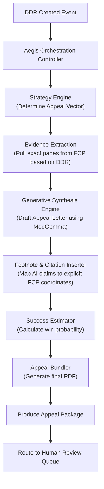
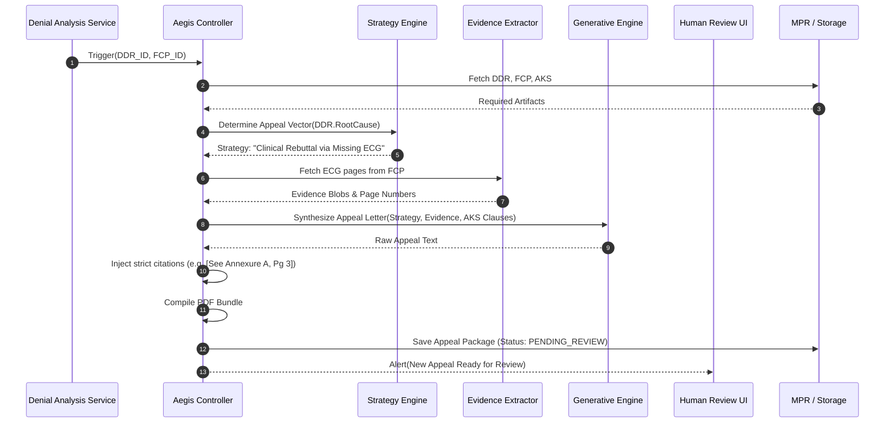

# Aegis Appeal Intelligence — Architectural Specification

This document presents the complete production-grade architecture, workflows, schemas, and API contracts for Aivana's **Aegis Appeal Intelligence** service.

---

## 1. Purpose
Aegis is the legal and clinical argumentation engine of Aivana. Once the Denial Analysis Service (DAS) determines the root cause of an insurer's rejection, Aegis formulates a structured, evidence-backed appeal. It generates a comprehensive Appeal Package containing an appeal letter, exact citations to policy and clinical evidence, and an ordered bundle of supporting documents extracted from the immutable Final Claim Packet (FCP).

## 2. Responsibilities
- Determine the optimal appeal strategy based on the Enriched Denial Report (DDR).
- Identify and extract the strongest evidence from the FCP to counter the denial.
- Synthesize a professional, medically and legally sound appeal letter using Generative AI.
- Cite exact pages, bounding boxes, and OCR text blocks to prevent insurer misinterpretation.
- Cite exact policy clauses from the AKS rule pack.
- Produce a compiled Supporting Evidence Bundle (PDF).
- Generate a checklist of any additional documents the hospital must upload to win the appeal.
- Estimate the probability of appeal success.
- Produce an actionable Appeal Intelligence Report.

## 3. Non-Responsibilities
- **Does NOT** parse the initial denial letter (that is the domain of DAS).
- **Does NOT** submit the appeal directly to the insurer (the Submission Adapter Layer handles transport).
- **Does NOT** alter the original FCP. The Appeal Bundle is a newly generated artifact linking back to the FCP.
- **Does NOT** send appeals without mandatory human review.

---

## 4. Inputs
- **Enriched Denial Report (DDR)** (From DAS)
- **Final Claim Packet (FCP)** (Immutable Source of Truth)
- **Trusted Patient Record (TPR)**
- **Clinical Evidence Assessment (CEA)**
- **Financial Compliance Assessment (FCA)**
- **Aivana Knowledge Studio (AKS)** (Specific rule pack version)

## 5. Outputs
- **Appeal Package**: A comprehensive JSON payload containing the letter, metadata, timelines, and bundles.
- **Appeal Intelligence Report**: A hospital-facing dashboard summary explaining the strategy and success estimate.
- **Appeal Bundle (PDF)**: The physical PDF containing the appeal letter prepended to the cited evidence pages.

## 6. Dependencies
- **Denial Analysis Service (DAS)**: Must successfully execute before Aegis is invoked.
- **Explainability Engine Core**: Used to map internal evidence citations into human-readable legal footnotes.
- **Generative AI Gateway (MedGemma/Claude/GPT)**: To synthesize the appeal narrative.

---

## 7. Position Inside Overall Pipeline

```
Insurer Denial → Submission Adapter → Denial Analysis Service (DDR)
                                                                 │
      ┌──────────────────────────────────────────────────────────┘
      ▼
 ╔═════════════════════════════════════════════════════╗
 ║             Aegis Appeal Intelligence               ║
 ║  (Formulates strategy, generates appeal letter,     ║
 ║   compiles evidence bundle)                         ║
 ╚═════════════════════════════════════════════════════╝
      │
      ▼
 Human Review Dashboard (Mandatory approval)
      │
      ▼
 Submission Adapter Layer → Insurer (Appeal Submission)
```

---

## 8. ASCII Architecture Diagram

```
                 +---------------------------------------------+
                 |       Inputs: DDR, FCP, CEA, FCA, AKS       |
                 +----------------------+----------------------+
                                        |
                                        v
                 +----------------------+----------------------+
                 |     Aegis Orchestration Controller          |
                 +----+-----------------+------------------+---+
                      |                 |                  |
                      v                 v                  v
             +--------+--------+ +------+-------+ +--------+--------+
             | Strategy Engine | | Evidence     | | Success        |
             | (Decision Tree) | | Extraction   | | Estimator (AI) |
             +--------+--------+ +------+-------+ +--------+--------+
                      |                 |                  |
                      +-----------------+------------------+
                                        |
                                        v
                 +----------------------+----------------------+
                 |      Generative Synthesis Engine            |
                 | (Drafts Appeal Letter with Footnotes)       |
                 +----------------------+----------------------+
                                        |
                                        v
                 +----------------------+----------------------+
                 |        Appeal Bundler & Formatter           |
                 | (Compiles PDF: Letter + Cited Attachments)  |
                 +----------------------+----------------------+
                                        |
                                        v
                 +----------------------+----------------------+
                 |   Appeal Package & Intelligence Report      |
                 |      (Awaiting Human Approval)              |
                 +---------------------------------------------+
```

---

## 9. Mermaid Workflow



---

## 10. Sequence Diagram



---

## 11. State Machine

```
   [DDR_RECEIVED]
     │
     ▼
  [STRATEGY_FORMULATION] ----(Invalid Root Cause)----> [FAILED]
     │
     ▼
  [EVIDENCE_GATHERING]
     │
     ▼
  [GENERATING_LETTER] -------(LLM Timeout)-----------> [RETRY_QUEUED]
     │
     ▼
  [COMPILING_BUNDLE]
     │
     ▼
  [PENDING_HUMAN_REVIEW]
     │
     ├── (Approved) ──────> [APPROVED_FOR_SUBMISSION]
     │
     └── (Rejected/Edited) ─> [REVISED_BY_HUMAN]
```

---

## 12. Components

1. **Strategy Engine**: A deterministic decision tree that reads the DDR's `primaryFault` and `classifiedTaxonomy` to select the legal/clinical tone of the appeal (e.g. aggressive policy enforcement vs clinical education).
2. **Evidence Extraction Module**: Navigates the FCP's `evidenceIndex` to isolate the exact PDF pages required to prove the hospital's case.
3. **Generative Synthesis Engine**: The LLM core that writes the persuasive appeal narrative. It is strictly constrained by a system prompt to avoid hallucinating clinical facts.
4. **Footnote & Citation Inserter**: A deterministic regex and mapping script that forces the LLM's references to perfectly match the physical page numbers of the compiled bundle.
5. **Appeal Bundler**: Uses `pdf-lib` to stitch the generated letter and extracted evidence pages into a single `Appeal_Bundle.pdf`.
6. **Success Estimator**: A lightweight ML classifier trained on historical appeal outcomes to predict win probability based on the denial taxonomy and hospital evidence completeness.

---

## 13. Internal Processing Pipeline

1. **Intake**: DDR is loaded; if `appealViabilityScore` is 0, Aegis halts and alerts billing (un-appealable).
2. **Structuring**: The prompt is assembled combining the hospital details, patient details, denial text, and extracted evidence.
3. **Generation**: The LLM drafts the letter.
4. **Validation**: The letter is scanned to ensure it contains exactly the required citations (no more, no less).
5. **Packaging**: The JSON package and PDF bundle are finalized.

---

## 14. Parallel Execution Opportunities
- **Success Estimation** and **Evidence Extraction** run concurrently while the **Generative Synthesis Engine** drafts the letter body, merging together at the Bundler phase.

---

## 15. Deterministic vs AI Table

| Task | Methodology | Rationale |
| :--- | :--- | :--- |
| **Strategy Formulation** | Deterministic | Strict mapping of DDR root causes to appeal templates. |
| **Evidence Extraction** | Deterministic | Pulling pages based on FCP hashes is binary. |
| **Appeal Letter Drafting** | AI Generative | Crafting persuasive, cohesive, and context-aware clinical/legal arguments requires high-level language synthesis. |
| **Citation Injection** | Deterministic | Ensuring "Page 4" actually points to Page 4 of the bundle prevents LLM hallucination of attachments. |
| **Success Estimation** | ML Classifier | Random Forest / XGBoost model trained on prior appeal outcomes. |

---

## 16. Latency Budget

- **Strategy & Evidence Extraction**: < 50ms
- **LLM Synthesis (Letter Generation)**: < 4000ms
- **Citation & PDF Bundling**: < 200ms
- **Success Estimation**: < 20ms
- **Total P95 Latency Target**: **< 5000ms** (Async task)

---

## 17. Scaling Strategy
- **Worker Queues**: Aegis operates via async workers listening to `DAS_DDR_GENERATED` events.
- **LLM Rate Limiting**: Centralized token bucket algorithms to prevent hitting API quotas on Vertex AI / OpenAI endpoints during batch appeal generation.

---

## 18. Caching Strategy
- Output bundles are stored directly to S3. Only the metadata JSON is cached in Redis for fast rendering on the Human Review Dashboard.

---

## 19. Retry Strategy
- Generative failures (e.g. LLM outputs invalid JSON or hallucinates an unauthorized clause) trigger a strict retry with a higher temperature penalty, up to 3 times.

---

## 20. Failure Handling
- If the LLM repeatedly fails validation, Aegis produces a "Skeleton Appeal" (a deterministic template with blank spaces for the narrative) and flags it `CRITICAL_REVIEW_REQUIRED`.

---

## 21. Event Model
- **`AEGIS_APPEAL_STARTED`**: Emitted when DDR is picked up.
- **`AEGIS_APPEAL_READY`**: Emitted when the package is generated and awaiting human review.
- **`AEGIS_APPEAL_APPROVED`**: Triggered by the hospital admin UI.

---

## 22. API Contracts

### Get Appeal Package
```
GET /v1/aegis/appeal/{appealId}
```

### Approve Appeal
```
POST /v1/aegis/appeal/{appealId}/approve
Content-Type: application/json

{
  "approvedBy": "dr_smith",
  "editedText": "Optional human edits to the letter"
}
```

---

## 23. JSON Schemas

### Appeal Package Schema
```json
{
  "$schema": "http://json-schema.org/draft-07/schema#",
  "title": "AppealPackage",
  "type": "object",
  "properties": {
    "appealId": { "type": "string" },
    "ddrId": { "type": "string" },
    "claimId": { "type": "string" },
    "status": { "enum": ["PENDING_REVIEW", "APPROVED", "SUBMITTED"] },
    "appealIntelligenceReport": {
      "type": "object",
      "properties": {
        "strategy": { "type": "string" },
        "successProbability": { "type": "integer", "minimum": 0, "maximum": 100 },
        "missingDocumentsChecklist": { "type": "array", "items": { "type": "string" } }
      }
    },
    "generatedLetter": { "type": "string" },
    "citedEvidence": {
      "type": "array",
      "items": {
        "type": "object",
        "properties": {
          "annexureLabel": { "type": "string" },
          "fcpDocumentId": { "type": "string" },
          "pages": { "type": "array", "items": { "type": "integer" } }
        }
      }
    },
    "bundleUrl": { "type": "string", "format": "uri" }
  },
  "required": ["appealId", "ddrId", "status", "generatedLetter", "bundleUrl"]
}
```

---

## 24. Database Schema
```sql
CREATE SCHEMA aegis_service;

CREATE TABLE aegis_service.appeals (
    appeal_id VARCHAR(64) PRIMARY KEY,
    ddr_id VARCHAR(64) NOT NULL,
    claim_id VARCHAR(64) NOT NULL,
    status VARCHAR(32) NOT NULL,
    success_probability INT NOT NULL,
    generated_letter TEXT NOT NULL,
    appeal_payload JSONB NOT NULL,
    created_at TIMESTAMP WITH TIME ZONE NOT NULL,
    approved_at TIMESTAMP WITH TIME ZONE,
    approved_by VARCHAR(64)
);
CREATE INDEX idx_aegis_status ON aegis_service.appeals(status);
```

---

## 25. Audit Model
Aegis logs the exact LLM prompt, the model version (e.g. `gemini-3.5-pro-v2`), and the token usage to the AKS Audit Engine for compliance and billing traceability.

## 26. Lineage Model
`Appeal -> DDR -> FCP -> TPR`. The appeal maintains a strict cryptographic lineage. The `bundleUrl` PDF is generated by splicing the exact FCP PDF hashes.

## 27. Metrics
- **Automated Acceptance Rate**: % of appeals approved by humans without text edits.
- **Appeal Win Rate**: % of submitted appeals that result in claim settlement (tracked via Denial Knowledge Service).
- **Generation Latency**: Time from DDR to Review Dashboard.

## 28. Benchmark Targets
- 80% Automated Acceptance Rate (minimal human edits).
- Complete PDF bundling of a 50-page evidence package in < 500ms.

---

## 29. Security Model
- Generative AI prompts do not contain the patient's mobile number or financial PAN data.
- S3 bundle URLs are signed and expire after 1 hour (presigned URLs for the UI).

## 30. Hospital Customization
Hospitals can configure the tone of the appeal (e.g. `Aggressive Legal`, `Clinical Collaborative`, `Standardized Template`) via their Hospital Config profile.

## 31. AKS Integration
The appeal letter quotes the AKS policy rules verbatim to prove insurer non-compliance. "As per Star Health Policy Clause 4.1..."

## 32. Future Extensibility
Can be extended to support multi-stage appeals (Level 1 Grievance, Level 2 Ombudsman) by branching the Strategy Engine.

## 33. Production Deployment
Kubernetes stateful workers for PDF manipulation (high memory requirement). LLM calls routed through the Aivana central AI Gateway.

## 34. Testing Strategy
- **Golden Dataset**: 500 historical denied claims run through Aegis nightly. Human medical directors periodically grade the generated letters for clinical accuracy and persuasiveness.
- **Unit Tests**: Ensure the PDF bundler correctly offsets page numbers for the Table of Contents.

## 35. Versioning
Letter templates and strategy trees are versioned in git. Prompt versions are tracked in the database payload.

---

## 36. Example Outputs

```json
{
  "appealId": "ap-20260714-001",
  "ddrId": "ddr-20260714-001",
  "status": "PENDING_REVIEW",
  "appealIntelligenceReport": {
    "strategy": "CLINICAL_EVIDENCE_REBUTTAL",
    "successProbability": 85,
    "missingDocumentsChecklist": []
  },
  "generatedLetter": "Dear Star Health Claims Team,\n\nWe are writing to formally appeal the denial of claim SH-2026-CLM-00123. The denial states that ECG reports were absent. However, as per Annexure A (Page 3 of the attached bundle), the ECG report was included in the original submission package. We request an immediate review and settlement of the approved amount.\n\nSincerely,\nApollo Hospitals",
  "citedEvidence": [
    { "annexureLabel": "Annexure A", "fcpDocumentId": "doc-ecg-001", "pages": [1] }
  ],
  "bundleUrl": "s3://appeals/ap-20260714-001/bundle.pdf"
}
```

---

## 37. Explainability Strategy
The dashboard highlights exactly which FCP document generated each paragraph of the appeal letter. If the LLM writes "The patient suffered from severe hypertension," the UI provides a tooltip linking to the Admission Note page in the FCP.

## 38. Human Review Rules
**Human review is mandatory for all Aegis outputs.** No appeal is ever sent to an insurer autonomously. A doctor or billing head must click `Approve`.

## 39. Technology Stack
- **Compute**: Python (for heavy PDF manipulation via `PyPDF2` / `pdfplumber`), Node.js (API).
- **AI**: MedGemma / Claude 3.5 Sonnet.
- **Storage**: AWS S3.

## 40. Open-source Dependencies
- `PyPDF2` for evidence bundle splicing.
- `Jinja2` for deterministic skeleton templating before LLM enrichment.

---

*End of Document*
