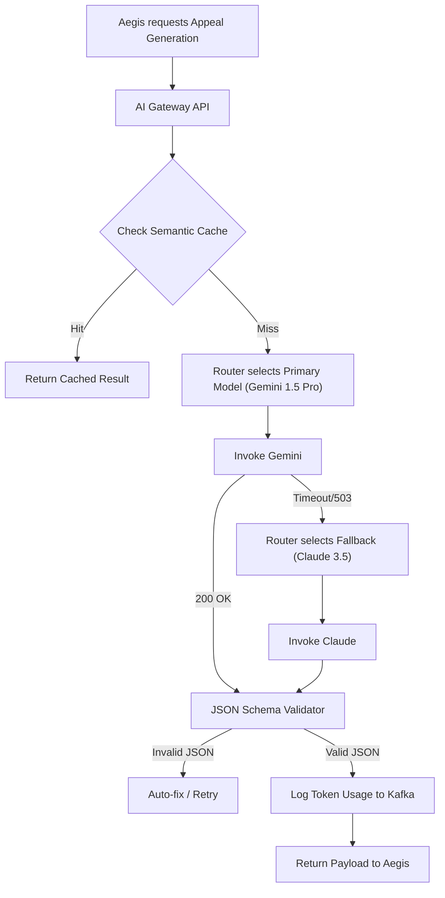
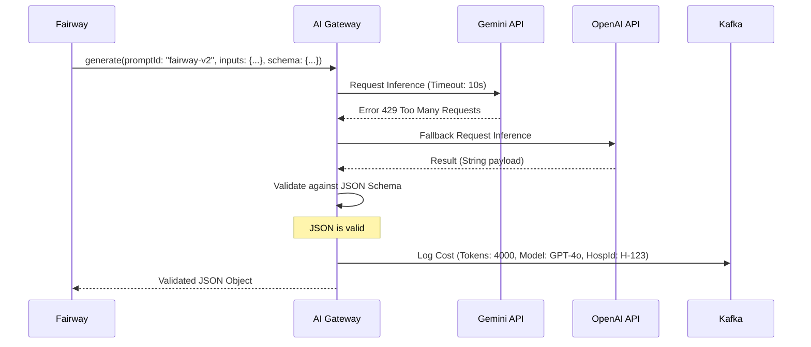

# AI Model Gateway — Architectural Specification

This document presents the complete production-grade architecture, workflows, schemas, and API contracts for Aivana's **AI Model Gateway**.

---

## 1. Purpose
In early iterations, Aivana microservices (Fairway, Aegis, ID, Extraction) called external LLMs (Google Gemini, OpenAI, Claude) directly. This creates a brittle, unobservable architecture. The AI Model Gateway centralizes all Generative AI traffic on the platform. It provides a single internal endpoint that abstracts away the underlying model provider. It is responsible for semantic routing, automatic failover/fallback, cost tracking per hospital, response caching, output schema validation (JSON enforcement), and real-time hallucination detection.

## 2. Responsibilities
- **Provider Abstraction**: Aivana services ask for a "Fast Reasoning Model" or "Heavy Context Model," and the Gateway decides whether to route to Gemini 1.5 Pro, Claude 3.5 Sonnet, or GPT-4o based on current uptime and latency.
- **Failover & Fallback**: If Gemini rate-limits the platform, seamlessly fall back to OpenAI without the calling microservice knowing.
- **Semantic Caching**: If Aegis requests an appeal for the exact same denial text twice, serve the cached response instantly.
- **Cost Allocation**: Track every token processed and bill it to the specific `hospitalId` and `serviceId`.
- **Output Validation**: Enforce rigorous JSON schema validation on LLM outputs before returning them to deterministic services.
- **Hallucination/Safety Checking**: Run a secondary, smaller model to verify the output of the primary model.

## 3. Non-Responsibilities
- **Does NOT** manage Prompts. (The Prompt Registry does this).
- **Does NOT** contain business logic for insurance rules.

---

## 4. Inputs
- **Inference Requests**: Unified JSON payloads from Fairway, Aegis, TPR, etc., containing the prompt, context, and requested JSON schema.
- **Model Credentials**: API keys from secure vaults.

## 5. Outputs
- **Validated Inference Result**: The LLM's response, strictly matching the requested schema.
- **Telemetry**: Cost, latency, and token metrics published to the Analytics Platform.

## 6. Dependencies
- **Prompt Registry**: To resolve `promptId` into actual prompt text.
- **External Providers**: Google Vertex AI, Azure OpenAI, Anthropic, or self-hosted open-source models (vLLM).

---

## 7. Position Inside Overall Pipeline

```
  [TPR Extraction]   [Fairway]   [Aegis Appeal]
         │              │              │
         └──────────────┼──────────────┘
                        ▼
 ╔═════════════════════════════════════════════════════╗
 ║                  AI Model Gateway                   ║
 ║  (Routing, Caching, Validation, Billing, Fallback)  ║
 ╚═════════════════════════════════════════════════════╝
         │              │              │
         ▼              ▼              ▼
     [Gemini]        [GPT-4o]      [Llama 3]
```

---

## 8. ASCII Architecture Diagram

```
                 +---------------------------------------------+
                 |       Internal API Gateway (REST/gRPC)      |
                 +----------------------+----------------------+
                                        |
                                        v
                 +----------------------+----------------------+
                 |      Semantic Cache (Redis / Pinecone)      |
                 +----+-----------------+------------------+---+
                      | (Cache Miss)    | (Cache Hit)      |
                      v                 |                  v
             +--------+--------+        |         (Return instantly)
             | Router &        |        |
             | Fallback Engine |        |
             +--------+--------+        |
                      |                 |
                      v                 |
             +--------+--------+        |
             | Payload Builder |        |
             | & Key Injector  |        |
             +--------+--------+        |
                      |                 |
                      v                 |
                 [ External LLM APIs ]  |
                      |                 |
                      v                 |
             +--------+--------+        |
             | JSON Validator  |        |
             | & Guardrails    |        |
             +--------+--------+        |
                      |                 |
                      v                 v
                 +----------------------+----------------------+
                 |         Cost & Telemetry Emitter (Kafka)    |
                 +---------------------------------------------+
```

---

## 9. Mermaid Workflow



---

## 10. Sequence Diagram (Fallback & Validation Scenario)



---

## 11. Core Gateway Components

1. **Semantic Cache**: Uses embeddings to detect if a functionally identical prompt was asked recently. "Explain this ECG" and "Analyze this ECG" map to the same cached result.
2. **Router / Load Balancer**: Distributes traffic across regions (e.g., US-East vs Europe) or models based on predefined cost/latency budgets.
3. **Guardrails Engine**: Uses fast, local classifiers (like a self-hosted BERT model) to detect PII leakage in the prompt, or toxic/hallucinated text in the response.
4. **Zod Validator**: Ensures the LLM output strictly conforms to the JSON schema requested by the internal microservice. If it fails, the Gateway can automatically prompt the LLM to fix its own JSON syntax error.

---

## 12. Internal Processing Pipeline

1. **Ingest**: Receive abstract request (`useClass: "REASONING_HEAVY"`).
2. **Resolve**: Fetch actual prompt text from Prompt Registry.
3. **Cache Check**: Vector search against Pinecone/Redis.
4. **Route**: Select optimal provider.
5. **Execute & Retry**: Handle HTTP network logic.
6. **Validate & Sanitize**: Ensure JSON schema match and strip markdown (````json ... ````).
7. **Return & Bill**: Send response to caller and usage to Kafka.

---

## 13. Deterministic vs AI Table

| Task | Methodology | Rationale |
| :--- | :--- | :--- |
| **Routing / Fallback** | Deterministic | Hard SLA and logic-based routing. |
| **JSON Validation** | Deterministic | Strict Schema enforcement (Zod/JSONSchema). |
| **Semantic Caching** | AI Assisted | Uses Vector Embeddings (Cosine Similarity). |
| **Inference** | AI Assisted | The actual payload generation. |

---

## 14. Latency Budget

- **Gateway Overhead (Cache Miss)**: < 50ms added to the LLM invocation time.
- **Gateway Overhead (Cache Hit)**: < 20ms total latency.

---

## 15. Scaling Strategy
- The Gateway is highly IO-bound (waiting on external LLMs). Node.js or Go are perfect here. It scales horizontally independent of the heavy logic engines like Fairway.

---

## 16. Caching Strategy
- **Exact Match (Redis)**: Instant lookup for identical strings.
- **Semantic Match (Vector DB)**: Requires embedding the prompt, but saves massive costs on repeated document extractions.

---

## 17. Retry Strategy
- The Gateway *owns* all retry logic for LLMs. Internal services (Fairway/Aegis) should **never** implement their own retry loops when calling the Gateway. The Gateway uses exponential backoff and provider cycling (e.g., Gemini -> Anthropic -> OpenAI).

---

## 18. Failure Handling
- If all cloud providers are down, the Gateway returns a standard `503 Service Unavailable` with a structured `AI_GATEWAY_OUTAGE` code, allowing the MCO to gracefully suspend the claim until AI services recover.

---

## 19. Event Model
- **Emits**: `LLM_USAGE_RECORD` (Consumed by the Analytics platform to bill hospitals).

---

## 20. API Contracts

### Unified Inference Request (Internal RPC)
```
POST /v1/ai/generate
Content-Type: application/json

{
  "hospitalId": "H-123",
  "serviceId": "AEGIS",
  "modelClass": "HEAVY_REASONING",
  "promptId": "aegis_appeal_v4",
  "inputs": {
    "claimData": "...",
    "denialReason": "..."
  },
  "responseSchema": {
    "type": "object",
    "properties": {
      "appealText": { "type": "string" },
      "confidence": { "type": "number" }
    },
    "required": ["appealText"]
  },
  "temperature": 0.2
}
```

---

## 21. JSON Schemas

### Usage Telemetry Payload (Kafka)
```json
{
  "$schema": "http://json-schema.org/draft-07/schema#",
  "title": "AiUsageRecord",
  "type": "object",
  "properties": {
    "requestId": { "type": "string" },
    "hospitalId": { "type": "string" },
    "serviceId": { "type": "string" },
    "modelUsed": { "type": "string" },
    "inputTokens": { "type": "integer" },
    "outputTokens": { "type": "integer" },
    "totalCostUsd": { "type": "number" },
    "latencyMs": { "type": "integer" },
    "cacheHit": { "type": "boolean" }
  }
}
```

---

## 22. Database Schema
The Gateway itself is largely stateless. It uses Redis for caching and emits usage logs to the Data Warehouse (BigQuery/Snowflake) via Kafka.

---

## 23. Audit Model
Because the AI Gateway sits in the middle of all AI traffic, it can sample and log 100% of LLM inputs and outputs to cold storage (S3). If an LLM hallucinates an illegal medical code, Aivana engineers can trace the exact prompt that caused it.

## 24. Lineage Model
The AI Gateway tags every returned JSON payload with a `gatewayTraceId`. This ID propagates down to the FCP, ensuring that every AI-generated byte in the final submission can be traced back to the exact LLM version and timestamp that generated it.

## 25. Metrics
- **Cache Hit Ratio**: Target > 30% for extraction tasks.
- **Provider Error Rate**: Tracking 429s and 500s across Google/OpenAI.
- **Cost Per Claim**: Total LLM spend aggregated by `claimId`.

## 26. Benchmark Targets
- Sustain 1,000 concurrent LLM connections.
- Ensure 0% JSON syntax errors leak back to the calling microservices.

---

## 27. Security Model
- **PII Scrubbing**: Before the payload leaves the Gateway to reach OpenAI, the Guardrails engine can optionally replace patient names with `[PATIENT_NAME]` to ensure external LLMs are not trained on hospital PHI.

## 28. Hospital Customization
Hospitals can choose their provider preferences. "Hospital A requires all data to stay in India, so the Gateway strictly routes to Azure OpenAI Central India. Hospital B wants the cheapest model, so route to Gemini Flash."

## 29. AKS Integration
Not directly related to AKS, but evaluates the rules pulled from AKS.

## 30. Future Extensibility
- **Model A/B Testing**: The Gateway can route 10% of traffic to a new open-source Llama 3 deployment, compare the outputs against the production Gemini baseline, and calculate an accuracy score.

## 31. Production Deployment
LiteLLM (Open Source Proxy) or custom Go API Gateway. Hosted in Kubernetes.

## 32. Testing Strategy
- **Chaos Engineering**: Intentionally injecting 503 errors into the mock Google API to ensure the Gateway's failover mechanisms instantly reroute to AWS Anthropic without dropping the internal request.

## 33. Versioning
The internal API (`/v1/ai/generate`) remains stable forever. As new models (GPT-5, Gemini 2) are released, they are added to the Gateway's routing table without requiring *any* code changes in Fairway or Taiga.

---

## 34. Example Outputs (Gateway Response)

```json
{
  "status": "SUCCESS",
  "metadata": {
    "traceId": "gw-8112",
    "provider": "google-vertex",
    "model": "gemini-1.5-pro",
    "latencyMs": 4200,
    "cacheHit": false
  },
  "data": {
    "appealText": "We request a review of the room rent deduction...",
    "confidence": 0.95
  }
}
```

---

## 35. Explainability Strategy
The Gateway helps explainability by appending the exact LLM metadata (Provider, Model Version, Temperature) to the output. The Explainability Service can then show the user: "This decision was extracted by Gemini 1.5 Pro."

## 36. Human Review Rules
The Gateway operates autonomously to ensure the system is highly available.

## 37. Technology Stack
- **Framework**: LiteLLM / Node.js / Go.
- **Caching**: Redis / Pinecone (Vector).
- **Validation**: Zod (TypeScript).

## 38. Open-source Dependencies
- `litellm` (or similar router) to normalize the SDK calls across all major AI providers into a single standard API.

---

*End of Document*
