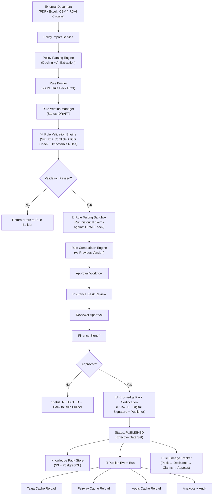
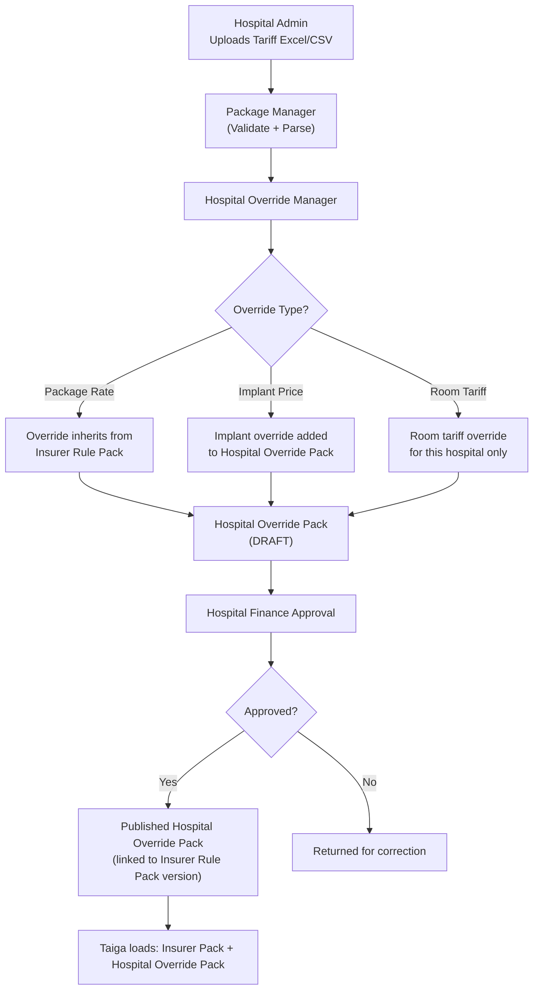
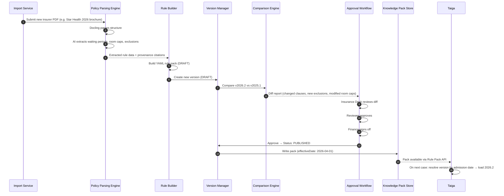
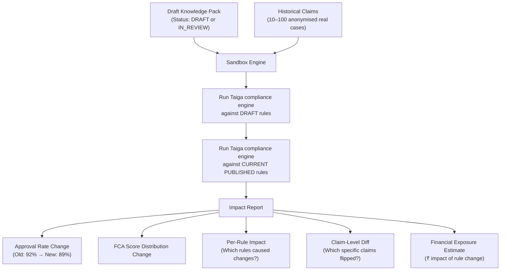
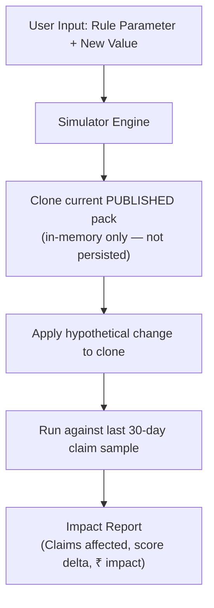
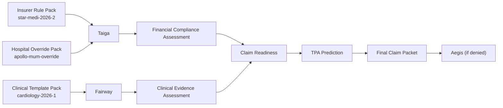
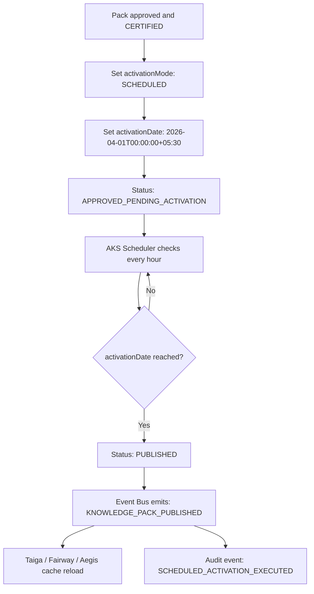

# Aivana Knowledge Studio (AKS) — Architectural Specification

AKS answers exactly **ONE question**:

> *"What are the current approved, versioned knowledge packs that Fairway, Taiga, and Aegis should use?"*

AKS is not a claims service. It is not a billing service. It is the **Insurance Operating System** of Aivana — the knowledge management backbone that every engine depends on. Every insurer product, hospital package, clinical specialty template, ICD mapping, TPA rule, IRDAI circular, and appeal template exists as a versioned, auditable **Knowledge Pack** that downstream services consume without writing a single line of code.

> **AKS is to Aivana what an operating system is to a computer. The engines (Fairway, Taiga, Aegis) are the applications. Knowledge Packs are the operating system's libraries. Without AKS, the engines are hardcoded. With AKS, they are infinitely configurable.**

---

## 1. Position in Aivana Platform

```
External Sources
────────────────────────────────────────────────────────────────
  Insurer PDFs      Hospital Excel     IRDAI Circulars
  Policy Brochures  Package CSVs       TPA Sheets
  Tariff Sheets     Negotiated Rates   NABH/ABDM Rules
        │                 │                  │
        └─────────────────▼──────────────────┘
                          │
                          ▼
        ╔══════════════════════════════════════╗
        ║     Aivana Knowledge Studio (AKS)   ║
        ║     "GitHub for Insurance Rules"    ║
        ╚══════════════════════════════════════╝
                          │
          ┌───────────────┼───────────────┐
          │               │               │
          ▼               ▼               ▼
    ┌──────────┐    ┌──────────┐    ┌──────────┐
    │ Fairway  │    │  Taiga   │    │  Aegis   │
    │ Clinical │    │Financial │    │ Denial   │
    │ Template │    │Rule Pack │    │Knowledge │
    │   Pack   │    │          │    │  Pack    │
    └──────────┘    └──────────┘    └──────────┘

        Claims Pipeline (Frozen — Never Modified by AKS)
        ─────────────────────────────────────────────────
        Hospital Upload → CCD → DocID → TPR → Fairway → Taiga → Claim Readiness → Aegis
```

---

## 2. Knowledge Pack Taxonomy

AKS manages **nine Knowledge Pack types** — and the list is intentionally extensible:

| Pack Type | Consumer | Contents |
| :--- | :--- | :--- |
| **Insurer Rule Pack** | Taiga | Room rent caps, waiting periods, co-pay, exclusions, packages, limits |
| **Clinical Specialty Template Pack** | Fairway | Evidence checklists per specialty (General Medicine, Cardiology, OBG, etc.) |
| **ICD Mapping Pack** | Taiga | ICD-10/11 chapter locks, India coding overrides, IRDAI preferred codes |
| **Hospital Override Pack** | Taiga | Hospital-negotiated package rates, custom tariffs, implant pricing |
| **Aegis Knowledge Pack** | Aegis | Denial reason libraries, appeal templates, insurer-specific appeal formats |
| **TPA Documentation Pack** | Claim Readiness | Required documents per insurer/TPA/procedure |
| **IRDAI Circular Pack** | All services | Regulatory circulars affecting coverage, exclusions, standards |
| **NABH / ABDM Pack** | Future services | Accreditation and digital health standards |
| **Package Master Pack** | Taiga / Claim Readiness | CGHS, PMJAY, and insurer-specific package code masters |

> **Design principle**: Every engine reads only Knowledge Packs. Nothing is hardcoded. When a new regulatory requirement arrives, a new pack version is published — no code is written.

---

## 3. System Architecture Diagram

```
┌───────────────────────────────────────────────────────────────────────────────┐
│                  Aivana Knowledge Studio (AKS)                                │
│                  "The Insurance Operating System"                             │
│                                                                               │
│  ┌─────────────────────────────────────────────────────────────────────────┐  │
│  │                    AKS Orchestration Controller                          │  │
│  │       (Pack Type Router + Tenant Resolver + Version Resolver)           │  │
│  └────┬──────────┬──────────┬──────────┬──────────┬──────────┬────────────┘  │
│       │          │          │          │          │          │               │
│       ▼          ▼          ▼          ▼          ▼          ▼               │
│  ┌────────┐ ┌────────┐ ┌────────┐ ┌────────┐ ┌────────┐ ┌────────┐        │
│  │Policy  │ │Policy  │ │  Rule  │ │Package │ │Hospital│ │  Rule  │        │
│  │Import  │ │Parsing │ │Builder │ │Manager │ │Override│ │Validation        │
│  │Service │ │Engine  │ │        │ │        │ │Manager │ │Engine  │        │
│  └────┬───┘ └────┬───┘ └────┬───┘ └───┬────┘ └────┬───┘ └────┬───┘        │
│       │          │          │          │           │          │               │
│       └──────────┴──────────┴────┬─────┴───────────┴──────────┘               │
│                                  │                                             │
│                                  ▼                                             │
│  ┌─────────────────────────────────────────────────────────────────────────┐  │
│  │                     Rule Version Manager                                │  │
│  │    DRAFT → IN_REVIEW → APPROVED → PUBLISHED → SUPERSEDED → RETIRED     │  │
│  └──────────────────────────────┬──────────────────────────────────────────┘  │
│                                  │                                             │
│       ┌────────────┬─────────────┼────────────┬──────────────┐               │
│       │            │             │            │              │               │
│       ▼            ▼             ▼            ▼              ▼               │
│  ┌─────────┐ ┌─────────┐ ┌──────────┐ ┌──────────┐ ┌──────────────┐       │
│  │  Rule   │ │Approval │ │  Rule    │ │  Rule    │ │  Simulation  │       │
│  │Comparison│ │Workflow │ │Explaina- │ │Dependency│ │  Sandbox     │       │
│  │  Engine │ │ Engine  │ │bility    │ │  Graph   │ │  Engine      │       │
│  └────┬────┘ └────┬────┘ └────┬─────┘ └────┬─────┘ └──────┬───────┘       │
│       │           │           │             │              │               │
│       └───────────┴───────────┼─────────────┘              │               │
│                               │                             │               │
│                               ▼                             ▼               │
│  ┌─────────────────────────────────────────────────────────────────────┐    │
│  │                  Knowledge Pack Certification Engine                │    │
│  │           (SHA256 + Digital Signature + Publisher Timestamp)        │    │
│  └─────────────────────────────┬───────────────────────────────────────┘    │
│                                 │                                            │
│                                 ▼                                            │
│  ┌─────────────────────────────────────────────────────────────────────┐    │
│  │                       Publish Event Bus                             │    │
│  │     (Taiga Reload · Fairway Reload · Aegis Reload · Analytics)      │    │
│  └─────────────────────────────┬───────────────────────────────────────┘    │
│                                 │                                            │
│                                 ▼                                            │
│  ┌─────────────────────────────────────────────────────────────────────┐    │
│  │                Rule Lineage Tracker                                 │    │
│  │   PDF → Clause → Rule → Pack → Taiga Decision → FCA → Claim → Appeal│    │
│  └─────────────────────────────┬───────────────────────────────────────┘    │
│                                 │                                            │
│       ┌─────────────────────────┴───────────────────────┐                   │
│       ▼                                                 ▼                   │
│  ┌─────────────────────────────────────┐  ┌─────────────────────────────┐  │
│  │        Audit Engine                 │  │  Knowledge Pack Store       │  │
│  │ (Immutable Log + Provenance Trail)  │  │  Postgres + S3 + Redis      │  │
│  └─────────────────────────────────────┘  └─────────────────────────────┘  │
└───────────────────────────────────────────────────────────────────────────────┘
```

---

## 4. Mermaid Workflow

### 4.1 Full Knowledge Pack Lifecycle (Updated — with Validation, Sandbox, Certification, Event Bus)



### 4.2 Hospital Override Workflow



### 4.3 Policy Update Workflow



---

## 5. Module Responsibilities

### 5.1 Policy Import Service

| Feature | Detail |
| :--- | :--- |
| Accepted formats | PDF, DOCX, Excel (.xlsx), CSV, Google Sheets export |
| File validation | MIME type check, file size limit, corruption detection (SHA256) |
| Duplicate detection | SHA256 hash compared against previously imported documents |
| OCR handling | Passes scanned PDFs through Docling (same gateway as claim documents) |
| Provenance tagging | Every uploaded file is tagged: source, upload timestamp, uploader, insurer, product name |
| Multi-document bundling | A single import session can contain multiple files for one policy version |

---

### 5.2 Policy Parsing Engine

The Policy Parsing Engine uses a **Docling-first + AI extraction** pattern (mirroring the Ingestion Gateway philosophy):

| Task | Method |
| :--- | :--- |
| Structural parsing (PDF layout, table extraction) | Docling |
| Table parsing (package tariffs, room rent schedules) | Docling native table structure |
| Clause text extraction | Docling native text |
| Waiting period value extraction | Deterministic pattern matching (regex on "30 days", "2 years", etc.) |
| Room rent percentage extraction | Deterministic pattern matching |
| Co-pay percentage extraction | Deterministic pattern matching |
| Exclusion list extraction | Deterministic list parsing |
| Ambiguous clause interpretation | LLM extraction adapter (conditional) |
| Extraction confidence scoring | Per-field confidence score attached |

**Extraction confidence thresholds:**
- `≥ 0.95` → Auto-accepted into Rule Builder
- `0.75 – 0.94` → Flagged for reviewer verification
- `< 0.75` → Blocked; manual entry required

---

### 5.3 Rule Builder

The Rule Builder converts extracted fields into structured YAML rule packs.

**Rule representation: YAML (primary)**

| Format | Verdict | Reason |
| :--- | :---: | :--- |
| **YAML** | ✅ Primary | Human-readable, git-diffable, hot-reloadable, supports comments |
| JSON | Secondary | Used for API transport; derived from YAML |
| Decision Tables | Supplementary | Used for complex matrix rules (co-pay by age × room category) |
| Drools | ❌ | JVM dependency, complex deployment, poor readability |

Decision tables supplement YAML for rules that are best represented as a matrix (e.g., co-pay varies by age band and room category simultaneously):

```
| Age Band | Room Category | Co-pay % |
|----------|---------------|----------|
| < 60     | Normal Ward   | 0%       |
| < 60     | ICU           | 10%      |
| ≥ 60     | Normal Ward   | 20%      |
| ≥ 60     | ICU           | 30%      |
```

---

### 5.4 Rule Version Manager

```
DRAFT         ← Created by Rule Builder; editable
    ↓
IN_REVIEW     ← Submitted to Approval Workflow; locked for editing
    ↓
APPROVED      ← All approval stages signed off
    ↓
PUBLISHED     ← Live; effectiveDate reached; consumed by Taiga/Fairway/Aegis
    ↓
SUPERSEDED    ← A newer version is PUBLISHED; this version still valid for historical cases
    ↓
RETIRED       ← Explicitly retired; no new cases should use this version
```

**Rollback procedure:**
1. Operator sets the current PUBLISHED version to `SUPERSEDED`.
2. A previous `SUPERSEDED` version is promoted back to `PUBLISHED`.
3. Rollback is a state change only — the YAML content of previous versions is never modified.
4. Rollback event is written to the immutable audit log.
5. Taiga's Rule Version Resolver picks up the new PUBLISHED version on the next request.

**Effective Date resolution (for Taiga):**
```
admission_date = TPR.admissionDate
active_pack = SELECT * FROM knowledge_packs
              WHERE insurer = TPR.insurer
                AND product = TPR.product
                AND status = 'PUBLISHED'
                AND effective_from <= admission_date
                AND (effective_to IS NULL OR effective_to >= admission_date)
              ORDER BY version DESC
              LIMIT 1
```

---

### 5.5 Hospital Override Manager

| Rule | Detail |
| :--- | :--- |
| Overrides inherit from | The specific insurer rule pack version the hospital is contracted against |
| What can be overridden | Package rate, room tariff, implant price, department-specific pricing |
| What cannot be overridden | Waiting periods, exclusions, co-pay rules, sum insured limits |
| Override hierarchy | Hospital Override > Insurer Scheme Rule > Insurer Global Rule > IRDAI Rule |
| Multiple hospital support | Each hospital has its own Override Pack; same insurer rule pack may have N hospital override packs |
| Override approval | Hospital Finance must approve before publishing |

---

### 5.6 Package Manager

| Feature | Detail |
| :--- | :--- |
| Import formats | Excel (.xlsx), CSV, TPA package sheets |
| Package schema | packageCode, packageName, procedureCodes[], inclusionList, exclusionList, rate, ICURate, implantIncluded, implantCap |
| Package validation | Validates procedure codes against ICD Mapping Pack before accepting |
| Package conflicts | Detects two mutually exclusive procedure codes in the same package group |
| Hospital packages | Hospital-defined packages extend insurer packages; cannot create new procedure categories |
| CGHS / PMJAY support | Standard CGHS and PMJAY package code tables maintained as reference packs |

---

### 5.7 Rule Comparison Engine

On every new version submission, the comparison engine generates a structured diff:

```json
{
  "compareFrom": "2025.1",
  "compareTo": "2026.2",
  "insurer": "Star Health",
  "product": "Medi Classic",
  "changes": {
    "added": [
      { "section": "exclusions", "item": "Obesity-related surgeries", "clause": "3.4(f)" }
    ],
    "modified": [
      {
        "section": "roomRent",
        "field": "normalWardCapPercent",
        "from": "1.0",
        "to": "0.75",
        "clause": "4.2"
      },
      {
        "section": "waitingPeriods",
        "field": "preExistingDisease",
        "from": "1460 days",
        "to": "1095 days",
        "clause": "3.1"
      }
    ],
    "removed": [
      { "section": "daycareList", "item": "Chemotherapy (outpatient)", "clause": "5.1" }
    ],
    "packageChanges": [
      {
        "packageCode": "CATARACT_PHACO",
        "field": "rate",
        "from": 30000,
        "to": 35000
      }
    ]
  }
}
```

This diff is presented to the Approval Workflow for review before any version is published.

---

### 5.8 Approval Workflow

```
DRAFT Submitted
       │
       ▼
Insurance Desk Review
  • Validates extracted clauses against source document
  • Approves / Returns for correction
       │
       ▼
Clinical/Medical Reviewer (for clinical template packs)
  • Reviews specialty evidence templates
  • Validates ICD chapter lock rules
       │
       ▼
Finance Review
  • Validates package tariffs
  • Validates room rent caps
  • Validates co-pay percentages
       │
       ▼
APPROVED
       │
       ▼
Effective Date Set → PUBLISHED
```

Each approval stage records: approver identity, timestamp, comments, and stage outcome. A rejection at any stage returns the pack to DRAFT with a mandatory rejection reason.

---

### 5.9 Audit Engine

The Audit Engine writes to an **append-only, immutable event log**. No record can be modified or deleted.

```json
{
  "eventId": "evt-20260713-0042",
  "timestamp": "2026-07-13T22:55:00+05:30",
  "actor": {
    "userId": "usr-admin-0923",
    "role": "INSURANCE_DESK",
    "hospital": "Apollo Hospitals Mumbai"
  },
  "action": "VERSION_APPROVED",
  "packType": "INSURER_RULE_PACK",
  "insurer": "Star Health",
  "product": "Medi Classic",
  "version": "2026.2",
  "previousVersion": "2025.1",
  "sourceDocument": {
    "filename": "star_health_medi_classic_2026_brochure.pdf",
    "sha256": "a3f92...c8",
    "uploadedAt": "2026-07-10T09:00:00+05:30"
  },
  "comment": "Reviewed against IRDAI circular dt. 2026-01-15. Room rent cap reduction confirmed."
}
```

---

### 5.10 Explainability Engine

Every rule in a Knowledge Pack retains its full provenance trail:

```yaml
# Example — Room Rent Rule with Provenance
roomRent:
  normalWard:
    capPercent: 0.75
    capBasis: "sumInsured"
    _provenance:
      sourceDocument: "star_health_medi_classic_2026_brochure.pdf"
      sha256: "a3f92...c8"
      pageNumber: 12
      clauseNumber: "4.2"
      paragraph: "The room rent eligible shall not exceed 0.75% of the Sum Insured per day..."
      extractionConfidence: 0.98
      extractionMethod: "DETERMINISTIC_PATTERN"
      approvedBy: "usr-admin-0923"
      approvedAt: "2026-07-13T22:55:00+05:30"
```

When Taiga issues a room rent deduction, it cites this provenance directly in the FCA output, creating an unbroken chain from the FCA citation back to the physical PDF page.

---

## 6. Knowledge Pack YAML Schema

### 6.1 Insurer Rule Pack (Full Schema)

```yaml
# AKS Insurer Rule Pack Schema v1.0
packType: "INSURER_RULE_PACK"
packId: "akp-star-medi-2026-2"
insurer: "Star Health Insurance"
product: "Medi Classic"
version: "2026.2"
status: "PUBLISHED"
effectiveFrom: "2026-04-01"
effectiveTo: null
previousVersion: "2025.1"
createdAt: "2026-07-13T00:00:00Z"
publishedAt: "2026-07-13T23:00:00Z"
publishedBy: "usr-finance-0042"

roomRent:
  normalWard:
    capPercent: 0.75
    capBasis: "sumInsured"
    proportionalDeduction: true
    _provenance: { pageNumber: 12, clauseNumber: "4.2", confidence: 0.98 }
  icu:
    capPercent: 2.0
    capBasis: "sumInsured"
    proportionalDeduction: true
    _provenance: { pageNumber: 12, clauseNumber: "4.3", confidence: 0.97 }

waitingPeriods:
  initialWaiting: { days: 30, _provenance: { pageNumber: 8, clauseNumber: "3.1(a)" } }
  preExistingDisease: { days: 1095, _provenance: { pageNumber: 8, clauseNumber: "3.1(b)" } }
  specificDiseases:
    - name: "Cataract"
      days: 730
      _provenance: { pageNumber: 9, clauseNumber: "3.2(a)" }
    - name: "Hernia"
      days: 730
    - name: "Kidney Stones"
      days: 730
    - name: "Joint Replacement"
      days: 730

copay:
  enabled: true
  rules:
    - ageMin: 0
      ageMax: 59
      roomCategory: "ALL"
      percentage: 0
    - ageMin: 60
      ageMax: 999
      roomCategory: "NORMAL"
      percentage: 20
    - ageMin: 60
      ageMax: 999
      roomCategory: "ICU"
      percentage: 30
  _provenance: { pageNumber: 15, clauseNumber: "5.1" }

maternity:
  waitingDays: 730
  normalDeliveryLimit: 35000
  lscsLimit: 50000
  _provenance: { pageNumber: 18, clauseNumber: "6.3" }

daycare:
  apply: true
  minimumHours: 0
  referenceList: "IRDAI_DAYCARE_2024_V1"
  _provenance: { pageNumber: 20, clauseNumber: "7.1" }

exclusions:
  - item: "Cosmetic surgery"
    clauseNumber: "8.1(a)"
  - item: "Dental treatment unless accidental"
    clauseNumber: "8.1(b)"
  - item: "Self-inflicted injuries"
    clauseNumber: "8.1(c)"
  - item: "AIDS/HIV"
    clauseNumber: "8.1(d)"
  - item: "Obesity-related surgeries"
    clauseNumber: "8.1(e)"
  - item: "Non-allopathic treatments except AYUSH"
    clauseNumber: "8.1(f)"

nonPayableConsumables:
  apply: true
  referenceList: "IRDAI_NONPAYABLE_2024_V2"

packages:
  - packageCode: "CATARACT_PHACO"
    packageName: "Cataract Phacoemulsification"
    icdCodes: ["H25.0", "H25.1", "H26.0"]
    rateNormal: 35000
    rateICU: null
    implantIncluded: false
    _provenance: { pageNumber: 24, clauseNumber: "PKG-001" }
  - packageCode: "LSCS"
    packageName: "Lower Segment Caesarean Section"
    icdCodes: ["O82", "O34.2"]
    rateNormal: 50000
    rateICU: 75000
    implantIncluded: false
  - packageCode: "TKR_UNILATERAL"
    packageName: "Total Knee Replacement (Unilateral)"
    icdCodes: ["M17.1", "M17.0"]
    rateNormal: 180000
    rateICU: 200000
    implantIncluded: true
    implantCap: 80000

diseaseSpecificLimits:
  - name: "Cataract"
    limitPerEye: 35000
  - name: "Cardiac Surgery"
    limit: 300000

insurerSpecificOverrides:
  - rule: "ICU_UPGRADE_REQUIRES_CLINICAL_JUSTIFICATION"
    value: true
  - rule: "DAYCARE_MINIMUM_HOURS"
    value: 0
```

### 6.2 Hospital Override Pack Schema

```yaml
packType: "HOSPITAL_OVERRIDE_PACK"
packId: "akp-hosp-apollo-mum-star-2026-2"
hospital: "Apollo Hospitals Mumbai"
hospitalCode: "HOSP-APOLLO-MUM-001"
linkedInsurerPack: "akp-star-medi-2026-2"
version: "2026.1"
status: "PUBLISHED"
effectiveFrom: "2026-04-01"

packageRateOverrides:
  - packageCode: "CATARACT_PHACO"
    negotiatedRate: 38000
    rationale: "Apollo Mumbai negotiated rate — MOU dated 2026-03-01"
    approvedBy: "usr-hosp-finance-0031"

implantPricingOverrides:
  - implantType: "Knee Implant (Premium)"
    negotiatedRate: 95000
    approvedBy: "usr-hosp-finance-0031"

roomTariffOverrides:
  - roomCategory: "DELUXE"
    mappedPolicyCategory: "NORMAL"
    dailyRate: 4500
    rationale: "Deluxe room billed as Normal Ward per insurer agreement"
```

### 6.3 Clinical Specialty Template Pack Schema (for Fairway)

```yaml
packType: "CLINICAL_SPECIALTY_TEMPLATE_PACK"
packId: "akp-clinical-cardiology-2026-1"
specialty: "Cardiology"
version: "2026.1"
status: "PUBLISHED"
effectiveFrom: "2026-01-01"

requiredEvidence:
  - field: "admissionNote"
    requirement: "MANDATORY"
  - field: "ecgReport"
    requirement: "MANDATORY"
  - field: "troponinLevel"
    requirement: "MANDATORY_IF_ACS"
  - field: "cardiologistNote"
    requirement: "MANDATORY"

medicalNecessityCriteria:
  - "ACS presentation must include documented symptom onset time"
  - "Interventional procedures require documented LVEF or SYNTAX score"

icdChapterLocks:
  - diagnosisCategory: "Ischaemic Heart Disease"
    allowedChapters: ["I"]
```

---

## 7. Database Schema

```sql
-- Knowledge Pack Registry
CREATE TABLE knowledge_packs (
  id               UUID PRIMARY KEY DEFAULT gen_random_uuid(),
  pack_type        VARCHAR(50) NOT NULL,  -- INSURER_RULE_PACK, HOSPITAL_OVERRIDE, CLINICAL_TEMPLATE, ICD_MAPPING, AEGIS_KNOWLEDGE
  pack_id          VARCHAR(100) UNIQUE NOT NULL,
  insurer          VARCHAR(100),
  hospital_code    VARCHAR(100),
  product          VARCHAR(100),
  version          VARCHAR(20) NOT NULL,
  status           VARCHAR(20) NOT NULL,  -- DRAFT, IN_REVIEW, APPROVED, PUBLISHED, SUPERSEDED, RETIRED
  effective_from   DATE NOT NULL,
  effective_to     DATE,
  previous_version VARCHAR(20),
  yaml_s3_key      VARCHAR(500) NOT NULL,  -- S3 path to YAML file
  yaml_sha256      VARCHAR(64) NOT NULL,
  created_at       TIMESTAMPTZ DEFAULT NOW(),
  created_by       UUID REFERENCES users(id),
  published_at     TIMESTAMPTZ,
  published_by     UUID REFERENCES users(id)
);

-- Source Document Registry
CREATE TABLE source_documents (
  id             UUID PRIMARY KEY,
  pack_id        VARCHAR(100) REFERENCES knowledge_packs(pack_id),
  filename       VARCHAR(500),
  file_type      VARCHAR(20),
  sha256         VARCHAR(64) UNIQUE,
  s3_key         VARCHAR(500),
  upload_at      TIMESTAMPTZ DEFAULT NOW(),
  uploaded_by    UUID REFERENCES users(id)
);

-- Immutable Audit Log
CREATE TABLE audit_events (
  id             UUID PRIMARY KEY DEFAULT gen_random_uuid(),
  timestamp      TIMESTAMPTZ DEFAULT NOW(),
  actor_id       UUID REFERENCES users(id),
  actor_role     VARCHAR(50),
  action         VARCHAR(100),  -- VERSION_CREATED, VERSION_APPROVED, VERSION_PUBLISHED, ROLLBACK, etc.
  pack_id        VARCHAR(100),
  pack_type      VARCHAR(50),
  details        JSONB
  -- NO UPDATE, NO DELETE permissions on this table
);

-- Approval Workflow Stages
CREATE TABLE approval_stages (
  id             UUID PRIMARY KEY,
  pack_id        VARCHAR(100) REFERENCES knowledge_packs(pack_id),
  stage          VARCHAR(50),  -- INSURANCE_DESK, CLINICAL_REVIEW, FINANCE
  status         VARCHAR(20),  -- PENDING, APPROVED, REJECTED
  approver_id    UUID REFERENCES users(id),
  approved_at    TIMESTAMPTZ,
  comments       TEXT
);

-- Version Comparison Store
CREATE TABLE version_diffs (
  id             UUID PRIMARY KEY,
  pack_id_from   VARCHAR(100),
  pack_id_to     VARCHAR(100),
  diff_json      JSONB,
  generated_at   TIMESTAMPTZ DEFAULT NOW()
);
```

---

## 8. API Contracts

### 8.1 Knowledge Pack Read API (consumed by Taiga, Fairway, Aegis)

```
GET /v1/packs/{packType}?insurer={insurer}&product={product}&admissionDate={date}
```

Returns the active PUBLISHED Knowledge Pack for the given insurer, product, and admission date.

```json
{
  "packId": "akp-star-medi-2026-2",
  "version": "2026.2",
  "status": "PUBLISHED",
  "effectiveFrom": "2026-04-01",
  "yamlContent": "{ ... full YAML pack ... }",
  "sha256": "a3f92...c8",
  "cachedAt": "2026-07-13T23:00:00Z"
}
```

### 8.2 Import API

```
POST /v1/import
Content-Type: multipart/form-data
```

Fields: `file`, `insurer`, `product`, `packType`, `description`

### 8.3 Version List API

```
GET /v1/packs/{packId}/versions
```

Returns the full version history for a pack.

### 8.4 Diff API

```
GET /v1/packs/{packId}/diff?from={version}&to={version}
```

Returns the structured comparison between two versions.

### 8.5 Rollback API

```
POST /v1/packs/{packId}/rollback
Body: { "targetVersion": "2025.1", "reason": "Room rent cap error in 2026.2" }
```

---

## 9. Taiga Rule Pack Resolution

Taiga resolves its Knowledge Pack at the start of every compliance request:

```
1. Read insurer + product + admissionDate from TPR
2. Call: GET /v1/packs/INSURER_RULE_PACK?insurer=X&product=Y&admissionDate=Z
3. Cache response in Redis (TTL: 1 hour)
4. Load Hospital Override Pack: GET /v1/packs/HOSPITAL_OVERRIDE_PACK?hospitalCode=H
5. Merge: Hospital Override > Insurer Pack (priority ladder)
6. Lock resolved pack version in FCA audit trail
```

The pack version used for any case is permanently recorded in the FCA audit schema. Even if the pack is later updated or rolled back, historical FCAs always show which exact version was used.

---

## 10. Security Model

| Concern | Control |
| :--- | :--- |
| Authentication | JWT-based auth; all AKS APIs require valid token |
| Role-based access | `INSURANCE_DESK`, `CLINICAL_REVIEWER`, `FINANCE`, `HOSPITAL_ADMIN`, `SUPER_ADMIN` |
| Multi-tenancy | Hospital can only read/write their own Override Pack; cannot access other hospitals' data |
| Insurer data isolation | Insurer rule packs scoped by insurer identity; cross-insurer reads blocked |
| Audit log immutability | Audit table has NO UPDATE, NO DELETE grants at database role level |
| YAML integrity | SHA256 of every YAML file stored; verified on every read |
| S3 access | Signed URLs only; direct bucket access blocked |
| Approval enforcement | Status transitions enforced at API level; database constraints prevent skipping stages |

---

## 11. Deployment Strategy

| Component | Deployment |
| :--- | :--- |
| AKS API (FastAPI) | Containerised; Kubernetes deployment; autoscaling |
| PostgreSQL (metadata) | Managed RDS / Cloud SQL; point-in-time recovery enabled |
| S3/MinIO (YAML packs) | Object storage with versioning enabled; lifecycle policy for archival |
| Redis (cache) | Managed ElastiCache / Redis Cloud; TTL 1 hour for pack cache |
| Approval Workflow | Async queue (Redis Streams / Kafka); email notifications for pending approvals |

---

## 12. Latency Budget

| Operation | Target |
| :--- | :--- |
| Knowledge pack read (cached) | < 20ms |
| Knowledge pack read (cold) | < 100ms |
| Policy import + parsing (PDF) | < 30 seconds (async, background) |
| Rule Builder YAML generation | < 5 seconds |
| Version diff computation | < 500ms |
| Approval stage transition | < 200ms |
| Rollback | < 500ms |
| Audit event write | < 50ms (async) |
| Sandbox simulation run (10 claims) | < 30 seconds (async) |
| Rule validation check | < 2 seconds |
| Event bus publish latency | < 100ms |

---

## 13. Rule Testing Sandbox ⭐ (Highest Priority)

The Sandbox is the most important capability that prevents bad rule packs from reaching production.

### How It Works



### Sandbox Output Schema

```json
{
  "sandboxRunId": "sbx-20260713-0042",
  "draftPackId": "akp-star-medi-2026-2",
  "baselinePackId": "akp-star-medi-2025-1",
  "claimsTestedCount": 50,
  "results": {
    "baseline": {
      "approvalRate": 0.92,
      "conditionalRate": 0.05,
      "failRate": 0.03,
      "avgScore": 88.4,
      "avgCashlessApproved": 87500
    },
    "draft": {
      "approvalRate": 0.89,
      "conditionalRate": 0.07,
      "failRate": 0.04,
      "avgScore": 85.1,
      "avgCashlessApproved": 84200
    },
    "delta": {
      "approvalRateChange": -0.03,
      "avgScoreChange": -3.3,
      "avgCashlessChange": -3300,
      "estimatedMonthlyImpact": -990000
    },
    "drivingChanges": [
      { "rule": "roomRent.normalWard.capPercent", "from": 1.0, "to": 0.75, "affectedClaims": 12 },
      { "rule": "waitingPeriods.preExistingDisease", "from": 1460, "to": 1095, "affectedClaims": 4 },
      { "rule": "packages.CATARACT_PHACO.rateNormal", "from": 30000, "to": 35000, "affectedClaims": 8 }
    ]
  }
}
```

### Sandbox Rules

- Sandbox runs against **anonymised historical claims only** — no live patient data
- Sandbox results are stored and linked to the pack version
- Approval workflow can require sandbox sign-off before proceeding
- Sandbox runs are asynchronous; UI polls for completion

---

## 14. Rule Simulator

The Simulator is different from the Sandbox. The Sandbox tests a whole new rule pack against real claims. The Simulator lets a user ask a hypothetical "what if" question against a single rule parameter.

### Interface

```
What if room_rent.normalWard.capPercent changes from 0.75% to 1.0%?

AKS Simulates:
  → 12 claims affected
  → Average cashless approved increases by ₹3,200/claim
  → 3 claims move from CONDITIONAL → PASS
  → Financial exposure change: +₹1,152,000/month (est.)
```

### Simulator Architecture



### What Can Be Simulated

| Parameter | Simulatable |
| :--- | :---: |
| Room rent cap (%) | ✅ |
| Co-pay percentage | ✅ |
| Waiting period days | ✅ |
| Package tariff change | ✅ |
| New exclusion added | ✅ |
| Exclusion removed | ✅ |
| Sum insured change | ✅ |

---

## 15. Rule Dependency Graph

AKS maintains a live dependency graph that maps how Knowledge Packs flow through the platform and which downstream decisions they influence.

### Dependency Map



### Impact Analysis

When a rule pack change is being reviewed, AKS automatically generates an **Impact Analysis Report**:

```
Changing: roomRent.normalWard.capPercent (0.75% → 1.0%)
Downstream impact:
  → Taiga: Room Rent Engine recalculates deduction_ratio
  → FCA: roomRentValidation.cashlessApproved changes
  → Claim Readiness: Financial readiness score affected
  → TPA Prediction: Confidence intervals shift
  → Aegis: Fewer denial appeals expected (room rent denials reduce)

Estimated affected services: 5
Estimated affected claims/month: 1,200
Estimated ₹ impact/month: +₹3,840,000
```

---

## 16. Rule Validation Engine

Before any pack can be submitted to the Approval Workflow, the **Rule Validation Engine** runs a pre-publication check — like a compiler checking code before release.

### Validation Checks

| Check | Category | Example |
| :--- | :--- | :--- |
| YAML schema validity | Syntax | Required field `insurer` missing |
| Duplicate clause detection | Logic | Two rules both define `roomRent.normalWard.capPercent` |
| Circular reference detection | Logic | Package A includes Package B which includes Package A |
| Invalid ICD code reference | Reference | Package references ICD `H99.9` which doesn't exist |
| Impossible room rent | Sanity | `capPercent: 150` — impossible value |
| Package conflict detection | Logic | Package CATARACT_LEFT and CATARACT_RIGHT both listed as mutually exclusive with each other |
| Missing ICD chapter lock | Completeness | Cataract procedure listed but no H-code chapter lock defined |
| Co-pay > 100% | Sanity | Co-pay percentage value exceeds 100 |
| Effective date before today | Temporal | `effectiveFrom` is in the past for a new DRAFT |
| Expired insurer product | Temporal | `effectiveTo` has already passed |

### Validation Output

```json
{
  "packId": "akp-star-medi-2026-2",
  "validationStatus": "FAILED",
  "errors": [
    {
      "severity": "BLOCKING",
      "code": "INVALID_ROOM_RENT_CAP",
      "message": "roomRent.normalWard.capPercent value 150 is > 100. Impossible configuration.",
      "path": "roomRent.normalWard.capPercent"
    }
  ],
  "warnings": [
    {
      "severity": "ADVISORY",
      "code": "MISSING_ICD_LOCK",
      "message": "Package CATARACT_PHACO references ophthalmology procedure but no H-code chapter lock is defined.",
      "path": "packages[0]"
    }
  ]
}
```

**BLOCKING errors** prevent submission to Approval Workflow.
**ADVISORY warnings** are shown to reviewers but do not block approval.

---

## 17. Knowledge Pack Certification

Every published Knowledge Pack receives a cryptographic certification record:

```json
{
  "certificationId": "cert-20260713-akp-star-medi-2026-2",
  "packId": "akp-star-medi-2026-2",
  "packVersion": "2026.2",
  "yamlSha256": "a3f92c8d1e4b5f6a7c8d9e0f1a2b3c4d5e6f7a8b9c0d1e2f3a4b5c6d7e8f9a0b",
  "publishedAt": "2026-07-13T23:00:00+05:30",
  "publishedBy": {
    "userId": "usr-finance-0042",
    "name": "Priya Sharma",
    "role": "FINANCE",
    "organization": "Star Health Insurance"
  },
  "approvalChain": [
    { "stage": "INSURANCE_DESK", "approvedBy": "usr-desk-0021", "approvedAt": "2026-07-12T10:00:00Z" },
    { "stage": "CLINICAL_REVIEW", "approvedBy": "usr-clinical-0009", "approvedAt": "2026-07-12T14:00:00Z" },
    { "stage": "FINANCE", "approvedBy": "usr-finance-0042", "approvedAt": "2026-07-13T22:50:00Z" }
  ],
  "sandboxVerified": true,
  "sandboxRunId": "sbx-20260712-0039",
  "validationStatus": "PASSED",
  "certificationStatus": "CERTIFIED"
}
```

The certification record is:
- Stored in the immutable audit log
- Attached to every FCA that cites this pack version
- Presented to IRDAI auditors on demand

---

## 18. Rule Lineage Tracker

AKS tracks the complete end-to-end lineage of every rule, from source document to final claim outcome:

```
Source Document
  star_health_2026_brochure.pdf
  Page 12, Clause 4.2
  Extraction Confidence: 0.98
        ↓
Rule in Knowledge Pack
  akp-star-medi-2026-2
  roomRent.normalWard.capPercent = 0.75%
  Approved by: Priya Sharma, 2026-07-13
        ↓
Taiga Decision
  CASE-24936: Room Rent Engine applied 0.75% cap
  Deduction Ratio: 0.667
  Total Deduction: ₹7,200
        ↓
Financial Compliance Assessment
  FCA-24936-v1
  roomRentValidation.status: ADVISORY
  cashlessApproved: ₹98,000
        ↓
Claim Submitted
  Claim Ref: SH-2026-CLM-003821
  Status: APPROVED
        ↓
Appeal (if denied)
  Aegis-Appeal-24936
  Cited rule pack version: 2026.2
  Cited clause: 4.2
```

This lineage is queryable. An insurer auditor can trace any claim back to the exact clause that governed it. A hospital can challenge any deduction by requesting the lineage report.

---

## 19. Knowledge Marketplace (Future — Design for Extensibility)

> **Status**: Designed for future implementation. The current schema supports it; no immediate build required.

The Knowledge Marketplace allows hospitals and TPAs to share verified Knowledge Packs:

```
Apollo Hospitals
  Creates: Orthopedic Package Master (premium implant rates, procedure codes, CCI edits)
  Exports: Certified Knowledge Pack
        ↓
Knowledge Marketplace
  Pack listed with: author, version, specialty, price (free or licensed)
        ↓
Rainbow Hospital
  Imports: Apollo Orthopedic Package Master
  Applies: as Hospital Override Pack
  Saves: weeks of manual package configuration
```

### Marketplace Design Principles

1. **Imported packs are read-only** — hospitals can extend them but not modify them
2. **Certification is mandatory** — only CERTIFIED packs can be listed
3. **Lineage is preserved** — imported packs carry their original provenance
4. **Revenue model**: Aivana takes a platform fee on licensed packs; free packs listed openly

### Schema Additions for Marketplace

```yaml
# Extended pack metadata for marketplace listing
marketplace:
  listed: true
  visibility: "PUBLIC"  # or PRIVATE, LICENSED
  category: "Orthopedics"
  authorOrganization: "Apollo Hospitals"
  licenseType: "FREE"  # or COMMERCIAL
  downloadCount: 142
  rating: 4.8
```

---

## 20. Event Bus Architecture

The Publish Event Bus decouples AKS from its consumers. When a pack is published, AKS does not directly call Taiga, Fairway, or Aegis. Instead, it emits a structured event:

```json
{
  "eventType": "KNOWLEDGE_PACK_PUBLISHED",
  "eventId": "evt-20260713-pub-0042",
  "timestamp": "2026-07-13T23:00:00+05:30",
  "packId": "akp-star-medi-2026-2",
  "packType": "INSURER_RULE_PACK",
  "insurer": "Star Health",
  "product": "Medi Classic",
  "version": "2026.2",
  "effectiveFrom": "2026-07-14",
  "affectedServices": ["TAIGA", "AEGIS"],
  "cacheInvalidationKeys": ["taiga:star_health:medi_classic", "aegis:star_health"]
}
```

### Event Consumers

| Consumer | Action on Event |
| :--- | :--- |
| **Taiga** | Invalidates Redis cache for affected insurer/product; pre-warms cache with new pack |
| **Fairway** | Invalidates Redis cache for affected specialty templates; pre-warms |
| **Aegis** | Reloads appeal templates for affected insurer |
| **Analytics** | Records pack publication event; triggers impact analysis pipeline |
| **Audit Engine** | Writes immutable publication event record |
| **Notification Service** | Sends email/Slack notification to hospital billing teams |

### Event Bus Technology

- **Preferred**: Kafka (for high-volume, multi-consumer, replay support)
- **Fallback**: Redis Streams (simpler ops, sufficient for < 100 events/day)
- **Guarantee**: At-least-once delivery with idempotent consumer handling

---

## 21. Knowledge Pack Health Dashboard

The Health Dashboard gives compliance teams and platform administrators a live operational view of every Knowledge Pack across the platform.

### Dashboard Panels

```
┌─────────────────────────────────────────────────────────────────────────┐
│                   AKS Knowledge Pack Health Dashboard                   │
├─────────────────────────┬───────────────────────────────────────────────┤
│  PUBLISHED PACKS        │  DRAFT PACKS                                 │
│  ──────────────         │  ────────────                                │
│  Star Health Medi 2026.2│  Star Health Comprehensive 2026.1 (BLOCKED)  │
│  New India Floater 2026.1│ HDFC Ergo 2026.1 (IN_REVIEW)               │
│  Apollo Override 2026.1  │ Cardiology Template v3.0 (DRAFT)            │
│  Cardiology Template v2.3│                                             │
├─────────────────────────┴───────────────────────────────────────────────┤
│  FAILED VALIDATIONS                                                     │
│  ─────────────────                                                      │
│  HDFC Ergo 2026.1 — BLOCKING: roomRent.capPercent > 100               │
│  Cataract Package v2 — ADVISORY: Missing ICD H-code chapter lock       │
├─────────────────────────────────────────────────────────────────────────┤
│  EXPIRING VERSIONS (next 60 days)                                       │
│  ────────────────────────────────                                       │
│  New India Floater 2025.2 — expires 2026-09-01                         │
│  Apollo Override 2025.3  — expires 2026-08-15                          │
├─────────────────────────────────────────────────────────────────────────┤
│  PACK ADOPTION                                                          │
│  ─────────────                                                          │
│  Star Health Medi 2026.2 — used by 312 hospitals                       │
│  Star Health Medi 2025.1 — used by 14 hospitals (SUPERSEDED — migrate) │
│  New India Floater 2026.1 — used by 87 hospitals                       │
├─────────────────────────────────────────────────────────────────────────┤
│  RECENT CHANGES (last 7 days)                                           │
│  ─────────────────────────────                                          │
│  2026-07-13  Star Health Medi 2026.2 PUBLISHED (room rent: 1%→0.75%)  │
│  2026-07-12  Cardiology Template v2.3 PUBLISHED                        │
│  2026-07-10  Apollo Override 2026.1 approved by Finance               │
└─────────────────────────────────────────────────────────────────────────┘
```

### Health Dashboard API

```
GET /v1/dashboard/health
```

Returns:

```json
{
  "publishedPacks": 12,
  "draftPacks": 3,
  "blockedValidations": 1,
  "advisoryWarnings": 2,
  "expiringIn60Days": 2,
  "packsByAdoption": [
    { "packId": "akp-star-medi-2026-2", "hospitalsUsing": 312 },
    { "packId": "akp-new-india-floater-2026-1", "hospitalsUsing": 87 }
  ],
  "supersededWithActiveHospitals": [
    { "packId": "akp-star-medi-2025-1", "hospitalsUsing": 14, "migrateBy": "2026-10-01" }
  ],
  "recentChanges": [
    {
      "timestamp": "2026-07-13T23:00:00Z",
      "action": "PUBLISHED",
      "packId": "akp-star-medi-2026-2",
      "summary": "room rent cap reduced from 1.0% to 0.75%"
    }
  ]
}
```

### Expiry Alerts

- 60-day advance warning for all packs with a set `effectiveTo` date
- Automated email to INSURANCE_DESK role when a pack expires in < 30 days
- A pack whose `effectiveTo` has passed is automatically set to `RETIRED` status
- Any hospital still using a `RETIRED` pack triggers a HIGH priority alert

---

## 22. Scheduled Activation

Scheduled Activation allows compliance teams to publish a pack today and have it automatically activate on a future date — without any manual action at midnight on a policy year changeover.

### How It Works



### Scheduled Activation YAML

```yaml
packId: "akp-star-medi-2026-2"
version: "2026.2"
status: "APPROVED_PENDING_ACTIVATION"
activationMode: "SCHEDULED"
activationDate: "2026-04-01T00:00:00+05:30"
activationNote: "New policy year activation — Star Health Medi Classic 2026"
```

### Rules

- A pack in `APPROVED_PENDING_ACTIVATION` is fully certified and approved but not yet active
- Taiga does **not** use this pack until `activationDate` is reached
- Multiple packs can be scheduled for the same date (e.g., all insurers' April 1 policy year packs)
- Activation is atomic per pack — if activation fails (e.g., DB write error), it retries with exponential backoff and alerts the admin
- Manual override: an admin can force-activate or cancel a scheduled activation before its date

### Multiple Policy Year Management

```
Q1 2026: star-medi-2025-1    (PUBLISHED — active for cases with admission date < 2026-04-01)
Q2 2026: star-medi-2026-2    (APPROVED_PENDING_ACTIVATION — activates 2026-04-01)

On 2026-04-01 00:00:00 IST:
  star-medi-2025-1  → SUPERSEDED
  star-medi-2026-2  → PUBLISHED
```

---

## 23. Rollback Preview

Before executing a rollback, the operator must see the impact. Rollback Preview answers:

> *"If I roll back from v2026.2 to v2025.1, how many hospitals and open claims will be affected?"*

### Preview API

```
POST /v1/packs/{packId}/rollback/preview
Body: { "targetVersion": "2025.1" }
```

Returns:

```json
{
  "currentVersion": "2026.2",
  "targetVersion": "2025.1",
  "rollbackPreview": {
    "hospitalsAffected": 312,
    "openCasesAffected": 1847,
    "inFlightFCAsAffected": 43,
    "ruleChanges": {
      "roomRent.normalWard.capPercent": { "current": 0.75, "afterRollback": 1.0 },
      "waitingPeriods.preExistingDisease": { "current": 1095, "afterRollback": 1460 },
      "packages.CATARACT_PHACO.rateNormal": { "current": 35000, "afterRollback": 30000 }
    },
    "estimatedFinancialImpact": {
      "cashlessApprovedChange": "+₹3,200 per affected claim",
      "monthlyExposureChange": "+₹5,910,400"
    },
    "sandboxPreview": {
      "approvalRateChange": "+3%",
      "avgScoreChange": "+3.3"
    },
    "riskLevel": "HIGH",
    "warnings": [
      "43 FCAs currently in-flight will use the rolled-back rules — results may differ from original validation",
      "312 hospitals will see rule change immediately after rollback"
    ]
  },
  "requiresConfirmation": true,
  "confirmationToken": "rbk-confirm-a3f92c8d"
}
```

### Rollback Confirmation

After reviewing the preview, the operator confirms using the token:

```
POST /v1/packs/{packId}/rollback/confirm
Body: { "confirmationToken": "rbk-confirm-a3f92c8d", "reason": "Room rent cap error in 2026.2" }
```

This two-step pattern (Preview → Confirm) prevents accidental rollbacks.

---

## 24. Pack Compatibility Matrix

As the platform evolves, Knowledge Pack versions must remain compatible with each other and with the service versions consuming them. The Compatibility Matrix enforces this.

### The Problem

```
Fairway v3.0 introduces a new mandatory field: "ICU justification note"
Clinical Template Pack v2.3 was authored before v3.0 and does not include this field
→ Fairway v3.0 fails silently on Clinical Template Pack v2.3
```

Without a Compatibility Matrix, this is a silent production failure.

### Compatibility Matrix Schema

```yaml
# AKS Compatibility Matrix
compatibilityRules:
  - packType: "CLINICAL_SPECIALTY_TEMPLATE_PACK"
    packVersionRange: ">=2.0.0 <3.0.0"
    compatibleWith:
      - service: "FAIRWAY"
        serviceVersionRange: ">=2.0.0 <4.0.0"
      - service: "TAIGA"
        serviceVersionRange: ">=3.0.0"

  - packType: "INSURER_RULE_PACK"
    packVersionRange: ">=2026.1"
    compatibleWith:
      - service: "TAIGA"
        serviceVersionRange: ">=4.0.0"
      - service: "CLAIM_READINESS"
        serviceVersionRange: ">=3.0.0"
```

### Compatibility Check — API

```
GET /v1/compatibility?packId=akp-clinical-cardiology-2026-1&serviceVersion[FAIRWAY]=3.2.0
```

Returns:

```json
{
  "packId": "akp-clinical-cardiology-2026-1",
  "packVersion": "2.3",
  "packType": "CLINICAL_SPECIALTY_TEMPLATE_PACK",
  "checks": [
    {
      "service": "FAIRWAY",
      "serviceVersion": "3.2.0",
      "compatible": true
    },
    {
      "service": "TAIGA",
      "serviceVersion": "4.1.0",
      "compatible": true
    },
    {
      "service": "CLAIM_READINESS",
      "serviceVersion": "3.0.0",
      "compatible": true
    }
  ],
  "overallCompatibility": "COMPATIBLE",
  "recommendation": null
}
```

### Incompatibility Handling

If a pack is incompatible with the current service version:
1. The pack cannot be PUBLISHED until the incompatibility is resolved
2. The Rule Validation Engine flags it as a BLOCKING error
3. Options: upgrade the pack version, or deploy a compatible service version first
4. The Dependency Graph is used to assess the cascade effect of any incompatibility

---

## 25. Aivana Platform Architecture — Complete Overview

This is the definitive architecture of the complete Aivana platform as of this document version.

```
┌───────────────────────────────────────────────────────────────────────────┐
│                         AIVANA PLATFORM                                   │
│                                                                           │
│  ┌─────────────────────────────────────────────────────────────────────┐  │
│  │            Aivana Knowledge Studio (AKS)                            │  │
│  │            "The Insurance Operating System"                         │  │
│  │                                                                     │  │
│  │  Insurer Rule Packs · Clinical Templates · ICD Mappings            │  │
│  │  Hospital Overrides · Aegis Knowledge · TPA Docs · IRDAI Circulars │  │
│  └────────────────────────────┬────────────────────────────────────────┘  │
│                               │                                           │
│           ┌───────────────────┼───────────────────┐                      │
│           │                   │                   │                      │
│           ▼                   ▼                   ▼                      │
│    ┌────────────┐      ┌────────────┐      ┌────────────┐               │
│    │   Fairway  │      │   Taiga    │      │   Aegis    │               │
│    │  Clinical  │      │ Financial  │      │  Denial    │               │
│    │ Templates  │      │ Rule Packs │      │ Knowledge  │               │
│    └────────────┘      └────────────┘      └────────────┘               │
│                                                                           │
│  ─────────────────────────────────────────────────────────────────────   │
│                         CLAIMS PIPELINE                                   │
│  ─────────────────────────────────────────────────────────────────────   │
│                                                                           │
│  Hospital Upload                                                          │
│       │                                                                   │
│       ▼                                                                   │
│  ┌─────────────────────────────────────────────────────┐                 │
│  │   Docling Ingestion Gateway                         │                 │
│  │   Output: Canonical Clinical Document (CCD)         │                 │
│  └─────────────────────────┬───────────────────────────┘                 │
│                             │                                             │
│  ┌──────────────────────────▼──────────────────────────┐                 │
│  │   Document Identification Service                   │                 │
│  └─────────────────────────┬───────────────────────────┘                 │
│                             │                                             │
│  ┌──────────────────────────▼──────────────────────────┐                 │
│  │   Patient Information Extraction + Consolidation    │                 │
│  │   Output: Trusted Patient Record (TPR)              │                 │
│  │   [ Patient Truth ]                                 │                 │
│  └─────────────────────────┬───────────────────────────┘                 │
│                             │                                             │
│  ┌──────────────────────────▼──────────────────────────┐                 │
│  │   Fairway Clinical Evidence Review                  │◄── Clinical     │
│  │   Output: Clinical Evidence Assessment (CEA)        │    Templates    │
│  │   [ Clinical Truth ] MNS + ECS                     │    from AKS     │
│  └─────────────────────────┬───────────────────────────┘                 │
│                             │                                             │
│  ┌──────────────────────────▼──────────────────────────┐                 │
│  │   Taiga Financial Compliance Engine                 │◄── Rule Packs   │
│  │   Output: Financial Compliance Assessment (FCA)     │    from AKS     │
│  │   [ Financial Truth ] 8 dimensions                  │                 │
│  └─────────────────────────┬───────────────────────────┘                 │
│                             │                                             │
│  ┌──────────────────────────▼──────────────────────────┐                 │
│  │   Claim Readiness Service                           │◄── TPA Docs     │
│  │   [ Submission Truth ] CEA + FCA + Admin            │    from AKS     │
│  └─────────────────────────┬───────────────────────────┘                 │
│                             │                                             │
│  ┌──────────────────────────▼──────────────────────────┐                 │
│  │   TPA Query Prediction                              │                 │
│  │   [ Anticipation Layer ]                            │                 │
│  └─────────────────────────┬───────────────────────────┘                 │
│                             │                                             │
│  ┌──────────────────────────▼──────────────────────────┐                 │
│  │   Final Claim Packet                                │                 │
│  │   [ Submission Layer ]                              │                 │
│  └─────────────────────────┬───────────────────────────┘                 │
│                             │                                             │
│                    Insurer Decision                                       │
│                             │                                             │
│             ┌───────────────┴───────────────┐                            │
│             │ APPROVED                      │ DENIED                    │
│             │ → Cashless processed          │                            │
│             │                               ▼                            │
│             │               ┌──────────────────────────────┐             │
│             │               │   Aegis Denial Appeal        │◄── Aegis   │
│             │               │   Intelligence               │    Knowledge│
│             │               │   [ Recovery Layer ]         │    from AKS │
│             │               └──────────────────────────────┘             │
└───────────────────────────────────────────────────────────────────────────┘
```

### Responsibility Charter

| Service | Single Responsibility | Output |
| :--- | :--- | :--- |
| **AKS** | Manage versioned knowledge for all engines | Knowledge Packs |
| **Ingestion Gateway** | Convert raw documents to structured CCD | CCD |
| **Document Identification** | Classify every document in the CCD | Classified CCD |
| **Patient Extraction + Consolidation** | Reconcile patient identity across documents | Trusted Patient Record (TPR) |
| **Fairway** | Assess clinical evidence sufficiency | CEA — Clinical Evidence Assessment |
| **Taiga** | Validate financial and policy compliance | FCA — Financial Compliance Assessment |
| **Claim Readiness** | Determine submission readiness | Readiness Score + Submission Decision |
| **TPA Query Prediction** | Anticipate insurer queries before submission | Query Prediction Pack |
| **Final Claim Packet** | Assemble the complete claim for submission | Submission-ready Claim Packet |
| **Aegis** | Generate denial appeal intelligence | Appeal Letters + Evidence Package |

### The Aivana Truth Hierarchy

```
Patient Truth      → TPR          (who the patient is, what happened clinically)
Clinical Truth     → CEA          (is the clinical evidence sufficient?)
Business Truth     → AKS Packs    (what are the rules today?)
Financial Truth    → FCA          (is the claim financially compliant?)
Submission Truth   → Readiness    (is the claim ready to submit?)
Recovery Truth     → Aegis        (how do we appeal if denied?)
```

> **Every truth is produced by exactly one service. No service produces two truths. No truth is produced by two services.**
