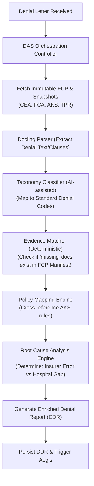
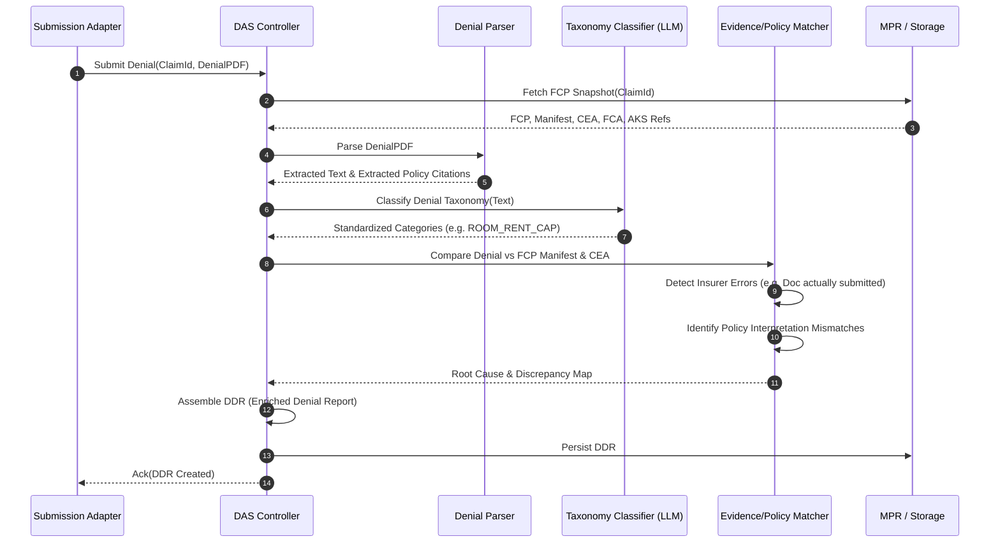

# Denial Analysis Service (DAS) — Architectural Specification

This document presents the complete production-grade architecture, workflows, schemas, and API contracts for Aivana's **Denial Analysis Service (DAS)**.

---

## 1. Purpose
The Denial Analysis Service (DAS) is the analytical bridge between an insurer's rejection and Aivana's appeal engine. It initiates exclusively after a TPA or Insurer denies a claim. Its sole purpose is to parse the denial, identify the root cause, map the denial reasons against the submitted immutable evidence, and produce a structured Enriched Denial Report (DDR) for downstream appeal generation.

## 2. Responsibilities
- OCR and parse raw denial letters received from TPAs/Insurers.
- Classify denial reasons into structured taxonomy (e.g., Clinical, Policy, Billing).
- Map denial reasons to explicit policy clauses using the AKS rule packs.
- Identify insurer mistakes (e.g., claiming a document was missing when the FCP manifest proves it was sent).
- Compare denial rationales against the submitted evidence (TPR, CEA, FCA).
- Identify specifically missing evidence, coding mistakes, or policy interpretation discrepancies.
- Produce a deterministic Root Cause Analysis.
- Produce a structured Enriched Denial Report (DDR) to feed Aegis.

## 3. Non-Responsibilities
- **Does NOT** generate appeal letters, bundles, or timelines (that is strictly the domain of Aegis).
- **Does NOT** modify the original claim or the Final Claim Packet (FCP is immutable).
- **Does NOT** communicate directly with the insurer (adapters handle transport).

---

## 4. Inputs
- **Final Claim Packet (FCP)** (Immutable Source of Truth containing exact hashes and submitted documents)
- **Denial Letter** (PDF or text payload from TPA)
- **Submission Readiness Report (SRR)**
- **Financial Compliance Assessment (FCA)**
- **Clinical Evidence Assessment (CEA)**
- **Aivana Knowledge Studio (AKS) Rule Pack** (Specific version locked in the FCP snapshot)
- **Trusted Patient Record (TPR)**

## 5. Outputs
- **Enriched Denial Report (DDR)**: A structured JSON artifact detailing the parsed denial taxonomy, root cause analysis, evidence discrepancy mapping, and policy clause references.

## 6. Dependencies
- **Docling-first Ingestion Gateway**: To parse and chunk the incoming Denial Letter.
- **Master Patient Record (Dexie/DB)**: To retrieve the exact upstream snapshot versions referenced in the FCP.
- **AKS Engine**: To resolve policy clauses cited in the denial letter against the verified rule pack.

---

## 7. Position Inside Overall Pipeline

```
Hospital Upload → [...] → Final Claim Packet (FCP) → Submission Adapter → Insurer
                                                                            │
      ┌─────────────────────────────────────────────────────────────────────┘
      ▼
 ╔═════════════════════════════════════════════════════╗
 ║           Denial Analysis Service (DAS)             ║
 ║  (Parses rejection, maps evidence, builds DDR)      ║
 ╚═════════════════════════════════════════════════════╝
      │
      ▼
Aegis Appeal Intelligence (Generates appeals based on DDR)
```

---

## 8. ASCII Architecture Diagram

```
                 +---------------------------------------------+
                 |  Inputs: FCP, Denial Letter, CEA, FCA, AKS  |
                 +----------------------+----------------------+
                                        |
                                        v
                 +----------------------+----------------------+
                 |      DAS Orchestration Controller           |
                 +----+-----------------+------------------+---+
                      |                 |                  |
                      v                 v                  v
             +--------+--------+ +------+-------+ +--------+--------+
             | Denial Parser   | | Taxonomy     | | Evidence Matcher |
             | (OCR/Docling)   | | Classifier   | | & Comparator     |
             +--------+--------+ +------+-------+ +--------+--------+
                      |                 |                  |
                      +-----------------+------------------+
                                        |
                                        v
                 +----------------------+----------------------+
                 |          Policy Mapping Engine              |
                 |  (Links denial text to AKS rule clauses)    |
                 +----------------------+----------------------+
                                        |
                                        v
                 +----------------------+----------------------+
                 |       Root Cause Analysis Engine            |
                 | (Identifies Insurer mistakes vs Hosp gaps)  |
                 +----------------------+----------------------+
                                        |
                                        v
                 +----------------------+----------------------+
                 |     DDR Generator & Audit Snapshot          |
                 +---------------------------------------------+
```

---

## 9. Mermaid Workflow



---

## 10. Sequence Diagram



---

## 11. State Machine

```
   [RECEIVED]
     │
     ▼
  [PARSING_DENIAL] ----(OCR/Parse Fail)----> [FAILED]
     │
     ▼
  [CLASSIFYING]
     │
     ▼
  [MAPPING_EVIDENCE]
     │
     ▼
  [ANALYZING_ROOT_CAUSE]
     │
     ▼
  [GENERATING_DDR] ----(DB Write Fail)-----> [RETRY_QUEUED]
     │
     ▼
  [DDR_COMPLETE] (Triggers Aegis)
```

---

## 12. Components

1. **Denial Parser**: Uses the Docling Gateway architecture to reliably convert PDF denial letters into structured JSON, extracting tabular data and policy citation blocks.
2. **Taxonomy Classifier**: AI-assisted module that categorizes raw insurer text ("As per clause 4.1, admission not justified") into standardized system taxonomy (`CLINICAL_NECESSITY_UNJUSTIFIED`).
3. **Evidence Matcher**: Deterministic engine that compares the denial claims against the `manifest.json` and `evidenceIndex` of the FCP.
4. **Policy Mapping Engine**: Deterministic rules engine that cross-references the cited clauses in the denial against the exact version of the AKS pack locked in the FCP snapshot.
5. **Root Cause Analysis (RCA) Engine**: Evaluates whether the denial is a legitimate hospital error (e.g. missing signature not caught by overrides) or an insurer mistake (e.g. denying for missing ECG when the ECG hash exists in the FCP).

---

## 13. Internal Processing Pipeline

1. **Extraction**: Denial PDF is converted to markdown.
2. **Entity Recognition**: Insurer name, patient ID, date, denied amount, and cited clauses are extracted.
3. **Classification**: The primary reason for denial is mapped to an internal unified taxonomy.
4. **Cross-Referencing**: The extracted reasons are bounced against the FCP. If the insurer claims "No pre-auth", the Evidence Matcher checks the FCP Authorization Bundle.
5. **Synthesis**: The RCA engine computes a confidence score on whether the denial is contestable.

---

## 14. Parallel Execution Opportunities
- **Evidence Matching** and **Policy Mapping** can run concurrently once the **Taxonomy Classification** resolves the core issue vectors.
- OCR parsing and FCP snapshot database retrieval are executed in parallel during the initialization phase.

---

## 15. Deterministic vs AI Table

| Task | Methodology | Rationale |
| :--- | :--- | :--- |
| **Denial Parsing (OCR)** | Deterministic / ML | Layout parsing via Docling is deterministic pattern matching. |
| **Taxonomy Classification** | AI Assisted | Insurers use highly variable, ambiguous free-text. LLM is required to normalize to system taxonomy. |
| **Missing Document Verification**| Deterministic | Comparing a denial claim against the FCP manifest hashes is binary math. |
| **Root Cause Assignment** | Deterministic | Rules-based matrix mapping evidence gaps vs insurer claims. |
| **DDR Assembly** | Deterministic | Strict JSON schema construction based on prior node outputs. |

---

## 16. Latency Budget

- **PDF Parsing (Docling)**: < 1500ms
- **DB Fetch (FCP Snapshot)**: < 50ms (Parallel)
- **Taxonomy Classification (LLM)**: < 800ms
- **Evidence & Policy Matching**: < 100ms
- **Root Cause & DDR Generation**: < 30ms
- **Total P95 Latency Target**: **< 2500ms**

---

## 17. Scaling Strategy
- **Event-Driven Invocation**: Triggered via message queues (e.g. Kafka/RabbitMQ) upon adapter webhook receipt.
- **Horizontal Pod Autoscaling (HPA)**: Kubernetes pods scale based on queue depth.
- **Stateless Design**: The orchestration controller keeps zero state between pipeline phases, allowing seamless retry distribution.

---

## 18. Caching Strategy
- The FCP snapshot and associated AKS rule packs are heavily cached in Redis, as they are immutable and repeatedly accessed during the appeal lifecycle.

---

## 19. Retry Strategy
- Transient DB/LLM timeouts trigger an exponential backoff retry (1s, 2s, 4s).
- Persistent failures (e.g. unreadable PDF) route the payload to a Dead Letter Queue (DLQ) for manual operations review.

---

## 20. Failure Handling
- If the Denial Parser fails to extract any meaningful text, the DDR is generated with a `MANUAL_INTERVENTION_REQUIRED` status, bypassing RCA.
- If the LLM returns an invalid taxonomy classification, a fallback deterministic regex classifier runs against common keywords (e.g. "room rent", "alcohol", "investigation").

---

## 21. Event Model
- **`DENIAL_RECEIVED`**: Triggered by Submission Adapter.
- **`DAS_EVALUATION_STARTED`**: Processing initiated.
- **`DAS_DDR_GENERATED`**: Payload successfully created, triggers Aegis.
- **`DAS_EVALUATION_FAILED`**: Routes to DLQ.

---

## 22. API Contracts

### Generate DDR
```
POST /v1/das/analyze
Content-Type: application/json

{
  "claimId": "SH-2026-CLM-00123",
  "fcpId": "fcp-20260714-clm-00123",
  "denialLetter": {
    "uri": "s3://bucket/denials/denial-00123.pdf",
    "mimeType": "application/pdf"
  }
}
```

---

## 23. JSON Schemas

### Enriched Denial Report (DDR) Schema
```json
{
  "$schema": "http://json-schema.org/draft-07/schema#",
  "title": "EnrichedDenialReport",
  "type": "object",
  "properties": {
    "ddrId": { "type": "string" },
    "claimId": { "type": "string" },
    "fcpId": { "type": "string" },
    "analyzedAt": { "type": "string", "format": "date-time" },
    "extractedDenialMetadata": {
      "type": "object",
      "properties": {
        "insurerReference": { "type": "string" },
        "deniedAmount": { "type": "number" },
        "rawText": { "type": "string" }
      }
    },
    "classifiedTaxonomy": {
      "type": "array",
      "items": {
        "type": "object",
        "properties": {
          "category": { "type": "string" },
          "confidence": { "type": "number" }
        }
      }
    },
    "evidenceDiscrepancyMap": {
      "type": "array",
      "items": {
        "type": "object",
        "properties": {
          "insurerClaim": { "type": "string" },
          "fcpReality": { "type": "string" },
          "isInsurerMistake": { "type": "boolean" },
          "fcpEvidenceRef": { "type": "string" }
        }
      }
    },
    "rootCauseAnalysis": {
      "type": "object",
      "properties": {
        "primaryFault": { "enum": ["INSURER", "HOSPITAL", "POLICY_AMBIGUITY"] },
        "appealViabilityScore": { "type": "integer" }
      }
    }
  },
  "required": ["ddrId", "claimId", "fcpId", "classifiedTaxonomy", "rootCauseAnalysis"]
}
```

---

## 24. Database Schema
```sql
CREATE SCHEMA das_service;

CREATE TABLE das_service.denial_reports (
    ddr_id VARCHAR(64) PRIMARY KEY,
    claim_id VARCHAR(64) NOT NULL,
    fcp_id VARCHAR(64) NOT NULL,
    created_at TIMESTAMP WITH TIME ZONE NOT NULL,
    primary_fault VARCHAR(32) NOT NULL,
    appeal_viability_score INT NOT NULL,
    ddr_payload JSONB NOT NULL
);
CREATE INDEX idx_das_claim ON das_service.denial_reports(claim_id);
```

---

## 25. Audit Model
All DDR generations log an immutable event to the centralized Audit Bus detailing the LLM confidence score, the FCP snapshot digested, and the exact timestamps of execution.

## 26. Lineage Model
The DDR directly references the `fcpId`. Because the FCP locks the versions of the TPR, CEA, FCA, and AKS packs, the DDR inherits a complete, unbroken graph backwards to the moment the hospital uploaded the first document.

## 27. Metrics
- **Taxonomy Match Rate**: % of denials successfully mapped to a standard category.
- **Insurer Error Rate**: % of denials flagged as `isInsurerMistake: true`.
- **Processing Time**: P50/P90/P99 duration distributions.

## 28. Benchmark Targets
- Parse and classify 95% of standard TPA denial PDF templates without human intervention.
- Median processing latency under 2.5 seconds.
- 0% false positives on "Insurer Mistake" flags (must strictly match FCP hashes).

---

## 29. Security Model
- PII handling: Denial texts containing PII are scrubbed before interacting with any external LLM endpoint.
- IAM: DAS possesses read-only access to the FCP storage bucket and write-only access to its DDR schema.

## 30. Hospital Customization
Hospitals can configure localized taxonomy mappings (e.g., categorizing generic "administrative" denials into hospital-specific department codes).

## 31. AKS Integration
DAS queries AKS via the locked `aksPackVersion` to retrieve exactly how the policy read on the date of submission, preventing retroactive policy changes from skewing the analysis.

## 32. Future Extensibility
The deterministic RCA engine is designed as a plugin interface. As insurers invent new denial reasons, new heuristic evaluation modules can be registered without modifying core orchestration.

## 33. Production Deployment
Dockerized Node.js controllers running in Kubernetes. The LLM classification layer invokes an internal gateway routing to Gemini 3.5 Flash / Qwen / MedGemma depending on latency/cost thresholds.

## 34. Testing Strategy
- **Regression Corpus**: A database of 5,000 historical denial letters used to benchmark taxonomy classification accuracy on every deployment.
- **Unit Tests**: 100% coverage on the Evidence Matcher module to guarantee hash comparisons never yield false assertions.

## 35. Versioning
API endpoints and DDR schemas are versioned at the URI layer (e.g., `/v1/das/analyze`). Sub-versions of the taxonomy engine are tracked via model registry tags.

---

## 36. Example Outputs

```json
{
  "ddrId": "ddr-20260714-001",
  "claimId": "SH-2026-CLM-00123",
  "extractedDenialMetadata": {
    "insurerReference": "SH-DEN-9941",
    "rawText": "Claim denied as diagnostic reports (ECG) are absent to justify the necessity of ICU stay."
  },
  "classifiedTaxonomy": [
    { "category": "MISSING_EVIDENCE_CLINICAL", "confidence": 0.98 }
  ],
  "evidenceDiscrepancyMap": [
    {
      "insurerClaim": "ECG reports absent",
      "fcpReality": "ECG report present in packet with verified OCR content.",
      "isInsurerMistake": true,
      "fcpEvidenceRef": "fcp_00123_clinical_ecg_4a737f26.pdf"
    }
  ],
  "rootCauseAnalysis": {
    "primaryFault": "INSURER",
    "appealViabilityScore": 95
  }
}
```

---

## 37. Explainability Strategy
The DDR clearly delineates *why* it reached a conclusion through the `evidenceDiscrepancyMap`. It juxtaposes the insurer's exact words (`insurerClaim`) with the deterministic system truth (`fcpReality`).

## 38. Human Review Rules
Human review is required if:
- `appealViabilityScore` is between 40-60 (high ambiguity).
- Docling extraction confidence is below 70%.
- Taxonomy classification requires a generic fallback.

## 39. Technology Stack
- **Compute**: Node.js (TypeScript) / Python (Docling worker)
- **Database**: PostgreSQL (JSONB columns)
- **Message Broker**: Kafka
- **AI**: GCP Vertex AI / Self-hosted Qwen

## 40. Open-source Dependencies
- `docling-core` for PDF structure parsing.
- `zod` for strict JSON schema enforcement.

---

*End of Document*
