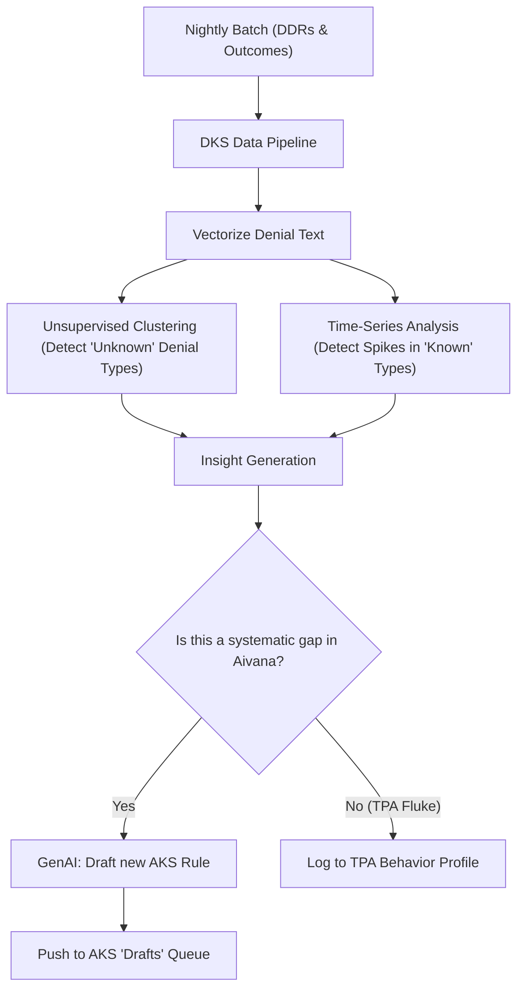
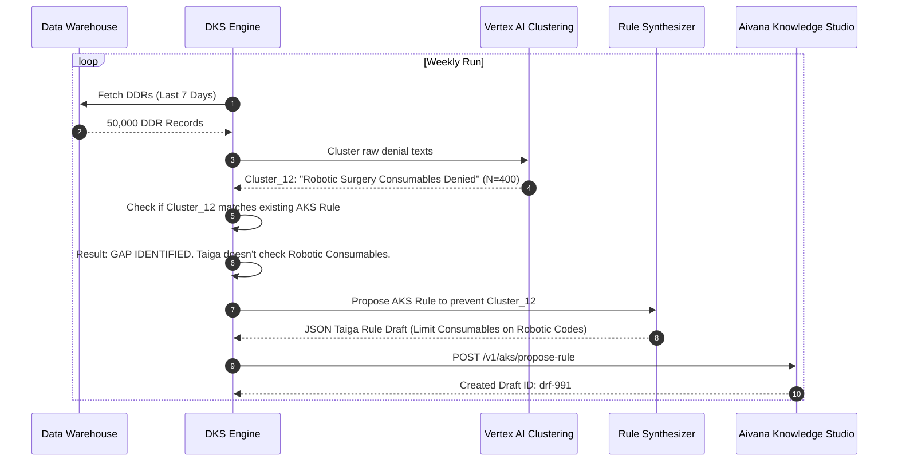

# Denial Knowledge Service (DKS) — Architectural Specification

This document presents the complete production-grade architecture, workflows, schemas, and API contracts for Aivana's **Denial Knowledge Service (DKS)**.

---

## 1. Purpose
The Denial Knowledge Service (DKS) is the self-learning engine of the Aivana platform. It represents the crucial "Feedback Loop." While DAS analyzes a *single* denial, DKS aggregates *thousands* of Enriched Denial Reports (DDRs) across all hospitals to identify macro-trends, unwritten insurer rules, and systemic coding failures. It then translates these insights into actionable updates for the Aivana Knowledge Studio (AKS), ensuring that the upstream pipeline (Fairway/Taiga) gets smarter every day.

## 2. Responsibilities
- Aggregate and ingest DDRs from all hospitals and TPAs.
- Perform unsupervised clustering (ML) to detect new, undocumented denial reasons.
- Track "Appeal Win Rates" to determine if an insurer's new denial tactic is legally valid or just a stalling mechanism.
- Generate "Knowledge Gap Alerts" when the system detects a rising trend of denials that current AKS rule packs failed to prevent.
- Draft proposed updates to AKS Rule Packs using GenAI based on empirical denial data.
- Provide a macro-level intelligence API for the Insurance Analytics Platform.

## 3. Non-Responsibilities
- **Does NOT** analyze individual claims (that is DAS).
- **Does NOT** directly modify active AKS rule packs (proposes drafts; AKS admins must approve).
- **Does NOT** handle hospital-specific financial reporting (that is the Analytics Platform).

---

## 4. Inputs
- **Enriched Denial Reports (DDRs)** (From DAS)
- **Appeal Outcome Events** (From SAS/Aegis - Did we win the appeal?)
- **Current AKS Rule Packs**

## 5. Outputs
- **Macro Trend Vectors**: Structured data on rising denial categories.
- **Draft AKS Rule Updates**: Auto-generated JSON rule blocks proposed for the next AKS pack version.
- **TPA Behavior Profiles**: Matrices tracking how aggressively insurers deny specific DRGs (Diagnosis Related Groups).

## 6. Dependencies
- **Data Warehouse (BigQuery/Snowflake)**: For querying millions of historical DDRs.
- **ML Clustering Engine**: (e.g., DBSCAN or K-Means via Vertex AI) to group similar denial texts.
- **AKS Engine**: To ingest the proposed rule drafts.

---

## 7. Position Inside Overall Pipeline

```
DAS (DDRs) ──────────┐
                     │
Aegis (Appeal Won/Lost) ───┼──► ╔═══════════════════════════════════════╗
                     │    ║    Denial Knowledge Service (DKS)     ║
                     │    ║ (Aggregates, Clusters, Discovers)     ║
                     │    ╚══════════════════╦════════════════════╝
                     │                       │
                     │                 (Drafts Rule Updates)
                     │                       ▼
                     └─────────► Aivana Knowledge Studio (AKS)
                                 (Publishes new rules to Fairway/Taiga)
```

---

## 8. ASCII Architecture Diagram

```
                 +---------------------------------------------+
                 |  Data Lake (DDRs, Appeals, Outcomes)        |
                 +----------------------+----------------------+
                                        | (Batch & Streaming Ingest)
                                        v
                 +----------------------+----------------------+
                 |      DKS Ingestion & Vectorization          |
                 |  (Converts DDR text into Embeddings)        |
                 +----+-----------------+------------------+---+
                      |                 |                  |
                      v                 v                  v
             +--------+--------+ +------+-------+ +--------+--------+
             | Trend Monitor   | | ML Cluster   | | Efficacy       |
             | (Time-series)   | | Engine       | | Tracker (Appeals)|
             +--------+--------+ +------+-------+ +--------+--------+
                      |                 |                  |
                      +-----------------+------------------+
                                        | (Macro Insights)
                                        v
                 +----------------------+----------------------+
                 |     AKS Rule Synthesizer (GenAI)            |
                 | (Translates insight into a Taiga/Fairway rule)
                 +----------------------+----------------------+
                                        |
                                        v
                 +----------------------+----------------------+
                 |   Draft Rule Proposal -> Sent to AKS Admin  |
                 +---------------------------------------------+
```

---

## 9. Mermaid Workflow



---

## 10. Sequence Diagram



---

## 11. State Machine (Insight Lifecycle)

```
   [DDR_INGESTED]
     │
     ▼
  [VECTORIZED & CLUSTERED]
     │
     ▼
  [TREND_IDENTIFIED] ----(Matches existing rule)----> [LOG_AS_TPA_METRIC]
     │
     ▼ (Rule Gap Detected)
  [DRAFTING_AKS_RULE]
     │
     ▼
  [PROPOSED_TO_AKS]
     │
     ├── (AKS Admin Rejects) ──> [DISCARDED]
     │
     └── (AKS Admin Approves) ─> [IMPLEMENTED_IN_NEXT_PACK_VERSION]
```

---

## 12. Components

1. **Vectorization Engine**: Uses an embedding model (e.g., `text-embedding-gecko`) to convert the raw text of insurer denials into high-dimensional vectors.
2. **ML Clustering Engine**: Groups the vectors to find semantic similarities without needing human-defined categories (e.g., discovering that 400 denials all loosely relate to "implants during maternity").
3. **Trend Monitor**: A statistical engine (ARIMA/Prophet) looking for sudden velocity spikes in specific taxonomy codes.
4. **Efficacy Tracker**: Analyzes whether Aivana's appeals against a certain denial type are winning. If win rate < 10%, DKS concludes the insurer is legally right, and Aivana *must* implement a preventive rule.
5. **AKS Rule Synthesizer**: An LLM strictly prompted to write JSON rules for Fairway (clinical conditions) or Taiga (financial unbundling) based on the discovered trend.

---

## 13. Internal Processing Pipeline

1. **Ingest**: Pull 100,000 DDRs from the data lake.
2. **Cluster**: Find patterns (e.g., Star Health is suddenly denying "Single AC Rooms" as "Deluxe Rooms").
3. **Evaluate**: Are we winning these appeals? (Yes = Insurer is stalling; No = Insurer changed their internal policy).
4. **Action**: If No, draft a Taiga rule: `If Room = Single AC AND TPA = Star Health, Warn Hospital: Map to Deluxe Room limit`.
5. **Deploy**: Push draft to AKS.

---

## 14. Parallel Execution Opportunities
- Vector embeddings and clustering algorithms scale horizontally via Spark or Vertex AI distributed jobs.

---

## 15. Deterministic vs AI Table

| Task | Methodology | Rationale |
| :--- | :--- | :--- |
| **Data Aggregation** | Deterministic | SQL queries on the Data Warehouse. |
| **Trend Discovery** | AI (Clustering) | Finding unwritten rules requires semantic similarity matching (e.g. "Stent not required" == "Implant deemed unnecessary"). |
| **Efficacy Tracking** | Deterministic | Calculating win/loss percentages. |
| **Rule Synthesis** | AI (Generative) | Translating a cluster of human text into a strictly formatted JSON logic block. |

---

## 16. Latency Budget

- **Not Applicable (Batch)**. DKS is not in the critical path of claim submission. It runs as a nightly/weekly batch process.

---

## 17. Scaling Strategy
- DKS utilizes OLAP databases (BigQuery/ClickHouse) and distributed ML pipelines, separating analytical workloads from the OLTP databases that run FCP/SAS.

---

## 18. Caching Strategy
- The resulting TPA Behavior Profiles are cached in Redis to rapidly serve the Insurance Analytics Platform dashboards.

---

## 19. Retry Strategy
- Standard batch-job retry mechanics (Apache Airflow / Dagster).

---

## 20. Failure Handling
- If the Rule Synthesizer generates invalid JSON, the draft is flagged for Engineering Review rather than being pushed to AKS.

---

## 21. Event Model
- Consumes: `DAS_DDR_GENERATED`, `APPEAL_WON`, `APPEAL_LOST`.
- Emits: `NEW_MACRO_TREND_DETECTED`, `AKS_DRAFT_PROPOSED`.

---

## 22. API Contracts

### Get TPA Behavior Profile
```
GET /v1/dks/tpa/STAR_HEALTH/insights
```

### Response
```json
{
  "tpaId": "STAR_HEALTH",
  "topDenialReasons": ["ROOM_RENT", "MISSING_ECG"],
  "emergingTrends": [
    {
      "description": "Rejecting Robotic Consumables",
      "velocity": "+45% week-over-week",
      "aksDraftId": "drf-991"
    }
  ]
}
```

---

## 23. JSON Schemas

### AKS Rule Draft Schema (Output to AKS)
```json
{
  "$schema": "http://json-schema.org/draft-07/schema#",
  "title": "AksRuleDraft",
  "type": "object",
  "properties": {
    "draftId": { "type": "string" },
    "targetService": { "enum": ["FAIRWAY", "TAIGA"] },
    "justification": { "type": "string" },
    "dksClusterReference": { "type": "string" },
    "proposedLogic": {
      "type": "object",
      "description": "The exact JSON logic block adhering to Taiga/Fairway schemas."
    }
  },
  "required": ["draftId", "targetService", "justification", "proposedLogic"]
}
```

---

## 24. Database Schema
```sql
CREATE SCHEMA dks_service;

CREATE TABLE dks_service.macro_trends (
    trend_id VARCHAR(64) PRIMARY KEY,
    tpa_id VARCHAR(64) NOT NULL,
    description TEXT NOT NULL,
    cluster_size INT NOT NULL,
    appeal_win_rate DECIMAL(5,2),
    created_at TIMESTAMP WITH TIME ZONE DEFAULT CURRENT_TIMESTAMP
);

CREATE TABLE dks_service.aks_proposals (
    proposal_id VARCHAR(64) PRIMARY KEY,
    trend_id VARCHAR(64) REFERENCES dks_service.macro_trends(trend_id),
    target_service VARCHAR(32) NOT NULL,
    status VARCHAR(32) DEFAULT 'DRAFT',
    proposed_payload JSONB NOT NULL
);
```

---

## 25. Audit Model
DKS proves *why* a new rule was proposed by linking the `proposal_id` directly to the `trend_id`, which contains the array of the 400 specific `ddr_id`s that triggered the cluster. Total transparency.

## 26. Lineage Model
`FCP -> DDR -> Cluster -> AKS Draft -> New AKS Version`. This completes the platform ouroboros. A mistake caught today becomes an automated guardrail tomorrow.

## 27. Metrics
- **Prevention Rate**: The drop in specific denial types after a DKS-proposed rule goes live in AKS.
- **Cluster Purity**: Measure of how well the ML engine groups related denials.
- **Auto-Draft Acceptance Rate**: % of DKS drafts that AKS admins approve without heavy edits.

## 28. Benchmark Targets
- Detect new unwritten insurer rules within 72 hours of the first wave of denials.
- > 70% approval rate of AI-generated AKS rule drafts by human admins.

---

## 29. Security Model
- DKS operates on anonymized DDRs. All PII (Patient Name, Claim ID) is stripped before vectorization and clustering, ensuring the ML models never memorize PHI.

## 30. Hospital Customization
Hospitals can opt-in to share their anonymized denial data to the global DKS pool. In return, they get "Herd Immunity" (protection from denials discovered at other hospitals).

## 31. AKS Integration
DKS is the primary upstream feeder for AKS. Without DKS, AKS admins would have to manually read PDFs to figure out how to update rules.

## 32. Future Extensibility
Predictive Pricing: By analyzing denial frequency, DKS could feed data to a hospital's pricing engine, suggesting they increase the base price of a procedure to offset the statistical likelihood of TPA deductions.

## 33. Production Deployment
Airflow / Prefect for orchestration. BigQuery for data. Vertex AI for embeddings and clustering.

## 34. Testing Strategy
- **Backtesting**: Run historical DDRs from 2024 through DKS and verify if it successfully "predicts" the rule changes that human admins manually implemented in 2025.

## 35. Versioning
Embedding models are versioned. Re-clustering historical data with a new model requires a complete batch re-run in a shadow environment.

---

## 36. Example Outputs

```json
{
  "draftId": "drf-991",
  "targetService": "FAIRWAY",
  "justification": "Detected 412 denials across 15 hospitals this week where Star Health rejected Dengue admissions because Platelet count was > 50,000. Current Fairway rule allows admission at 80,000. Proposing rule update.",
  "dksClusterReference": "cluster-dengue-plt-star-01",
  "proposedLogic": {
    "condition": "DENGUE",
    "insurer": "STAR_HEALTH",
    "mandatory_evidence": [
      {
        "parameter": "PLATELET_COUNT",
        "operator": "LESS_THAN",
        "value": 50000,
        "action": "BLOCK_SUBMISSION"
      }
    ]
  }
}
```

---

## 37. Explainability Strategy
Every proposed rule includes a natural language `justification` detailing the statistical trigger. The AKS admin UI displays this alongside a graph showing the sudden spike in those specific denials.

## 38. Human Review Rules
**Strictly Mandatory.** DKS cannot push a rule to live AKS. It only proposes drafts. Insurance rules dictate hospital finances; human domain experts must approve changes.

## 39. Technology Stack
- **Compute**: Python (Pandas/Scikit-learn/PyTorch).
- **Data Lake**: Snowflake or BigQuery.
- **Orchestration**: Apache Airflow.

## 40. Open-source Dependencies
- `scikit-learn` for clustering algorithms (DBSCAN).
- `sentence-transformers` for local text embeddings if cloud APIs are too costly.

---

*End of Document*
