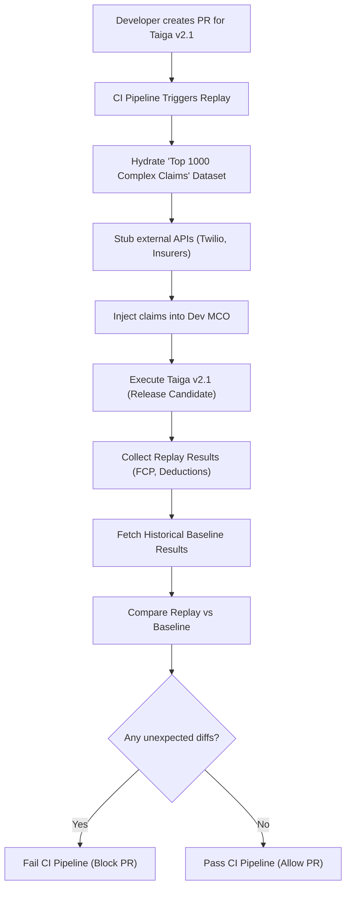
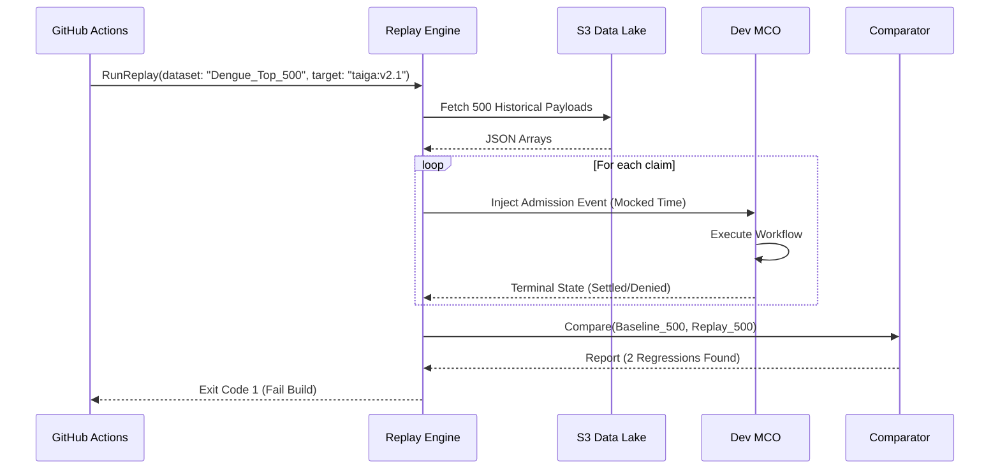

# Digital Twin / Replay Engine — Architectural Specification

This document presents the complete production-grade architecture, workflows, schemas, and API contracts for Aivana's **Digital Twin / Replay Engine**.

---

## 1. Purpose
In a deterministic insurance operating system, software regressions are catastrophic. If a developer updates a Fairway clinical prompt, or an AKS Admin publishes a new Taiga rule pack, they need absolute mathematical certainty that it won't break existing behavior. The Digital Twin / Replay Engine provides a "Time-Travel" regression testing framework. It allows developers to replay thousands of historical claims through the *new* pipeline and compare the outcomes against the *historical* outcomes. If a rule change meant to fix one edge case accidentally denies 500 valid claims, the Replay Engine flags the regression before it reaches production.

## 2. Responsibilities
- **State Hydration**: Pull complete historical claim contexts (TPR, original PDFs, original AKS rules).
- **Time-Travel Execution**: Trick the core engines into thinking "today" is the date the claim was originally filed (to ensure waiting periods are calculated identically).
- **Mocking Integration Hub**: Automatically inject the historical HL7/JSON payload as if a hospital just transmitted it.
- **Diff Generation**: Compare the replay output (e.g., FCP, Taiga deductions) against the historical baseline.
- **Golden Dataset Management**: Maintain curated sets of claims (e.g., "The top 1,000 most complex Dengue cases of 2025") used for continuous integration (CI) gating.

## 3. Non-Responsibilities
- **Does NOT** alter the Master Claim Orchestrator (MCO) production tables.
- **Does NOT** submit data to external insurers (SAS is strictly stubbed out during replay).

---

## 4. Inputs
- **Dataset ID**: A reference to a curated list of historical `claimId`s.
- **Target Container/Version**: The specific Git hash or Docker image of the service being tested (e.g., `fairway-engine:v2.4.1`).

## 5. Outputs
- **Regression Report**: A CI/CD compatible JSON artifact indicating pass/fail status and detailing any unintended side effects.

## 6. Dependencies
- **Kubernetes / CI Runner**: Replays often run as part of the GitHub Actions or GitLab CI deployment pipeline.
- **Data Lake (Cold Storage)**: To pull historical payloads that may have been purged from the hot transactional databases.

---

## 7. Position Inside Overall Pipeline

```
  [Aivana CI/CD Pipeline (GitHub Actions)]
                  │
                  ▼ (Trigger Replay)
 ╔═════════════════════════════════════════════════════╗
 ║           Digital Twin / Replay Engine              ║
 ║  (Injects historical claims into isolated cluster)  ║
 ╚═════════════════════════════════════════════════════╝
          │               │                │
          ▼               ▼                ▼
  [Dev MCO]        [Dev Taiga v2]     [Dev Fairway]
  (Orchestrates)   (New Logic)        (New Prompts)
          │               │                │
          └───────────────┼────────────────┘
                          ▼
                [ Regression Report ]
```

---

## 8. ASCII Architecture Diagram

```
                 +---------------------------------------------+
                 |          Replay API (Triggered via CI)      |
                 +----------------------+----------------------+
                                        |
                                        v
                 +----------------------+----------------------+
                 |      Golden Dataset Hydrator                |
                 | (Pulls 10,000 historical claims from S3)    |
                 +----+-----------------+------------------+---+
                      |                 |                  |
                      v                 v                  v
             +--------+--------+ +------+-------+ +--------+--------+
             | Time-Travel     | | External API | | Batch Injector  |
             | Mutator         | | Stubber      | |                 |
             +--------+--------+ +------+-------+ +--------+--------+
                      |                 |                  |
                      +-----------------+------------------+
                                        |
                                        v
                 +----------------------+----------------------+
                 |        Isolated Kubernetes Namespace        |
                 |      (Runs the Release Candidate Code)      |
                 +----------------------+----------------------+
                                        |
                                        v
                 +----------------------+----------------------+
                 |          Regression Comparator Engine       |
                 |    (Fails the CI build if Diff > 0%)        |
                 +---------------------------------------------+
```

---

## 9. Mermaid Workflow



---

## 10. Core Mechanisms

### The Time-Travel Mutator
If a claim from Jan 2024 is replayed in July 2026, time-based rules (like "Requires 2 years waiting period") will evaluate differently, causing a false-positive regression. The Replay Engine injects a `MOCK_CURRENT_DATE=2024-01-15T00:00:00Z` header into every internal request, tricking Taiga and Fairway into executing exactly as they would have on that date.

### The Stubber
A replay must not accidentally text a doctor via Twilio or submit a claim to Star Health. The Replay Engine automatically intercepts and mocks the Notification Service and Submission Adapter Service at the gRPC level, returning standard `200 OK` success responses.

---

## 11. Sequence Diagram



---

## 12. Components

1. **Dataset Manager**: UI/API to curate Golden Datasets. (e.g., "Save this edge-case claim to the `Regression_Test_Suite`").
2. **Batch Injector**: High-throughput Kafka producer that blasts the historical HL7/Admission payloads into the test cluster's ingress queue.
3. **Comparator Engine**: A strict JSON-diff engine. For deterministic services (Taiga), it enforces a 0% diff policy. For AI services (Fairway), it enforces a "Semantic Equivalence" policy.

---

## 13. Deterministic vs AI Table

| Task | Methodology | Rationale |
| :--- | :--- | :--- |
| **Taiga Regression** | Deterministic | Math must match exactly byte-for-byte. |
| **Fairway Regression**| AI Assisted | An LLM prompt update might rephrase an extraction (e.g., "Diabetic" vs "Has Diabetes"). The Comparator uses a semantic similarity model to ensure the meaning hasn't changed, even if the string has. |
| **MCO Routing** | Deterministic | The state machine path must be identical. |

---

## 14. Latency Budget

- **Replay Execution**: Not latency-sensitive. A CI pipeline can take 10-15 minutes to replay 10,000 claims.
- **Reporting**: Reports should be generated within 60 seconds of batch completion.

---

## 15. Scaling Strategy
- The isolated Kubernetes namespace (the "Digital Twin" cluster) uses auto-scaling node pools. When a CI job triggers, the cluster scales from 0 to 100 pods, processes the 10,000 claims, and scales back to 0.

---

## 16. Caching Strategy
- The Replay Engine caches the historical baseline results locally in Redis to speed up the comparator phase, rather than fetching them from the Data Lake on every CI run.

---

## 17. Failure Handling
- **Deadlocks**: If a developer's code introduces an infinite loop in MCO, the Replay Engine sets a hard global timeout (e.g., 5 minutes per claim). Any claim exceeding this is marked as a `TIMEOUT_REGRESSION` and fails the build.

---

## 18. API Contracts

### Trigger Replay
```
POST /v1/replay/trigger
Content-Type: application/json

{
  "datasetId": "dataset_golden_core",
  "targetService": "taiga",
  "targetVersion": "v2.5.0-rc1",
  "expectedDiffs": {
    "ignorePaths": ["$.timestamp", "$.traceId"]
  }
}
```

---

## 19. JSON Schemas

### Regression Report Schema
```json
{
  "$schema": "http://json-schema.org/draft-07/schema#",
  "title": "ReplayRegressionReport",
  "type": "object",
  "properties": {
    "replayId": { "type": "string" },
    "claimsProcessed": { "type": "integer" },
    "claimsPassed": { "type": "integer" },
    "claimsFailed": { "type": "integer" },
    "status": { "enum": ["PASS", "FAIL"] },
    "regressions": {
      "type": "array",
      "items": {
        "type": "object",
        "properties": {
          "claimId": { "type": "string" },
          "path": { "type": "string" },
          "historicalValue": {},
          "replayValue": {}
        }
      }
    }
  }
}
```

---

## 20. Database Schema
Replay reports are stored for auditing (e.g., proving that v2.5 passed all tests before deployment).

```sql
CREATE SCHEMA replay_engine;

CREATE TABLE replay_engine.datasets (
    dataset_id VARCHAR(64) PRIMARY KEY,
    name VARCHAR(128) NOT NULL,
    claim_ids JSONB NOT NULL -- Array of historical claim UUIDs
);

CREATE TABLE replay_engine.reports (
    report_id VARCHAR(64) PRIMARY KEY,
    dataset_id VARCHAR(64) REFERENCES replay_engine.datasets(dataset_id),
    target_version VARCHAR(128) NOT NULL,
    status VARCHAR(16) NOT NULL, -- PASS/FAIL
    regression_count INT NOT NULL,
    created_at TIMESTAMP WITH TIME ZONE DEFAULT CURRENT_TIMESTAMP
);
```

---

## 21. Audit Model
This engine acts as the CI/CD auditor. It guarantees that Aivana never deploys code that breaks existing functionality. The reports generated here are often shared with enterprise hospital clients to prove Aivana's platform stability.

## 22. Lineage Model
The Replay Engine doesn't create production lineage. It consumes production lineage (from FCP and MCO) to understand exactly how the baseline claim was processed, ensuring it mocks the environment perfectly.

## 23. Metrics
- **Replay Coverage**: % of edge cases in the rule engine covered by a Golden Dataset.
- **CI Time**: Duration of the replay test suite.

## 24. Security Model
- **Data Anonymization**: Because Golden Datasets are used in dev/staging clusters, they undergo a one-time PHI-scrubbing process before being added to the dataset, ensuring developers do not interact with live patient names during testing.

## 25. Future Extensibility
"Chaos Replay." The Replay Engine intentionally injects random 503 errors and Kafka disconnects into the isolated cluster during the replay to verify that the MCO's retry logic successfully recovers 100% of the claims without human intervention.

---

*End of Document*
