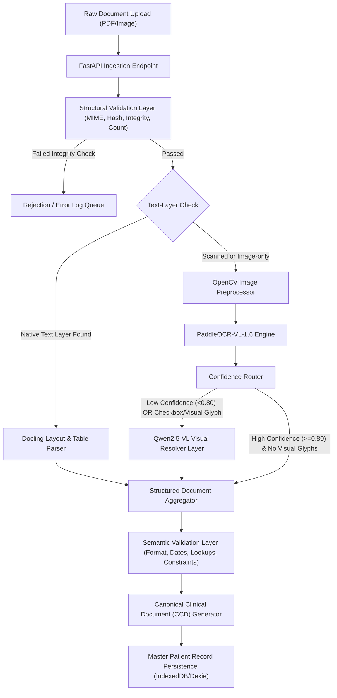

# Docling-First Ingestion Gateway Architecture Specification

This document presents Aivana's ingestion architecture design, optimized for high-fidelity document processing, minimized token hallucination, and standard downstream consumption via a **Canonical Clinical Document (CCD)**.

---

## 1. System Ingestion Pipeline Flow



---

## 2. Ingestion Lifecycles & Processing States

To facilitate operation tracking and pipeline debugging, each document is assigned an operational status tracker as it moves through the gateway:

*   `RECEIVED`: Raw file accepted by FastAPI endpoint, hash generated.
*   `VALIDATED`: Passed **Structural Validation** (integrity and duplicate checks).
*   `PARSED`: Structural layout (Docling) or OCR (PaddleOCR) completed.
*   `OCR_COMPLETE`: Text characters extracted.
*   `VISUAL_CHECK_COMPLETE`: **Confidence Router** and/or Qwen2.5-VL resolver execution finished.
*   `READY_FOR_EXTRACTION`: Passed **Semantic Validation**; the CCD is finalized and ready for clinical/policy extraction.

---

## 3. Two-Layer Validation Specification

Validation is split into two distinct responsibility layers that evolve independently:

### Layer 1: Structural Validation (Deterministic File Checks)
*   **Hash Generation**: SHA-256 generation on input stream.
*   **Duplicate Detection**: Checks if the hash matches an existing record in the database.
*   **PDF Integrity & Corruption Check**: Validates file headers and stream structure.
*   **MIME-Type Audit**: Limits ingestion strictly to approved formats (`application/pdf`, `image/jpeg`, `image/png`, `image/tiff`).
*   **Page Count Audit**: Verifies that page boundaries align with the file header.

### Layer 2: Semantic Validation (Deterministic Data Constraints)
*   **Policy Format Matching**: Asserts regex matches on policy and UHID structures.
*   **Chronological Date Audit**: Verifies that `admissionDate <= dischargeDate` and ` LMP < EDD`.
*   **Required Fields Check**: Confirms mandatory fields (Name, Insurer, TPA) are present in metadata.
*   **Institutional Lookups**: Cross-references insurer name, TPA, and NABH/NABL accreditation codes against standard hospitals registries.

---

## 4. Hierarchical ID System

Every entity in the document hierarchy is indexed using a strict parent-child ID system to ensure downstream citation tracing:

```
Case ID (e.g., "CASE-24936")
  └── Document ID (e.g., "DOC-a89f21")
        └── Page ID (e.g., "DOC-a89f21-P02")
              └── Block ID (e.g., "DOC-a89f21-P02-B09")
                    └── Entity ID (e.g., "DOC-a89f21-P02-B09-E01")
```

---

## 5. Canonical Clinical Document (CCD) Schema

All downstream modules (**Fairway**, **Taiga**, **Aegis**, and **Claim Readiness**) consume the generated **Canonical Clinical Document (CCD)** representation, shielding them from raw PDF parsing or image-level dependencies.

### Field-Level Lineage Schema
Every extracted field preserves its origin, coordinates, confidence, and validation status, enabling Aegis and Fairway to cite source evidence dynamically.

```json
{
  "ccdId": "ccd-99281a8c",
  "caseId": "CASE-24936",
  "processingStatus": "READY_FOR_EXTRACTION",
  "fileMetadata": {
    "documentId": "DOC-a89f21",
    "fileName": "discharge_summary_scan.pdf",
    "fileSize": 2048576,
    "sha256": "a3f5b721e9087c6b54a3e21019d87e65...",
    "pageCount": 3,
    "ingestedAt": "2026-07-13T19:58:00Z"
  },
  "extractedEntities": {
    "patientName": {
      "value": "Rahul Sharma",
      "entityId": "DOC-a89f21-P01-B02-E01",
      "pageId": "DOC-a89f21-P01",
      "blockId": "DOC-a89f21-P01-B02",
      "boundingBox": [50, 100, 250, 120],
      "ocrConfidence": 0.99,
      "routingPath": "PaddleOCR -> Direct",
      "validated": true
    },
    "diagnosis": {
      "value": "Acute MCA Infarction",
      "entityId": "DOC-a89f21-P02-B12-E03",
      "pageId": "DOC-a89f21-P02",
      "blockId": "DOC-a89f21-P02-B12",
      "boundingBox": [40, 310, 300, 335],
      "ocrConfidence": 0.54,
      "routingPath": "PaddleOCR -> Confidence Router -> Qwen2.5-VL",
      "validated": true
    },
    "surgicalManagement": {
      "value": false,
      "entityId": "DOC-a89f21-P01-B08-E04",
      "pageId": "DOC-a89f21-P01",
      "blockId": "DOC-a89f21-P01-B08",
      "boundingBox": [100, 200, 120, 220],
      "ocrConfidence": 0.92,
      "routingPath": "Confidence Router -> Qwen2.5-VL (Checkbox state)",
      "validated": true
    }
  },
  "pageLayouts": [
    {
      "pageId": "DOC-a89f21-P01",
      "pageNumber": 1,
      "width": 595,
      "height": 842,
      "blocks": [
        {
          "blockId": "DOC-a89f21-P01-B02",
          "type": "paragraph",
          "content": "Patient Name: Rahul Sharma",
          "boundingBox": [50, 100, 250, 120],
          "confidence": 0.99
        }
      ]
    }
  ],
  "auditTrail": [
    {
      "status": "RECEIVED",
      "timestamp": "2026-07-13T21:18:00Z"
    },
    {
      "status": "VALIDATED",
      "timestamp": "2026-07-13T21:18:01Z",
      "note": "Passed Structural Validation checks."
    },
    {
      "status": "READY_FOR_EXTRACTION",
      "timestamp": "2026-07-13T21:18:05Z",
      "note": "Semantic constraints verified. CCD generated."
    }
  ]
}
```

---

## 6. Optimization Benefits

1. **GPU Load Reduction**: The **Confidence Router** prevents calling high-overhead Vision models (Qwen2.5-VL) for clean, high-confidence character extractions (>=0.80), saving significant cluster utilization.
2. **Clinical Citation Grounding**: Aegis and Fairway cite exact page numbers and boundary boxes directly from the CCD data structure, eliminating redundant layout parsing checks downstream.
3. **Decoupled Validation Lifecycles**: Structural checks fail fast at the gateway boundary, whereas semantic business validations can fail, update, or run asynchronously without impacting basic file processing.
