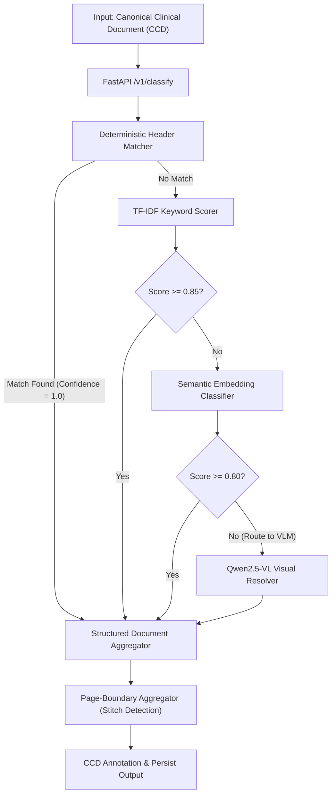
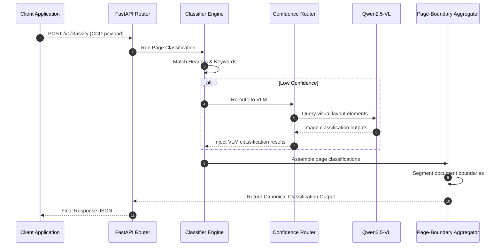

# Document Identification Service Architectural Specification

This document defines the production-grade architecture, component interfaces, pipelines, and data contracts for Aivana's **Document Identification Service**. 

---

## 1. System Architecture & Component Interface

```
┌────────────────────────────────────────────────────────────────────────┐
│                      Canonical Clinical Document (CCD)                 │
└───────────────────────────────────┬────────────────────────────────────┘
                                    │
                                    ▼
┌────────────────────────────────────────────────────────────────────────┐
│                     Document Identification Service                    │
│                                                                        │
│  ┌─────────────────────────┐             ┌──────────────────────────┐  │
│  │   FastAPI Controller    │             │   Deterministic Rules    │  │
│  └────────────┬────────────┘             └────────────┬─────────────┘  │
│               │                                       │                │
│               ▼                                       ▼                │
│  ┌─────────────────────────┐             ┌──────────────────────────┐  │
│  │    Confidence Router    │◄───────────►│   TF-IDF Keyword Scorer  │  │
│  └────────────┬────────────┘             └────────────┬─────────────┘  │
│               │                                       │                │
│               ▼                                       ▼                │
│  ┌─────────────────────────┐             ┌──────────────────────────┐  │
│  │   Qwen2.5-VL Fallback   │             │  Semantic Embedding Map  │  │
│  └────────────┬────────────┘             └────────────┬─────────────┘  │
│               │                                       │                │
│               ▼                                       ▼                │
│  ┌──────────────────────────────────────────────────────────────────┐  │
│  │                 Page-Boundary Aggregator Layer                   │  │
│  └────────────────────────────────┬─────────────────────────────────┘  │
└───────────────────────────────────┼────────────────────────────────────┘
                                    │
                                    ▼
┌────────────────────────────────────────────────────────────────────────┐
│             Canonical Classification Output -> Persistence             │
└────────────────────────────────────────────────────────────────────────┘
```

---

## 2. Mermaid Workflows

### 2.1 General Classification Pipeline



### 2.2 Sequence Diagram



---

## 3. Component Responsibilities

| Component | Responsibility |
| :--- | :--- |
| **FastAPI Controller** | Exposes the `/v1/classify` API, manages operational logging, tracks processing states, and maps schemas. |
| **Deterministic Rules Engine** | Runs fast regular expression checks on page headers, metadata fields, and layout tokens. |
| **TF-IDF Keyword Scorer** | Matches page text tokens against specialized dictionaries (e.g. pharmacology terms indicating a Pharmacy Bill). |
| **Semantic Embedding Matcher** | Translates page texts into vector embeddings to match semantic labels (e.g. clinical narratives). |
| **Confidence Router** | Directs documents with low-confidence scores or visual elements (e.g. scans of Aadhaar/PAN cards) to the VLM. |
| **Qwen2.5-VL Visual Resolver** | Inspects visual templates, handwriting scripts, signatures, stamps, and layout alignments. |
| **Page-Boundary Aggregator** | Segments multi-page documents (e.g. split ranges of final bills) into single bounded files. |

---

## 4. API Contracts & JSON Schemas

### 4.1 API Request/Response Contract

*   **Endpoint**: `POST /v1/classify`
*   **Request Schema**:
```json
{
  "caseId": "CASE-24936",
  "documentId": "DOC-a89f21",
  "ccdPayload": {} 
}
```

*   **Response Schema**:
```json
{
  "caseId": "CASE-24936",
  "documentId": "DOC-a89f21",
  "classificationStatus": "SUCCESS",
  "identifiedDocuments": [
    {
      "documentClass": "Discharge Summary",
      "pageRange": [1, 2],
      "overallConfidence": 0.99,
      "state": "READY_FOR_EXTRACTION",
      "pages": [
        {
          "pageNumber": 1,
          "confidence": 0.99,
          "source": "deterministic_header",
          "matchDetail": "Found header pattern 'DISCHARGE SUMMARY' in Block DOC-a89f21-P01-B01"
        },
        {
          "pageNumber": 2,
          "confidence": 0.98,
          "source": "tf_idf_keyword",
          "matchDetail": "Keyword density (patient condition, discharge, diagnosis) matches Discharge class"
        }
      ]
    }
  ]
}
```

### 4.2 Canonical Classification Output Schema

This schema defines the output persisted to the **Master Patient Record**:

```json
{
  "$schema": "http://json-schema.org/draft-07/schema#",
  "title": "CanonicalClassificationOutput",
  "type": "OBJECT",
  "properties": {
    "caseId": { "type": "STRING" },
    "documentId": { "type": "STRING" },
    "identifiedDocuments": {
      "type": "ARRAY",
      "items": {
        "type": "OBJECT",
        "properties": {
          "documentClass": {
            "type": "STRING",
            "enum": [
              "Insurance Card", "Aadhaar", "PAN", "Admission Note", "Progress Notes", 
              "Nursing Notes", "Consent Forms", "Lab Reports", "Radiology Reports", 
              "OT Notes", "Procedure Notes", "Implant Bills", "Pharmacy Bills", 
              "Final Bills", "Discharge Summary", "Death Summary", "ICU Notes", 
              "Investigation Reports", "Unclassified"
            ]
          },
          "pageRange": {
            "type": "ARRAY",
            "items": { "type": "INTEGER" },
            "minItems": 2,
            "maxItems": 2
          },
          "overallConfidence": { "type": "NUMBER" },
          "explanation": { "type": "STRING" },
          "lineage": {
            "type": "ARRAY",
            "items": {
              "type": "OBJECT",
              "properties": {
                "pageNumber": { "type": "INTEGER" },
                "pageId": { "type": "STRING" },
                "confidence": { "type": "NUMBER" },
                "classificationSource": { "type": "STRING" },
                "reasoning": { "type": "STRING" }
              },
              "required": ["pageNumber", "pageId", "confidence", "classificationSource", "reasoning"]
            }
          }
        },
        "required": ["documentClass", "pageRange", "overallConfidence", "explanation", "lineage"]
      }
    }
  },
  "required": ["caseId", "documentId", "identifiedDocuments"]
}
```

---

## 5. Processing States & Lifecycle Machine

The service transitions the document package status through the following pipeline:

```
                  ┌───────────────┐
                  │   RECEIVED    │
                  └───────┬───────┘
                          │
                          ▼
             ┌─────────────────────────┐
             │  RUNNING_DETERMINISTIC  │
             └────────────┬────────────┘
                          │
            ┌─────────────┴─────────────┐
     Score < 0.80                 Score >= 0.80
            │                           │
            ▼                           ▼
┌─────────────────────────┐   ┌────────────────────┐
│   RUNNING_AI_FALLBACK   │   │    OCR_COMPLETE    │
└───────────┬─────────────┘   └─────────┬──────────┘
            │                           │
            └─────────────┬─────────────┘
                          │
                          ▼
            ┌───────────────────────────┐
            │   BOUNDARY_SEGMENTATION   │
            └─────────────┬─────────────┘
                          │
                          ▼
            ┌───────────────────────────┐
            │         VALIDATING        │
            └─────────────┬─────────────┘
                          │
            ┌─────────────┴─────────────┐
         Passed                       Failed
            │                           │
            ▼                           ▼
      ┌───────────┐               ┌───────────┐
      │ COMPLETED │               │  FAILED   │
      └───────────┘               └───────────┘
```

---

## 6. Operation Management & Resiliency

### 6.1 Latency Budget (Target: 30-Page Document)
*   **Total Budget**: **3000ms**
*   **Segment Allocation**:
    *   *FastAPI Request Validation*: **50ms**
    *   *Deterministic Rule Match*: **150ms** (5ms per page)
    *   *TF-IDF Keyword Scorer*: **300ms** (10ms per page)
    *   *Semantic Embedding Matcher*: **500ms**
    *   *VLM Checkbox/Visual checks (selective fallback)*: **1800ms** (single call for ambiguous pages)
    *   *Segmentation & Aggregation*: **150ms**
    *   *Master Patient Record save*: **50ms**

### 6.2 Failure Handling & Retry Policies
*   **Timeout Threshold**: API enforces a strict hard-timeout of **5000ms**.
*   **Retry Strategy**: 
    *   *Network calls (e.g. Embedding/VLM services)*: 3 retries using **Exponential Backoff** with jitter (`initial_delay = 50ms`, `multiplier = 2`).
    *   *Engine Failures*: If the classifier fails to resolve after retries, the output falls back to `Unclassified` with a confidence score of `0.0`.
*   **Human-in-the-loop Queue**: Unclassified or low-confidence (<0.70) results route automatically to the hospital reviewer's dashboard holding queue.

### 6.3 Audit Schema
Every execution generates a corresponding audit transaction in the log:

```json
{
  "timestamp": "2026-07-13T21:27:00Z",
  "caseId": "CASE-24936",
  "documentId": "DOC-a89f21",
  "engineMetrics": {
    "totalLatencyMs": 850,
    "vlmInvoked": false,
    "confidenceScoreAvg": 0.96
  },
  "rulesEvaluated": [
    { "ruleId": "HOSP_A_FINAL_BILL", "result": "MATCHED", "action": "Classified Page 1 as Final Bill" }
  ],
  "operator": "AI_DOC_CLASSIFIER"
}
```

---

## 7. Hospital-Specific Template Customizations

To support varying invoice, billing, and clinical forms across hospitals, the service loads dynamic configurations from a shared YAML template repository (`hospital_templates.yaml`):

```yaml
hospital_configs:
  - hospital_id: "HOSP_A_DELHI"
    custom_rules:
      - target_class: "Final Bills"
        regex_headers:
          - "REGISTRATION/BILLING DETAILS"
          - "SUMMARY OF CHARGES"
        layout_signatures:
          column_names: ["Charge Description", "Billable Quantity", "Amount (INR)"]
          
  - hospital_id: "HOSP_B_MUMBAI"
    custom_rules:
      - target_class: "Discharge Summary"
        regex_headers:
          - "PATIENT SUMMARY ON RELEASE"
          - "DISCHARGE PROTOCOL"
        layout_signatures:
          headings: ["Condition on Discharge", "Follow-up Instructions"]
```
These templates are parsed dynamically by the deterministic rules engine at initialization, eliminating hard-coded regex dependencies.
