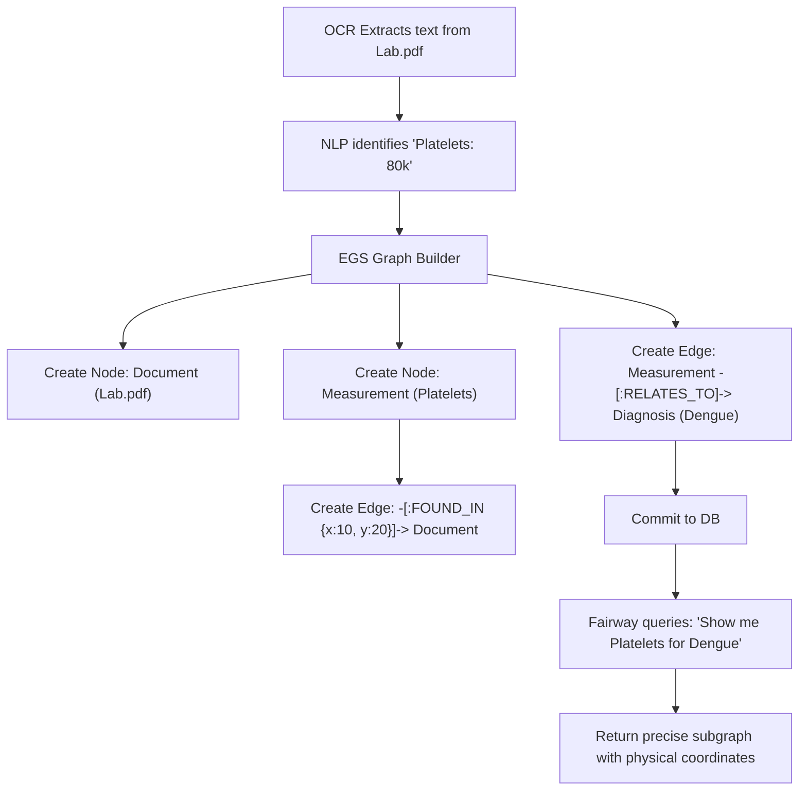
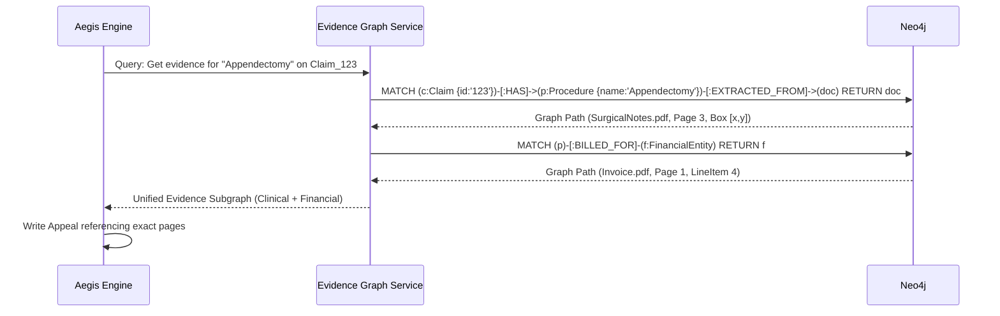

# Evidence Graph Service (EGS) — Architectural Specification

This document presents the complete production-grade architecture, workflows, schemas, and API contracts for Aivana's **Evidence Graph Service (EGS)**.

---

## 1. Purpose
In early iterations, services like Aegis or Fairway had to perform full-text searches across the entire FCP (Final Claim Packet) or TPR (Trusted Patient Record) to find evidence. This is slow and prone to LLM hallucination (e.g., retrieving the heart rate from day 1 instead of day 5). The Evidence Graph Service (EGS) represents all clinical and financial artifacts as a strict, queryable Graph. Instead of searching strings, downstream engines traverse relationships: `Claim` → `Diagnosis (Dengue)` → `Lab Test (Platelets)` → `Value (80,000)` → `Physical Proof (LabReport.pdf, Page 2, Bounding Box X/Y)`.

## 2. Responsibilities
- **Graph Ingestion**: Consume the output of the TPR and OCR extraction pipelines to build the Evidence Graph for a specific claim.
- **Relational Mapping**: Link financial items (e.g., "Surgical Fee ₹50k" on the invoice) to clinical events (e.g., "Appendectomy performed on Oct 12" in the surgical notes).
- **Sub-graph Delivery**: When Taiga asks, "Give me all evidence relating to the Surgeon's fee," EGS returns a precise, pre-linked graph, eliminating the need for Taiga to search the raw PDFs.
- **Proof-of-Life anchoring**: Ensure that *every* abstract clinical fact is anchored to a physical coordinate in a scanned document.

## 3. Non-Responsibilities
- **Does NOT** perform OCR or NLP extraction (The Document Identification and Patient Extraction services do this).
- **Does NOT** define insurance rules (PKG does this).

---

## 4. Inputs
- **Extraction Payloads**: JSON from the OCR/NLP engines (containing bounding boxes, confidence scores, and extracted entities).
- **TPR Updates**: When the Trusted Patient Record resolves two entities into one, EGS updates its edges.

## 5. Outputs
- **Evidence Sub-graphs**: JSON representations of specific graph traversals.
- **Explainability Fragments**: Passes physical bounding box data to the Explainability Service.

## 6. Dependencies
- **Graph Database**: Neo4j or Amazon Neptune (can be a distinct namespace within the same cluster used by the PKG and Explainability services).
- **Event Bus**: To listen for extraction completion events.

---

## 7. Position Inside Overall Pipeline

```
  [OCR / Extraction]       [TPR Consolidation]
          │                        │
          └───────────┬────────────┘
                      ▼
 ╔═════════════════════════════════════════════════════╗
 ║             Evidence Graph Service (EGS)            ║
 ║  (Links Claims to Diagnoses, Bills, and Raw OCR)    ║
 ╚═════════════════════════════════════════════════════╝
          │                        │
          ▼                        ▼
      [Fairway]                 [Aegis]
 (Traverses for criteria)  (Traverses to write appeals)
```

---

## 8. ASCII Architecture Diagram

```
                 +---------------------------------------------+
                 |          Extraction Event Listener          |
                 +----------------------+----------------------+
                                        |
                                        v
                 +----------------------+----------------------+
                 |          Evidence Graph Builder             |
                 +----+-----------------+------------------+---+
                      |                 |                  |
                      v                 v                  v
             +--------+--------+ +------+-------+ +--------+--------+
             | Clinical Linker | | Financial    | | Bounding Box    |
             | (Vitals/Labs)   | | Linker (Bills| | Anchor          |
             +--------+--------+ +------+-------+ +--------+--------+
                      |                 |                  |
                      +-----------------+------------------+
                                        |
                                        v
                 +----------------------+----------------------+
                 |      Evidence Graph DB (Neo4j / Neptune)    |
                 +----------------------+----------------------+
                                        |
                                        v
                 +----------------------+----------------------+
                 |          Query & Traversal API (gRPC)       |
                 +---------------------------------------------+
```

---

## 9. Mermaid Workflow



---

## 10. Node & Edge Ontology

### Core Nodes
- `(Claim)`: The root node.
- `(Document)`: E.g., "DischargeSummary.pdf".
- `(Page)`: E.g., Page 2.
- `(ClinicalEntity)`: E.g., Diagnosis, Procedure, VitalSign, LabResult.
- `(FinancialEntity)`: E.g., InvoiceLineItem, RoomCharge.

### Core Edges
- `[:CONTAINS]`: (Document) -> (Page)
- `[:EXTRACTED_FROM]`: (ClinicalEntity) -> (Page) [Properties: `boundingBox`, `confidence`]
- `[:SUPPORTS_DIAGNOSIS]`: (LabResult) -> (ClinicalEntity:Diagnosis)
- `[:BILLED_FOR]`: (FinancialEntity) -> (ClinicalEntity:Procedure)

---

## 11. Sequence Diagram (Aegis Fetching Evidence)



---

## 12. Components

1. **Extraction Listener**: Subscribes to the event bus. Every time a new document is processed, it receives the raw JSON array of OCR blocks.
2. **Clinical Linker**: Maps lab results to diagnoses based on temporal proximity and TPR rules.
3. **Financial Linker**: Uses exact string matching and fuzzy matching to link items on the final hospital bill to clinical events mentioned in the doctor's notes.
4. **Traversal API**: Provides pre-computed Cypher queries for the most common Aivana use cases (e.g., "Get all evidence for a specific rule violation").

---

## 13. Deterministic vs AI Table

| Task | Methodology | Rationale |
| :--- | :--- | :--- |
| **Node Anchoring** | Deterministic | The bounding box X/Y coordinates are absolute math. |
| **Financial Linking** | Deterministic | Matching a bill code to a procedure code. |
| **Clinical Linking** | AI Assisted | Determining that "CBC Report" supports "Dengue" requires semantic knowledge (often resolved via PKG). |

---

## 14. Latency Budget

- **Graph Construction (Write)**: < 2 seconds per document.
- **Graph Traversal (Read)**: < 50ms (Crucial, as Fairway and Taiga make dozens of these calls per claim).

---

## 15. Scaling Strategy
- The EGS database is heavily sharded by `hospitalId` and time (e.g., `Cluster_Apollo_2026_Q3`). Because evidence queries almost never span across different claims or different hospitals, sharding by claim/hospital provides infinite horizontal scalability for reads and writes.

---

## 16. Caching Strategy
- Because the evidence for a submitted claim is immutable (documents cannot be altered post-submission), EGS heavily caches read queries in Redis. If Aegis asks for evidence today, and the UI asks for it tomorrow, it serves from RAM.

---

## 17. Retry Strategy
- Standard event-bus retry. If EGS fails to build the graph (e.g., DB timeout), the message goes to a Dead Letter Queue (DLQ), and MCO pauses the claim pipeline until EGS recovers and processes the DLQ.

---

## 18. API Contracts

### gRPC Service Definition (Conceptual)
```protobuf
service EvidenceGraph {
  rpc GetProcedureEvidence(ProcedureRequest) returns (EvidenceSubgraph);
  rpc LinkFinancialToClinical(LinkRequest) returns (LinkResponse);
}

message ProcedureRequest {
  string claim_id = 1;
  string procedure_code = 2;
}

message EvidenceSubgraph {
  repeated ClinicalNode clinical_nodes = 1;
  repeated DocumentAnchor anchors = 2;
}
```

---

## 19. JSON Schemas

### Document Anchor Object
```json
{
  "$schema": "http://json-schema.org/draft-07/schema#",
  "title": "DocumentAnchor",
  "type": "object",
  "properties": {
    "documentId": { "type": "string" },
    "fileName": { "type": "string" },
    "pageNumber": { "type": "integer" },
    "boundingBox": {
      "type": "object",
      "properties": {
        "x1": { "type": "number" },
        "y1": { "type": "number" },
        "x2": { "type": "number" },
        "y2": { "type": "number" }
      }
    },
    "extractedSnippet": { "type": "string" }
  }
}
```

---

## 20. Database Schema
Defined in Cypher (Neo4j).

```cypher
MERGE (c:Claim {id: "clm-123"})
MERGE (p:Procedure {code: "CPT-44970", name: "Laparoscopic Appendectomy"})
MERGE (c)-[:HAS_PROCEDURE]->(p)

MERGE (doc:Document {id: "doc-99", name: "Operative_Note.pdf"})
MERGE (page:Page {num: 2})-[:BELONGS_TO]->(doc)

MERGE (p)-[:EXTRACTED_FROM {x1:100, y1:200, conf:0.98}]->(page)
```

---

## 21. Audit Model
The entire premise of EGS is auditing. By enforcing the rule that *no clinical entity can exist in the graph without an `[:EXTRACTED_FROM]` edge*, it guarantees that the AI cannot hallucinate facts. If the graph cannot trace the fact to a physical coordinate on a PDF, the fact is purged.

## 22. Lineage Model
EGS is the physical manifestation of Aivana's data lineage constraint. The AI Gateway relies on EGS to ground its prompts. FCP relies on EGS to know which pages to package.

## 23. Metrics
- **Anchoring Rate**: % of TPR clinical entities that have a valid path to a `Document` node (Target: 100%).
- **Graph Build Time**: Time to construct the graph after OCR finishes.

## 24. Security Model
- EGS contains the raw extracted text (PHI). The database is encrypted at rest (KMS), and access is strictly governed by the Aivana IAM layer. The Graph DB cannot be queried directly from the internet.

## 25. Future Extensibility
**Image Evidence Linking**: Extending the graph to include DICOM images (X-Rays, MRIs). A `(Diagnosis: Fracture)` could have an edge `[:EXTRACTED_FROM]` pointing to a specific bounding box on an X-Ray image.

---

*End of Document*
