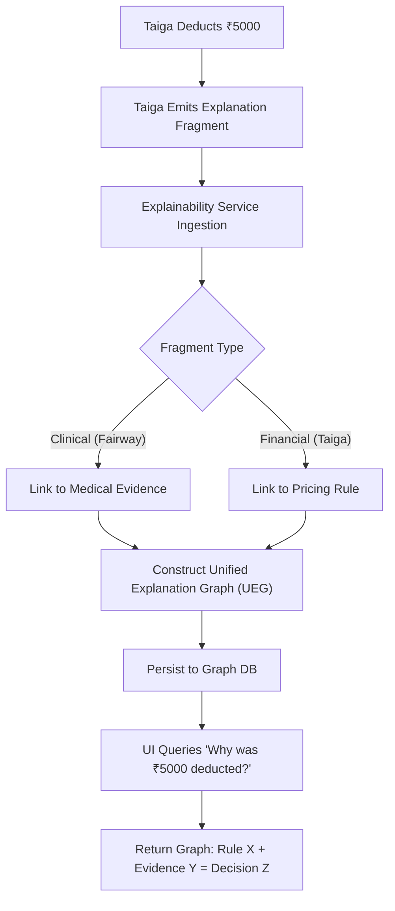
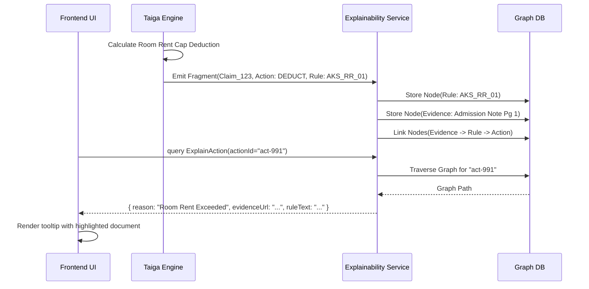

# Explainability Service — Architectural Specification

This document presents the complete production-grade architecture, workflows, schemas, and API contracts for Aivana's **Explainability Service**.

---

## 1. Purpose
The Explainability Service is the universal transparency layer of the Aivana platform. In healthcare and insurance, "Black Box" AI is fundamentally unacceptable. When Taiga deducts ₹5,000 from a claim, or when Fairway flags an ICU admission as unjustified, the human user (doctor/biller) must know exactly *why*. Previously, explanations were fragmented across services. This service centralizes explainability, ingesting graph fragments from all upstream engines and exposing a unified API that allows the UI to render the exact chain of logic: **Data → Rule → Decision**.

## 2. Responsibilities
- Act as the central sink for all justification metadata emitted by core AI/Rules engines (Fairway, Taiga, DAS, Aegis, SRR).
- Construct and persist four core structures:
  - **Reason Graph**: The logical steps taken to reach a conclusion.
  - **Evidence Graph**: The physical artifacts (PDF pages, OCR blocks) proving the assertion.
  - **Rule Graph**: The exact AKS policies applied to the claim.
  - **Decision Graph**: The final synthesis of rules vs evidence.
- Expose a normalized GraphQL API for the frontend UI to visualize tooltips, trace logs, and evidence bounding boxes.
- Translate highly technical internal AI justifications into human-readable clinical/financial text.

## 3. Non-Responsibilities
- **Does NOT** execute rules or make claim decisions (Taiga/Fairway do this).
- **Does NOT** orchestrate workflows (MCO does this).
- **Does NOT** generate appeal text (Aegis does this).

---

## 4. Inputs
- **Explanation Payloads**: JSON blobs emitted by Fairway, Taiga, Aegis, and DAS alongside their primary outputs.
- **FCP / Evidence Index**: To resolve exact document page numbers and bounding box coordinates for rendering.
- **AKS Rule Metadata**: To pull the exact text of a policy clause.

## 5. Outputs
- **Unified Explanation Graph (UEG)**: A standardized JSON/GraphQL response bridging the gap between a UI element (e.g., a red warning icon) and the underlying platform logic.

## 6. Dependencies
- **Graph Database / Document Store**: MongoDB or Neo4j to store highly interconnected justification nodes.
- **Aivana Event Bus**: To ingest explanation fragments asynchronously without slowing down the core execution pipeline.

---

## 7. Position Inside Overall Pipeline

```
  [Fairway]   [Taiga]   [DAS]   [Aegis]
      │          │        │        │
      └──────────┼────────┼────────┘
                 ▼ (Emits Explanation Fragments)
 ╔═════════════════════════════════════════════════════╗
 ║              Explainability Service                 ║
 ║  (Consolidates, Normalizes, and Links to Evidence)  ║
 ╚═════════════════════════════════════════════════════╝
                         │
                         ▼ (GraphQL Queries)
            [ Hospital Frontend UI ]
```

---

## 8. ASCII Architecture Diagram

```
                 +---------------------------------------------+
                 |       Explanation Fragment Queue (Kafka)    |
                 +----------------------+----------------------+
                                        |
                                        v
                 +----------------------+----------------------+
                 |      Fragment Ingestion & Normalizer        |
                 |  (Transforms Taiga/Fairway schemas to UEG)  |
                 +----+-----------------+------------------+---+
                      |                 |                  |
                      v                 v                  v
             +--------+--------+ +------+-------+ +--------+--------+
             | Reason Graph    | | Evidence     | | Rule Graph      |
             | Builder         | | Resolver     | | Linker          |
             +--------+--------+ +------+-------+ +--------+--------+
                      |                 |                  |
                      +-----------------+------------------+
                                        |
                                        v
                 +----------------------+----------------------+
                 |        Explainability Graph DB (Neo4j)      |
                 +----------------------+----------------------+
                                        |
                                        v
                 +----------------------+----------------------+
                 |          Explanation API (GraphQL)          |
                 +---------------------------------------------+
```

---

## 9. Mermaid Workflow



---

## 10. Sequence Diagram



---

## 11. Core Graph Structures

### The Unified Explanation Graph (UEG)
The UEG consists of four specific sub-graphs that link together to tell a complete story:

1. **Reason Graph**: The logical sequence. E.g., `Patient admitted for Dengue` → `Platelets were 150k` → `Threshold is 100k` → `Admission Unjustified`.
2. **Evidence Graph**: The physical reality. E.g., `Node: LabReport.pdf` → `Node: Page 2` → `Node: BoundingBox(100, 200)` → `Value: Platelets 150k`.
3. **Rule Graph**: The policy truth. E.g., `Node: StarHealth_Policy_v4` → `Node: Clause 4.1` → `Requirement: Platelets < 100k`.
4. **Decision Graph**: The intersection. E.g., `Decision: Query Raised` (Links to Reason, Evidence, and Rule).

---

## 12. Components

1. **Ingestion Normalizer**: Taiga and Fairway speak different languages. This component maps all incoming justification blobs into the standard UEG schema.
2. **Evidence Resolver**: Connects an AI extraction (e.g., "Diabetes") to the exact physical coordinates in the original PDF so the UI can draw a yellow highlight box around the text.
3. **Natural Language Generator (NLG)**: Sometimes graph traversal results in a robotic explanation (`Rule A + Val B = False`). The NLG passes the graph to a lightweight LLM to generate a human-readable sentence for the UI tooltip.
4. **GraphQL API**: Allows the UI to fetch exactly the depth of explanation required (e.g., fetching just the sentence, or drilling down into the exact AKS rule version).

---

## 13. Internal Processing Pipeline

1. **Listen**: Consume `ACTION_EXPLAINED` topics from Kafka.
2. **Parse**: Extract the `subject`, `rule`, `evidence`, and `decision` from the payload.
3. **Link**: Create edges in Neo4j between the entities.
4. **Enrich**: Fetch the actual text of the AKS rule cited so the UI doesn't have to make a secondary API call.
5. **Serve**: Expose the sub-graph to the frontend.

---

## 14. Parallel Execution Opportunities
- The ingestion pipeline is heavily parallelized. Because explanations are non-blocking (they don't affect the MCO workflow progression), the service can ingest thousands of fragments asynchronously.

---

## 15. Deterministic vs AI Table

| Task | Methodology | Rationale |
| :--- | :--- | :--- |
| **Graph Construction** | Deterministic | Linking an action to its source rule must be mathematically exact. |
| **Evidence Resolution** | Deterministic | Bounding box coordinates from the OCR engine map directly to the PDF. |
| **Explanation Text Gen** | AI Assisted | Converting a JSON logic path into a fluid, human-readable sentence (NLG). |

---

## 16. Latency Budget

- **Ingestion**: Asynchronous (Queue-based).
- **API Read (GraphQL)**: < 100ms. The UI requests explanations in real-time as users hover over elements; it must be lightning fast.

---

## 17. Scaling Strategy
- Uses a distributed Graph Database (Neo4j or Amazon Neptune) designed for fast traversal of highly connected nodes.
- Read-heavy architecture: Caching is heavily employed at the GraphQL layer because explanations for a specific claim decision never change once generated.

---

## 18. Caching Strategy
- Redis caches the compiled UI tooltip text. Once Taiga deducts ₹5000, the explanation for *that specific deduction* is immutable and can be cached forever.

---

## 19. Retry Strategy
- If a fragment arrives before the FCP Evidence Index is fully populated, the Ingestion Normalizer places it in a retry queue with exponential backoff until the evidence resolves.

---

## 20. Failure Handling
- If the Explainability Service goes down, the core Aivana pipeline (MCO, Taiga, Fairway) continues unabated. The UI will simply show a generic "Explanation temporarily unavailable" message.

---

## 21. Event Model
- Consumes: `EXPLANATION_EMITTED` (from any platform service).
- No downstream events are emitted; it is purely an analytical sink for the UI.

---

## 22. API Contracts

### GraphQL Query Example
```graphql
query GetExplanation($actionId: ID!) {
  explanation(actionId: $actionId) {
    humanReadableSummary
    decision {
      outcome
      confidence
    }
    reasonGraph {
      steps
    }
    ruleGraph {
      policyName
      clauseText
      aksVersion
    }
    evidenceGraph {
      documentName
      pageNumber
      boundingPolygon { x y w h }
      extractedText
    }
  }
}
```

---

## 23. JSON Schemas

### Explanation Fragment (Ingestion Schema)
```json
{
  "$schema": "http://json-schema.org/draft-07/schema#",
  "title": "ExplanationFragment",
  "type": "object",
  "properties": {
    "actionId": { "type": "string" },
    "claimId": { "type": "string" },
    "sourceService": { "enum": ["TAIGA", "FAIRWAY", "AEGIS", "SRR"] },
    "decisionNode": { "type": "object" },
    "ruleRefs": { "type": "array", "items": { "type": "string" } },
    "evidenceRefs": { "type": "array", "items": { "type": "string" } }
  },
  "required": ["actionId", "claimId", "sourceService"]
}
```

---

## 24. Database Schema
While implemented in a Graph DB, the conceptual mapping is:

```cypher
// Neo4j Representation
(Decision:Action {id: "act-123"})-[:BASED_ON_RULE]->(Rule:Clause {id: "aks-4.1"})
(Decision:Action {id: "act-123"})-[:SUPPORTED_BY]->(Evidence:OCR_Block {id: "ocr-88"})
(Evidence:OCR_Block)-[:LOCATED_IN]->(Document:PDF_Page {id: "page-2"})
```

---

## 25. Audit Model
This service *is* the audit model. By explicitly separating the decision from the explanation, it ensures that every AI or Deterministic action on the platform can be historically justified to a hospital auditor or an insurer.

## 26. Lineage Model
The UEG links the output (Action) directly to the root source (OCR Bounding Box). If an insurer claims Aivana made a mistake, the lineage proves exactly which pixel of which PDF drove the decision.

## 27. Metrics
- **UI Tooltip Load Time**: Time to render the explanation on hover.
- **Traceability Score**: Percentage of platform decisions that have a fully resolved Reason/Evidence/Rule graph attached to them (Target: 100%).

## 28. Benchmark Targets
- Ingest and normalize 500 explanation fragments per claim within 2 seconds of workflow completion.

---

## 29. Security Model
- Explanations containing PHI (e.g., "Deduction applied because patient John Doe has history of... ") inherit the same strict access controls as the core claim. Only users with RBAC access to the `claimId` can query its explanations.

## 30. Hospital Customization
Hospitals can configure the verbosity of explanations. A billing manager might want the "Deep Technical Rule Graph," while a front-desk clerk just wants the "Human Readable Summary."

## 31. AKS Integration
The service constantly queries AKS to hydrate the Rule Graph. It ensures that when it explains a decision made on June 1st, it fetches the AKS rule as it existed on June 1st.

## 32. Future Extensibility
"Interactive Explainability." A user clicks "I disagree" on an explanation tooltip. This feedback routes directly to the DKS (Denial Knowledge Service) to retrain the AI or alert an AKS admin that a rule is confusing.

## 33. Production Deployment
Node.js GraphQL Gateway. Neo4j (Graph DB) for relationship storage.

## 34. Testing Strategy
- **Graph Integrity Tests**: Ensure there are no orphaned decision nodes. Every decision MUST have at least one incoming edge from an Evidence or Rule node.

## 35. Versioning
GraphQL schema evolution allows the addition of new graph dimensions (e.g., a "Financial Impact Graph") without breaking older UI clients.

---

## 36. Example Outputs (GraphQL JSON Response)

```json
{
  "data": {
    "explanation": {
      "humanReadableSummary": "Room rent was capped at 1% of the 5L Sum Insured (₹5,000), resulting in a proportional deduction of ₹2,000 from the surgeon's fee.",
      "decision": {
        "outcome": "PROPORTIONAL_DEDUCTION_APPLIED",
        "confidence": 1.0
      },
      "ruleGraph": [
        {
          "policyName": "Star Health Comprehensive",
          "clauseText": "Surgeon fees must be scaled proportionally if room rent cap is exceeded.",
          "aksVersion": "v2.1.4"
        }
      ],
      "evidenceGraph": [
        {
          "documentName": "Final_Bill.pdf",
          "pageNumber": 1,
          "boundingPolygon": { "x": 120, "y": 400, "w": 300, "h": 20 },
          "extractedText": "Room Type: Deluxe AC - ₹8,000"
        }
      ]
    }
  }
}
```

---

## 37. Explainability Strategy
(N/A - This entire service is the manifestation of the explainability strategy.)

## 38. Human Review Rules
Explanations are read-only. Humans cannot edit the graph, as it represents the immutable, cryptographic truth of why the system made a decision.

## 39. Technology Stack
- **API**: GraphQL (Apollo Server).
- **Database**: Neo4j / Amazon Neptune.
- **Messaging**: Kafka.

## 40. Open-source Dependencies
- `neo4j-driver` for Cypher queries.
- `graphql-js` for API schema definition.

---

*End of Document*
