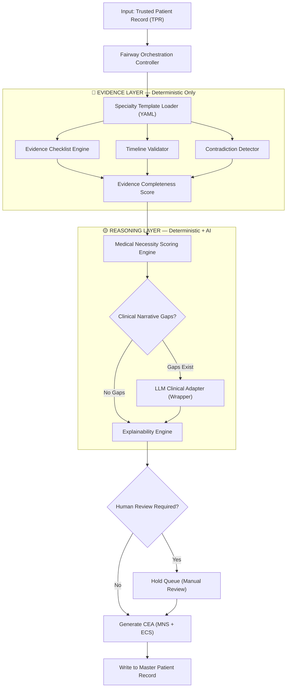
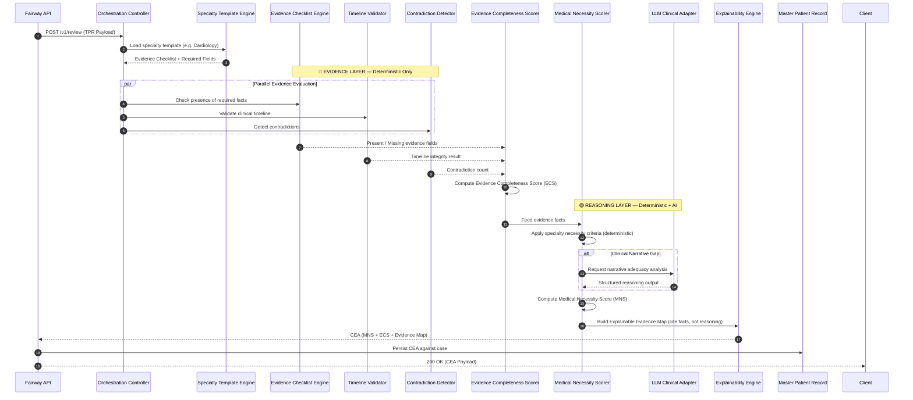

# Fairway Clinical Evidence Review Service — Architectural Specification

This document defines the production-grade architecture, component interfaces, clinical pipelines, and data contracts for Aivana's **Fairway Clinical Evidence Review Service**.

Fairway answers ONE question:

> *"Based on the Trusted Patient Record, is there sufficient documented clinical evidence to justify the requested admission, treatment, surgery, ICU stay, investigation, implant, or stay extension for insurance approval?"*

---

## 1. Position in Aivana Pipeline

```
Hospital Upload
      ↓
CCD → Document Identification → Patient Extraction → Patient Consolidation
      ↓
Trusted Patient Record (TPR)   ← Fairway INPUT
      ↓
Fairway Clinical Evidence Review   ← THIS SERVICE
      ↓
Clinical Evidence Assessment (CEA) ← Fairway OUTPUT
      ↓
Taiga → Claim Readiness → TPA Prediction → Final Claim Packet → Aegis
```

---

## 2. System Architecture Diagram

Fairway is internally split into two logical processing layers. This is the most important architectural distinction:

- **Evidence Layer** — answers *"What facts exist in the TPR?"* — runs entirely deterministically.
- **Reasoning Layer** — answers *"Do these facts justify the admission?"* — runs deterministically first; LLM invoked only when narrative gaps require clinical judgement.

The LLM is responsible ONLY for the Reasoning Layer. It never discovers facts. Facts are always discovered deterministically.

```
┌─────────────────────────────────────────────────────────────────────┐
│                    Trusted Patient Record (TPR)                     │
└────────────────────────────────┬────────────────────────────────────┘
                                 │
                                 ▼
┌─────────────────────────────────────────────────────────────────────┐
│                Fairway Clinical Evidence Review Service             │
│                                                                     │
│   ┌─────────────────────────────────────────────────────────────┐   │
│   │                   Orchestration Controller                  │   │
│   └────────────────────────┬────────────────────────────────────┘   │
│                            │                                        │
│   ╔═══════════════════════▼════════════════════════╗              │
│   ║            EVIDENCE LAYER (Deterministic)      ║              │
│   ║                                                ║              │
│   ║  ┌─────────────────┐  ┌────────────────────┐  ║              │
│   ║  │ Evidence        │  │  Specialty Template │  ║              │
│   ║  │ Checklist Engine│  │  Loader (YAML)      │  ║              │
│   ║  └────────┬────────┘  └────────┬────────────┘  ║              │
│   ║           │                   │               ║              │
│   ║  ┌────────▼────────┐  ┌────────▼────────────┐  ║              │
│   ║  │ Timeline        │  │  Contradiction       │  ║              │
│   ║  │ Validator       │  │  Detector            │  ║              │
│   ║  └────────┬────────┘  └────────┬────────────┘  ║              │
│   ║           └──────────┬─────────┘               ║              │
│   ║                      ▼                         ║              │
│   ║         ┌────────────────────────┐             ║              │
│   ║         │ Evidence Completeness  │             ║              │
│   ║         │ Score Calculator       │             ║              │
│   ║         └────────────┬───────────┘             ║              │
│   ╚══════════════════════╪════════════════════════╝              │
│                          │                                        │
│   ╔══════════════════════▼════════════════════════╗              │
│   ║          REASONING LAYER (Deterministic + AI) ║              │
│   ║                                               ║              │
│   ║  ┌───────────────────────────────────────┐   ║              │
│   ║  │  Medical Necessity Scoring Engine     │   ║              │
│   ║  └──────────────────┬────────────────────┘   ║              │
│   ║                     │                        ║              │
│   ║        ┌────────────┴──────────────┐         ║              │
│   ║        ▼                           ▼         ║              │
│   ║  ┌──────────────┐    ┌───────────────────┐   ║              │
│   ║  │ Deterministic│    │ LLM Clinical      │   ║              │
│   ║  │ Rules Engine │    │ Adapter (Wrapper) │   ║              │
│   ║  └──────┬───────┘    └────────┬──────────┘   ║              │
│   ║         └─────────┬───────────┘              ║              │
│   ║                   ▼                          ║              │
│   ║         ┌─────────────────────┐              ║              │
│   ║         │ Explainability      │              ║              │
│   ║         │ Engine              │              ║              │
│   ║         └─────────┬───────────┘              ║              │
│   ╚═════════════════╪═════════════════════════╝              │
│                     │                                           │
│                     ▼                                           │
│   ┌─────────────────────────────────────────────────────────┐   │
│   │                 Human Review Gate                       │   │
│   └─────────────────────────┬───────────────────────────────┘   │
└─────────────────────────────┼───────────────────────────────────┘
                              │
                              ▼
┌─────────────────────────────────────────────────────────────────────┐
│               Clinical Evidence Assessment (CEA)                    │
│        Medical Necessity Score  +  Evidence Completeness Score      │
└─────────────────────────────────────────────────────────────────────┘
```

---

## 3. Mermaid Workflow

### 3.1 Full Clinical Evidence Pipeline (Evidence → Reasoning)



### 3.2 Sequence Diagram



---

## 4. Component Responsibilities

### 4.1 Evidence Layer — Deterministic Only

| Component | Layer | Responsibility |
| :--- | :---: | :--- |
| **Orchestration Controller** | Both | Routes the TPR through both layers, manages parallel threads, tracks processing state. |
| **Specialty Template Engine** | Evidence | Loads the applicable YAML checklist for the diagnosis specialty (hot-reloadable). |
| **Evidence Checklist Engine** | Evidence | Checks presence/absence of required facts (lab values, vitals, imaging, notes) against the template. Never interprets — only verifies existence. |
| **Timeline Validator** | Evidence | Confirms chronological ordering of clinical events deterministically. |
| **Contradiction Detector** | Evidence | Applies rule-based contradiction checks across paired clinical fields. |
| **Evidence Completeness Scorer** | Evidence | Computes the Evidence Completeness Score from checklist results, timeline violations, and contradiction penalties. |

### 4.2 Reasoning Layer — Deterministic + Conditional AI

| Component | Layer | Responsibility |
| :--- | :---: | :--- |
| **Medical Necessity Scorer** | Reasoning | Applies specialty necessity criteria to the evidence facts; determines if documented facts justify the admission. |
| **LLM Clinical Adapter** | Reasoning | Invoked **only when** clinical narrative text requires adequacy interpretation. Never discovers facts — only reasons about adequacy of existing narrative content. |
| **Explainability Engine** | Reasoning | Maps every conclusion to its source fact and provenance in the TPR. |
| **Human Review Gate** | Both | Routes CEAs below confidence thresholds or with critical gaps to the manual review queue. |

---

## 5. Specialty Evidence Templates

Each specialty defines a configurable checklist consumed by the **Deterministic Evidence Checker** and **Medical Necessity Scorer**:

### 5.1 General Medicine
```yaml
specialty: "General Medicine"
required_evidence:
  - admissionNote: MANDATORY
  - chiefComplaint: MANDATORY
  - vitals: MANDATORY
  - diagnosisStatement: MANDATORY
  - labResults:
      - CBC: MANDATORY
      - RFT: IF_APPLICABLE
      - LFT: IF_APPLICABLE
  - treatmentPlan: MANDATORY
  - dischargeNote: MANDATORY
medical_necessity_criteria:
  - "Diagnosis must indicate acute condition requiring inpatient monitoring"
  - "Stable OPD-manageable conditions must not be admitted without documented failure of OPD treatment"
```

### 5.2 Cardiology
```yaml
specialty: "Cardiology"
required_evidence:
  - admissionNote: MANDATORY
  - ecgReport: MANDATORY
  - troponinLevel: MANDATORY_IF_ACS
  - echoReport: IF_APPLICABLE
  - cardiologistNote: MANDATORY
  - vitalsTimeSeries: MANDATORY
  - catheteriazionReport: IF_SURGICAL
medical_necessity_criteria:
  - "ACS presentation must include documented symptom onset time"
  - "Interventional procedures require documented LVEF or SYNTAX score"
```

### 5.3 Orthopaedics
```yaml
specialty: "Orthopaedics"
required_evidence:
  - xRayReport: MANDATORY
  - mriReport: IF_SOFT_TISSUE
  - orthoSurgeonNote: MANDATORY
  - implantConsent: MANDATORY_IF_IMPLANT
  - physiotherapyNotes: IF_CONSERVATIVE
medical_necessity_criteria:
  - "Elective joint replacements require documented conservative treatment failure"
  - "Trauma admissions require documented mechanism of injury"
```

### 5.4 Obstetrics & Gynaecology
```yaml
specialty: "Obstetrics"
required_evidence:
  - antenatalRecords: MANDATORY_IF_MATERNITY
  - ultraSoundReport: MANDATORY
  - lmpDate: MANDATORY
  - deliveryNote: MANDATORY
  - obgSpecialistNote: MANDATORY
  - neonatalOutcome: MANDATORY
medical_necessity_criteria:
  - "LSCS must document medical indication (previous scar, CPD, fetal distress)"
  - "Normal delivery admission must document active labour establishment"
```

*(Additional templates exist for Neurology, Oncology, Paediatrics, Urology, Gastroenterology, ICU/Critical Care.)*

---

## 6. Dual Scoring System

Fairway produces two independent scores. They measure different things and must never be merged into one.

### 6.1 Evidence Completeness Score (ECS)

The ECS answers: **"Are all required supporting documents present?"**

This is computed entirely in the **Evidence Layer** — no AI required.

$$\text{ECS} = \frac{\text{Mandatory fields present}}{\text{Total mandatory fields}} - (0.10 \times N_{contradictions}) - (0.05 \times N_{timeline\_violations})$$

| Score Range | Classification | Meaning |
| :--- | :--- | :--- |
| 0.90 – 1.00 | COMPLETE | All required evidence present |
| 0.75 – 0.89 | MOSTLY_COMPLETE | Minor gaps; advisory |
| 0.60 – 0.74 | INCOMPLETE | Material gaps; must collect documents |
| < 0.60 | CRITICALLY_INCOMPLETE | Mandatory human review |

### 6.2 Medical Necessity Score (MNS)

The MNS answers: **"Do the facts that exist justify the clinical decision?"**

This is computed in the **Reasoning Layer** — LLM invoked conditionally for narrative adequacy.

$$\text{MNS} = (0.40 \times D) + (0.35 \times N) + (0.25 \times T) - (0.15 \times N_{contradictions})$$

Where:
- $D$ = Diagnosis justification score (are findings consistent with diagnosis?)
- $N$ = Narrative adequacy score (is clinical history sufficient to justify inpatient care?)
- $T$ = Timeline integrity score

| Score Range | Classification |
| :--- | :--- |
| 0.90 – 1.00 | SUFFICIENT |
| 0.75 – 0.89 | CONDITIONALLY_SUFFICIENT |
| 0.60 – 0.74 | INSUFFICIENT |
| < 0.60 | CRITICAL |

### 6.3 Why Two Scores Matter

A case may score differently on each dimension:

| Scenario | ECS | MNS | Meaning |
| :--- | :---: | :---: | :--- |
| All docs present, well-documented | 0.95 | 0.91 | Clean case — submit |
| All docs present, weak clinical narrative | 0.95 | 0.58 | Docs exist but need better clinical justification |
| Strong narrative, missing lab reports | 0.52 | 0.88 | Good clinical case — collect missing documents |
| Missing docs + weak narrative | 0.48 | 0.51 | Critical — mandatory human review |

This gives hospital billing staff a precise signal: is the problem *documentation* or *clinical justification*? Both require different actions.

---

## 7. Contradiction Detection Rules

Contradictions are detected deterministically before any LLM invocation:

| Rule | Example |
| :--- | :--- |
| **Mobility Conflict** | Progress note states "patient ambulatory" but nursing note states "bed-ridden, assistance required" |
| **Consciousness Conflict** | ICU log documents GCS=3 but surgical consent lists patient as self-signed |
| **Diagnosis Timing Conflict** | Radiology report date precedes symptom onset date documented in history |
| **Dual Delivery Conflict** | Both Normal Delivery and Caesarean Section marked on consent forms |
| **Admission Diagnosis Drift** | Initial admission diagnosis diverges significantly from final discharge diagnosis without a documented differential |

---

## 8. API Contracts & JSON Schemas

### 8.1 API Endpoint
- **Endpoint**: `POST /v1/review`
- **Input**: Trusted Patient Record (TPR)

### 8.2 Clinical Evidence Assessment (CEA) Output Schema

```json
{
  "$schema": "http://json-schema.org/draft-07/schema#",
  "title": "ClinicalEvidenceAssessment",
  "type": "object",
  "properties": {
    "caseId": { "type": "string" },
    "ceaVersion": { "type": "integer" },
    "generatedAt": { "type": "string" },
    "specialty": { "type": "string" },
    "medicalNecessityScore": { "type": "number" },
    "necessityClassification": {
      "type": "string",
      "enum": ["SUFFICIENT", "CONDITIONALLY_SUFFICIENT", "INSUFFICIENT", "CRITICAL"]
    },
    "clinicalCompleteness": {
      "type": "object",
      "properties": {
        "score": { "type": "number" },
        "presentEvidence": { "type": "array", "items": { "type": "string" } },
        "missingEvidence": { "type": "array", "items": { "type": "string" } }
      }
    },
    "contradictions": {
      "type": "array",
      "items": {
        "type": "object",
        "properties": {
          "ruleId": { "type": "string" },
          "description": { "type": "string" },
          "sourceA": { "type": "object" },
          "sourceB": { "type": "object" },
          "severity": { "type": "string", "enum": ["BLOCKING", "ADVISORY"] }
        }
      }
    },
    "timelineIntegrity": {
      "type": "object",
      "properties": {
        "score": { "type": "number" },
        "violations": { "type": "array", "items": { "type": "string" } }
      }
    },
    "explainableEvidenceMap": {
      "type": "array",
      "items": {
        "type": "object",
        "properties": {
          "claim": { "type": "string" },
          "supportingEvidence": { "type": "string" },
          "provenance": {
            "type": "object",
            "properties": {
              "documentClass": { "type": "string" },
              "pageNumber": { "type": "integer" },
              "blockId": { "type": "string" }
            }
          },
          "confidence": { "type": "number" }
        }
      }
    },
    "humanReviewRequired": { "type": "boolean" },
    "humanReviewReason": { "type": "string" }
  },
  "required": [
    "caseId", "ceaVersion", "generatedAt", "specialty",
    "medicalNecessityScore", "necessityClassification",
    "clinicalCompleteness", "contradictions",
    "timelineIntegrity", "explainableEvidenceMap", "humanReviewRequired"
  ]
}
```

---

## 9. Processing States

```
RECEIVED
    ↓
TEMPLATE_LOADED
    ↓
EVIDENCE_CHECKING
    ↓
TIMELINE_VALIDATING
    ↓
CONTRADICTION_SCANNING
    ↓
NECESSITY_SCORING
    ↓
AI_NARRATIVE_ANALYSIS     (conditional — only if gaps exist)
    ↓
EXPLAINABILITY_MAPPING
    ↓
HUMAN_REVIEW_GATE
    ↓
CEA_GENERATED
    ↓
PERSISTED
```

---

## 10. AI Field Allowlist for Fairway

| Clinical Task | AI Allowed? | Rationale |
| :--- | :---: | :--- |
| Interpret free-text clinical history | ✅ | Unstructured text requires semantic comprehension |
| Evaluate examination finding narratives | ✅ | Structured values absent; narrative comprehension needed |
| Assess sufficiency of clinical justification in notes | ✅ | Requires clinical knowledge to judge adequacy |
| Verify lab values present/absent | ❌ | Deterministic lookup against TPR structured fields |
| Validate dates and chronology | ❌ | Deterministic comparison checks |
| Match diagnosis to specialty checklist | ❌ | Deterministic against YAML templates |
| Detect mobility/consciousness contradictions | ❌ | Deterministic rule-based comparison |

---

## 11. Latency Budget

| Phase | Target |
| :--- | :---: |
| Template Loading | < 20ms |
| Deterministic Evidence Checking | < 150ms |
| Timeline Validation | < 50ms |
| Contradiction Detection | < 100ms |
| Medical Necessity Scoring | < 50ms |
| LLM Clinical Adapter (conditional) | < 1500ms |
| Explainability Mapping | < 100ms |
| Persistence to MPR | < 50ms |
| **Total (deterministic path)** | **< 500ms** |
| **Total (with LLM narrative analysis)** | **< 2500ms** |

---

## 12. Failure Handling & Retry Policy

- **LLM Adapter timeout**: 3 retries with Exponential Backoff (`base = 200ms`, `multiplier = 1.5`).
- **Persistent LLM failure**: CEA is generated with `AI_UNAVAILABLE` flag; narrative fields marked `PENDING_MANUAL_REVIEW`.
- **Human Review Trigger Conditions**:
  - `medicalNecessityScore < 0.60`
  - Any `BLOCKING` severity contradiction detected
  - Critical specialty-required evidence (e.g. Troponin for ACS) is absent
  - LLM narrative analysis confidence `< 0.70`

---

## 13. Audit Schema

```json
{
  "timestamp": "2026-07-13T22:08:00Z",
  "caseId": "CASE-24936",
  "ceaVersion": 1,
  "operator": "FAIRWAY_ENGINE",
  "specialty": "Cardiology",
  "performance": {
    "totalLatencyMs": 820,
    "llmInvoked": true,
    "llmLatencyMs": 640
  },
  "necessityScore": 0.81,
  "classification": "CONDITIONALLY_SUFFICIENT",
  "missingEvidenceCount": 2,
  "contradictionsDetected": 0,
  "humanReviewTriggered": false
}
```
