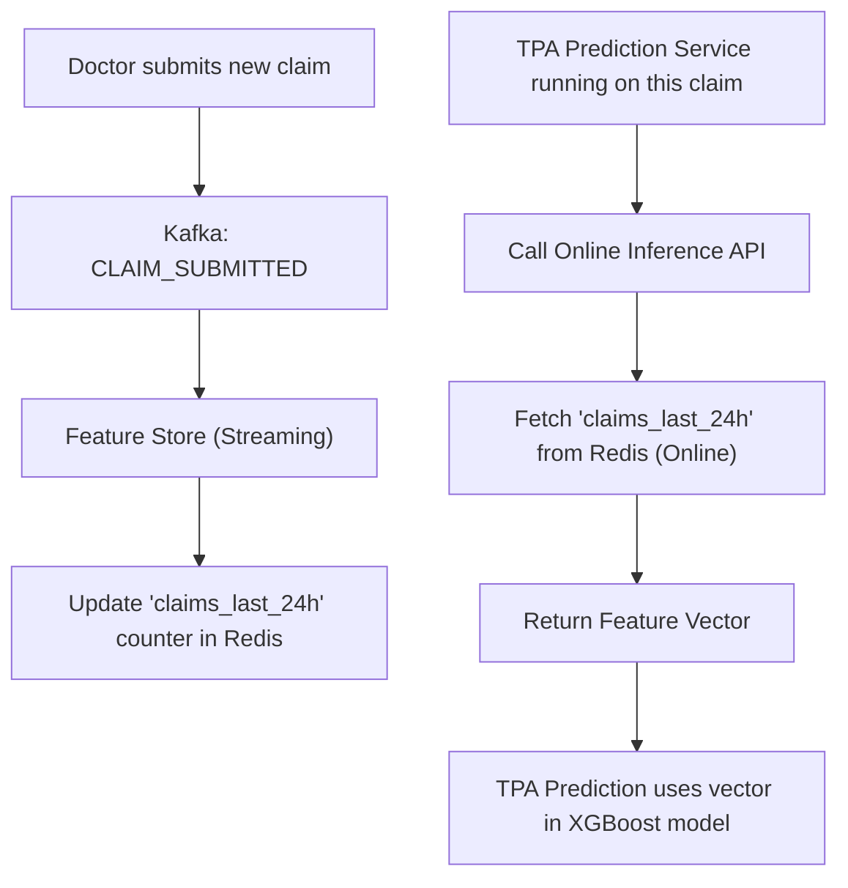
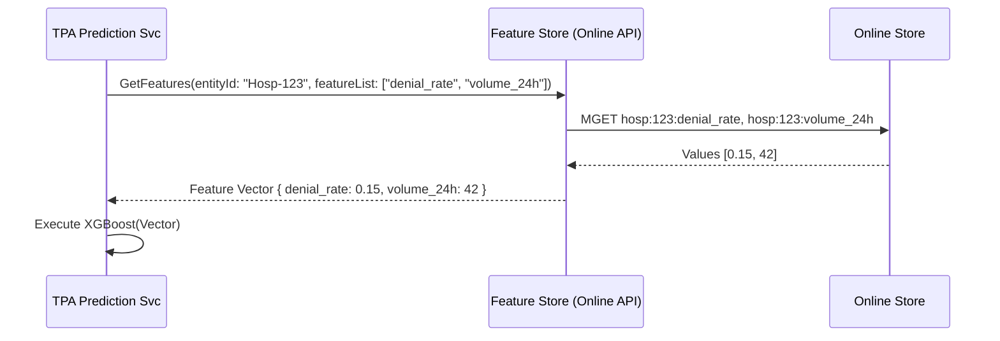

# Feature Store — Architectural Specification

This document presents the complete production-grade architecture, workflows, schemas, and API contracts for Aivana's **Feature Store**.

---

## 1. Purpose
As Aivana matures, several services rely on Predictive Machine Learning (e.g., the TPA Query Prediction service, Predictive Denials in URSE). These ML models require "Features"—mathematical representations of historical behavior. For example, `hospital_historical_denial_rate` or `doctor_anomaly_score`. If every service calculates these features independently, it leads to code duplication, massive database strain, and "training-serving skew" (where the model is trained on one definition of a feature, but production uses another). The Feature Store centralizes the definition, computation, storage, and serving of all ML features.

## 2. Responsibilities
- **Feature Computation (Batch)**: Run nightly Spark/SQL jobs to compute heavy historical features (e.g., "Doctor X's average length of stay over the last 90 days").
- **Feature Computation (Streaming)**: Process real-time Kafka events to update fast-moving features (e.g., "Number of claims submitted by this hospital in the last 1 hour").
- **Offline Serving**: Provide massive, point-in-time correct datasets to Data Scientists for training new models.
- **Online Serving**: Provide low-latency (sub-10ms) feature vectors to production microservices (like TPA Prediction) during live claim processing.
- **Registry**: Maintain a searchable catalog of all features so data scientists don't reinvent the wheel.

## 3. Non-Responsibilities
- **Does NOT** run ML inference (The AI Gateway or dedicated model servers do this).
- **Does NOT** enforce business rules (Taiga does this).

---

## 4. Inputs
- **Raw Data**: Kafka streams (Admissions, Denials, Settlements) and Data Lake tables (FCPs).
- **Feature Definitions**: Code (Python/SQL) defining how a feature is mathematically derived.

## 5. Outputs
- **Online Feature Vectors**: Fast JSON responses for live inference (e.g., `[0.4, 1.2, 0, 99]`).
- **Offline Training Sets**: Parquet/CSV files for Jupyter Notebooks.

## 6. Dependencies
- **Data Lake (S3/Snowflake/BigQuery)**: The source for batch computation.
- **Kafka**: The source for streaming computation.

---

## 7. Position Inside Overall Pipeline

```
  [Kafka Event Bus]         [Data Lake (S3)]
          │                        │
          └───────────┬────────────┘
                      ▼
 ╔═════════════════════════════════════════════════════╗
 ║                   Feature Store                     ║
 ║  (Computes, Stores, and Serves ML Feature Vectors)  ║
 ╚═════════════════════════════════════════════════════╝
          │                        │
          ▼ (Online Serving)       ▼ (Offline Serving)
  [TPA Prediction]            [Data Scientists]
  (Live Inference)            (Model Training)
```

---

## 8. ASCII Architecture Diagram

```
                 +---------------------------------------------+
                 |            Feature Registry (UI/API)        |
                 +----------------------+----------------------+
                                        |
                                        v
                 +----------------------+----------------------+
                 |          Computation Engine (Spark/Flink)   |
                 +----+-----------------+------------------+---+
                      | (Batch Jobs)    | (Streaming Jobs) |
                      v                 v                  v
             +--------+--------+ +------+-------+ +--------+--------+
             | Historical Data | | Live Kafka   | | Real-time       |
             | (S3 / Snowflake)| | Streams      | | Aggregation     |
             +--------+--------+ +------+-------+ +--------+--------+
                      |                 |                  |
                      +-----------------+------------------+
                                        |
                 +----------------------+----------------------+
                 |               Data Synchronization          |
                 +----+------------------------------------+---+
                      |                                    |
                      v                                    v
             +--------+--------+                  +--------+--------+
             | Offline Store   |                  | Online Store    |
             | (S3 / Parquet)  |                  | (Redis / Dynamo)|
             +--------+--------+                  +--------+--------+
                      |                                    |
                      v                                    v
             +--------+--------+                  +--------+--------+
             | Training SDK    |                  | Inference API   |
             | (Python/Pandas) |                  | (REST/gRPC)     |
             +-----------------+                  +-----------------+
```

---

## 9. Mermaid Workflow



---

## 10. Sequence Diagram (Online Inference)



---

## 11. Core Features

### Point-in-Time Correctness (Time-Travel)
When Data Scientists pull a dataset to train a model on historical claims from 2024, they need the features *as they existed in 2024*. If a hospital has a 10% denial rate today, but had a 50% denial rate in 2024, training the model on the 10% rate introduces "data leakage." The Offline Store mathematically guarantees point-in-time correct joins.

### Feature Definition as Code
Features are defined in a Git repository (e.g., using Feast or Hopsworks syntax).
```python
@feature_view(
    name="hospital_features",
    entities=[hospital],
    ttl=timedelta(days=1),
    source=hospital_batch_source,
)
```

---

## 12. Components

1. **Feature Registry**: A metadata catalog where teams document what a feature is, who owns it, and how it is calculated.
2. **Offline Store**: Optimized for high-throughput batch reads (S3, Parquet). Used for training.
3. **Online Store**: Optimized for low-latency key-value lookups (Redis, DynamoDB). Used for live inference.
4. **Materialization Engine**: The background sync process that moves freshly computed features from the Offline Store to the Online Store so they are ready for inference.

---

## 13. Deterministic vs AI Table

| Task | Methodology | Rationale |
| :--- | :--- | :--- |
| **Feature Computation** | Deterministic | SQL/Spark aggregations (Sums, Averages, Counts). |
| **Online Serving** | Deterministic | Key-Value lookups. |
| **Feature Selection** | AI Assisted | Data scientists use algorithms to determine *which* features in the store are actually predictive. |

---

## 14. Latency Budget

- **Online Serving (Read)**: < 10ms (Must not bottleneck the live MCO pipeline).
- **Streaming Computation (Write)**: < 5 seconds from event ingestion to Redis update.
- **Batch Materialization**: Runs nightly.

---

## 15. Scaling Strategy
- The Online Store is essentially a massive Redis cluster. It scales horizontally via sharding. Read latency remains flat regardless of data volume.

---

## 16. Caching Strategy
- The Online Store *is* a cache. It only holds the latest value of a feature. Historical values are kept only in the Offline Store.

---

## 17. Failure Handling
- If the Feature Store Online API is down, downstream ML services (like TPA Prediction) are configured with default/median fallback values for features so the claim pipeline doesn't crash, though prediction accuracy degrades.

---

## 18. API Contracts

### Online Feature Retrieval
```
POST /v1/features/online
Content-Type: application/json

{
  "entities": {
    "hospital_id": ["H-123", "H-456"]
  },
  "features": [
    "hospital_profile:historical_denial_rate",
    "hospital_profile:avg_los_variance"
  ]
}
```

*Response:*
```json
{
  "results": [
    {
      "entity": "H-123",
      "features": {
        "hospital_profile:historical_denial_rate": 0.12,
        "hospital_profile:avg_los_variance": 1.4
      }
    },
    {
      "entity": "H-456",
      "features": {
        "hospital_profile:historical_denial_rate": 0.08,
        "hospital_profile:avg_los_variance": 0.9
      }
    }
  ]
}
```

---

## 19. Database Schema (Registry Metadata)

```sql
CREATE SCHEMA feature_store;

CREATE TABLE feature_store.entities (
    name VARCHAR(64) PRIMARY KEY,
    description TEXT,
    join_key VARCHAR(64) NOT NULL
);

CREATE TABLE feature_store.features (
    feature_id VARCHAR(128) PRIMARY KEY,
    entity_name VARCHAR(64) REFERENCES feature_store.entities(name),
    data_type VARCHAR(32) NOT NULL,
    description TEXT,
    owner_team VARCHAR(64),
    created_at TIMESTAMP WITH TIME ZONE
);
```

---

## 20. Audit Model
Changes to feature definitions are strictly audited via Git commits. Because the Offline Store retains all historical computations, Aivana can prove exactly what data was used to train any model, satisfying regulatory algorithmic auditing requirements.

## 21. Lineage Model
When TPA Prediction saves its score to the FCP, it includes the `feature_vector_hash`. If a hospital contests the prediction, Aivana can reverse-lookup the hash in the Feature Store to see the exact input values that drove the prediction.

## 22. Metrics
- **Feature Freshness**: Time since the feature was last updated (e.g., "Batch features are 12 hours old").
- **Online Serving Latency**: P99 latency of API requests.

## 23. Security Model
- Features are often aggregated (e.g., "Average cost"). However, some features are patient-specific (e.g., `patient_historical_claims_count`). The Feature Store relies on the same IAM layer as the rest of the platform to restrict access to Patient-level entities.

## 24. Future Extensibility
**Embeddings as Features**: Storing dense vectors (e.g., the 768-dimensional embedding of a hospital's clinical behavior) in the Feature Store, allowing deep learning models to consume them instantly alongside scalar features.

---

*End of Document*
