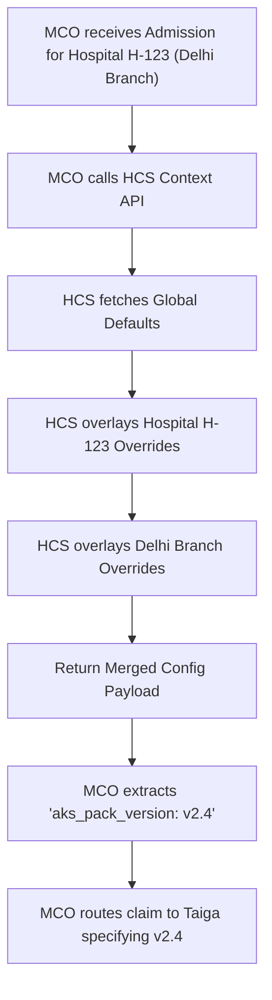
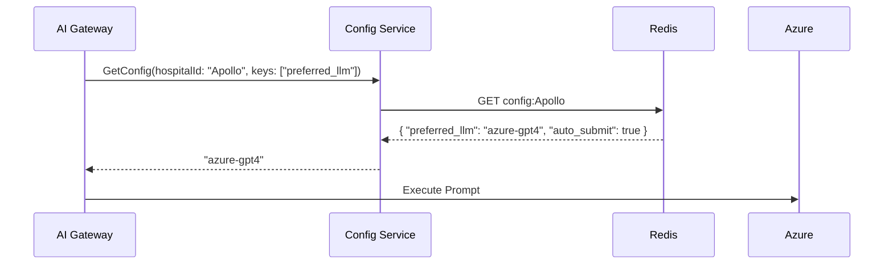

# Hospital Configuration Service (HCS) — Architectural Specification

This document presents the complete production-grade architecture, workflows, schemas, and API contracts for Aivana's **Hospital Configuration Service (HCS)**.

---

## 1. Purpose
Aivana is a multi-tenant B2B SaaS platform. Apollo Hospital operates very differently from Max Healthcare. Apollo might want aggressive AI appeals (using GPT-4o), while Max wants conservative appeals (using Gemini 1.5). Apollo might be using Taiga Rule Pack v2.1, while Max is still testing v2.0 in their staging environment. If configuration settings are scattered across Fairway, Taiga, and Aegis, it becomes impossible to manage deployments or override behavior per tenant. The Hospital Configuration Service (HCS) centralizes all multi-tenant configuration, feature flags, and environment mappings.

## 2. Responsibilities
- **Knowledge Pack Mapping**: Tells the Master Claim Orchestrator (MCO) which specific AKS Knowledge Pack versions a given hospital is currently subscribed to.
- **Feature Flagging**: Toggles platform features (e.g., `enable_auto_submission: true`) at a global, hospital, or hospital-branch level.
- **Provider Preferences**: Stores hospital-specific API keys, preferred LLM providers, and data localization requirements (e.g., "Must use AWS Mumbai").
- **Environment Management**: Supports multiple environments per hospital (Dev, Staging, Prod) so hospitals can test new Aivana features on historical claims before going live.

## 3. Non-Responsibilities
- **Does NOT** execute rules (Taiga does this).
- **Does NOT** store patient data or claim data.

---

## 4. Inputs
- **Admin UI**: Aivana Customer Success managers configuring a new hospital onboarding.
- **Runtime Queries**: Internal microservices asking for configuration context during claim processing.

## 5. Outputs
- **Context Payloads**: JSON maps merged in a hierarchical override order (Global -> Hospital -> Branch).

## 6. Dependencies
- **Database**: PostgreSQL (Source of truth) and Redis (Read cache).
- **Aivana Knowledge Studio (AKS)**: To validate that requested Knowledge Pack versions actually exist.

---

## 7. Position Inside Overall Pipeline

```
          [Aivana Admin UI]
                  │
                  ▼
 ╔═════════════════════════════════════════════════════╗
 ║         Hospital Configuration Service (HCS)        ║
 ║  (Centralized Tenant Settings and Feature Flags)    ║
 ╚═════════════════════════════════════════════════════╝
          │               │                │
          ▼               ▼                ▼
        [MCO]        [AI Gateway]     [Taiga / Fairway]
   (Which Pack?)   (Which LLM?)     (Feature Flags?)
```

---

## 8. ASCII Architecture Diagram

```
                 +---------------------------------------------+
                 |            Config Management API (REST)     |
                 +----------------------+----------------------+
                                        |
                                        v
                 +----------------------+----------------------+
                 |         Hierarchical Merge Engine           |
                 +----+-----------------+------------------+---+
                      |                 |                  |
                      v                 v                  v
             +--------+--------+ +------+-------+ +--------+--------+
             | Global Defaults | | Hospital     | | Branch          |
             |                 | | Overrides    | | Overrides       |
             +--------+--------+ +------+-------+ +--------+--------+
                      |                 |                  |
                      +-----------------+------------------+
                                        |
                 +----------------------+----------------------+
                 |          PostgreSQL (Source of Truth)       |
                 +----------------------+----------------------+
                                        | (Pub/Sub Invalidation)
                                        v
                 +----------------------+----------------------+
                 |       Redis (High-Speed Config Cache)       |
                 +----------------------+----------------------+
                                        |
                                        v
                 +----------------------+----------------------+
                 |          Context API (gRPC/REST)            |
                 |     (Queried by all Internal Services)      |
                 +---------------------------------------------+
```

---

## 9. Mermaid Workflow



---

## 10. Sequence Diagram (AI Gateway checking preferences)



---

## 11. Core Features

### Hierarchical Configuration Merge
Settings cascade.
1. **Global**: `auto_appeal: false` (Default for all Aivana).
2. **Hospital (Apollo)**: `auto_appeal: true` (Apollo trusts the AI).
3. **Branch (Apollo-Pediatrics)**: `auto_appeal: false` (Pediatrics is too sensitive, they want manual review).
When MCO queries HCS for Apollo-Pediatrics, HCS merges these levels at runtime and returns `false`.

### Multi-Environment Support
A hospital can have `Hosp-123-PROD` and `Hosp-123-STAGING`. When AKS publishes a new rule pack, the Customer Success manager updates the `STAGING` config to point to the new pack. The hospital runs 50 dummy claims through staging. Once verified, the Admin updates the `PROD` config.

---

## 12. Components

1. **Management UI API**: Endpoints for CRUD operations on tenant configs.
2. **Hierarchical Merge Engine**: Code that resolves the JSON overlay logic.
3. **Context API**: Fast read-only endpoints serving the resolved configurations to internal microservices.
4. **Audit Logger**: Records every change (who changed `auto_submit` from false to true, and when).

---

## 13. Deterministic vs AI Table

| Task | Methodology | Rationale |
| :--- | :--- | :--- |
| **Config Merging** | Deterministic | Standard JSON object merging (e.g., Lodash `merge`). |
| **Cache Invalidation** | Deterministic | Redis Pub/Sub clears cache immediately on update. |

---

## 14. Latency Budget

- **Read Context (gRPC)**: < 5ms. (Must be fast, as MCO fetches config at the start of every single claim state transition).

---

## 15. Scaling Strategy
- Config data is tiny. The entire configuration state for 1,000 hospitals easily fits in memory. HCS runs a local in-memory cache (like Guava/Caffeine in Java, or an LRU cache in Go) backed by Redis, resulting in 0ms network latency for the most frequently accessed configs.

---

## 16. Caching Strategy
- **L1 Cache**: In-memory inside the HCS container.
- **L2 Cache**: Redis cluster.
- **Invalidation**: When a config updates in Postgres, HCS publishes an invalidation event to Redis Pub/Sub, dropping the L1/L2 caches instantly.

---

## 17. Failure Handling
- If HCS is completely offline, microservices are designed to fall back to hardcoded `GLOBAL_DEFAULTS`, which prioritize safety (e.g., failing open to manual human review).

---

## 18. API Contracts

### Fetch Merged Context
```
GET /v1/config/context?hospitalId=H-123&branchId=B-456
```
*Response:*
```json
{
  "hospitalId": "H-123",
  "branchId": "B-456",
  "environment": "PRODUCTION",
  "features": {
    "enable_auto_submission": false,
    "enable_aegis_appeals": true,
    "require_doctor_signature": true
  },
  "knowledgePacks": {
    "taiga_clinical": "v2.4.1",
    "fairway_extraction": "v1.9.0"
  },
  "preferences": {
    "preferred_llm": "gemini-1.5-pro",
    "data_localization": "ap-south-1"
  }
}
```

---

## 19. Database Schema

```sql
CREATE SCHEMA hcs;

CREATE TABLE hcs.tenants (
    tenant_id VARCHAR(64) PRIMARY KEY,
    name VARCHAR(128) NOT NULL,
    type VARCHAR(32) NOT NULL, -- GLOBAL, HOSPITAL, BRANCH
    parent_id VARCHAR(64) REFERENCES hcs.tenants(tenant_id)
);

CREATE TABLE hcs.configurations (
    config_id VARCHAR(64) PRIMARY KEY,
    tenant_id VARCHAR(64) REFERENCES hcs.tenants(tenant_id),
    environment VARCHAR(32) NOT NULL, -- PROD, STAGING
    config_json JSONB NOT NULL,
    updated_by VARCHAR(64),
    updated_at TIMESTAMP WITH TIME ZONE DEFAULT CURRENT_TIMESTAMP,
    UNIQUE(tenant_id, environment)
);

CREATE TABLE hcs.audit_logs (
    log_id SERIAL PRIMARY KEY,
    tenant_id VARCHAR(64),
    diff JSONB, -- Shows exactly what keys changed
    changed_by VARCHAR(64),
    changed_at TIMESTAMP WITH TIME ZONE
);
```

---

## 20. Audit Model
HCS maintains a strict audit log of every change. If a hospital asks, "Why did you automatically submit a claim on Tuesday when we didn't want you to?", Aivana can check the HCS audit log: "Your Admin enabled the `auto_submit` flag on Monday at 4:00 PM, and disabled it on Wednesday."

## 21. Lineage Model
When FCP builds the final claim, it records a hash of the HCS configuration state used to generate the claim.

## 22. Metrics
- **Cache Hit Rate**: Target > 99.9%.
- **Config Drift**: Number of hospitals deviating from the Global Default config.

## 23. Security Model
- **Secrets Management**: HCS does *not* store raw passwords or API keys in the `config_json`. If a hospital brings their own OpenAI key, HCS stores a reference URI (e.g., `arn:aws:secretsmanager:ap-south-1:123:secret:hospitalA-openai`). The AI Gateway resolves the URI at runtime.

## 24. Future Extensibility
**Dynamic A/B Testing Integration**: HCS can integrate with the Prompt Registry to say: "For Hospital A, route 50% of claims to Prompt v1, and 50% to Prompt v2," managing the rollout at the tenant level.

---

*End of Document*
