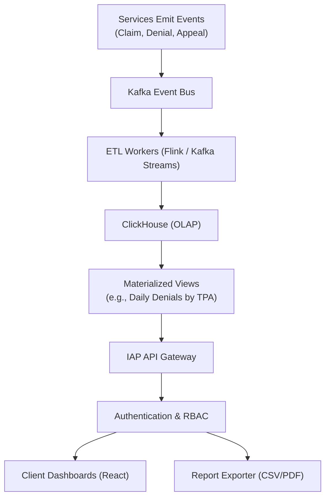
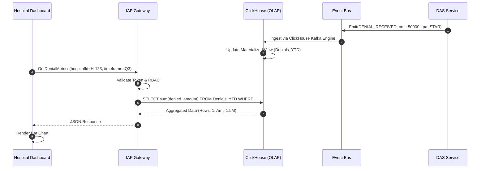

# Insurance Analytics Platform (IAP) — Architectural Specification

This document presents the complete production-grade architecture, workflows, schemas, and API contracts for Aivana's **Insurance Analytics Platform (IAP)**.

---

## 1. Purpose
The Insurance Analytics Platform (IAP) is the business intelligence (BI) layer of Aivana. It transforms the millions of transactional events generated by the core pipeline (FCP, DAS, Aegis, DKS) into interactive, executive-level dashboards for hospital administrators. It answers critical operational questions: *How much money are we losing to Star Health? What is our first-pass approval rate? Which doctors have the highest clinical query rates?*

## 2. Responsibilities
- Aggregate event streams from all Aivana microservices via Kafka into an OLAP Data Warehouse (e.g., ClickHouse / BigQuery).
- Maintain materialized views of complex, slow-changing metrics (e.g., YTD Claim Approvals).
- Expose a low-latency GraphQL or REST API specifically optimized for frontend BI dashboards.
- Provide Role-Based Access Control (RBAC) so a hospital CEO sees enterprise-wide data, while a billing clerk sees only their specific ward.
- Render visual analytics for claim lifecycles, denial root causes, and appeal win rates.
- Generate automated PDF/Excel reports for month-end financial reconciliation.

## 3. Non-Responsibilities
- **Does NOT** process live claims or affect the FCP generation path (completely decoupled).
- **Does NOT** draft appeals (Aegis domain).
- **Does NOT** discover new AKS rules (DKS domain).
- **Does NOT** serve as the primary transactional database (OLTP) for the platform.

---

## 4. Inputs
- **Aivana Event Bus (Kafka)**: Consumes all major platform events (`CLAIM_SUBMITTED`, `DENIAL_RECEIVED`, `APPEAL_WON`, `FCP_GENERATED`).
- **DKS Insights**: Consumes the TPA Behavior Profiles generated by the Denial Knowledge Service.

## 5. Outputs
- **Analytical API Responses**: Fast, aggregated JSON for charting libraries (e.g., Recharts, D3).
- **Exportable Reports**: CSV/Excel/PDF extracts for hospital finance teams.
- **Embedded Dashboards**: Pre-rendered iframe/BI widgets if requested.

## 6. Dependencies
- **OLAP Database (ClickHouse)**: Optimized for ultra-fast `GROUP BY` queries over billions of rows.
- **Change Data Capture (CDC) / Debezium**: To stream state changes from the OLTP Postgres databases (e.g., Taiga, Aegis) into Kafka.

---

## 7. Position Inside Overall Pipeline

```
  [Taiga]   [DAS]   [Aegis]   [SAS]
     │        │        │        │
     └────────┼────────┼────────┘
              ▼
   ╔══════════════════════╗
   ║  Aivana Event Bus    ║ (Kafka)
   ╚══════════════════════╝
              │
              ▼
 ╔═════════════════════════════════════════════════════╗
 ║         Insurance Analytics Platform (IAP)          ║
 ║  (Data Warehouse, Materialized Views, Query API)    ║
 ╚═════════════════════════════════════════════════════╝
              │
              ▼
    Hospital Executive Dashboards
```

---

## 8. ASCII Architecture Diagram

```
                 +---------------------------------------------+
                 |       Kafka Topics (CDC + Domain Events)    |
                 +----------------------+----------------------+
                                        | (Stream Ingestion)
                                        v
                 +----------------------+----------------------+
                 |      Data Ingestion & ETL Pipeline          |
                 |  (Transforms raw JSON into columnar schema) |
                 +----+-----------------+------------------+---+
                      |                 |                  |
                      v                 v                  v
             +--------+--------+ +------+-------+ +--------+--------+
             | Real-Time       | | Materialized | | Historical     |
             | Event Store     | | Views (Aggs) | | Cold Storage   |
             +--------+--------+ +------+-------+ +--------+--------+
                      |                 |                  |
                      +-----------------+------------------+
                                        | (Query)
                                        v
                 +----------------------+----------------------+
                 |         Analytics API Gateway (GraphQL)     |
                 | (Handles Auth, Pagination, Rate Limiting)   |
                 +----------------------+----------------------+
                                        |
                                        v
                 +----------------------+----------------------+
                 |       Hospital BI / Finance Dashboards      |
                 +---------------------------------------------+
```

---

## 9. Mermaid Workflow



---

## 10. Sequence Diagram



---

## 11. State Machine (Data Lifecycle)

```
   [RAW_EVENT_EMITTED]
     │
     ▼
  [KAFKA_INGESTION] ----(Schema Mismatch)----> [DEAD_LETTER_QUEUE]
     │
     ▼
  [ETL_TRANSFORMATION] (Flattening JSON, Type Casting)
     │
     ▼
  [OLAP_STORAGE]
     │
     ├──> [MATERIALIZED_VIEW_UPDATED] (Real-time analytics)
     │
     └──> [S3_COLD_ARCHIVE] (Compliance/Historical)
```

---

## 12. Components

1. **ETL Pipeline**: Flink or Kafka Streams jobs that read complex, nested JSON payloads (like an FCP manifest) and flatten them into highly efficient columnar tables.
2. **OLAP Engine (ClickHouse)**: The heart of IAP. ClickHouse is chosen for its ability to execute aggregations over billions of rows in milliseconds.
3. **Materialized View Engine**: Pre-calculates common queries (e.g., `SELECT count(*) GROUP BY TPA`) so the dashboard loads instantly.
4. **GraphQL API**: Provides a flexible query interface so the frontend can request exactly the metrics it needs without over-fetching.
5. **Export Engine**: A worker pool that can take a 100,000-row SQL result and stream it into a CSV file for download, without crashing memory.

---

## 13. Internal Processing Pipeline

1. **Event Capture**: A claim is submitted. SAS emits an event with the `tpaId` and `timestamp`.
2. **Streaming**: The event is buffered in Kafka.
3. **Batch Write**: ClickHouse ingests the events in micro-batches (e.g., every 1 second) to optimize disk I/O.
4. **Aggregation**: ClickHouse automatically updates the `Daily_Submissions_By_TPA` materialized view.
5. **Serving**: The hospital logs in. The API queries the view and returns the data in 20ms.

---

## 14. Parallel Execution Opportunities
- The ETL pipeline is partition-based. If a hospital has a massive spike in claims, Kafka partitions scale horizontally to distribute the ETL load across multiple worker nodes.

---

## 15. Deterministic vs AI Table

| Task | Methodology | Rationale |
| :--- | :--- | :--- |
| **Data Aggregation** | Deterministic | Financial reporting must be 100% mathematically accurate. No AI hallucination allowed. |
| **Data Visualization** | Deterministic | Standard charting libraries (Bar, Line, Pie). |
| **Predictive Insights (Future)**| AI Assisted | An LLM overlay ("Talk to your Data") could allow admins to type: "Why did Star Health denials spike in June?" |

---

## 16. Latency Budget

- **Event to OLAP (Data Freshness)**: < 5 seconds.
- **Dashboard API Query (P95)**: < 150ms.
- **CSV Export (100k rows)**: < 10 seconds.

---

## 17. Scaling Strategy
- The OLTP databases (Postgres) scale for transaction safety (ACID). The OLAP database (ClickHouse) scales for read-heavy analytical workloads. Decoupling them ensures that a massive BI query will never slow down active claim processing.

---

## 18. Caching Strategy
- The GraphQL API uses Apollo Server caching with Redis to cache identical queries (e.g., "Total YTD Revenue") for 5 minutes, vastly reducing database load during peak hospital hours.

---

## 19. Retry Strategy
- If the ETL worker fails to insert a batch into ClickHouse due to network jitter, it relies on Kafka's consumer offset management to retry without losing or duplicating data (Exactly-Once Semantics).

---

## 20. Failure Handling
- **Data Inconsistencies**: If a bug in a microservice emits corrupted data, IAP maintains the raw events in an S3 data lake, allowing engineers to "replay" the historical events and rebuild the ClickHouse tables from scratch.

---

## 21. Event Model
IAP is a **consumer** of almost all platform events:
- `FCP_GENERATED` (Tracking processing volume)
- `CLAIM_SUBMITTED` (Tracking SAS adapter volume)
- `DENIAL_RECEIVED` (Tracking TPA behavior)
- `APPEAL_WON`/`APPEAL_LOST` (Tracking Aegis efficacy)

---

## 22. API Contracts

### Get Hospital Dashboard Metrics (GraphQL)
```graphql
query GetDashboard($hospitalId: ID!, $dateRange: DateRangeInput!) {
  metrics(hospitalId: $hospitalId, dateRange: $dateRange) {
    totalClaimsSubmitted
    totalAmountClaimed
    denialRatePercentage
    denialsByTPA {
      tpaName
      denialCount
      deniedAmount
    }
    topDenialReasons {
      taxonomyCategory
      count
    }
    aegisWinRate
  }
}
```

---

## 23. JSON Schemas (API Response)

```json
{
  "data": {
    "metrics": {
      "totalClaimsSubmitted": 1450,
      "totalAmountClaimed": 45000000,
      "denialRatePercentage": 12.5,
      "denialsByTPA": [
        { "tpaName": "Star Health", "denialCount": 85, "deniedAmount": 1200000 },
        { "tpaName": "Niva Bupa", "denialCount": 42, "deniedAmount": 650000 }
      ],
      "topDenialReasons": [
        { "taxonomyCategory": "ROOM_RENT_CAP", "count": 60 },
        { "taxonomyCategory": "MISSING_EVIDENCE_CLINICAL", "count": 25 }
      ],
      "aegisWinRate": 78.4
    }
  }
}
```

---

## 24. Database Schema (ClickHouse Example)

```sql
-- Flattened wide table optimized for columnar scanning
CREATE TABLE iap_db.claims_analytics (
    hospital_id String,
    tpa_id String,
    claim_id String,
    submission_date Date,
    claimed_amount Float64,
    status Enum8('SUBMITTED'=1, 'DENIED'=2, 'SETTLED'=3, 'APPEALED'=4),
    denial_taxonomy String,
    aegis_outcome String
) ENGINE = MergeTree()
PARTITION BY toYYYYMM(submission_date)
ORDER BY (hospital_id, tpa_id, submission_date);

-- Materialized View for instant dashboard loading
CREATE MATERIALIZED VIEW iap_db.mv_denials_by_tpa
ENGINE = SummingMergeTree()
ORDER BY (hospital_id, tpa_id, submission_date)
AS SELECT
    hospital_id,
    tpa_id,
    submission_date,
    count() as total_denials,
    sum(claimed_amount) as total_denied_amount
FROM iap_db.claims_analytics
WHERE status = 'DENIED'
GROUP BY hospital_id, tpa_id, submission_date;
```

---

## 25. Audit Model
IAP is an analytical projection. The absolute source of truth remains the distributed Postgres DBs and the immutable S3 artifacts (FCP). IAP is for visualization, not legal auditing.

## 26. Lineage Model
Because every event ingested into IAP retains the `ClaimId` and `FCPId`, a user clicking on a bar chart inside the dashboard can immediately drill down to the exact claim and view the original FCP PDF.

## 27. Metrics
- **Query Latency**: Must remain < 200ms even as the data warehouse grows to terabytes.
- **Data Freshness**: Delay between a claim being submitted and it appearing on the dashboard.

## 28. Benchmark Targets
- Render complex multi-dimensional filtering queries over 5 years of historical hospital data in < 1 second.

---

## 29. Security Model
- **Multi-Tenancy**: The GraphQL API enforces strict Row-Level Security (RLS). A user token is bound to a `hospitalId`. The query layer automatically injects `WHERE hospital_id = ?` into every ClickHouse query. A hospital cannot mathematically query a competitor's data.

## 30. Hospital Customization
Hospitals can create custom dashboards by dragging and dropping metrics, or setting up automated email reports (e.g., "Send the CFO a PDF of the Denial Rate every Monday at 8 AM").

## 31. AKS Integration
IAP visualizes the ROI of the AKS packs. It can plot a timeline graph showing a sharp decrease in clinical queries exactly on the date a new Fairway Clinical Knowledge Pack was deployed.

## 32. Future Extensibility
Embedding natural language BI ("Chat with your Claims"). IAP's clean GraphQL schema makes it trivial to hook up a LangChain agent, allowing doctors to ask: "Show me all cataract claims denied by FHPL last week."

## 33. Production Deployment
ClickHouse Cloud for fully managed OLAP. Node.js/Apollo for the API Gateway. React/Tremor for the frontend dashboard components.

## 34. Testing Strategy
- **Data Reconciliation Tests**: Nightly scripts sum the total revenue in Taiga's Postgres DB and compare it to the sum in ClickHouse. If they diverge by even 1 Rupee, an alert is triggered (Data Drift detection).

## 35. Versioning
GraphQL relies on schema evolution (adding fields, deprecating old ones) rather than breaking `/v1` `/v2` versioning, ensuring frontend dashboards never break unexpectedly.

---

## 36. Example Outputs (PDF Report Generation)

```json
{
  "reportId": "rep-2026-07-14",
  "status": "COMPLETED",
  "downloadUrl": "s3://reports/hosp-88/monthly_financials_jun2026.pdf",
  "metadata": {
    "rowsProcessed": 14500,
    "generatedInMs": 1240
  }
}
```

---

## 37. Explainability Strategy
Data tooltips. Every chart axis or metric card has an `(i)` info icon explaining exactly how the math is calculated (e.g., "Denial Rate = (Total Denied Claims / Total Settled + Denied Claims). Pending claims are excluded.").

## 38. Human Review Rules
Not applicable for data visualization, though anomaly alerts (e.g., "Your denial rate spiked 30% today") require immediate human investigation.

## 39. Technology Stack
- **OLAP**: ClickHouse.
- **Ingestion**: Apache Kafka, Debezium (CDC).
- **API**: Node.js, GraphQL (Apollo).
- **Frontend**: React, Tremor, Recharts.

## 40. Open-source Dependencies
- `clickhouse-client` for high-speed node integration.
- `graphql-tools` for schema stitching and execution.
- `puppeteer` (or similar) for generating PDF reports from web views.

---

*End of Document*
