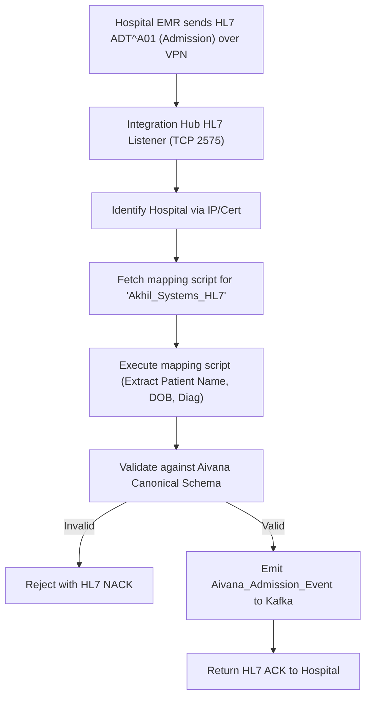
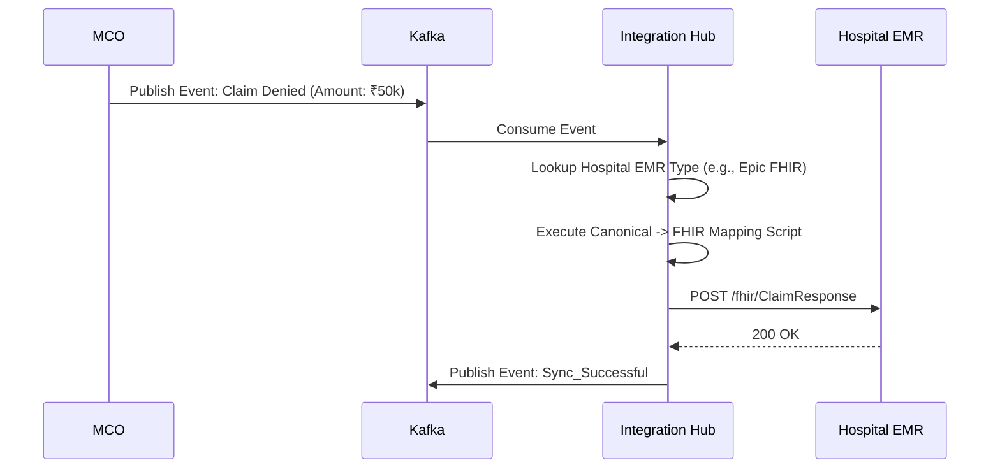

# Integration Hub — Architectural Specification

This document presents the complete production-grade architecture, workflows, schemas, and API contracts for Aivana's **Integration Hub**.

---

## 1. Purpose
Aivana is useless if it cannot seamlessly exchange data with a hospital's existing Electronic Medical Record (EMR) or Hospital Information System (HIS) like Epic, Cerner, or local Indian systems like Akhil Systems. Every EMR speaks a different dialect of HL7 v2, FHIR, or custom REST/SOAP XML. If the core Aivana ingestion services try to parse these directly, the codebase becomes an unmaintainable spaghetti of hospital-specific IF/ELSE statements. The Integration Hub acts as the universal translator and edge router. It sits at the perimeter of the Aivana VPC, ingesting raw hospital protocols and emitting clean, standardized JSON events onto the internal Kafka bus.

## 2. Responsibilities
- **Protocol Translation**: Convert HL7 v2 (MLLP), FHIR (REST), XML (SOAP), and raw PDF dumps (SFTP) into Aivana's Canonical JSON schema.
- **Bi-directional Sync**: Push Aivana's claim status updates, AI-generated denial appeals, and query responses *back* into the hospital's EMR.
- **Edge Throttling**: Protect the core platform from being DDoS'd if a hospital accidentally triggers a massive batch export of 100,000 historical claims.
- **Secure Connectivity**: Manage Site-to-Site VPNs, AWS PrivateLink, and mutual TLS (mTLS) certificates for each tenant.
- **Plugin Architecture**: Support isolated "Adapter Plugins" so a developer can write an `AkhilSystemsAdapter` without touching the core Hub logic.

## 3. Non-Responsibilities
- **Does NOT** perform Document OCR (Docling Gateway does this).
- **Does NOT** orchestrate the claim (MCO does this).

---

## 4. Inputs
- **Hospital EMRs**: Pushing HL7 ADT (Admit/Discharge/Transfer) messages or FHIR payloads.
- **Internal Microservices**: Pushing `CLAIM_UPDATED` events via Kafka.

## 5. Outputs
- **Canonical Aivana Events**: Standardized JSON (e.g., `Aivana_Admission_Event`) emitted to Kafka for the MCO.
- **EMR Callbacks**: HTTP/HL7 pushes back to the hospital system.

## 6. Dependencies
- **Kafka**: The primary internal backbone.
- **Hospital Configuration Service (HCS)**: To know which adapter plugin is active for a specific hospital.

---

## 7. Position Inside Overall Pipeline

```
 [Hospital EMR]         [Hospital SFTP]
      │ (HL7)                │ (PDFs)
      ▼                      ▼
 ╔═════════════════════════════════════════════════════╗
 ║                  Integration Hub                    ║
 ║  (Protocol Translation, VPN, Canonicalization)      ║
 ╚═════════════════════════════════════════════════════╝
      │ (Aivana Canonical Event: Admission)
      ▼
 [Kafka Event Bus]
      │
      ▼
 [Master Claim Orchestrator (MCO)]
```

---

## 8. ASCII Architecture Diagram

```
                 +---------------------------------------------+
                 |       Edge Ingress (VPN / API Gateway)      |
                 +----------------------+----------------------+
                                        |
                                        v
                 +----------------------+----------------------+
                 |         Adapter Router & Rate Limiter       |
                 +----+-----------------+------------------+---+
                      |                 |                  |
                      v                 v                  v
             +--------+--------+ +------+-------+ +--------+--------+
             | HL7 v2 Listener | | FHIR REST    | | Custom XML    |
             | (MLLP TCP)      | | Endpoint     | | Webhook       |
             +--------+--------+ +------+-------+ +--------+--------+
                      |                 |                  |
                      v                 v                  v
                 +----------------------+----------------------+
                 |         Adapter Plugin Execution Engine     |
                 |  (Executes Hospital-Specific mapping JS)    |
                 +----------------------+----------------------+
                                        |
                                        v
                 +----------------------+----------------------+
                 |          Canonical Transformer (JSON)       |
                 +----------------------+----------------------+
                                        |
                                        v
                 +---------------------------------------------+
                 |          Internal Kafka Topic (Ingest)      |
                 +---------------------------------------------+
```

---

## 9. Mermaid Workflow (Inbound Admission)



---

## 10. Core Features

### The Plugin Execution Engine
Instead of hardcoding mappings in Java/Go, the Hub runs a lightweight V8 Javascript engine (like Deno or Node.js VM). Field engineers write simple Javascript mappings:
```javascript
function mapHl7ToCanonical(hl7Message) {
  return {
    patientName: hl7Message.PID[5],
    dateOfBirth: formatHl7Date(hl7Message.PID[7]),
    hospitalId: "H-123"
  };
}
```
This script is deployed instantly via the UI without restarting the Hub.

### Dead Letter Queue (DLQ) Reprocessing
If an EMR sends a malformed HL7 message (e.g., missing the Patient ID), the Hub rejects it from the main pipeline but saves the raw payload to an S3 DLQ. Aivana Support can fix the mapping script and click "Replay" in the UI to ingest the failed message correctly.

---

## 11. Sequence Diagram (Outbound Status Sync)



---

## 12. Components

1. **Ingress Handlers**: TCP listeners for MLLP (HL7), REST endpoints for webhooks, and polling workers for SFTP/S3 drops.
2. **Javascript VM**: Secure, sandboxed execution environment for mapping scripts.
3. **Egress Handlers**: HTTP clients for pushing data back out.
4. **Connection Manager**: Monitors the health of Site-to-Site VPNs and alerts if a hospital's connection drops.

---

## 13. Deterministic vs AI Table

| Task | Methodology | Rationale |
| :--- | :--- | :--- |
| **Parsing & Validation** | Deterministic | Strict protocol adherence (HL7/FHIR). |
| **Data Mapping** | Deterministic | Exact path extraction (`PID.5.1` -> `firstName`). |
| **Mapping Generation**| AI Assisted | An LLM in the Admin UI can auto-generate the Javascript mapping code by looking at a sample XML payload. |

---

## 14. Latency Budget

- **Inbound Transformation**: < 100ms. (The EMR is waiting for a synchronous ACK).
- **Outbound Sync**: Handled asynchronously via Kafka, retry backoffs up to 24 hours if the hospital EMR is down.

---

## 15. Scaling Strategy
- The Hub is stateless (state is immediately pushed to Kafka). It auto-scales horizontally based on CPU usage. Dedicated deployments can be spun up for massive enterprise clients (e.g., `hub-apollo.aivana.internal`) to prevent noisy-neighbor issues.

---

## 16. Caching Strategy
- Mapping scripts are cached in memory (L1) and fetched from PostgreSQL on startup or update.

---

## 17. Failure Handling
- If the internal Kafka bus is down, the Hub buffers inbound requests to a local persistent disk (RocksDB) to ensure it can still return ACKs to the EMR and prevent data loss.

---

## 18. API Contracts

### Canonical Event Schema (Emitted to Kafka)
```json
{
  "$schema": "http://json-schema.org/draft-07/schema#",
  "title": "AivanaAdmissionEvent",
  "type": "object",
  "properties": {
    "eventId": { "type": "string" },
    "hospitalId": { "type": "string" },
    "timestamp": { "type": "string", "format": "date-time" },
    "patient": {
      "type": "object",
      "properties": {
        "mrn": { "type": "string" },
        "name": { "type": "string" },
        "dob": { "type": "string" }
      }
    },
    "admission": {
      "type": "object",
      "properties": {
        "visitId": { "type": "string" },
        "department": { "type": "string" },
        "diagnosis": { "type": "string" }
      }
    }
  }
}
```

---

## 19. Database Schema (Mapping Management)

```sql
CREATE SCHEMA integration_hub;

CREATE TABLE integration_hub.connections (
    connection_id VARCHAR(64) PRIMARY KEY,
    hospital_id VARCHAR(64) NOT NULL,
    protocol VARCHAR(32) NOT NULL, -- HL7, FHIR, SFTP
    status VARCHAR(32) NOT NULL
);

CREATE TABLE integration_hub.mapping_scripts (
    script_id VARCHAR(64) PRIMARY KEY,
    connection_id VARCHAR(64) REFERENCES integration_hub.connections(connection_id),
    direction VARCHAR(16) NOT NULL, -- INBOUND, OUTBOUND
    javascript_code TEXT NOT NULL,
    version INT NOT NULL,
    updated_at TIMESTAMP WITH TIME ZONE DEFAULT CURRENT_TIMESTAMP
);
```

---

## 20. Audit Model
The Hub logs 100% of raw inbound payloads and outbound transformed JSONs to an S3 Data Lake for 30 days. If a hospital says, "Aivana missed an admission," support can pull the raw HL7 trace to prove the EMR never actually sent the message.

## 21. Lineage Model
The Hub attaches a `sourceSystemTraceId` (e.g., the HL7 Message Control ID) to the Canonical JSON. This ID survives all the way to the FCP, allowing the claim to be easily reconciled with the hospital's internal database.

## 22. Metrics
- **Message Throughput**: Messages processed per second.
- **DLQ Rate**: Percentage of messages failing schema validation.
- **EMR Uptime**: Tracked via outbound heartbeat pings.

## 23. Security Model
- **VPC Peering**: For large hospitals, the Hub accepts traffic only over AWS PrivateLink or IPSec VPNs. It does not expose a public IP.
- **mTLS**: For hospitals using public REST webhooks, the Hub requires Mutual TLS authentication using certificates issued by the Aivana CA.

## 24. Future Extensibility
**Integration Marketplace**: Third-party developers can write and publish adapters (e.g., "Standard Practo EMR Adapter") to the Hub, allowing new hospitals to onboard with zero custom mapping code.

---

*End of Document*
