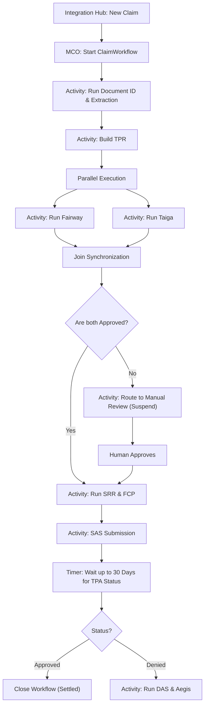
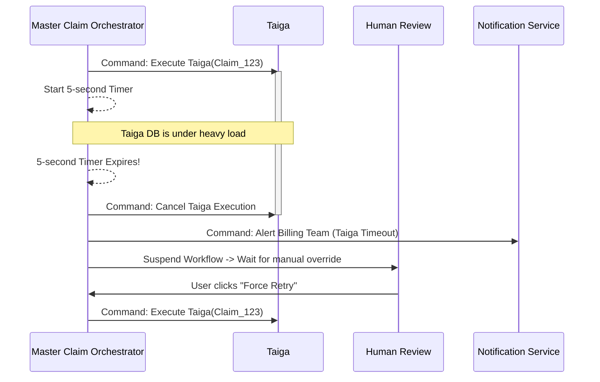

# Master Claim Orchestrator (MCO) — Architectural Specification

This document presents the complete production-grade architecture, workflows, schemas, and API contracts for Aivana's **Master Claim Orchestrator (MCO)**.

---

## 1. Purpose
The Master Claim Orchestrator (MCO) is the central nervous system of the Aivana platform. While Aivana's individual microservices (Fairway, Taiga, DAS, Aegis) are highly decoupled and event-driven, complex healthcare insurance claims require a deterministic Saga pattern to guarantee progression. The MCO owns the end-to-end lifecycle of a claim: routing it between services, managing retries, executing compensating transactions (rollbacks), handling timeouts, and exposing a unified visualization of the claim's exact status.

## 2. Responsibilities
- **Saga Execution**: Coordinate the linear and parallel progression of a claim from Admission to Settlement.
- **State Management**: Maintain the definitive, authoritative state of the claim.
- **Timeout & SLA Enforcement**: E.g., if Fairway takes > 5 seconds, route to a manual fallback queue.
- **Compensating Actions**: If an FCP generation fails, automatically invalidate the associated Taiga/Fairway snapshots to ensure consistency.
- **Human-in-the-Loop Orchestration**: Suspend workflows indefinitely until a human doctor signs a document or approves an appeal, then seamlessly resume.
- **Visibility**: Expose a DAG (Directed Acyclic Graph) of the claim's journey for the UI.

## 3. Non-Responsibilities
- **Does NOT** perform any business logic. It does not validate clinical notes (Fairway) or check billing rules (Taiga). It only *orchestrates* the services that do.
- **Does NOT** parse documents or extract text.

---

## 4. Inputs
- **Integration Hub Events**: Signals that a new admission or claim has begun.
- **Service Callbacks**: Webhooks or Kafka events from downstream services (e.g., `FAIRWAY_COMPLETED`, `SAS_FAILED`).
- **Human Interactions**: API calls indicating a user clicked "Approve" or "Reject."

## 5. Outputs
- **Command Events**: Directives telling specific services to execute (e.g., `COMMAND: START_TAIGA`).
- **Workflow State Updates**: Pushed to the UI via WebSockets or GraphQL subscriptions.
- **Escalation Events**: Sent to the Notification & Collaboration Service if a workflow is stuck.

## 6. Dependencies
- **Temporal.io / Camunda**: The underlying distributed workflow engine. Building a resilient orchestrator from scratch is an anti-pattern. MCO wraps an enterprise engine (like Temporal).

---

## 7. Position Inside Overall Pipeline

```
          [ Integration Hub ] (HIS/EMR pushes admission)
                   │
                   ▼
 ╔═════════════════════════════════════════════════════╗
 ║           Master Claim Orchestrator (MCO)           ║
 ║  (Temporal.io Worker - Owns the State Machine)      ║
 ╚═════════════════════════════════════════════════════╝
       │      │      │      │      │      │      │
       ▼      ▼      ▼      ▼      ▼      ▼      ▼
    [TPR] [Fairway] [Taiga] [SRR] [FCP] [SAS] [Aegis]
```

---

## 8. ASCII Architecture Diagram

```
                 +---------------------------------------------+
                 |       External Trigger (Admission/Claim)    |
                 +----------------------+----------------------+
                                        |
                                        v
                 +----------------------+----------------------+
                 |          MCO API Gateway / Starter          |
                 +----+-----------------+------------------+---+
                      |                 |
                      v                 v
             +--------+--------+ +------+------------------+
             | Workflow Worker | | Activity Workers        |
             | (State Machine) | | (Service Integrations)  |
             +--------+--------+ +------+------------------+
                      |                 |
                      +-----------------+
                                        |
                                        v
                 +----------------------+----------------------+
                 |      Temporal/Camunda Cluster (DB)          |
                 |  (Event Sourcing, Timers, Saga State)       |
                 +----------------------+----------------------+
                                        |
                                        v
                 +----------------------+----------------------+
                 |       Aivana Microservice Ecosystem         |
                 +---------------------------------------------+
```

---

## 9. Mermaid Workflow



---

## 10. Sequence Diagram (Timeout & Compensation Scenario)



---

## 11. State Machine (Saga Pattern)

MCO utilizes a Saga pattern to ensure that if a later step fails, previous steps are compensated (rolled back or marked invalid) to maintain system integrity.

```
  [START]
     │
     ▼
  [EXTRACTION_PHASE]
     │
     ▼
  [INTELLIGENCE_PHASE] (Fairway & Taiga) 
     │   └──(Fail)──> [COMPENSATE_TPR_VERSION] ──> [HUMAN_REVIEW]
     ▼
  [PACKAGING_PHASE] (SRR & FCP)
     │   └──(Fail)──> [COMPENSATE_INTELLIGENCE_LOCKS] ──> [RETRY]
     ▼
  [SUBMISSION_PHASE] (SAS)
     │   └──(Timeout)──> [POLLING_LOOP]
     ▼
  [POST_SUBMISSION] (DAS & Aegis)
```

---

## 12. Components

1. **Workflow Definitions**: Code-based (TypeScript/Go) definitions of the exact business process. Using code instead of drag-and-drop XML ensures version control and testability.
2. **Activity Workers**: Small wrapper functions that translate a workflow step into an actual HTTP/gRPC call to a downstream microservice (e.g., `callFairway()`).
3. **Timer / Timer Queue**: A distributed, durable clock that can sleep a workflow for 10 seconds or 10 months without consuming CPU.
4. **Signal Handlers**: Endpoints that allow external systems (like humans clicking buttons in the UI) to inject data into a sleeping workflow to wake it up.

---

## 13. Internal Processing Pipeline

1. **Instantiation**: MCO receives an admission payload. It creates a unique `workflowId` (usually matching `claimId`).
2. **Execution**: MCO steps through the code. If a machine crashes mid-execution, Temporal rehydrates the state on another node and resumes exactly where it left off.
3. **Suspension**: MCO hits `await waitForHumanApproval()`. The workflow unloads from memory.
4. **Resumption**: The UI sends an API signal to MCO. The workflow reloads and moves to the next step.

---

## 14. Parallel Execution Opportunities
- Orchestrators natively handle Fan-out/Fan-in. MCO can trigger Fairway, Taiga, and TPA Query Prediction simultaneously, waiting for `Promise.all()` before proceeding to the Final Claim Packet.

---

## 15. Deterministic vs AI Table

| Task | Methodology | Rationale |
| :--- | :--- | :--- |
| **Workflow Routing** | Deterministic | The orchestration graph must be 100% predictable. |
| **Retry Math** | Deterministic | Exponential backoff algorithms (e.g., retry 3 times at 1s, 2s, 4s). |
| **Timeout Handling** | Deterministic | Hard SLA boundaries. |
| **Dynamic Routing (Future)**| AI Assisted | An AI gateway might suggest skipping Taiga if a micro-claim is under $50 and historical approval rate is 100%. |

---

## 16. Latency Budget

- **Workflow Step Transition**: < 10ms (Orchestrator overhead).
- **Signal Processing (Wake up)**: < 20ms.

---

## 17. Scaling Strategy
- **Event Sourcing**: The orchestrator engine (Temporal) writes all state changes to an append-only log (Cassandra/Postgres).
- **Worker Scaling**: The actual logic (Workflow and Activity workers) are stateless pods deployed in Kubernetes that can scale infinitely based on backlog depth.

---

## 18. Caching Strategy
- Orchestrators inherently avoid caching workflow state; they rely on fast DB reads (Event Sourcing rehydration) to guarantee absolute consistency and avoid split-brain scenarios.

---

## 19. Retry Strategy
- MCO centralizes all retries. Individual microservices (like Fairway) do *not* implement their own retries. If Fairway fails 503, MCO handles the backoff and calls Fairway again. This prevents cascading retry storms across the network.

---

## 20. Failure Handling
- **Poison Pills**: If a workflow contains a bug that causes it to crash every time it runs, MCO isolates the specific workflow instance without affecting the other 10,000 active claims.
- **Compensating Transactions**: If FCP generation fails permanently, MCO sends a signal to Taiga and Fairway: `INVALIDATE_SNAPSHOT_123`.

---

## 21. Event Model
- MCO does not rely on Kafka for internal progression. It uses gRPC to guarantee step-by-step execution.
- MCO emits `WORKFLOW_STATE_CHANGED` events to Kafka so the Analytics Platform and UI can update.

---

## 22. API Contracts

### Start Claim Lifecycle
```
POST /v1/mco/start
Content-Type: application/json

{
  "hospitalId": "H-123",
  "patientId": "P-999",
  "admissionData": { ... }
}
```

### Signal Workflow (Human Approval)
```
POST /v1/mco/signal/{workflowId}
Content-Type: application/json

{
  "signalName": "HUMAN_APPROVAL",
  "payload": {
    "approved": true,
    "overrides": ["IGNORE_ROOM_CAP"]
  }
}
```

---

## 23. JSON Schemas

### Workflow Status Schema
```json
{
  "$schema": "http://json-schema.org/draft-07/schema#",
  "title": "McoWorkflowStatus",
  "type": "object",
  "properties": {
    "workflowId": { "type": "string" },
    "status": { "enum": ["RUNNING", "SUSPENDED", "COMPLETED", "FAILED"] },
    "currentStep": { "type": "string" },
    "history": {
      "type": "array",
      "items": {
        "type": "object",
        "properties": {
          "step": { "type": "string" },
          "result": { "type": "string" },
          "timestamp": { "type": "string", "format": "date-time" }
        }
      }
    }
  }
}
```

---

## 24. Database Schema
MCO relies on the underlying Temporal/Camunda database (typically Postgres or Cassandra) for event sourcing. No custom business tables are created in the MCO schema, only visibility projections.

```sql
CREATE SCHEMA mco_visibility;

CREATE TABLE mco_visibility.active_claims (
    workflow_id VARCHAR(64) PRIMARY KEY,
    hospital_id VARCHAR(64) NOT NULL,
    current_phase VARCHAR(64) NOT NULL,
    is_blocked BOOLEAN DEFAULT FALSE,
    last_updated TIMESTAMP WITH TIME ZONE
);
```

---

## 25. Audit Model
Because MCO is built on Event Sourcing, every single action (e.g., `ActivityScheduled`, `ActivityStarted`, `ActivityCompleted`) is immutably logged with microsecond precision. This provides a flawless audit trail of the entire claim.

## 26. Lineage Model
MCO binds the temporal flow of the claim. While FCP binds the *data* lineage (hashes), MCO binds the *process* lineage (what happened, when, and who approved it).

## 27. Metrics
- **End-to-End Velocity**: Average time from Admission to SAS Submission.
- **Human Bottleneck Time**: Average time a workflow sits in `SUSPENDED` state waiting for a doctor.

## 28. Benchmark Targets
- Sustain 10,000 concurrent active workflows per hospital.
- Support long-running workflows that sleep for up to 2 years (for complex legal appeals).

---

## 29. Security Model
- MCO workers authenticate with downstream services using mutual TLS (mTLS) to ensure only the orchestrator can trigger sensitive financial operations in Taiga.

## 30. Hospital Customization
Hospitals can select different macro-workflows. E.g., `Apollo_Workflow_v1` might include a mandatory `Internal_Audit_Step` before SRR, whereas a smaller clinic's workflow skips it.

## 31. AKS Integration
MCO uses AKS configuration settings to determine workflow branching (e.g., "If Insurer = Star Health, routing must include a 24-hour pre-auth wait timer").

## 32. Future Extensibility
Adding a new service (e.g., "Fraud Detection") is as simple as inserting one line of code into the MCO workflow definition: `await executeFraudDetection()`.

## 33. Production Deployment
Temporal Server cluster backed by managed PostgreSQL. MCO Worker fleets deployed as Node.js or Go services in Kubernetes.

## 34. Testing Strategy
- **Time-Travel Testing**: The orchestrator testing framework allows developers to fast-forward time in unit tests to verify that a "30-day timeout" logic works perfectly in milliseconds.

## 35. Versioning
Orchestrators support concurrent versioning. `ClaimWorkflow_v1` runs for existing claims, while new admissions automatically start on `ClaimWorkflow_v2`. Both execute simultaneously on the same worker fleet without conflict.

---

## 36. Example Outputs

```json
{
  "workflowId": "clm-2026-991",
  "status": "SUSPENDED",
  "currentStep": "AWAITING_PHYSICIAN_SIGNATURE",
  "pendingSignals": ["SIGNATURE_RECEIVED", "CANCEL_CLAIM"],
  "elapsedTimeMs": 450210
}
```

---

## 37. Explainability Strategy
The UI connects to MCO and visualizes the workflow as a flowchart (DAG). Completed steps are green, the active step is pulsing blue, and failed steps are red. Users can click any node to see the exact input/output payloads.

## 38. Human Review Rules
MCO explicitly halts execution and waits for `HumanSignals` at critical junctions defined by the Hospital Configuration Service (e.g., "Always pause before submitting claims > $10,000").

## 39. Technology Stack
- **Engine**: Temporal.io (Open Source) or Camunda.
- **Compute**: TypeScript/Go for Workflow/Activity definitions.
- **Database**: PostgreSQL (for Temporal persistence).

## 40. Open-source Dependencies
- `@temporalio/client` and `@temporalio/worker` for orchestration bindings.

---

*End of Document*
