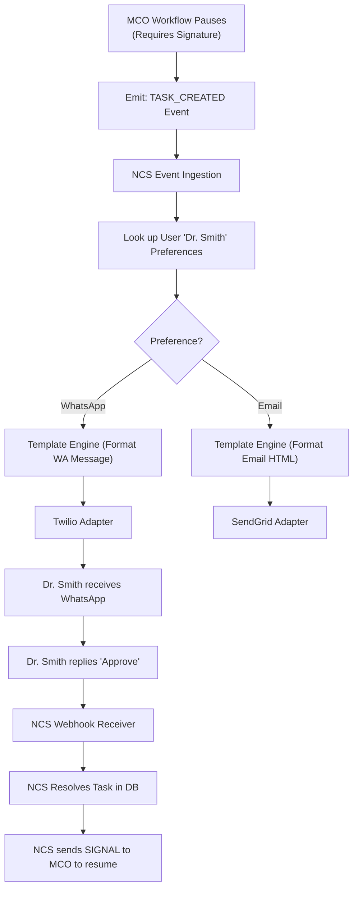
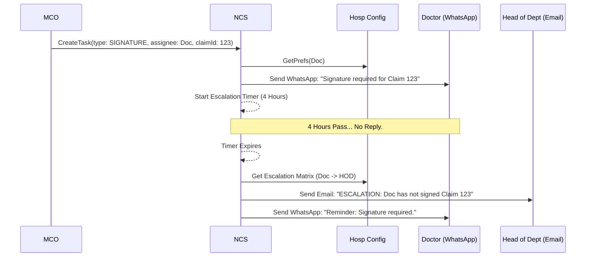

# Notification & Collaboration Service — Architectural Specification

This document presents the complete production-grade architecture, workflows, schemas, and API contracts for Aivana's **Notification & Collaboration Service (NCS)**.

---

## 1. Purpose
The Notification & Collaboration Service (NCS) centralizes all human-in-the-loop interactions, alerts, and team communications across the Aivana platform. In a busy hospital, billing clerks, medical directors, and front-desk staff need to collaborate on complex claims. Rather than hardcoding email or SMS logic into Fairway or Aegis, NCS acts as a universal router. It handles omnichannel delivery (WhatsApp, SMS, Push, Email), manages task assignments (e.g., "Doctor X must sign this appeal"), resolves `@mentions` in claim comments, and enforces escalation policies if tasks are ignored.

## 2. Responsibilities
- **Omnichannel Routing**: Deliver messages via the user's preferred channel (WhatsApp, Email, SMS, In-App).
- **Task Management**: Create, assign, track, and resolve claim-related tasks.
- **Collaboration**: Host a centralized comment thread for every claim, supporting `@mentions` and internal notes.
- **Escalation**: Automatically escalate tasks (e.g., if a doctor ignores a signature request for 4 hours, notify the HOD).
- **Template Management**: Store localized, templated messages with dynamic variables (e.g., `"Claim {{claimId}} was denied. Action required."`).
- **Webhook Processing**: Handle inbound replies (e.g., a doctor replying "APPROVED" via WhatsApp).

## 3. Non-Responsibilities
- **Does NOT** pause or advance the actual claim workflow (MCO does this based on signals).
- **Does NOT** manage user authentication or RBAC roles (IAM/Hospital Config Service handles this).
- **Does NOT** determine *if* a claim is missing a signature (Fairway/Taiga determine this).

---

## 4. Inputs
- **Platform Events**: Kafka events emitted by MCO, DAS, Aegis, etc. (e.g., `MCO_WORKFLOW_SUSPENDED_WAITING_HUMAN`).
- **User Actions**: UI interactions (creating a task, adding a comment, resolving an alert).
- **External Webhooks**: Twilio/WhatsApp API callbacks for delivery receipts and inbound replies.

## 5. Outputs
- **Outbound Messages**: API calls to Twilio (SMS/WhatsApp), SendGrid (Email), or FCM (Push).
- **In-App Notifications**: WebSocket pushes to the Aivana React frontend.
- **Workflow Signals**: API calls back to MCO (e.g., translating a WhatsApp "YES" reply into a `HUMAN_APPROVAL` signal).

## 6. Dependencies
- **Hospital Configuration Service**: To look up user contact details, notification preferences, and escalation matrices.
- **Master Claim Orchestrator (MCO)**: To signal that a task has been completed.
- **Third-Party Gateways**: Twilio, SendGrid, Firebase Cloud Messaging.

---

## 7. Position Inside Overall Pipeline

```
  [Aegis]   [Taiga]   [MCO]
     │         │        │
     └─────────┼────────┘
               ▼ (Emits "Need Human" Event)
 ╔═════════════════════════════════════════════════════╗
 ║      Notification & Collaboration Service (NCS)     ║
 ║  (Routes alerts, assigns tasks, manages comments)   ║
 ╚═════════════════════════════════════════════════════╝
       │                │                 │
       ▼                ▼                 ▼
   [In-App UI]     [WhatsApp]          [Email]
  (Task Inbox)    (Quick Reply)     (Daily Digest)
```

---

## 8. ASCII Architecture Diagram

```
                 +---------------------------------------------+
                 |       Event Bus (Internal Services)         |
                 +----------------------+----------------------+
                                        |
                                        v
                 +----------------------+----------------------+
                 |          NCS Event Ingestion API            |
                 +----+-----------------+------------------+---+
                      |                 |                  |
                      v                 v                  v
             +--------+--------+ +------+-------+ +--------+--------+
             | Template Engine | | Task & Thread| | Escalation      |
             | (Localization)  | | Manager (DB) | | Timer Worker    |
             +--------+--------+ +------+-------+ +--------+--------+
                      |                 |                  |
                      +-----------------+------------------+
                                        | (Dispatch)
                                        v
                 +----------------------+----------------------+
                 |            Channel Router (Pub/Sub)         |
                 +----+-----------------+------------------+---+
                      |                 |                  |
                      v                 v                  v
             +--------+--------+ +------+-------+ +--------+--------+
             | In-App Socket   | | SMS/WhatsApp | | Email Adapter   |
             | (WebSockets)    | | (Twilio)     | | (SendGrid)      |
             +-----------------+ +--------------+ +-----------------+
```

---

## 9. Mermaid Workflow



---

## 10. Sequence Diagram (Escalation Scenario)



---

## 11. State Machine (Task Lifecycle)

```
   [CREATED]
     │
     ├── (Assigned to User)
     ▼
  [PENDING] <──────┐
     │             │ (Escalated/Reassigned)
     ├── (Ignored) ┘
     │
     ├── (Action Taken)
     ▼
  [RESOLVED] ───> (Signal sent to MCO)
```

---

## 12. Components

1. **Event Ingestion API**: Consumes REST or Kafka events from internal services requesting notifications.
2. **Template Engine**: Resolves variables (e.g., `{{patient.name}}`) and supports i18n localization.
3. **Task & Thread Manager**: Stores the relational state of tasks, comments, and mentions in Postgres.
4. **Channel Router**: Decides which physical adapter to invoke based on user preferences.
5. **Escalation Worker**: A cron/timer-based scheduler that sweeps the DB for `PENDING` tasks that have breached their SLAs.
6. **Inbound Webhook Receiver**: Parses webhooks from Twilio (SMS/WhatsApp) to map replies back to the original task context.

---

## 13. Internal Processing Pipeline

1. **Ingest Request**: e.g., "Notify Billing Group that Aegis Appeal is ready for review."
2. **Resolve Targets**: Map "Billing Group" to a list of specific user IDs via the Config Service.
3. **Check Preferences**: User A wants In-App only. User B wants In-App + Email.
4. **Format & Dispatch**: Generate the payloads and push to the respective channel adapters.

---

## 14. Parallel Execution Opportunities
- **Fan-out Dispatch**: Sending an urgent "TPA Portal Down" alert to 500 hospital users is fanned out across multiple Celery/Node worker threads concurrently.

---

## 15. Deterministic vs AI Table

| Task | Methodology | Rationale |
| :--- | :--- | :--- |
| **Routing & Preferences** | Deterministic | Strict adherence to user configuration. |
| **Escalation Timers** | Deterministic | Hard SLAs based on hospital policy. |
| **Smart Replies (Future)** | AI Assisted | Suggesting quick replies to users in the UI based on the claim context. |
| **Tone Normalization (Future)** | AI Assisted | Rewriting aggressive inter-departmental comments into professional tones. |

---

## 16. Latency Budget

- **In-App WebSocket Push**: < 100ms.
- **External API Dispatch (Email/WA)**: < 1000ms.
- **Overall Async Latency**: Not critical (human response times are measured in minutes/hours).

---

## 17. Scaling Strategy
- **Stateless Adapters**: The Twilio/SendGrid adapters are stateless and can scale horizontally.
- **WebSocket Cluster**: Uses Redis Pub/Sub to sync WebSocket connections across multiple Node.js instances (Socket.io/WS), ensuring a user receives the notification regardless of which pod they are connected to.

---

## 18. Caching Strategy
- User notification preferences and escalation matrices are heavily cached in Redis, as they rarely change but are queried on every single notification dispatch.

---

## 19. Retry Strategy
- If SendGrid is down, NCS uses an exponential backoff queue for email dispatch (up to 24 hours).
- If an In-App WebSocket fails to deliver (user went offline), the notification is persisted in the DB as `unread = true` for when they log back in.

---

## 20. Failure Handling
- **Channel Fallback**: If a WhatsApp message fails to deliver (e.g., number invalid), NCS automatically falls back to Email, then to SMS, ensuring critical alerts are not lost.

---

## 21. Event Model
- Consumes: Any internal event requiring human attention.
- Emits: `TASK_RESOLVED` (Usually consumed by MCO).

---

## 22. API Contracts

### Create Task / Notification (Internal)
```
POST /v1/ncs/tasks
Content-Type: application/json

{
  "claimId": "clm-123",
  "taskType": "APPROVAL_REQUIRED",
  "assigneeType": "ROLE",
  "assigneeId": "MEDICAL_DIRECTOR",
  "priority": "HIGH",
  "templateId": "tmpl_appeal_ready",
  "variables": { "appealId": "ap-99" }
}
```

### Post Comment (Frontend)
```
POST /v1/ncs/claims/clm-123/comments
Content-Type: application/json

{
  "authorId": "usr-88",
  "text": "I checked the records, @dr_smith please review the ECG.",
  "mentions": ["dr_smith"]
}
```

---

## 23. JSON Schemas

### Task Object
```json
{
  "$schema": "http://json-schema.org/draft-07/schema#",
  "title": "NcsTask",
  "type": "object",
  "properties": {
    "taskId": { "type": "string" },
    "claimId": { "type": "string" },
    "status": { "enum": ["PENDING", "RESOLVED", "ESCALATED", "CANCELLED"] },
    "assigneeId": { "type": "string" },
    "dueDate": { "type": "string", "format": "date-time" },
    "escalationLevel": { "type": "integer" }
  },
  "required": ["taskId", "claimId", "status", "assigneeId"]
}
```

---

## 24. Database Schema

```sql
CREATE SCHEMA ncs_service;

CREATE TABLE ncs_service.tasks (
    task_id VARCHAR(64) PRIMARY KEY,
    claim_id VARCHAR(64) NOT NULL,
    assignee_id VARCHAR(64) NOT NULL,
    status VARCHAR(32) NOT NULL,
    due_date TIMESTAMP WITH TIME ZONE,
    escalation_level INT DEFAULT 0
);

CREATE TABLE ncs_service.comments (
    comment_id VARCHAR(64) PRIMARY KEY,
    claim_id VARCHAR(64) NOT NULL,
    author_id VARCHAR(64) NOT NULL,
    comment_text TEXT NOT NULL,
    created_at TIMESTAMP WITH TIME ZONE DEFAULT CURRENT_TIMESTAMP
);

CREATE TABLE ncs_service.comment_mentions (
    comment_id VARCHAR(64) REFERENCES ncs_service.comments(comment_id),
    mentioned_user_id VARCHAR(64) NOT NULL,
    is_read BOOLEAN DEFAULT FALSE
);
```

---

## 25. Audit Model
NCS logs all external dispatch receipts (e.g., Twilio Message SID) and timestamped user read-receipts. If a hospital claims "We were never notified of the TPA query," NCS can prove exactly when the SMS was delivered and when the user read the In-App alert.

## 26. Lineage Model
Every comment and task is strictly bound to a `claimId`. When a claim is archived, its entire conversation thread and task history are archived with it, providing a complete narrative of hospital collaboration.

## 27. Metrics
- **Task Resolution Time**: Average time from Task Creation to Resolution (segmented by hospital/ward).
- **Escalation Rate**: Percentage of tasks that breach their SLA and trigger an escalation.
- **Channel Delivery Success**: % of WhatsApp/SMS messages successfully delivered.

## 28. Benchmark Targets
- Sub-100ms WebSocket delivery for live collaborative editing/commenting.
- Handle 5,000 concurrent WebSocket connections per hospital pod.

---

## 29. Security Model
- **No PHI in External Channels**: To comply with HIPAA/NDHM, external SMS or WhatsApp messages *never* contain patient names. They use secure templates: "You have an urgent task for Claim #1234. Click here to view in secure portal."

## 30. Hospital Customization
Highly customizable via the Hospital Config Service. Hospitals can define: "Do not send SMS between 10 PM and 6 AM unless Priority = CRITICAL."

## 31. AKS Integration
Not directly integrated with AKS, but tasks often reference AKS rules (e.g., "Task: Address violation of AKS Rule 4.1").

## 32. Future Extensibility
- **Smart Routing**: If NCS detects a user is currently active on the Web App (WebSocket is connected), it suppresses the Email/SMS notification to reduce channel noise and save Twilio costs.

## 33. Production Deployment
Node.js (for high-concurrency WebSockets and async I/O). Redis for Pub/Sub. PostgreSQL for task storage.

## 34. Testing Strategy
- **Mock Adapters**: In non-production environments, the Twilio/SendGrid adapters are replaced with mock adapters that write payloads to standard out, preventing accidental spam during testing.

## 35. Versioning
Notification templates are versioned in the database. If a hospital updates their SMS template, active workflows automatically pick up the new template on the next dispatch.

---

## 36. Example Outputs (Webhook Reply Processing)

```json
{
  "event": "INBOUND_WHATSAPP_REPLY",
  "from": "+919876543210",
  "messageText": "APPROVE",
  "context": {
    "resolvedTaskId": "task-881",
    "claimId": "clm-123",
    "actionTaken": "Triggered MCO Resume Signal"
  }
}
```

---

## 37. Explainability Strategy
Every task in the UI clearly states *why* it was created. E.g., "Created by MCO because Taiga detected a Room Rent violation requiring Medical Director override."

## 38. Human Review Rules
NCS is the system designed specifically *to enable* human review. It is the bridge between the autonomous AI and the human operators.

## 39. Technology Stack
- **API/WebSockets**: Node.js, Socket.io.
- **Messaging**: Kafka (Internal), Redis (Socket Pub/Sub).
- **Database**: PostgreSQL.

## 40. Open-source Dependencies
- `handlebars` for complex string template interpolation.
- `socket.io` for resilient real-time bidirectional event-based communication.

---

*End of Document*
