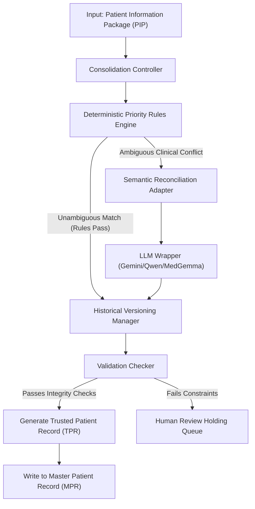
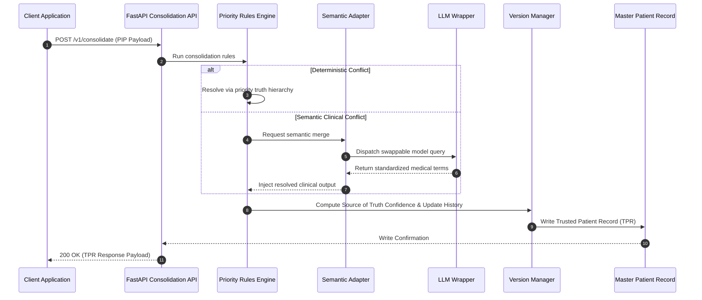

# Patient Consolidation Service Architectural Specification

This document defines the production-grade architecture, component interfaces, pipelines, and data contracts for Aivana's **Patient Consolidation Service**.

---

## 1. System Ingestion & Consolidation Architecture

The Patient Consolidation Service takes a **Patient Information Package (PIP)** containing multiple, possibly conflicting, values extracted from different documents, and generates a unified, authoritative **Trusted Patient Record (TPR)**.

```
┌────────────────────────────────────────────────────────────────────────┐
│                   Patient Information Package (PIP)                    │
└───────────────────────────────────┬────────────────────────────────────┘
                                    │
                                    ▼
┌────────────────────────────────────────────────────────────────────────┐
│                     Patient Consolidation Service                      │
│                                                                        │
│         ┌────────────────────────────────────────────────────┐         │
│         │               Consolidation Controller             │         │
│         └──────────┬──────────────────────────────┬──────────┘         │
│                    │                              │                    │
│                    ▼                              ▼                    │
│         ┌────────────────────┐          ┌────────────────────┐         │
│         │      Priority      │          │ Semantic Reconcil. │         │
│         │   Rules Engine     │          │      Adapter       │         │
│         └──────────┬─────────┘          └─────────┬──────────┘         │
│                    │                              │                    │
│                    │                              ▼                    │
│                    │                    ┌────────────────────┐         │
│                    │                    │  LLM Wrapper (Core)│         │
│                    │                    └─────────┬──────────┘         │
│                    │                              │                    │
│                    └──────────────┬───────────────┘                    │
│                                   │                                    │
│                                   ▼                                    │
│         ┌────────────────────────────────────────────────────┐         │
│         │            Historical Versioning Manager           │         │
│         └─────────────────────────┬──────────────────────────┘         │
│                                   │                                    │
│                                   ▼                                    │
│         ┌────────────────────────────────────────────────────┐         │
│         │            Validation & Integrity Checker          │         │
│         └─────────────────────────┬──────────────────────────┘         │
└───────────────────────────────────┼────────────────────────────────────┘
                                    │
                                    ▼
┌────────────────────────────────────────────────────────────────────────┐
│                    Trusted Patient Record (TPR)                        │
└───────────────────────────────────┬────────────────────────────────────┘
                                    │
                                    ▼
┌────────────────────────────────────────────────────────────────────────┐
│             Master Patient Record Database (Persistence)               │
└────────────────────────────────────────────────────────────────────────┘
```

---

## 2. Mermaid Workflows

### 2.1 General Consolidation Pipeline



### 2.2 Sequence Diagram



---

## 3. Strict Field-Level AI Allowlist Matrix

To prevent hallucinations on critical identifiers and dates, AI models are strictly forbidden from participating in demographic, billing, or financial resolutions:

| Field Group | Target Fields | AI Allowed? | Resolution Method |
| :--- | :--- | :---: | :--- |
| **Identifiers** | Policy Number, Member ID, UHID, Aadhaar, PAN, Claim Number | ❌ | **Deterministic-Only** (Priority Hierarchies + Regex check) |
| **Dates** | Admission Date, Discharge Date, DOB, Surgery Date | ❌ | **Deterministic-Only** (Date Priority checks) |
| **Financials** | Sum Insured, Room Category Capping, Bill Amounts | ❌ | **Deterministic-Only** (Arithmetic capping verification) |
| **Clinical** | Primary Diagnosis, Secondary Diagnosis, Co-morbidities | ✅ | **Hybrid** (Rules mapping + Semantic Adapter normalization) |
| **Treatment** | Planned Procedure, Medication Names, Implants Used | ✅ | **Hybrid** (Rules matching + LLM medical code lookup) |

---

## 4. Source of Truth Confidence Calculation

To ensure down-stream validation engines (**Fairway**, **Taiga**) know the reliability of each consolidated field, the service calculates a weighted **Source of Truth Confidence**:

$$\text{Source of Truth Confidence} = \text{Extraction Confidence} \times \text{Document Trust Score} \times \text{Priority Score}$$

### Weights Matrix Definitions:
1.  **Extraction Confidence**: The raw OCR/LLM confidence value extracted in the PIP.
2.  **Document Trust Score**:
    *   *Government IDs (Aadhaar/PAN)*: `1.0`
    *   *Insurance Cards / Approval Letters*: `0.95`
    *   *Admission Forms / Discharge Summaries*: `0.85`
    *   *Nursing Logs / Progress Notes*: `0.70`
3.  **Priority Score**: Matches the Truth Hierarchy level:
    *   *Priority 1 (Primary)*: `1.0`
    *   *Priority 2*: `0.90`
    *   *Priority 3*: `0.80`
    *   *Priority 4*: `0.70`

---

## 5. API Contracts & JSON Schemas

### 5.1 API Consolidation Endpoint
*   **Endpoint**: `POST /v1/consolidate`
*   **Request Schema**: Consumes a standard PIP.

### 5.2 Trusted Patient Record (TPR) Schema
This schema represents the single authoritative record written in the Master Patient Record:

```json
{
  "$schema": "http://json-schema.org/draft-07/schema#",
  "title": "TrustedPatientRecord",
  "type": "object",
  "properties": {
    "caseId": { "type": "string" },
    "tprVersion": { "type": "integer" },
    "lastUpdatedAt": { "type": "string" },
    "consolidatedFields": {
      "type": "object",
      "properties": {
        "patientName": { "$ref": "#/definitions/trustedField" },
        "policyNumber": { "$ref": "#/definitions/trustedField" },
        "primaryDiagnosis": { "$ref": "#/definitions/trustedField" }
      },
      "required": ["patientName", "policyNumber", "primaryDiagnosis"]
    },
    "auditHistory": {
      "type": "array",
      "items": { "$ref": "#/definitions/auditEntry" }
    }
  },
  "required": ["caseId", "tprVersion", "lastUpdatedAt", "consolidatedFields", "auditHistory"],
  "definitions": {
    "trustedField": {
      "type": "object",
      "properties": {
        "activeValue": { "type": "string" },
        "sourceOfTruthConfidence": { "type": "number" },
        "provenance": {
          "type": "object",
          "properties": {
            "documentId": { "type": "string" },
            "documentClass": { "type": "string" },
            "pageNumber": { "type": "integer" },
            "blockId": { "type": "string" }
          },
          "required": ["documentId", "documentClass", "pageNumber", "blockId"]
        },
        "rejectedValues": {
          "type": "array",
          "items": {
            "type": "object",
            "properties": {
              "value": { "type": "string" },
              "sourceDocument": { "type": "string" },
              "confidence": { "type": "number" },
              "rejectionReason": { "type": "string" }
            },
            "required": ["value", "sourceDocument", "confidence", "rejectionReason"]
          }
        }
      },
      "required": ["activeValue", "sourceOfTruthConfidence", "provenance", "rejectedValues"]
    },
    "auditEntry": {
      "type": "object",
      "properties": {
        "timestamp": { "type": "string" },
        "operator": { "type": "string" },
        "action": { "type": "string" },
        "fieldChanged": { "type": "string" },
        "oldValue": { "type": "string" },
        "newValue": { "type": "string" },
        "reason": { "type": "string" }
      },
      "required": ["timestamp", "operator", "action", "fieldChanged", "oldValue", "newValue"]
    }
  }
}
```

---

## 6. Latency Budget Limits
To reflect realistic operational pipelines parsing 20-50 fields across multiple document versions, the latency budget is allocated as follows:

| Metric | Target | Description |
| :--- | :---: | :--- |
| **Average Latency** | **< 1.0 second** | Standard execution path with deterministic priority checks and minimal updates. |
| **P95 Latency** | **< 2.0 seconds** | Includes database reads for audit log generation and semantic normalizations. |
| **Worst-case Latency** | **< 3.0 seconds** | High-concurrency operations involving multi-page billing corrections and version rollbacks. |
