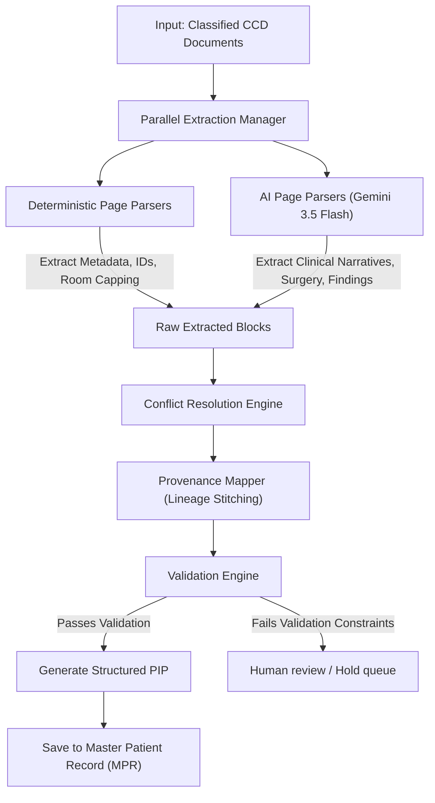
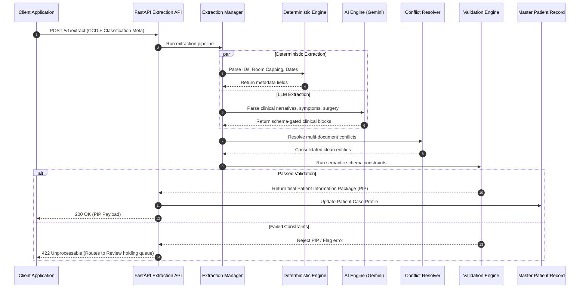

# Patient Information Extraction Service Architectural Specification

This document defines the production-grade architecture, component interfaces, pipelines, and data contracts for Aivana's **Patient Information Extraction Service**. 

---

## 1. Component Architecture & Ingestion Pipeline

The Patient Information Extraction Service is designed to extract structured healthcare data from a classified **Canonical Clinical Document (CCD)** and produce a validated **Patient Information Package (PIP)**.

```
┌────────────────────────────────────────────────────────────────────────┐
│                      Canonical Clinical Document (CCD)                 │
└───────────────────────────────────┬────────────────────────────────────┘
                                    │
                                    ▼
┌────────────────────────────────────────────────────────────────────────┐
│                Patient Information Extraction Service                  │
│                                                                        │
│         ┌────────────────────────────────────────────────────┐         │
│         │             Parallel Extraction Manager            │         │
│         └──────────┬──────────────────────────────┬──────────┘         │
│                    │                              │                    │
│                    ▼                              ▼                    │
│         ┌────────────────────┐          ┌────────────────────┐         │
│         │   Deterministic    │          │    AI Extraction   │         │
│         │   Parser Engine    │          │    Engine (LLM)    │         │
│         └──────────┬─────────┘          └─────────┬──────────┘         │
│                    │                              │                    │
│                    └──────────────┬───────────────┘                    │
│                                   │                                    │
│                                   ▼                                    │
│         ┌────────────────────────────────────────────────────┐         │
│         │             Conflict Resolution Engine             │         │
│         └─────────────────────────┬──────────────────────────┘         │
│                                   │                                    │
│                                   ▼                                    │
│         ┌────────────────────────────────────────────────────┐         │
│         │             Provenance & Lineage Mapper            │         │
│         └─────────────────────────┬──────────────────────────┘         │
│                                   │                                    │
│                                   ▼                                    │
│         ┌────────────────────────────────────────────────────┐         │
│         │                 Validation Engine                  │         │
│         └─────────────────────────┬──────────────────────────┘         │
└───────────────────────────────────┼────────────────────────────────────┘
                                    │
                                    ▼
┌────────────────────────────────────────────────────────────────────────┐
│                   Patient Information Package (PIP)                    │
└───────────────────────────────────┬────────────────────────────────────┘
                                    │
                                    ▼
┌────────────────────────────────────────────────────────────────────────┐
│                     Master Patient Record (Dexie)                      │
└────────────────────────────────────────────────────────────────────────┘
```

---

## 2. Mermaid Workflows

### 2.1 Extraction and Conflict Resolution Pipeline



### 2.2 Sequence Diagram



---

## 3. Component Responsibilities

### 3.1 Parallel Extraction Manager
*   **Role**: Spawns concurrent extraction workers for each classified document type inside the CCD bundle.
*   **Scale**: Parallelizes execution per document class (e.g. parsing the Insurance Card in parallel with the Discharge Summary).

### 3.2 Deterministic Parser Engine
*   **Role**: Extracts structured values using regular expressions and layout anchors.
*   **Target Fields**: Patient DOB, Policy Numbers, Sum Insured, Room Category Limits, Dates (Admission/Discharge), Aadhaar/PAN IDs.

### 3.3 AI Extraction Engine (LLM Fallback)
*   **Role**: Translates unstructured paragraphs into schema-gated objects.
*   **Target Fields**: Chief complaints, clinical histories, comorbidities, surgery summaries, laboratory outcomes.

### 3.4 Conflict Resolution Engine
*   **Role**: Resolves conflicting values extracted across multiple documents using a strict document-hierarchy priority matrix (e.g. verifying patient age mismatch between Aadhaar and Admission Form).

### 3.5 Provenance & Lineage Mapper
*   **Role**: Maps every extracted attribute to its precise source location in the document layout coordinates.

---

## 4. API Contracts & JSON Schemas

### 4.1 API Extraction Endpoint
*   **Endpoint**: `POST /v1/extract`
*   **Request Payload**: Consumes a classified Canonical Clinical Document (CCD).

### 4.2 Patient Information Package (PIP) Schema
This schema defines the output persisted to the **Master Patient Record**:

```json
{
  "$schema": "http://json-schema.org/draft-07/schema#",
  "title": "PatientInformationPackage",
  "type": "object",
  "properties": {
    "caseId": { "type": "string" },
    "patient": {
      "type": "object",
      "properties": {
        "name": { "$ref": "#/definitions/provenanceFieldString" },
        "age": { "$ref": "#/definitions/provenanceFieldNumber" },
        "gender": { "$ref": "#/definitions/provenanceFieldString" },
        "dob": { "$ref": "#/definitions/provenanceFieldString" },
        "uhid": { "$ref": "#/definitions/provenanceFieldString" }
      },
      "required": ["name", "age", "gender"]
    },
    "insurance": {
      "type": "object",
      "properties": {
        "insurerName": { "$ref": "#/definitions/provenanceFieldString" },
        "tpa": { "$ref": "#/definitions/provenanceFieldString" },
        "policyNumber": { "$ref": "#/definitions/provenanceFieldString" },
        "sumInsured": { "$ref": "#/definitions/provenanceFieldNumber" }
      },
      "required": ["insurerName", "policyNumber", "sumInsured"]
    },
    "clinical": {
      "type": "object",
      "properties": {
        "diagnosis": { "$ref": "#/definitions/provenanceFieldString" },
        "comorbidities": {
          "type": "array",
          "items": { "$ref": "#/definitions/provenanceFieldString" }
        },
        "chiefComplaint": { "$ref": "#/definitions/provenanceFieldString" }
      },
      "required": ["diagnosis"]
    }
  },
  "required": ["caseId", "patient", "insurance", "clinical"],
  "definitions": {
    "provenanceFieldString": {
      "type": "object",
      "properties": {
        "value": { "type": "string" },
        "confidence": { "type": "number" },
        "provenance": { "$ref": "#/definitions/provenanceLineage" }
      },
      "required": ["value", "confidence", "provenance"]
    },
    "provenanceFieldNumber": {
      "type": "object",
      "properties": {
        "value": { "type": "number" },
        "confidence": { "type": "number" },
        "provenance": { "$ref": "#/definitions/provenanceLineage" }
      },
      "required": ["value", "confidence", "provenance"]
    },
    "provenanceLineage": {
      "type": "object",
      "properties": {
        "documentId": { "type": "string" },
        "documentClass": { "type": "string" },
        "pageId": { "type": "string" },
        "blockId": { "type": "string" },
        "boundingBox": {
          "type": "array",
          "items": { "type": "number" },
          "minItems": 4,
          "maxItems": 4
        }
      },
      "required": ["documentId", "documentClass", "pageId", "blockId", "boundingBox"]
    }
  }
}
```

---

## 5. Conflict Resolution Priority Matrix

When conflicting data exists for the same attribute across different documents, the conflict resolution engine resolves them using this priority matrix:

| Field Group | Priority 1 (Highest) | Priority 2 | Priority 3 (Lowest) | Reason |
| :--- | :--- | :--- | :--- | :--- |
| **Demographics** (Name, DOB) | Govt ID (Aadhaar/PAN) | Insurance Card | Admission Note | Govt IDs are the absolute legal source of truth. |
| **Policy Details** (Policy No) | Insurance Card | Govt ID / PAN | Admission Note | Insurance Cards carry the precise active policy number. |
| **Admission Details** (Date/Room) | Admission Note | OT / Progress Notes | Discharge Summary | Admission notes capture the direct check-in transaction. |
| **Diagnosis & Surgery** | Discharge Summary | OT Note | Progress Notes | Discharge summaries carry the finalized clinical evaluation. |
| **ICU Stay Duration** | ICU Vitals Log | Progress Notes | Discharge Summary | Logs record real-time monitoring check-ins/check-outs. |

---

## 6. Operation Management & Resiliency

### 6.1 Latency Budget (Target: 30-Page Document Bundle)
*   **Total Budget**: **1500ms**
*   **Segment Allocation**:
    *   *FastAPI Payload Parsing*: **50ms**
    *   *Deterministic Extraction Engine*: **150ms** (runs regex scripts concurrently)
    *   *AI Extraction Engine*: **1100ms** (runs parallel model queries per document block)
    *   *Conflict Resolution Engine*: **100ms**
    *   *Validation Constraints Check*: **50ms**
    *   *Master Patient Record Update*: **50ms**

### 6.2 Retry & Failure Policy
*   **Timeout Threshold**: Hard timeout set to **3000ms**.
*   **Retry Logic**:
    *   AI endpoint failures (e.g. Gemini quota limits): 3 retries using **Exponential Backoff** (`base = 100ms`, `multiplier = 1.5`).
    *   In the event of persistent model extraction failures, the field is set to `null` and flagged as `EXTRACTION_FAILED` in the pipeline trace.
*   **Human holding queue**: PIP packages failing validation constraints (e.g., missing mandatory insurance numbers or diagnosis) are routed to the review dashboard holding queue.

### 6.3 Audit Logging Schema
Every extraction transaction is logged for auditability:

```json
{
  "timestamp": "2026-07-13T21:56:00Z",
  "caseId": "CASE-24936",
  "documentId": "DOC-a89f21",
  "operator": "AI_EXTRACTION_SERVICE",
  "performance": {
    "latencyMs": 1120,
    "success": true
  },
  "conflictsResolved": [
    {
      "field": "patient.dob",
      "chosenValue": "1990-05-15",
      "chosenSource": "Govt ID (Aadhaar)",
      "rejectedValue": "1990-08-20",
      "rejectedSource": "Admission Note"
    }
  ]
}
```
