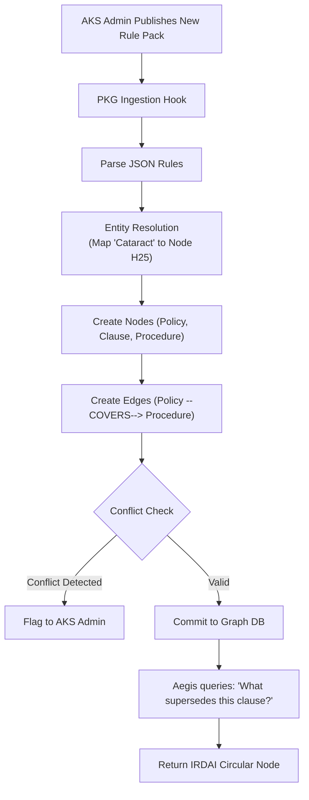
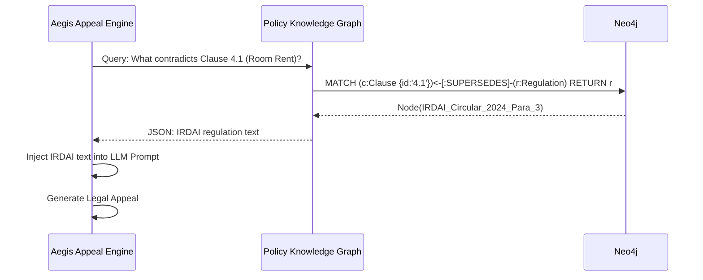

# Policy Knowledge Graph (PKG) — Architectural Specification

This document presents the complete production-grade architecture, workflows, schemas, and API contracts for Aivana's **Policy Knowledge Graph (PKG)**.

---

## 1. Purpose
Historically, Aivana's Knowledge Studio (AKS) operated as a flat repository of rules (JSON arrays of `if/then` conditions). As the platform expands, this flat structure limits advanced AI reasoning. The Policy Knowledge Graph (PKG) elevates AKS by translating static rules into a deeply connected semantic graph. It maps relationships between Insurer Policies, Medical Conditions (ICD-10), Procedures (CPT), Evidence, and Legal Precedents. This allows downstream models (like Aegis) to traverse relationships dynamically (e.g., finding out that an IRDAI circular *supersedes* a specific Star Health clause regarding Dengue).

## 2. Responsibilities
- **Graph Construction**: Convert flat AKS Knowledge Packs into Graph Nodes and Edges.
- **Ontology Mapping**: Maintain the core Aivana healthcare ontology (linking SNOMED, ICD-10, and CPT).
- **Semantic Queries**: Expose an API that allows Taiga/Fairway to query relationships (e.g., `Does [Procedure X] require [Evidence Y] under [Policy Z]?`).
- **Conflict Resolution**: Detect and flag contradictions in the graph (e.g., Hospital Billing Rule says ₹5000, Insurer Policy says ₹4000).
- **Reasoning Backbone**: Serve as the foundational context layer for Retrieval-Augmented Generation (RAG) prompts in the AI Gateway.

## 3. Non-Responsibilities
- **Does NOT** execute claims. It only provides the map of rules; Taiga/Fairway execute the rules against a specific claim.
- **Does NOT** ingest raw PDFs (The Ingestion Gateway does this).

---

## 4. Inputs
- **AKS Rule Packs**: Versioned JSON rule definitions.
- **Medical Ontologies**: Standardized ICD-10 and CPT code sets.
- **External Regulations**: IRDAI circulars, court judgements (ingested via DKS/AKS pipelines).

## 5. Outputs
- **Sub-Graph Payloads**: Graph paths returned in response to semantic queries.
- **Rule Resolution**: Deterministic answers to dependency questions.

## 6. Dependencies
- **Graph Database**: Neo4j, Amazon Neptune, or TigerGraph.
- **Aivana Knowledge Studio (AKS)**: The source of truth for the raw rules that populate the PKG.

---

## 7. Position Inside Overall Pipeline

```
  [IRDAI Circulars]   [AKS Knowledge Packs]   [ICD/CPT Ontologies]
          │                    │                     │
          └────────────────────┼─────────────────────┘
                               ▼
 ╔═════════════════════════════════════════════════════╗
 ║             Policy Knowledge Graph (PKG)            ║
 ║  (Nodes: Policy, Clause, Disease, Procedure, ICD)   ║
 ║  (Edges: requires, covers, supersedes, excludes)    ║
 ╚═════════════════════════════════════════════════════╝
          │                    │                     │
          ▼                    ▼                     ▼
 [Fairway (Queries        [Taiga (Queries        [Aegis (Traverses
  Medical Necessity)]      Financial Caps)]       for Appeals)]
```

---

## 8. ASCII Architecture Diagram

```
                 +---------------------------------------------+
                 |          AKS Pack Ingestion Hook            |
                 +----------------------+----------------------+
                                        |
                                        v
                 +----------------------+----------------------+
                 |      Ontology & Entity Resolution Engine    |
                 | (Maps string "Dengue" to Node "ICD-A90")    |
                 +----+-----------------+------------------+---+
                      |                 |                  |
                      v                 v                  v
             +--------+--------+ +------+-------+ +--------+--------+
             | Node Builder    | | Edge Builder | | Conflict Check  |
             +--------+--------+ +------+-------+ +--------+--------+
                      |                 |                  |
                      +-----------------+------------------+
                                        |
                                        v
                 +----------------------+----------------------+
                 |        Policy Graph Database (Neo4j)        |
                 +----------------------+----------------------+
                                        |
                                        v
                 +----------------------+----------------------+
                 |          Graph Query API (GraphQL)          |
                 +---------------------------------------------+
```

---

## 9. Mermaid Workflow



---

## 10. Node & Edge Ontology

### Core Nodes
- `(Policy)`: E.g., Star Health Comprehensive.
- `(Clause)`: E.g., Section 4.1 Room Rent.
- `(Disease)`: E.g., Dengue Fever.
- `(Code)`: E.g., ICD-10 A90.
- `(Procedure)`: E.g., Appendectomy.
- `(Evidence)`: E.g., ECG Report.
- `(Regulation)`: E.g., IRDAI Master Circular 2024.

### Core Edges
- `[:COVERS]`: (Policy) -> (Disease)
- `[:EXCLUDES]`: (Policy) -> (Procedure)
- `[:REQUIRES_EVIDENCE]`: (Procedure) -> (Evidence)
- `[:MAPPED_TO]`: (Disease) -> (Code)
- `[:SUPERSEDES]`: (Regulation) -> (Clause)
- `[:DEPENDS_ON]`: (Clause A) -> (Clause B)

---

## 11. Sequence Diagram (Aegis Querying PKG)



---

## 12. Components

1. **Entity Resolution Engine**: Uses exact string matching and vector embeddings to map raw text from AKS rules ("heart attack") to standard ontological nodes ("Myocardial Infarction", ICD-I21).
2. **Graph Builder**: Translates the nested JSON of an AKS rule pack into Cypher queries to insert Nodes and Edges.
3. **Conflict Detection Engine**: Runs standard Cypher algorithms to find impossible paths (e.g., A requires B, B excludes A).
4. **GraphQL API**: The interface for downstream microservices to query the graph.

---

## 13. Deterministic vs AI Table

| Task | Methodology | Rationale |
| :--- | :--- | :--- |
| **Node/Edge Creation** | Deterministic | The schema must be strictly enforced. |
| **Graph Traversal** | Deterministic | Cypher queries return mathematically exact paths. |
| **Entity Resolution (Fuzzy)**| AI Assisted | Mapping colloquial rule text to exact SNOMED/ICD codes often requires semantic vector matching. |

---

## 14. Latency Budget

- **Graph Traversal (Read)**: < 50ms.
- **Graph Compilation (Write)**: < 5 seconds (occurs rarely, only when AKS publishes a pack).

---

## 15. Scaling Strategy
- The PKG is heavily read-optimized. Because insurance policies change infrequently (yearly or quarterly), the Graph DB can be replicated across multiple read-replicas.

---

## 16. Caching Strategy
- The results of common semantic queries (e.g., `MATCH (p:Procedure {name:'Cataract'})-[:REQUIRES_EVIDENCE]->(e) RETURN e`) are cached in Redis for instantaneous retrieval by Fairway during bulk claim processing.

---

## 17. Failure Handling
- If the PKG API goes down, Taiga and Fairway can temporarily fall back to their local, flat caches of the AKS rule packs, though they will lose advanced relationship-based reasoning capabilities.

---

## 18. API Contracts

### GraphQL Semantic Query
```graphql
query GetRequirements {
  procedure(code: "CPT-66984") {
    name
    requiresEvidence(policyId: "pol-star-comp") {
      documentType
      mandatory
    }
    excludedBy(policyId: "pol-star-comp") {
      clauseText
    }
  }
}
```

---

## 19. JSON Schemas

### PKG Node Schema
```json
{
  "$schema": "http://json-schema.org/draft-07/schema#",
  "title": "PkgNode",
  "type": "object",
  "properties": {
    "nodeId": { "type": "string" },
    "labels": { "type": "array", "items": { "type": "string" } },
    "properties": {
      "type": "object",
      "properties": {
        "name": { "type": "string" },
        "code": { "type": "string" },
        "text": { "type": "string" },
        "version": { "type": "string" }
      }
    }
  }
}
```

---

## 20. Database Schema
Defined in Cypher (Neo4j).

```cypher
// Create a constraint to ensure ICD codes are unique
CREATE CONSTRAINT ON (c:ICDCode) ASSERT c.code IS UNIQUE;

// Example insertion
MERGE (d:Disease {name: "Dengue Fever"})
MERGE (c:ICDCode {code: "A90"})
MERGE (d)-[:MAPPED_TO]->(c);

MERGE (p:Policy {id: "pol-123", name: "Star Health"})
MERGE (p)-[:COVERS {waitingPeriodDays: 30}]->(d);
```

---

## 21. Audit Model
Changes to the graph are versioned. A Node property `validFrom` and `validTo` enables "temporal querying." If a claim is from 2024, the PKG ignores any Edges created in 2025.

## 22. Lineage Model
The PKG forms the baseline reality for the platform. When the Explainability Service creates its "Rule Graph," it is actually storing pointers to specific Nodes inside the PKG.

## 23. Metrics
- **Graph Density**: The average number of edges per node (indicates the maturity of the knowledge base).
- **Conflict Rate**: The number of logical contradictions flagged during AKS pack ingestion.

## 24. Security Model
- The PKG contains **no Patient Health Information (PHI)**. It is purely an ontology of rules and medical science. Therefore, it has lower data-privacy compliance overhead compared to the TPR or FCP.

## 25. Future Extensibility
**Vector Search**: By embedding the text of every Node into a vector database, the AI Gateway can perform semantic RAG queries (e.g., finding rules conceptually similar to "post-operative infection" without knowing the exact ICD code).

---

*End of Document*
