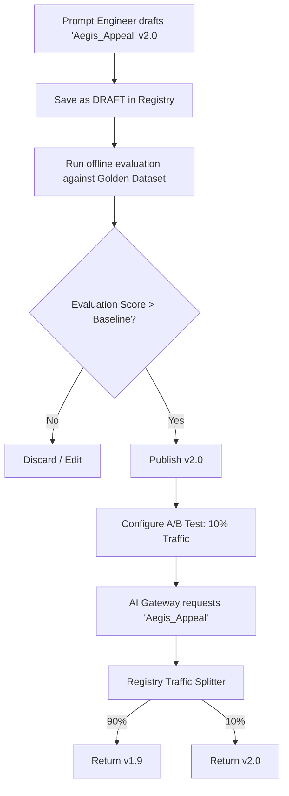
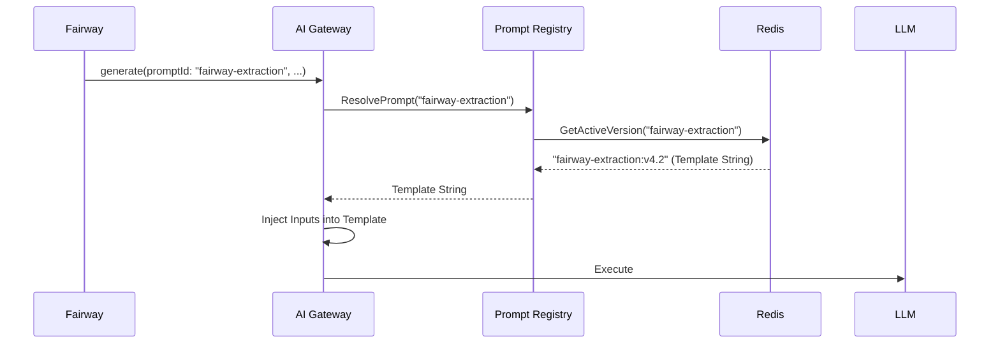

# Prompt Registry — Architectural Specification

This document presents the complete production-grade architecture, workflows, schemas, and API contracts for Aivana's **Prompt Registry**.

---

## 1. Purpose
In early iterations, system prompts (e.g., "You are an expert medical coder...") were hardcoded into the source code of Fairway, Aegis, and DAS. This created a massive bottleneck: changing a single word in a prompt required a full software deployment, PR review, and CI/CD pipeline run. The Prompt Registry decouples prompts from code. It acts as a centralized, version-controlled Content Management System (CMS) for prompts. It allows Prompt Engineers to update, A/B test, and rollback prompts instantly in production without involving backend engineers.

## 2. Responsibilities
- **Version Control**: Maintain strict semantic versioning (v1.0.0) for every prompt on the platform.
- **Rollback**: Provide instant 1-click rollbacks if a new prompt degrades AI performance.
- **Evaluation Management**: Link prompts to specific Golden Datasets and store their Evaluation Scores (e.g., "Prompt v2 achieved 95% accuracy on the Dengue Dataset").
- **Dynamic Resolution**: Serve the correct prompt text to the AI Gateway at runtime based on the requested `promptId`.
- **A/B Testing**: Support traffic splitting (e.g., "Serve v1 to 90% of requests, and v2 to 10%").

## 3. Non-Responsibilities
- **Does NOT** execute prompts (The AI Gateway does this).
- **Does NOT** define JSON output schemas (The calling service defines its expected schema).

---

## 4. Inputs
- **Prompt Authoring**: Data scientists submitting new prompt templates via the UI.
- **Evaluation Scores**: Results from offline evaluation runs.

## 5. Outputs
- **Resolved Prompt Template**: A string containing Handlebars variables (`{{patientHistory}}`) returned to the AI Gateway.

## 6. Dependencies
- **AI Gateway**: The primary consumer of the Prompt Registry.
- **Database**: PostgreSQL (for relational metadata) and Redis (for sub-millisecond retrieval).

---

## 7. Position Inside Overall Pipeline

```
  [Prompt Engineers / UI] ─────────┐
                                   │ (Publish v2.1)
                                   ▼
 ╔═════════════════════════════════════════════════════╗
 ║                  Prompt Registry                    ║
 ║  (Version Control, A/B Testing, Evaluation Scores)  ║
 ╚═════════════════════════════════════════════════════╝
                                   │
                                   ▼ (Fetch prompt: aegis-appeal-v2.1)
                          [ AI Model Gateway ]
                                   │
                                   ▼
                         [ External LLM (Gemini) ]
```

---

## 8. ASCII Architecture Diagram

```
                 +---------------------------------------------+
                 |            Prompt Admin UI / CLI            |
                 +----------------------+----------------------+
                                        |
                                        v
                 +----------------------+----------------------+
                 |         Registry Management API (REST)      |
                 +----+-----------------+------------------+---+
                      |                 |                  |
                      v                 v                  v
             +--------+--------+ +------+-------+ +--------+--------+
             | Version Manager | | A/B Traffic  | | Evaluation    |
             | (Git-like logic)| | Splitter     | | Tracker       |
             +--------+--------+ +------+-------+ +--------+--------+
                      |                 |                  |
                      +-----------------+------------------+
                                        |
                                        v
                 +----------------------+----------------------+
                 |          PostgreSQL (Source of Truth)       |
                 +----------------------+----------------------+
                                        | (Cache Warming)
                                        v
                 +----------------------+----------------------+
                 |       Redis (High-Speed Read Cache)         |
                 +----------------------+----------------------+
                                        |
                                        v
                 +----------------------+----------------------+
                 |          Resolution API (gRPC/REST)         |
                 |     (Queried by AI Gateway at Runtime)      |
                 +---------------------------------------------+
```

---

## 9. Mermaid Workflow



---

## 10. Sequence Diagram (Runtime Resolution)



---

## 11. Core Features

### Semantic Versioning
Prompts use strict `MAJOR.MINOR.PATCH` versioning:
- **PATCH (v1.0.1)**: Typo fixes. Safe to auto-upgrade.
- **MINOR (v1.1.0)**: Added new instructions (e.g., "Format dates as DD-MM-YYYY"). Safe to auto-upgrade.
- **MAJOR (v2.0.0)**: Fundamentally changed the prompt structure or required input variables. Services must explicitly opt-in to Major updates to avoid breaking their internal parsing logic.

### Variable Validation
Prompts are Handlebars templates. When a Prompt Engineer saves a prompt containing `{{diagnosis}}` and `{{labResults}}`, the Registry extracts these variable names and stores them as a required schema. If the AI Gateway tries to use this prompt but forgets to pass `labResults`, the Gateway throws an error *before* hitting the LLM.

---

## 12. Components

1. **Management API**: Used by humans to author, evaluate, and publish prompts.
2. **Resolution API**: High-throughput, low-latency endpoint used by the AI Gateway to fetch strings.
3. **Traffic Splitter**: Evaluates weighted rules (e.g., 90/10) to determine which specific version of a prompt to serve for a generic request.
4. **Lineage Tracker**: Links every prompt version to the specific GitHub commit of the Evaluation Script that approved it.

---

## 13. Deterministic vs AI Table

| Task | Methodology | Rationale |
| :--- | :--- | :--- |
| **Version Resolution** | Deterministic | Strict mathematical traffic splitting (e.g., modulo hashing on `claimId` for consistent A/B testing). |
| **Variable Extraction** | Deterministic | AST parsing of Handlebars templates. |
| **Prompt Evaluation** | AI Assisted | Uses "LLM-as-a-Judge" to evaluate if the new prompt is better than the old prompt during the offline CI phase. |

---

## 14. Latency Budget

- **Resolution (Read)**: < 5ms. (Must be virtually instantaneous, served purely from Redis).

---

## 15. Scaling Strategy
- The Resolution API is deployed as a highly replicated sidecar or microservice alongside the AI Gateway. Because read traffic is 10,000x higher than write traffic, Redis caching provides infinite scale.

---

## 16. Caching Strategy
- **Active Version Cache**: Redis holds a simple key-value map: `prompt_name -> active_template_string`. When an Admin clicks "Publish", the Management API updates PostgreSQL and immediately overwrites the Redis key, ensuring zero-downtime cache invalidation.

---

## 17. Failure Handling
- **Redis Outage**: If Redis goes down, the Resolution API falls back to PostgreSQL.
- **Total Registry Outage**: The AI Gateway maintains a small in-memory LRU cache of the most recently fetched prompts. It can continue serving traffic using slightly stale prompts if the Registry is fully offline.

---

## 18. API Contracts

### Resolve Prompt (Internal)
```
GET /v1/registry/resolve?name=aegis_appeal&claimId=clm-123
```
*Response:*
```json
{
  "version": "v2.1.0",
  "template": "You are a legal expert reviewing a denial for {{hospitalName}}...",
  "requiredVariables": ["hospitalName", "denialText", "evidence"]
}
```

---

## 19. JSON Schemas

### Prompt Entity Schema
```json
{
  "$schema": "http://json-schema.org/draft-07/schema#",
  "title": "PromptVersion",
  "type": "object",
  "properties": {
    "promptId": { "type": "string" },
    "name": { "type": "string" },
    "version": { "type": "string" },
    "status": { "enum": ["DRAFT", "ACTIVE", "DEPRECATED", "ROLLBACK"] },
    "templateText": { "type": "string" },
    "requiredVariables": { "type": "array", "items": { "type": "string" } },
    "evaluationScore": { "type": "number" },
    "authorId": { "type": "string" },
    "publishedAt": { "type": "string", "format": "date-time" }
  }
}
```

---

## 20. Database Schema

```sql
CREATE SCHEMA prompt_registry;

CREATE TABLE prompt_registry.prompts (
    prompt_name VARCHAR(128) PRIMARY KEY,
    description TEXT,
    created_at TIMESTAMP WITH TIME ZONE DEFAULT CURRENT_TIMESTAMP
);

CREATE TABLE prompt_registry.prompt_versions (
    version_id VARCHAR(64) PRIMARY KEY,
    prompt_name VARCHAR(128) REFERENCES prompt_registry.prompts(prompt_name),
    semantic_version VARCHAR(16) NOT NULL,
    template_text TEXT NOT NULL,
    status VARCHAR(32) NOT NULL,
    evaluation_score DECIMAL(5,4),
    published_by VARCHAR(64),
    published_at TIMESTAMP WITH TIME ZONE
);

CREATE TABLE prompt_registry.traffic_rules (
    prompt_name VARCHAR(128) PRIMARY KEY,
    primary_version_id VARCHAR(64),
    primary_weight INT DEFAULT 100,
    canary_version_id VARCHAR(64),
    canary_weight INT DEFAULT 0
);
```

---

## 21. Audit Model
Every change to a prompt is immutable. You cannot `UPDATE` a prompt text. You can only insert a new version. This guarantees that if we need to audit a claim from two years ago, we can retrieve the *exact* prompt text used on that day.

## 22. Lineage Model
The `version_id` of the prompt is passed to the AI Gateway, which passes it to the FCP, which stores it in the Evidence Index. Lineage is fully preserved from prompt creation to final claim submission.

## 23. Metrics
- **Prompt Iteration Velocity**: Number of new prompt versions published per week.
- **A/B Test Win Rate**: Percentage of canary prompts that graduate to primary vs. rolled back.

## 24. Security Model
- Prompt templates cannot contain PHI. The template variables (`{{patient_name}}`) are populated by the AI Gateway at runtime. The Registry only stores the raw, un-hydrated templates.

## 25. Future Extensibility
**Multi-Lingual Prompts**: If Aivana expands to the Middle East, the Registry can store `ar-AE` variants of prompts. The AI Gateway can request `ResolvePrompt("aegis_appeal", locale="ar-AE")`, and the Registry serves the Arabic-optimized prompt.

---

*End of Document*
