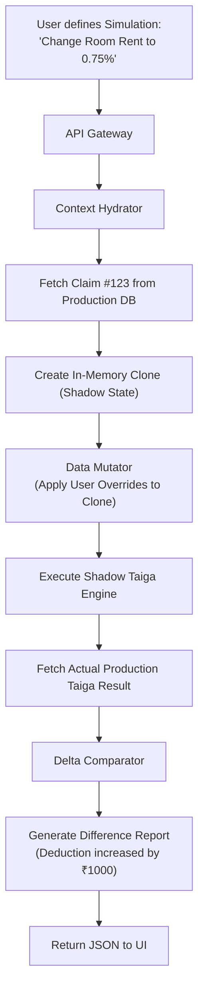
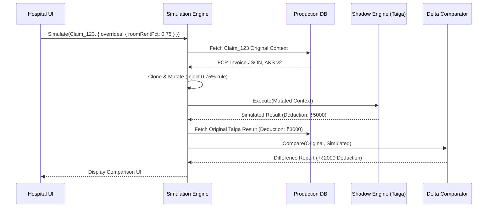

# Universal Rule Simulation Engine — Architectural Specification

This document presents the complete production-grade architecture, workflows, schemas, and API contracts for Aivana's **Universal Rule Simulation Engine**.

---

## 1. Purpose
The Universal Rule Simulation Engine (URSE) is Aivana's strategic sandbox and "what-if" analytical tool. It empowers hospitals and Aivana administrators to test hypothetical changes against actual historical or live claims without affecting production data. 
* "What happens if we reduce the Room Rent from 1% to 0.75%?"
* "What if Star Health applies a new exclusion to this package?"
* "Will this new AKS Rule prevent the denials we saw last week?"
URSE clones the context of a claim, injects the hypothetical variables, executes a shadow run of Taiga/Fairway, and outputs a detailed comparative Difference Report showing the exact financial and clinical impact.

## 2. Responsibilities
- Provide a secure, isolated sandbox execution environment for Taiga (Financial) and Fairway (Clinical).
- Hydrate shadow claims from the production data lake (FCP, TPR).
- Accept dynamic override parameters (e.g., custom rule packs, simulated diagnoses, altered bills).
- Run the simulation and capture the outputs.
- Generate a `Difference Report` comparing the simulated outcome vs. the actual production outcome (e.g., "Approval Probability: -4%, Deductions: +₹2,500").
- Support bulk simulations (e.g., run a new rule against 1,000 historical claims).

## 3. Non-Responsibilities
- **Does NOT** alter the Master Claim Orchestrator (MCO) state.
- **Does NOT** submit anything to the Submission Adapter Service (SAS).
- **Does NOT** generate official explanations or DDRs.

---

## 4. Inputs
- **Base Claim ID**: The production claim to be cloned.
- **Simulation Parameters**: The specific variables to alter (e.g., `overrideRules`, `overrideDiagnosis`, `overrideLineItems`).
- **Target Engine**: Whether to run Fairway, Taiga, or both.

## 5. Outputs
- **Simulation Result**: The raw output of the shadow engines.
- **Difference Report**: A structured comparison highlighting exactly what changed (deltas in deductions, query flags, policy violations).

## 6. Dependencies
- **Fairway / Taiga Core Libraries**: The simulation engine must execute the exact same business logic code as production.
- **Data Warehouse / TPR**: To fetch the historical context of the claim.

---

## 7. Position Inside Overall Pipeline

```
  [Hospital UI] ─────────┐ (Request "What-If" Simulation)
                         │
                         ▼
 ╔═════════════════════════════════════════════════════╗
 ║         Universal Rule Simulation Engine            ║
 ║  (Clones Claim -> Applies Overrides -> Runs Logic)  ║
 ╚═════════════════════════════════════════════════════╝
          │               │                │
          ▼               ▼                ▼
   [Shadow TPR]    [Shadow Taiga]   [Shadow Fairway]
          │               │                │
          └───────────────┼────────────────┘
                          ▼
                [ Difference Report ]
```

---

## 8. ASCII Architecture Diagram

```
                 +---------------------------------------------+
                 |       Simulation API Gateway (REST)         |
                 +----------------------+----------------------+
                                        |
                                        v
                 +----------------------+----------------------+
                 |      Context Hydrator & Cloner              |
                 | (Pulls production claim data into memory)   |
                 +----+-----------------+------------------+---+
                      |                 |                  |
                      v                 v                  v
             +--------+--------+ +------+-------+ +--------+--------+
             | Rule Injector   | | Data Mutator | | Batch Iterator    |
             | (Swaps AKS Pack)| | (Alters bill)| | (For N claims)    |
             +--------+--------+ +------+-------+ +--------+--------+
                      |                 |                  |
                      +-----------------+------------------+
                                        | (Execute Shadow Run)
                                        v
                 +----------------------+----------------------+
                 |    Serverless Execution Environment         |
                 |    (AWS Lambda / Knative Functions)         |
                 |    -> Runs Taiga/Fairway isolated           |
                 +----------------------+----------------------+
                                        |
                                        v
                 +----------------------+----------------------+
                 |       Delta Comparator & Report Gen         |
                 +---------------------------------------------+
```

---

## 9. Mermaid Workflow



---

## 10. Sequence Diagram



---

## 11. State Machine (Simulation Lifecycle)

```
   [QUEUED]
     │
     ▼
  [HYDRATING_CONTEXT] ----(Claim Not Found)----> [FAILED]
     │
     ▼
  [APPLYING_MUTATIONS]
     │
     ▼
  [EXECUTING_SHADOW_ENGINES]
     │
     ├── (Engine Crash) ──> [FAILED_SIMULATION]
     │
     └── (Success) ───────> [CALCULATING_DELTAS]
                                 │
                                 ▼
                           [REPORT_READY]
```

---

## 12. Components

1. **Context Hydrator**: Safely extracts read-only copies of the production database state (Invoices, Clinical Extractions) into an isolated memory space.
2. **Data Mutator**: A JSON-patching engine that safely overlays the user's hypothetical parameters onto the cloned state.
3. **Shadow Engine Executor**: Uses serverless functions (e.g., AWS Lambda, GCP Cloud Run) to execute the core logic libraries of Taiga/Fairway. Serverless ensures that running 1,000 bulk simulations doesn't steal compute from the production cluster.
4. **Delta Comparator**: A deep-diff utility that compares two complex JSON trees (Production vs. Simulated) and extracts the exact nodes that changed.

---

## 13. Internal Processing Pipeline

1. **Setup**: Parse the override parameters.
2. **Clone**: Deep copy the target claim.
3. **Mutate**: E.g., Change `diagnosis: "Malaria"` to `diagnosis: "Dengue"`.
4. **Run**: Invoke Taiga/Fairway.
5. **Diff**: Generate the delta.

---

## 14. Parallel Execution Opportunities
- **Bulk Simulations**: If an AKS Admin wants to test a new rule pack against 5,000 historical claims, URSE distributes this across 5,000 parallel serverless invocations, completing in seconds.

---

## 15. Deterministic vs AI Table

| Task | Methodology | Rationale |
| :--- | :--- | :--- |
| **Claim Cloning** | Deterministic | Exact JSON deep copying. |
| **Shadow Execution** | Deterministic | The underlying Taiga rules engine is mathematically deterministic. |
| **Delta Comparison** | Deterministic | Algorithmic deep-diffing. |
| **Predictive Denial** | AI Assisted | URSE can optionally call a predictive ML model to ask: "If we submit this altered claim, what is the probability of denial?" |

---

## 16. Latency Budget

- **Single Claim Simulation**: < 800ms (to enable real-time slider dragging in the UI).
- **Bulk Simulation (N=1000)**: < 15 seconds.

---

## 17. Scaling Strategy
- **Serverless Architecture**: Because simulation workloads are highly bursty (a user suddenly runs 1,000 claims, then nothing for hours), URSE leverages serverless functions for the shadow engines to scale from 0 to 1,000 instantly without permanent infrastructure costs.

---

## 18. Caching Strategy
- If the simulation parameters (Claim ID + Mutated Rule Hash) are identical to a previous run, URSE returns the cached Difference Report from Redis instantly.

---

## 19. Retry Strategy
- Standard 3-attempt retry on serverless execution timeouts. If a specific claim fails consistently due to a mutation creating invalid state, that specific simulation is marked `FAILED` without failing the entire bulk batch.

---

## 20. Failure Handling
- **Mutation Validation**: If the user's override parameters break the schema (e.g., setting Room Rent to a string `"Free"` instead of a number), the Data Mutator catches it via `zod` validation before execution and returns a 400 Bad Request.

---

## 21. Event Model
- URSE operates predominantly via synchronous REST APIs, as users are actively waiting for the result in the UI. For bulk runs, it emits `BULK_SIMULATION_COMPLETED` to Kafka.

---

## 22. API Contracts

### Run Simulation
```
POST /v1/urse/simulate
Content-Type: application/json

{
  "baseClaimId": "clm-123",
  "targetEngines": ["TAIGA"],
  "overrides": {
    "aksRules": {
      "roomRentPercentage": 0.75
    }
  }
}
```

---

## 23. JSON Schemas

### Difference Report Schema
```json
{
  "$schema": "http://json-schema.org/draft-07/schema#",
  "title": "SimulationDifferenceReport",
  "type": "object",
  "properties": {
    "simulationId": { "type": "string" },
    "baseClaimId": { "type": "string" },
    "financialDelta": {
      "type": "object",
      "properties": {
        "originalDeductions": { "type": "number" },
        "simulatedDeductions": { "type": "number" },
        "netDifference": { "type": "number" }
      }
    },
    "clinicalDelta": {
      "type": "object",
      "properties": {
        "newFlagsRaised": { "type": "array", "items": { "type": "string" } },
        "flagsResolved": { "type": "array", "items": { "type": "string" } }
      }
    },
    "deepDiff": { "type": "object", "description": "Raw JSON patch array" }
  }
}
```

---

## 24. Database Schema
Simulations are generally ephemeral. Only "Saved Scenarios" or bulk run metadata are persisted.

```sql
CREATE SCHEMA urse_service;

CREATE TABLE urse_service.saved_scenarios (
    scenario_id VARCHAR(64) PRIMARY KEY,
    name VARCHAR(128) NOT NULL,
    base_claim_id VARCHAR(64),
    override_payload JSONB NOT NULL,
    created_by VARCHAR(64) NOT NULL
);

CREATE TABLE urse_service.bulk_runs (
    run_id VARCHAR(64) PRIMARY KEY,
    scenario_id VARCHAR(64) REFERENCES urse_service.saved_scenarios(scenario_id),
    claims_processed INT NOT NULL,
    aggregate_financial_impact DECIMAL(12,2),
    completed_at TIMESTAMP WITH TIME ZONE
);
```

---

## 25. Audit Model
Any simulation that involves PHI requires an audit log entry: `User X ran a simulation on Claim Y using Parameters Z.` This prevents staff from running unauthorized scenarios on VIP patient data.

## 26. Lineage Model
Simulations are branches. A simulated output cannot be merged back into the production MCO workflow. If a user likes the simulated outcome, they must manually apply those changes to the live claim (e.g., uploading a new invoice).

## 27. Metrics
- **Simulation Count**: Number of "What-If" scenarios run by hospitals (indicates engagement).
- **Execution Latency**: Time to return a delta report.

## 28. Benchmark Targets
- Return a single-claim financial delta report in < 500ms.
- Execute 10,000 historical claims against a proposed AKS rule in < 30 seconds.

---

## 29. Security Model
- **Network Isolation**: The serverless execution environment has *no* outbound internet access and *no* write access to the production databases. It can only return the computed JSON to the caller.

## 30. Hospital Customization
Hospitals can save "Scenario Templates" (e.g., "Max Deductions Stress Test") and apply them to any claim with one click.

## 31. AKS Integration
URSE is the ultimate validation tool for AKS. Before an AKS Admin publishes a new rule pack to production, they **must** run it through URSE against the last 30 days of claims to ensure it doesn't accidentally deny 50% of legitimate submissions.

## 32. Future Extensibility
"Optimization Solver." Instead of the user providing the overrides, URSE could run a Monte Carlo simulation across thousands of rule variations to automatically find the billing configuration that maximizes the approved claim amount without violating policy.

## 33. Production Deployment
Node.js API Gateway. Knative (Kubernetes Serverless) or AWS Lambda for the ephemeral Taiga/Fairway execution engines.

## 34. Testing Strategy
- **Diff Consistency**: A test suite asserts that if URSE is given a claim with *zero* overrides, the resulting `netDifference` is mathematically guaranteed to be exactly 0.

## 35. Versioning
URSE must be capable of loading historical versions of the Taiga/Fairway logic libraries. If a hospital wants to simulate how a claim *would have been processed last year*, URSE spins up the `v1.2` container instead of the `v2.0` container.

---

## 36. Example Outputs

```json
{
  "simulationId": "sim-881",
  "baseClaimId": "clm-123",
  "financialDelta": {
    "originalDeductions": 5000,
    "simulatedDeductions": 7500,
    "netDifference": 2500
  },
  "clinicalDelta": {
    "newFlagsRaised": ["WARNING: Length of Stay exceeds standard by 1 day"],
    "flagsResolved": []
  },
  "deepDiff": {
    "taigaOutput.roomRentDeduction": { "old": 2000, "new": 4500 }
  }
}
```

---

## 37. Explainability Strategy
The UI for URSE is heavily visual. It displays a split-screen layout (Before / After). Changes are highlighted in red (negative impact) or green (positive impact), allowing the billing clerk to immediately see the consequence of their hypothetical edit.

## 38. Human Review Rules
Simulations are entirely human-driven. They are sandboxes for humans to review scenarios before committing actions in production.

## 39. Technology Stack
- **API**: Node.js / Express.
- **Compute**: AWS Lambda / GCP Cloud Functions / Knative.
- **Diff Engine**: `deep-diff` or custom JSON-patch comparison library.

## 40. Open-source Dependencies
- `fast-json-patch` for applying user mutations to the cloned claim state.
- `zod` for rigorous validation of override payloads.

---

*End of Document*
