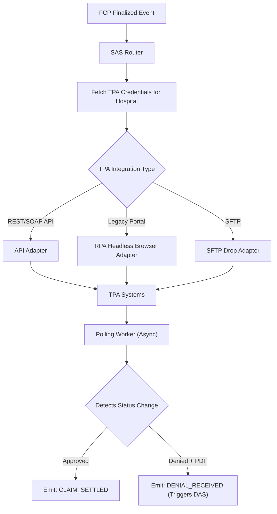
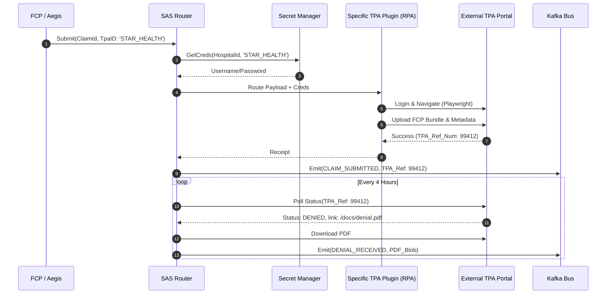

# Submission Adapter Service (SAS) — Architectural Specification

This document presents the complete production-grade architecture, workflows, schemas, and API contracts for Aivana's **Submission Adapter Service (SAS)**.

---

## 1. Purpose
The Submission Adapter Service (SAS) is the transport and connectivity layer of the Aivana platform. It decouples Aivana's internal data structures (FCP, Aegis Appeals) from the specific, chaotic, and ever-changing integration requirements of third-party insurers (TPAs). It acts as a universal driver, translating Aivana payloads into TPA-specific API calls, SFTP drops, or RPA (Robotic Process Automation) portal interactions.

## 2. Responsibilities
- Provide a standardized internal API for Aivana services (FCP, Aegis) to "Send Claim" or "Send Appeal."
- Route outbound payloads to the correct TPA-specific plugin (e.g., Star Health Adapter, Niva Bupa Adapter).
- Handle transport-level normalization (e.g., mapping Aivana's internal `documentType: DISCHARGE_SUMMARY` to the TPA's required `code: DS_01`).
- Manage authentication, tokens, and session persistence for TPA portals.
- Execute RPA scripts (via headless browsers) for TPAs that do not offer modern APIs.
- Poll TPA portals/APIs for status updates (e.g., "Approved", "Query", "Denied").
- Ingest raw TPA responses (like Denial PDFs) and route them back into Aivana (e.g., triggering DAS).

## 3. Non-Responsibilities
- **Does NOT** alter the FCP's contents or re-run clinical/financial rules (Taiga/Fairway domain).
- **Does NOT** parse denial text or determine appeal viability (DAS/Aegis domain).
- **Does NOT** define insurance policy rules (AKS domain).

---

## 4. Inputs
- **Final Claim Packet (FCP)** (From the core pipeline, ready for initial submission)
- **Aegis Appeal Package** (For submitting post-denial appeals)
- **TPA Webhooks / Poll Responses** (Incoming status updates and PDFs from the outside world)

## 5. Outputs
- **TPA Submission Receipts**: Internal standardized JSON acknowledging the TPA received the file.
- **TPA Status Events**: Emitted to the internal Kafka bus (e.g., `CLAIM_DENIED`, `QUERY_RAISED`).
- **Raw Denial PDFs**: Passed to DAS for processing.

## 6. Dependencies
- **Secret Manager (HashiCorp/AWS KMS)**: To securely retrieve hospital-specific TPA portal credentials.
- **Browser Automation Grid (Playwright/Selenium)**: For running RPA adapters.

---

## 7. Position Inside Overall Pipeline

```
          FCP (Initial Claims)              Aegis (Appeals)
                  │                                │
                  └───────────────┬────────────────┘
                                  ▼
 ╔════════════════════════════════════════════════════════════╗
 ║             Submission Adapter Service (SAS)               ║
 ║                                                            ║
 ║  [Star Adapter]  [Niva Adapter]  [MDIndia RPA Adapter]     ║
 ╚════════════════════════════════════════════════════════════╝
                  │                                ▲
             (Push payload)                  (Poll for status/denials)
                  ▼                                │
  [ External TPA Portals / APIs / SFTP / Email Gateways ]
```

---

## 8. ASCII Architecture Diagram

```
                 +---------------------------------------------+
                 |  Internal Aivana Message Bus (Kafka)        |
                 +----------------------+----------------------+
                                        | (Consume: SUBMIT_CLAIM, SUBMIT_APPEAL)
                                        v
                 +----------------------+----------------------+
                 |      SAS Routing & Auth Controller          |
                 |  (Fetches Hosp Credentials & Selects Route) |
                 +----+-----------------+------------------+---+
                      |                 |                  |
                      v                 v                  v
             +--------+--------+ +------+-------+ +--------+--------+
             | API Adapter     | | RPA Adapter  | | Polling Worker  |
             | (e.g. Star FHIR)| | (Playwright) | | (Status Sync)   |
             +--------+--------+ +------+-------+ +--------+--------+
                      |                 |                  |
                      +-----------------+------------------+
                                        | (Translate & Execute)
                                        v
                            EXTERNAL TPA ECOSYSTEM
```

---

## 9. Mermaid Workflow



---

## 10. Sequence Diagram



---

## 11. State Machine

```
   [QUEUED_FOR_SUBMISSION]
     │
     ▼
  [AUTHENTICATING] ----(Creds Fail)----> [AUTH_FAILED_ALERT_HOSPITAL]
     │
     ▼
  [TRANSMITTING]
     │
     ├── (TPA API Down) ──> [RETRY_BACKOFF]
     │
     └── (Success) ───────> [SUBMITTED_AWAITING_STATUS]
                                 │
                                 ▼ (Async Polling)
                           [STATUS_UPDATED]
```

---

## 12. Components

1. **Routing Controller**: Determines which plugin to load based on the `TpaID` attached to the claim.
2. **Credential Manager Interface**: Standardized hooks to fetch short-lived tokens or permanent passwords from the secure vault.
3. **Plugin Registry**: A dynamic loader for TPA adapters. This allows developers to write and deploy a new "Niva Bupa Adapter" without redeploying the core SAS engine.
4. **API Adapters**: Fast, synchronous node/python scripts that POST data to modern TPA endpoints.
5. **RPA Adapters (Browser Grid)**: Containerized Playwright workers that simulate human clicks for legacy portals that refuse to provide APIs.
6. **Polling & Webhook Engine**: A CRON-based distributed scheduler that logs into portals to scrape status changes or listens on an open port for TPA webhooks.

---

## 13. Internal Processing Pipeline

1. **Ingest**: SAS receives a standardized Aivana JSON payload.
2. **Translate**: The plugin maps Aivana keys (`patient.dob`) to TPA keys (`member_date_of_birth_YYYYMMDD`).
3. **Transmit**: The payload is sent.
4. **Record**: The TPA's unique tracking ID is saved in Aivana's DB to link the systems.

---

## 14. Parallel Execution Opportunities
- **RPA Automation**: Multiple headless browsers can run concurrently across different claims and different hospitals using a Kubernetes grid (e.g., Selenium Grid or Playwright on AWS Fargate).
- **Polling**: Status polling is aggressively parallelized across thousands of active claims using distributed task queues (Celery/BullMQ).

---

## 15. Deterministic vs AI Table

| Task | Methodology | Rationale |
| :--- | :--- | :--- |
| **Routing** | Deterministic | Static mapping: `STAR_HEALTH` -> `StarAdapter.js`. |
| **Credential Fetching** | Deterministic | Standard Vault API call. |
| **API Translation** | Deterministic | Hardcoded JSON-to-JSON mappings per TPA. |
| **RPA Navigation** | Deterministic | Playwright scripts targeting specific CSS selectors. |
| **RPA Self-Healing (Future)** | AI Assisted | If a TPA changes their portal UI, an AI vision model can attempt to auto-locate the new "Upload" button (graceful fallback). |

---

## 16. Latency Budget

- **API Submissions**: < 2000ms
- **RPA Submissions**: 15 - 45 seconds (browser navigation is inherently slow).
- **Total P95 Latency Target (API)**: **< 2.5s**

---

## 17. Scaling Strategy
- **RPA Node Pool**: Because running Chromium in headless mode requires ~500MB RAM per session, SAS uses a dedicated, autoscaling Kubernetes Node Pool (spot instances) specifically for RPA workloads.
- **Queue Throttling**: SAS throttles submissions to avoid triggering rate limits or DDoS protections on legacy TPA portals.

---

## 18. Caching Strategy
- **Session Tokens**: If an API requires a JWT that lasts 24 hours, SAS caches it in Redis so it doesn't re-authenticate on every single claim submission for that hospital.

---

## 19. Retry Strategy
- TPA portals are notoriously unstable. SAS implements advanced retry logic (Jittered Exponential Backoff).
- If an RPA script fails because a portal is under maintenance, it pauses and retries 4 hours later.

---

## 20. Failure Handling
- **Broken Selectors**: If a TPA updates their UI and breaks the RPA script, the adapter throws a `PLUGIN_BROKEN` error. SAS immediately pages the Aivana engineering team to update the selector, while queueing the hospital's claims safely.

---

## 21. Event Model
- **`SUBMIT_CLAIM_INTENT`**: Received from FCP.
- **`CLAIM_SUBMITTED_EXTERNALLY`**: Emitted by SAS.
- **`EXTERNAL_STATUS_CHANGE`**: Emitted when polling detects a change (triggers downstream notifications).

---

## 22. API Contracts

*(Internal API - Only accessible by Aivana services)*

### Submit Payload
```
POST /v1/sas/transmit
Content-Type: application/json

{
  "tpaId": "STAR_001",
  "hospitalId": "HOSP_88",
  "payloadType": "INITIAL_CLAIM",
  "fcpId": "fcp-2026-001",
  "fcpBundleUrl": "s3://..."
}
```

---

## 23. JSON Schemas

### Adapter Response Schema
```json
{
  "$schema": "http://json-schema.org/draft-07/schema#",
  "title": "TransmissionReceipt",
  "type": "object",
  "properties": {
    "transactionId": { "type": "string" },
    "fcpId": { "type": "string" },
    "tpaId": { "type": "string" },
    "status": { "enum": ["SUCCESS", "TPA_REJECTED", "ADAPTER_FAILED"] },
    "tpaReferenceId": { "type": "string" },
    "rawTpaResponse": { "type": "string" },
    "transmittedAt": { "type": "string", "format": "date-time" }
  },
  "required": ["transactionId", "status"]
}
```

---

## 24. Database Schema
```sql
CREATE SCHEMA sas_service;

CREATE TABLE sas_service.transmissions (
    transaction_id VARCHAR(64) PRIMARY KEY,
    fcp_id VARCHAR(64) NOT NULL,
    tpa_id VARCHAR(64) NOT NULL,
    hospital_id VARCHAR(64) NOT NULL,
    status VARCHAR(32) NOT NULL,
    tpa_reference_id VARCHAR(128),
    plugin_version VARCHAR(32),
    created_at TIMESTAMP WITH TIME ZONE NOT NULL
);
CREATE INDEX idx_sas_fcp ON sas_service.transmissions(fcp_id);
```

---

## 25. Audit Model
SAS logs all outbound HTTP requests and RPA screenshots (on failure) to an S3 audit bucket. If a hospital claims Aivana didn't submit the file, SAS provides the exact HTTP 200 OK response from the TPA.

## 26. Lineage Model
SAS is the terminal node of the outbound pipeline. It links the internal `fcpId` to the external `tpaReferenceId`, completing the traceability graph.

## 27. Metrics
- **Adapter Success Rate**: % of claims successfully pushed on the first try.
- **TPA Uptime**: Aivana acts as a health-check monitor for the Indian insurance industry, tracking which portals are down the most.
- **RPA Execution Time**: Average time to complete a headless browser flow.

## 28. Benchmark Targets
- 99.9% success rate for API adapters.
- > 92% success rate for RPA adapters (accounting for portal UI changes).

---

## 29. Security Model
- **No Inbound Public Internet**: SAS only accepts connections from the internal mesh.
- **Egress Proxies**: RPA traffic routes through rotating static IPs so TPAs can whitelist the Aivana infrastructure.
- **Zero-Knowledge**: SAS does not decrypt patient clinical data; it blindly passes the FCP bundle to the endpoint.

## 30. Hospital Customization
Hospitals manage their TPA portal credentials in a dedicated UI. SAS securely vaults them.

## 31. AKS Integration
SAS does not directly use AKS rules. However, if a TPA portal has a hard limit of "Max 5 attachments", the SAS adapter configuration feeds that constraint back upstream to the FCP Bundle Optimizer.

## 32. Future Extensibility
New TPAs can be supported in hours simply by writing a new adapter class that implements the `ITpaPlugin` interface, dropping it into the registry, and restarting the worker.

## 33. Production Deployment
Node.js for API routing. Playwright on Docker for RPA.

## 34. Testing Strategy
- **Mock TPA Servers**: Aivana maintains a suite of dummy TPA servers to integration-test the adapters.
- **Canary Deployments**: When updating a Playwright script due to a UI change, it is routed 5% of traffic first to ensure it doesn't break.

## 35. Versioning
Adapters are versioned independently of the core service (e.g., `StarAdapter@v2.1.4`).

---

## 36. Example Outputs (Internal Event)

```json
{
  "event": "CLAIM_SUBMITTED_EXTERNALLY",
  "fcpId": "fcp-2026-001",
  "tpaId": "STAR_001",
  "hospitalId": "HOSP_88",
  "tpaReferenceId": "TRX-99-44-112",
  "timestamp": "2026-07-14T10:00:00Z"
}
```

---

## 37. Explainability Strategy
If an adapter fails, the UI shows the hospital the exact error. If it's an API error, it shows the TPA's JSON response (e.g., "Invalid Policy Number"). If it's an RPA error, it shows a screenshot of the headless browser where it got stuck.

## 38. Human Review Rules
If a TPA portal is fundamentally broken for >24 hours, SAS pauses the queue and prompts the hospital billing team to "Download FCP and manually email to TPA."

## 39. Technology Stack
- **Compute**: Node.js, Python (Playwright).
- **Messaging**: Kafka (Internal), Celery (Polling tasks).
- **Secrets**: HashiCorp Vault.

## 40. Open-source Dependencies
- `playwright` for robust cross-browser automation.
- `axios` with interceptors for API calls.

---

*End of Document*
