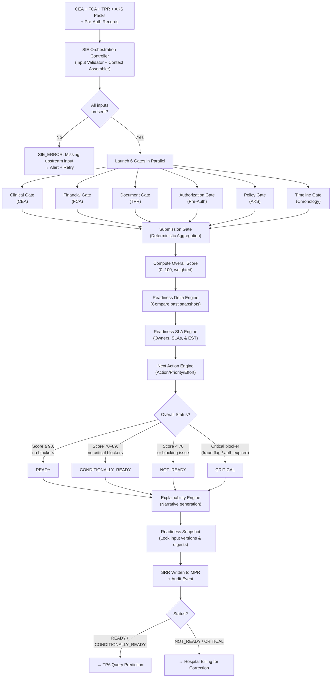

# Submission Intelligence Engine (SIE) — Architectural Specification

SIE answers exactly **ONE question**:

> *"Is this claim ready to be submitted today?"*

SIE is not a reasoning engine. It does not create new intelligence. It is an **orchestration engine** — a CI/CD pipeline for insurance claims. It reads the outputs of Fairway, Taiga, and AKS, applies deterministic gate rules, and produces a single `Submission Readiness Report (SRR)`.

---

## 1. Position in Aivana Pipeline

```
✅ Fairway  →  Clinical Evidence Assessment (CEA)
✅ Taiga    →  Financial Compliance Assessment (FCA)
✅ AKS      →  Knowledge Packs (certified, active)
✅ TPR      →  Trusted Patient Record

              All four feed into:

        ╔══════════════════════════════════════╗
        ║  Submission Intelligence Engine (SIE)║
        ║  "CI/CD Pipeline for Claims"        ║
        ╚══════════════════════════════════════╝
                           │
                           ▼
            Submission Readiness Report (SRR)
                           │
               ┌───────────┴────────────┐
               │                        │
          READY /                   NOT_READY /
     CONDITIONALLY_READY              CRITICAL
               │
               ▼
      TPA Query Prediction  ←  Next service
```

---

## 2. System Architecture Diagram

```
┌─────────────────────────────────────────────────────────────────────────────────┐
│                   Submission Intelligence Engine (SIE)                          │
│                                                                                 │
│  ┌───────────────────────────────────────────────────────────────────────────┐  │
│  │                     SIE Orchestration Controller                          │  │
│  │   (Input Validator + Claim Context Assembler + Gate Scheduler)            │  │
│  └──────┬──────────┬──────────┬──────────┬──────────┬──────────┬────────────┘  │
│         │          │          │          │          │          │               │
│    Parallel Execution (6 Gates run concurrently)                               │
│         │          │          │          │          │          │               │
│         ▼          ▼          ▼          ▼          ▼          ▼               │
│  ┌──────────┐ ┌──────────┐ ┌──────────┐ ┌──────────┐ ┌──────────┐ ┌────────┐ │
│  │ Clinical │ │Financial │ │Document  │ │Authoriz. │ │  Policy  │ │Timeline│ │
│  │   Gate   │ │  Gate    │ │  Gate    │ │  Gate    │ │  Gate    │ │  Gate  │ │
│  │  (CEA)   │ │  (FCA)   │ │  (TPR)   │ │ (Pre-Auth│ │  (AKS)   │ │(Chrono)│ │
│  └─────┬────┘ └─────┬────┘ └─────┬────┘ └─────┬────┘ └─────┬────┘ └────┬───┘ │
│        │            │            │             │            │           │      │
│        └────────────┴────────────┴──────┬──────┴────────────┴───────────┘      │
│                                         │                                       │
│                                         ▼                                       │
│  ┌──────────────────────────────────────────────────────────────────────────┐   │
│  │                        Submission Gate                                   │   │
│  │   (Deterministic aggregation → READY / CONDITIONALLY_READY /            │   │
│  │    NOT_READY / CRITICAL)                                                 │   │
│  └──────────────────────────────────┬───────────────────────────────────────┘   │
│                                     │                                           │
│                                     ▼                                           │
│  ┌──────────────────────────────────────────────────────────────────────────┐   │
│  │                     Readiness Delta Engine                               │   │
│  │   (State progression analyzer & resolved blocker tracker)                │   │
│  └──────────────────────────────────┬───────────────────────────────────────┘   │
│                                     │                                           │
│                                     ▼                                           │
│  ┌──────────────────────────────────────────────────────────────────────────┐   │
│  │                     Readiness SLA Engine                                 │   │
│  │   (Issues workflow routing, SLAs, Escalation timelines & EST timer)      │   │
│  └──────────────────────────────────┬───────────────────────────────────────┘   │
│                                     │                                           │
│                                     ▼                                           │
│  ┌──────────────────────────────────────────────────────────────────────────┐   │
│  │                     Next Action Engine                                   │   │
│  │   (Remediation scheduler mapping blockers to teams, action & priority)   │   │
│  └──────────────────────────────────┬───────────────────────────────────────┘   │
│                                     │                                           │
│                                     ▼                                           │
│  ┌──────────────────────────────────────────────────────────────────────────┐   │
│  │                     Explainability Engine                                │   │
│  │   (Human-readable narrative — ONLY module allowed AI)                    │   │
│  └──────────────────────────────────┬───────────────────────────────────────┘   │
│                                     │                                           │
│                                     ▼                                           │
│  ┌──────────────────────────────────────────────────────────────────────────┐   │
│  │                   Audit & SRR Writer (Snapshot)                          │   │
│  │   (Immutable SRR version write with cryptographic snapshot digests)       │   │
│  └──────────────────────────────────────────────────────────────────────────┘   │
└─────────────────────────────────────────────────────────────────────────────────┘
```

---

## 3. Processing State Machine

```
RECEIVED
    │
    ▼
ASSEMBLING
  (Orchestration Controller loads CEA + FCA + TPR + AKS packs + pre-auth records)
    │
    ▼
EVALUATING
  (6 gates execute in parallel)
    │
    ├── CLINICAL_GATE_RUNNING
    ├── FINANCIAL_GATE_RUNNING
    ├── DOCUMENT_GATE_RUNNING
    ├── AUTHORIZATION_GATE_RUNNING
    ├── POLICY_GATE_RUNNING
    └── TIMELINE_GATE_RUNNING
    │
    ▼ (all gates complete)
AGGREGATING
  (Submission Gate reads all gate results, computes overallScore, overallStatus)
    │
    ▼
DELTA_ANALYSIS
  (Readiness Delta Engine compares current run against previous SRR snapshots)
    │
    ▼
SLA_CALCULATION
  (Readiness SLA Engine maps owners, metrics, and calculates Estimated Ready Time)
    │
    ▼
NEXT_ACTION_MAPPING
  (Next Action Engine assigns responsible teams, priorities, and effort vectors)
    │
    ▼
EXPLAINING
  (Explainability Engine generates human-readable narrative)
    │
    ▼
 ┌──────────┬──────────────────────┬──────────┬──────────┐
 │          │                      │          │          │
 ▼          ▼                      ▼          ▼          ▼
READY  CONDITIONALLY_READY    NOT_READY   CRITICAL   FAILED
                                                   (SIE internal error)
    │
    ▼
SNAPSHOT_COMMITTED
  (Immutable reference hash written to database)
    │
    ▼
AUDIT_WRITTEN
    │
    ▼
SRR_COMPLETE
```

---

## 4. Mermaid Workflows

### 4.1 Full SIE Execution Flow



---

## 5. Gate Specifications

### 5.1 Clinical Gate

**Input**: Clinical Evidence Assessment (CEA) from Fairway
**Deterministic**: 100%

| Check | Pass Condition | Blocker if Fails |
| :--- | :--- | :---: |
| Fairway overall status | `CEA.overallStatus ∈ {PASS, CONDITIONAL}` | ✅ BLOCKING |
| Medical Necessity Score | `CEA.medicalNecessityScore ≥ 60` | ✅ BLOCKING |
| Evidence Completeness Score | `CEA.evidenceCompletenessScore ≥ 50` | ✅ BLOCKING |
| Human review flag | `CEA.humanReviewRequired = false` | ⚠️ ADVISORY |
| Unresolved clinical contradictions | No `CONTRADICTION` flags in CEA | ⚠️ ADVISORY |
| CEA version matches current | CEA not stale (< 24 hours old) | ✅ BLOCKING |

**Gate Score Formula**:
```
clinicalScore = (MNS × 0.6) + (ECS × 0.4)
```

---

### 5.2 Financial Gate

**Input**: Financial Compliance Assessment (FCA) from Taiga
**Deterministic**: 100%

| Check | Pass Condition | Blocker if Fails |
| :--- | :--- | :---: |
| Taiga overall status | `FCA.overallStatus ∈ {PASS, CONDITIONAL}` | ✅ BLOCKING |
| ICD validation | `FCA.icdValidation.status ≠ FAIL` | ✅ BLOCKING |
| Billing arithmetic | `FCA.billingValidation.arithmeticCheck = PASS` | ✅ BLOCKING |
| Room rent validation | `FCA.roomRentValidation.status ∈ {PASS, ADVISORY}` | ⚠️ ADVISORY |
| Package compliance | `FCA.packageValidation.status ≠ FAIL` | ✅ BLOCKING |
| Waiting period | `FCA.policyCompliance.waitingPeriod ≠ FAIL` | ✅ BLOCKING |
| Exclusion check | `FCA.policyCompliance.exclusion ≠ FAIL` | ✅ BLOCKING |
| Financial risk | `FCA.financialRisk.classification ≠ CRITICAL` | ✅ BLOCKING |
| Human review flag | `FCA.humanReviewRequired = false` | ⚠️ ADVISORY |

**Gate Score Formula**:
```
financialScore = FCA.overallScore
```

---

### 5.3 Document Gate

**Input**: Trusted Patient Record (TPR) — document inventory
**Deterministic**: 100%

| Check | Pass Condition | Blocker if Fails |
| :--- | :--- | :---: |
| Admission note present | `TPR.documents.admissionNote.present = true` | ✅ BLOCKING |
| Discharge summary present | `TPR.documents.dischargeSummary.present = true` | ✅ BLOCKING |
| Discharge summary signed | `TPR.documents.dischargeSummary.signed = true` | ✅ BLOCKING |
| Investigation reports present | `TPR.documents.investigationReports.count ≥ 1` | ⚠️ ADVISORY |
| Pre-auth copy present | `TPR.documents.preAuthLetter.present = true` | ✅ BLOCKING |
| No duplicate documents | `TPR.documents.duplicateFlag = false` | ⚠️ ADVISORY |
| Insurance card present | `TPR.documents.insuranceCard.present = true` | ✅ BLOCKING |
| Pharmacy bills (if applicable) | Procedure-specific check per AKS Clinical Template | ⚠️ ADVISORY |
| OT notes present (if surgical) | Procedure-specific check per AKS Clinical Template | ✅ BLOCKING if surgical |

**Document Gate cross-references AKS Clinical Template Pack** to determine which documents are mandatory for the specific procedure category.

---

### 5.4 Authorization Gate

**Input**: Pre-Authorization record from hospital's pre-auth system
**Deterministic**: 100%

| Check | Pass Condition | Blocker if Fails |
| :--- | :--- | :---: |
| Pre-auth granted | `preAuth.status = GRANTED` | ✅ BLOCKING |
| Pre-auth not expired | `preAuth.expiryDate ≥ today` | ✅ BLOCKING |
| Pre-auth matches insurer | `preAuth.insurer = TPR.insurer` | ✅ BLOCKING |
| Pre-auth matches hospital | `preAuth.hospitalCode = TPR.hospitalCode` | ✅ BLOCKING |
| Enhancement approved (if applicable) | `preAuth.enhancement.status = APPROVED` | ✅ BLOCKING if enhancement exists |
| Enhancement not expired | `preAuth.enhancement.expiryDate ≥ today` | ✅ BLOCKING if enhancement exists |
| No pending approval stages | `preAuth.pendingApprovalStages = []` | ⚠️ ADVISORY |
| Pre-auth covers full episode | `preAuth.approvedAmount ≥ FCA.cashlessApproved` | ⚠️ ADVISORY |

---

### 5.5 Policy Gate

**Input**: AKS Knowledge Pack (Insurer Rule Pack + Hospital Override Pack)
**Deterministic**: 100%

| Check | Pass Condition | Blocker if Fails |
| :--- | :--- | :---: |
| Active rule pack exists | `AKS.insurerRulePack.status = PUBLISHED` | ✅ BLOCKING |
| Rule pack is certified | `AKS.insurerRulePack.certificationStatus = CERTIFIED` | ✅ BLOCKING |
| Rule pack effective for admission date | `pack.effectiveFrom ≤ admissionDate ≤ pack.effectiveTo` | ✅ BLOCKING |
| Hospital override pack approved | `AKS.hospitalOverridePack.status = PUBLISHED` (if exists) | ✅ BLOCKING if override exists |
| Pack not superseded for this case | Correct version by admission date | ✅ BLOCKING |
| Pack compatibility verified | `compatibilityMatrix.check(pack, TAIGA_VERSION) = COMPATIBLE` | ✅ BLOCKING |

---

### 5.6 Timeline Gate

**Input**: TPR timeline fields + CEA + FCA timestamps
**Deterministic**: 100%

| Check | Pass Condition | Blocker if Fails |
| :--- | :--- | :---: |
| Admission date ≤ discharge date | `TPR.admissionDate ≤ TPR.dischargeDate` | ✅ BLOCKING |
| Procedure date within episode | `procedureDate ≥ admissionDate AND procedureDate ≤ dischargeDate` | ✅ BLOCKING |
| Discharge summary date ≥ discharge date | `dischargeSummary.date ≥ TPR.dischargeDate` | ✅ BLOCKING |
| Pre-auth granted before admission | `preAuth.grantedDate ≤ admissionDate` | ⚠️ ADVISORY |
| CEA generated after admission | `CEA.generatedAt ≥ admissionDate` | ⚠️ ADVISORY |
| FCA generated after discharge | `FCA.generatedAt ≥ dischargeDate` | ⚠️ ADVISORY |
| Billing date ≥ discharge date | `billing.date ≥ dischargeDate` | ✅ BLOCKING |
| No future-dated documents | All document dates ≤ today | ✅ BLOCKING |

---

### 5.7 Submission Gate (Deterministic Aggregation)

The Submission Gate reads all 6 gate results and applies the following deterministic logic:

**Step 1 — Blocking Issue Scan**:
Any BLOCKING issue in any gate immediately classifies the SRR based on severity:

```
Any CRITICAL classification (fraud flag, auth expired > 7 days, FCA.status = CRITICAL)
  → overallStatus = CRITICAL

Any BLOCKING issue (room rent, document missing, ICD fail, auth expired < 7 days, etc.)
  → overallStatus = NOT_READY

Zero blocking issues
  → proceed to score calculation
```

**Step 2 — Weighted Score Calculation** (only if no blockers):

| Gate | Weight |
| :--- | :---: |
| Clinical Gate | 25% |
| Financial Gate | 30% |
| Document Gate | 20% |
| Authorization Gate | 15% |
| Policy Gate | 5% |
| Timeline Gate | 5% |

```
overallScore = (clinicalScore × 0.25)
             + (financialScore × 0.30)
             + (documentScore × 0.20)
             + (authScore × 0.15)
             + (policyScore × 0.05)
             + (timelineScore × 0.05)
```

**Step 3 — Status from Score**:

| Score | Status |
| :--- | :--- |
| ≥ 90 | `READY` |
| 70–89 | `CONDITIONALLY_READY` |
| < 70 | `NOT_READY` |

---

## 6. Advanced Workflow Engines (New Capabilities)

### 6.1 Readiness Snapshot Engine (Immutable Auditing)
To defend against insurer disputes, the system generates an immutable, cryptographically-signed **Submission Snapshot** whenever a claim goes through evaluation.
- **Reference Tree**: The snapshot locks the unique database keys and content hashes of all upstream dependencies.
- **Content Freeze**: Even if the hospital updates clinical notes, bills, or uploads new PDFs later, the submitted claim continues to point to the exact snapshot versions.
- **Verification Hash**: A SHA-256 hash is computed over the consolidated inputs to guarantee absolute tamper-proof verification.

```json
"submissionSnapshot": {
  "snapshotId": "snap-20260714-sh-00123",
  "verificationHash": "e3b0c44298fc1c149afbf4c8996fb92427ae41e4649b934ca495991b7852b855",
  "lockedReferences": {
    "claimVersion": "v4",
    "tprVersion": "TPR-24936-v18",
    "ceaVersion": "CEA-24936-v12",
    "fcaVersion": "FCA-24936-v8",
    "aksPackVersion": "akp-star-medi-v4",
    "hospitalConfigVersion": "hosp-apollo-v3"
  }
}
```

### 6.2 Readiness Delta Engine (State Progression Tracking)
Hospitals need to trace claim improvement metrics and view exact delta updates over time rather than simple binary statuses. The Delta Engine compares the current evaluation with the previous run:
- **Score Progression**: Tracks absolute score changes (e.g. `+21` points).
- **Resolved Issues List**: Detects blockers or warnings that are no longer present.
- **Pending Issues List**: Tracks unresolved issues remaining in the system.

```json
"readinessDelta": {
  "previousSrrId": "srr-20260713-clm-003821",
  "previousScore": 61,
  "currentScore": 82,
  "scoreDiff": 21,
  "resolvedIssues": [
    { "gate": "CLINICAL", "code": "MISSING_ECG", "message": "Missing ECG report resolved" },
    { "gate": "DOCUMENT", "code": "MISSING_SIGNATURE", "message": "Discharge summary signature verified" }
  ],
  "stillPendingIssues": [
    { "gate": "AUTHORIZATION", "code": "PREAUTH_EXPIRED", "message": "Pre-auth expired" }
  ]
}
```

### 6.3 Auto Re-evaluation Engine (Event-Driven Automation)
Manual click-to-rerun behavior is replaced by an **Event-Driven Controller**. Whenever an entity update occurs, the engine triggers an automatic background evaluation of the SRR.
- **Monitored Events**:
  - `FILE_UPLOADED` (e.g. Signature uploaded, Lab test attached)
  - `PREAUTH_APPROVED` or `ENHANCEMENT_GRANTED`
  - `BILLING_CORRECTED` (FCA re-runs)
  - `AKS_PACK_UPDATED` (New policy/hospital rules go live)
  - `CEA_UPDATED` or `FCA_UPDATED`
- **Debounce Buffer**: Event evaluation requests are debounced by 2 seconds per claim to prevent unnecessary execution loops during batch updates.

### 6.4 Readiness SLA Engine (Operations & Deadlines)
Tracks turnaround times (TAT) and assigns active tickets to resolve blockers.
- **Issue Assignment**: Every blocker/warning maps to a specific hospital owner (Doctor, Insurance Desk, Billing).
- **SLA Thresholds**: Configurable standard completion timelines.
- **Estimated Ready Time (ERT)**: Sums active SLA values taking concurrency into account to provide a projected completion timestamp.

| Blocker Code | Owner | Standard SLA | Escalation Path |
|---|---|---|---|
| `MISSING_SIGNATURE` | Doctor | 30 minutes | Medical Superintendent |
| `PREAUTH_EXPIRED` | Insurance Desk | 2 hours | Ops Head |
| `ROOM_RENT_OVER_CAP` | Billing | 20 minutes | CFO Desk |

```json
"slaEngine": {
  "estimatedReadyTime": "2026-07-14T02:15:00+05:30",
  "activeBlockers": [
    {
      "code": "MISSING_SIGNATURE",
      "owner": "DOCTOR",
      "slaMinutes": 30,
      "timeElapsedMinutes": 5,
      "escalationState": "NORMAL"
    },
    {
      "code": "PREAUTH_EXPIRED",
      "owner": "INSURANCE_DESK",
      "slaMinutes": 120,
      "timeElapsedMinutes": 10,
      "escalationState": "NORMAL"
    }
  ]
}
```

### 6.5 Next Action Engine (Workflow Execution)
Provides a prioritized prescriptive instruction set for hospital administrators to make claims ready.
- **Action Items**: Explicit steps required.
- **Attributes**: Assigned team, estimated effort, and execution priority (High/Medium/Low).

```json
"nextActions": [
  {
    "priority": "HIGH",
    "action": "Upload ECG report via Pre-Auth portal",
    "responsibleTeam": "INSURANCE_DESK",
    "estimatedEffort": "5 mins"
  },
  {
    "priority": "HIGH",
    "action": "Request Doctor's digital signature on Discharge Summary",
    "responsibleTeam": "DOCTOR",
    "estimatedEffort": "10 mins"
  },
  {
    "priority": "MEDIUM",
    "action": "Correct room rent billing discrepancies in HIS",
    "responsibleTeam": "BILLING",
    "estimatedEffort": "15 mins"
  }
]
```

---

## 7. SRR JSON Schema

```json
{
  "srrId": "srr-20260714-clm-003821",
  "claimId": "SH-2026-CLM-003821",
  "caseId": "CASE-24936",
  "generatedAt": "2026-07-14T00:02:00+05:30",
  "processingDurationMs": 284,

  "overallStatus": "NOT_READY",
  "overallScore": 68,

  "submissionSnapshot": {
    "snapshotId": "snap-20260714-sh-00123",
    "verificationHash": "e3b0c44298fc1c149afbf4c8996fb92427ae41e4649b934ca495991b7852b855",
    "lockedReferences": {
      "claimVersion": "v4",
      "tprVersion": "TPR-24936-v18",
      "ceaVersion": "CEA-24936-v12",
      "fcaVersion": "FCA-24936-v8",
      "aksPackVersion": "akp-star-medi-v4",
      "hospitalConfigVersion": "hosp-apollo-v3"
    }
  },

  "readinessDelta": {
    "previousSrrId": "srr-20260713-clm-003821",
    "previousScore": 61,
    "currentScore": 82,
    "scoreDiff": 21,
    "resolvedIssues": [
      { "gate": "CLINICAL", "code": "MISSING_ECG", "message": "Missing ECG report resolved" },
      { "gate": "DOCUMENT", "code": "MISSING_SIGNATURE", "message": "Discharge summary signature verified" }
    ],
    "stillPendingIssues": [
      { "gate": "AUTHORIZATION", "code": "PREAUTH_EXPIRED", "message": "Pre-auth expired" }
    ]
  },

  "slaEngine": {
    "estimatedReadyTime": "2026-07-14T02:15:00+05:30",
    "activeBlockers": [
      {
        "code": "MISSING_SIGNATURE",
        "owner": "DOCTOR",
        "slaMinutes": 30,
        "timeElapsedMinutes": 5,
        "escalationState": "NORMAL"
      },
      {
        "code": "PREAUTH_EXPIRED",
        "owner": "INSURANCE_DESK",
        "slaMinutes": 120,
        "timeElapsedMinutes": 10,
        "escalationState": "NORMAL"
      }
    ]
  },

  "nextActions": [
    {
      "priority": "HIGH",
      "action": "Upload ECG report via Pre-Auth portal",
      "responsibleTeam": "INSURANCE_DESK",
      "estimatedEffort": "5 mins"
    },
    {
      "priority": "HIGH",
      "action": "Request Doctor's digital signature on Discharge Summary",
      "responsibleTeam": "DOCTOR",
      "estimatedEffort": "10 mins"
    }
  ],

  "gates": {
    "clinical": {
      "status": "PASS",
      "score": 82,
      "medicalNecessityScore": 88,
      "evidenceCompletenessScore": 74,
      "blockers": [],
      "warnings": [
        { "code": "HUMAN_REVIEW_FLAGGED", "message": "Fairway flagged case for human review" }
      ],
      "citations": ["CEA-24936-v12"]
    },
    "financial": {
      "status": "PASS",
      "score": 91,
      "blockers": [],
      "warnings": [
        { "code": "ROOM_RENT_ADVISORY", "message": "Room rent advisory deduction of ₹3,200 applies" }
      ],
      "citations": ["FCA-24936-v8"]
    },
    "document": {
      "status": "FAIL",
      "score": 40,
      "blockers": [
        {
          "code": "DISCHARGE_SUMMARY_UNSIGNED",
          "severity": "BLOCKING",
          "message": "Discharge summary is missing treating doctor's signature",
          "field": "TPR.documents.dischargeSummary.signed",
          "remediationAction": "Upload signed discharge summary",
          "estimatedResolutionMinutes": 15
        }
      ],
      "warnings": [],
      "citations": ["TPR-24936-v18"]
    },
    "authorization": {
      "status": "FAIL",
      "score": 0,
      "blockers": [
        {
          "code": "PREAUTH_EXPIRED",
          "severity": "BLOCKING",
          "message": "Pre-authorization expired on 2026-07-10",
          "field": "preAuth.expiryDate",
          "remediationAction": "Request authorization revalidation from insurer",
          "estimatedResolutionMinutes": 180
        }
      ],
      "warnings": [],
      "citations": ["PREAUTH-2026-033"]
    },
    "policy": {
      "status": "PASS",
      "score": 100,
      "blockers": [],
      "warnings": [],
      "citations": ["akp-star-medi-v4"]
    },
    "timeline": {
      "status": "PASS",
      "score": 100,
      "blockers": [],
      "warnings": [],
      "citations": ["TPR-24936-v18"]
    }
  },

  "explanation": "Claim SH-2026-CLM-003821 is NOT READY because the discharge summary is missing the treating doctor's signature and the pre-authorization expired on 2026-07-10. Resolving these two issues is estimated to take 2–4 hours.",
  
  "humanReviewRequired": false,
  "nextStep": null,

  "auditTrail": {
    "inputVersions": {
      "ceaVersion": "CEA-24936-v12",
      "fcaVersion": "FCA-24936-v8",
      "tprVersion": "TPR-24936-v18",
      "aksPackVersion": "akp-star-medi-v4"
    },
    "gateExecutionOrder": "PARALLEL",
    "gateDurations": {
      "clinical": 35,
      "financial": 28,
      "document": 24,
      "authorization": 40,
      "policy": 10,
      "timeline": 15,
      "submissionGate": 5,
      "explainability": 110
    }
  }
}
```

---

## 8. Architecture Q&A

### Q1. What is the best production architecture?
A **parallel gate orchestration model** where all 6 gates execute concurrently on the assembled Claim Context, their results converge at the Submission Gate, followed by delta, SLA, and action engines, and the Explainability Engine generates the narrative last.

### Q2. How should the orchestration controller work?
The controller performs:
1. **Input Validation**: Verify all upstream inputs (CEA, FCA, TPR, AKS pack) exist.
2. **Claim Context Assembly**: Build a unified `ClaimContext` object containing all fields.
3. **Gate Scheduling & Engine Pipeline**: Trigger parallel gates, then execute Delta, SLA, and Next Action pipelines.

### Q3. Should gates execute sequentially or in parallel?
**Parallel**, always. The 6 gates are completely independent; serial execution would add ~5× latency for no benefit.

### Q4. How should readiness be scored?
A weighted composite score (0–100) assembled from the 6 gate scores when zero blockers are present.

### Q5. Should every gate have equal weight?
No. Financial (30%) and Clinical (25%) gates are weighted highest since they are the root of most TPA claim rejections.

### Q6. How should blocking issues be represented?
Structured objects specifying the error code, message, responsible field, remediation plan, and resolution time.

### Q7. How should warnings differ from blockers?
Blockers force a `NOT_READY` or `CRITICAL` state, halting submission. Warnings do not halt submission, but decrease the score, leading to `CONDITIONALLY_READY`.

### Q8. How should explainability work?
Templated generation for standard cases (0-2 blockers) and LLM-assisted synthesis for highly complex multi-gate failures.

### Q9. How should confidence be calculated?
Derived from average upstream extraction and rule mapping confidence metrics.

### Q10. When should human review be triggered?
`overallStatus = CRITICAL`, low score (< 50), manual flags from Fairway/Taiga, or extreme SLA breach.

### Q11. How should SIE integrate with TPA Query Prediction?
`READY` or `CONDITIONALLY_READY` status pushes the SRR snapshot directly to the TPA Query Predictor. `NOT_READY` or `CRITICAL` halts submission, routing actions back to hospital queues.

### Q12. How should retries and partial failures be handled?
All gate errors trigger a single automated retry. Persistent faults are raised as `GATE_ERROR` which defaults the report to `CRITICAL` for human safety oversight.

### Q13. How should historical readiness trends be stored?
Aggregated snapshots are written to the database with metric-oriented audit columns (first attempt scores, resolution times, failure categories) for billing office reporting.

### Q14. How should auditability be maintained?
Via immutable snapshot logs with verification hashes representing the state of all dependencies at the millisecond of execution.

### Q15. How should hospital-specific workflows be supported?
Using Hospital Override configs loaded at startup which define localized SLA thresholds, signature exception lists, or notification routing rules.

---

## 9. API Contracts

### 8.1 SIE Submit Claim
```
POST /v1/sie/evaluate
Content-Type: application/json

{
  "claimId": "SH-2026-CLM-003821",
  "caseId": "CASE-24936",
  "ceaRef": "CEA-24936-v12",
  "fcaRef": "FCA-24936-v8",
  "tprRef": "TPR-24936-v18",
  "aksPackRef": "akp-star-medi-v4",
  "preAuthRef": "PREAUTH-2026-033",
  "hospitalCode": "HOSP-APOLLO-MUM-001",
  "requestedBy": "CLAIM_ROUTER_SERVICE"
}
```

### 8.2 SRR Read
```
GET /v1/sie/srr/{srrId}
```

### 8.3 SRR Event Webhook
```
POST /v1/sie/events/trigger
Content-Type: application/json

{
  "eventType": "FILE_UPLOADED | PREAUTH_APPROVED | BILLING_CORRECTED | AKS_PACK_UPDATED",
  "claimId": "SH-2026-CLM-003821",
  "payload": {
    "fileId": "file-discharge-summary-signed-102",
    "updatedAt": "2026-07-14T00:02:10Z"
  }
}
```

---

## 10. Latency Budget

| Step | Target |
| :--- | :--- |
| Input validation + context assembly | < 20ms |
| 6 gates (parallel) | < 120ms (slowest gate) |
| Delta, SLA & Action engines | < 30ms |
| Explainability (template) | < 20ms |
| Explainability (LLM fallback) | < 300ms |
| Snapshot commit & SRR write | < 30ms |
| **Average total (no LLM)** | **< 220ms** |
| **Average total (with LLM)** | **< 520ms** |

---

## 11. Failure Handling

- **Stale Inputs**: Upstream payloads exceeding 24 hours are blocked from evaluation.
- **Verification Mismatch**: Snapshot checksum errors trigger immediate failure logs and flag cases as `CRITICAL`.
- **Explainability Faults**: LLM timeout defaults to local template assembly without crashing the pipeline.

---

*End of Document*
