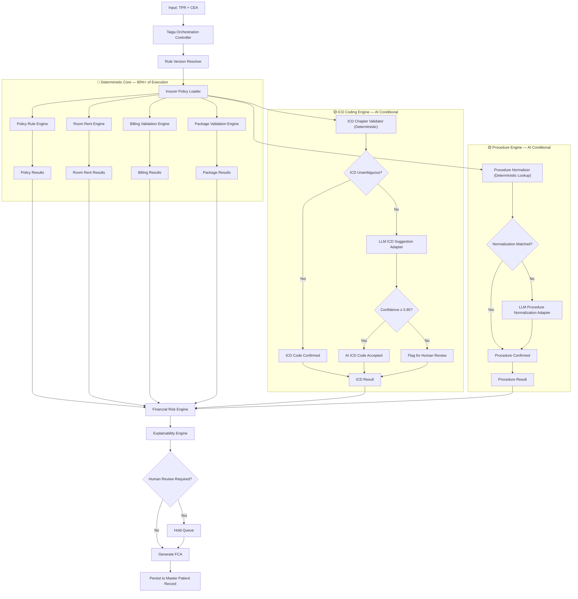
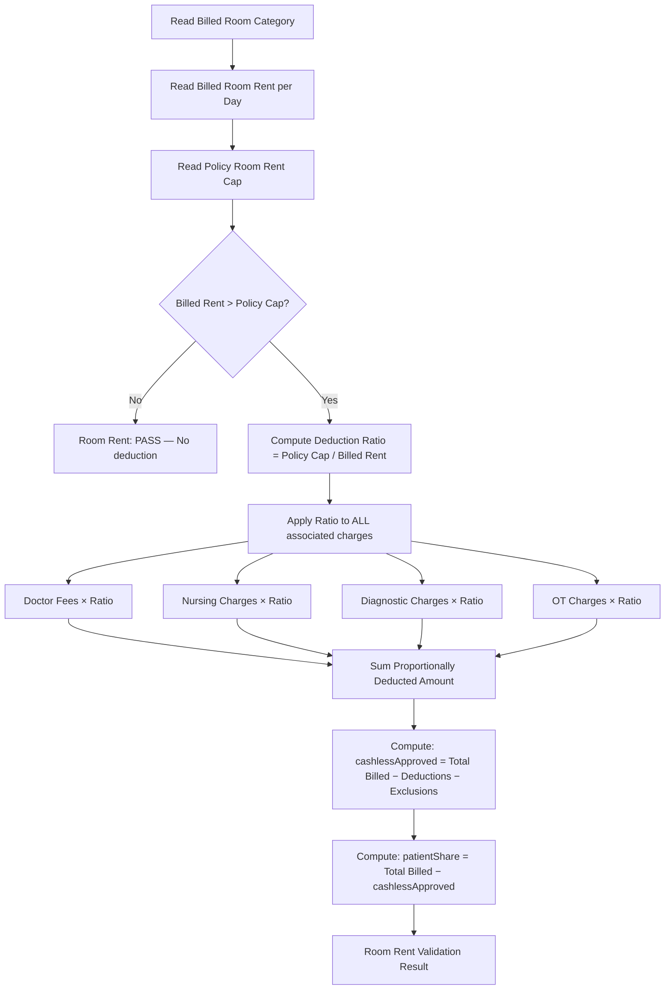
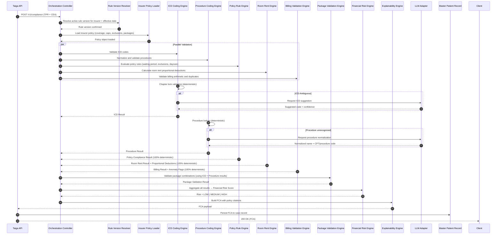

# Taiga Financial Compliance Engine — Architectural Specification

Taiga answers exactly **ONE** question:

> *"If this claim is submitted today, is it financially and policy compliant according to the insurer's rules?"*

Taiga is the **Financial Intelligence Layer** of Aivana. It protects hospital revenue by identifying every financial compliance violation before a claim is submitted. Like Fairway produces a Clinical Evidence Assessment (CEA), Taiga produces a **Financial Compliance Assessment (FCA)**.

---

## 1. Position in Aivana Pipeline

```
Hospital Upload
      ↓
Docling Ingestion Gateway (CCD)
      ↓
Document Identification
      ↓
Clinical Entity Extraction
      ↓
Trusted Patient Record (TPR)     ─────────────────────────┐
      ↓                                                    │
Fairway Clinical Evidence Review                           │
      ↓                                                    │
Clinical Evidence Assessment (CEA) ────────────────────────┤
                                                           │
                                                           ▼
                                           Taiga Financial Compliance Engine
                                                           │
                                                           ▼
                                           Financial Compliance Assessment (FCA)
                                                           │
                                                           ▼
                                Claim Readiness → TPA Prediction → Final Claim Packet
                                                           │
                                                           ▼
                                                         Aegis
```

**Taiga Inputs**: TPR + CEA
**Taiga Output**: FCA
**Taiga NEVER reads**: PDFs, Images, OCR data, CCD, raw documents

---

## 2. System Architecture Diagram

```
┌─────────────────────────────────────────────────────────────────────────────┐
│              Taiga Financial Compliance Engine                               │
│                                                                             │
│   ┌─────────────────────────────────────────────────────────────────────┐   │
│   │                  Taiga Orchestration Controller                      │   │
│   │         (Rule Version Resolver + Insurer Policy Loader)             │   │
│   └──────┬──────────┬──────────┬──────────┬──────────┬──────────┬───────┘   │
│          │          │          │          │          │          │           │
│          ▼          ▼          ▼          ▼          ▼          ▼           │
│   ╔══════════╗ ╔═══════════╗ ╔══════════╗ ╔══════════╗ ╔═══════════╗       │
│   ║  ICD     ║ ║ Procedure ║ ║ Policy   ║ ║ Billing  ║ ║ Room Rent ║       │
│   ║  Coding  ║ ║ Coding    ║ ║ Rule     ║ ║ Validation║ ║ Engine   ║       │
│   ║  Engine  ║ ║ Engine    ║ ║ Engine   ║ ║ Engine   ║ ║          ║       │
│   ╚══════╦═══╝ ╚═════╦═════╝ ╚════╦═════╝ ╚════╦═════╝ ╚═════╦═════╝       │
│          ║           ║            ║             ║             ║             │
│          ▼           ▼            ▼             ▼             ▼             │
│   ╔══════════════════════════════════════════════════════════════════╗       │
│   ║               Package Validation Engine                         ║       │
│   ╚══════════════════════════════════╦═══════════════════════════════╝       │
│                                      ║                                      │
│                                      ▼                                      │
│   ╔══════════════════════════════════════════════════════════════════╗       │
│   ║               Financial Risk Engine                             ║       │
│   ║         (LOW / MEDIUM / HIGH — 100% Deterministic)             ║       │
│   ╚══════════════════════════════════╦═══════════════════════════════╝       │
│                                      ║                                      │
│                                      ▼                                      │
│   ╔══════════════════════════════════════════════════════════════════╗       │
│   ║               Explainability Engine                              ║       │
│   ║         (Policy Clause → Rule → Calculation → Citation)        ║       │
│   ╚══════════════════════════════════╦═══════════════════════════════╝       │
│                                      ║                                      │
│                                      ▼                                      │
│   ┌──────────────────────────────────────────────────────────────────┐       │
│   │                   Human Review Gate                              │       │
│   └──────────────────────────────────┬───────────────────────────────┘       │
└──────────────────────────────────────┼─────────────────────────────────────┘
                                       │
                                       ▼
┌─────────────────────────────────────────────────────────────────────────────┐
│               Financial Compliance Assessment (FCA)                         │
│   overallStatus: PASS | CONDITIONAL | FAIL                                 │
│   overallScore: 0–100                                                       │
│   icdValidation + procedureValidation + billingValidation +                │
│   policyValidation + roomRentValidation + packageValidation +              │
│   copayValidation + waitingPeriodValidation + exclusionValidation +        │
│   financialRisk + recommendations                                           │
└─────────────────────────────────────────────────────────────────────────────┘
```

---

## 3. Mermaid Workflow

### 3.1 Full Financial Compliance Pipeline



### 3.2 Room Rent Proportional Deduction Flow



---

## 4. Sequence Diagram



---

## 5. Component Responsibilities

### 5.1 ICD Coding Engine

| Task | Method | AI? |
| :--- | :--- | :---: |
| ICD-10 code lookup by diagnosis text | Deterministic dictionary + alias table | ❌ |
| ICD Chapter lock validation (H, O, M, D, N) | Deterministic rule per specialty | ❌ |
| Code plausibility against diagnosis category | Deterministic chapter map | ❌ |
| Diagnosis ambiguity resolution | LLM ICD Adapter (conditional) | ✅ |
| WHO ICD-10 / ICD-11 compliance check | Deterministic code range validation | ❌ |
| Indian coding quirks (CGHS, IRDAI preferred codes) | Deterministic override table | ❌ |
| Low-confidence ICD hold | Deterministic threshold check | ❌ |

**ICD Chapter Lock Rules (from AGENTS.md)**:
- Cataract / Ophthalmology → `H` codes only
- LSCS / Maternity / Delivery → `O` or `Z` codes only
- Hysterectomy / Fibroids / Gynaecology → `D`, `N`, or `Z` codes only
- Osteoarthritis / TKR / Orthopaedics → `M` codes only
- Ambiguous terms → `Pending ICD-10` — manual review required
- AI confidence `< 0.85` → block auto-submission

---

### 5.2 Procedure Coding Engine

| Task | Method | AI? |
| :--- | :--- | :---: |
| Procedure name normalization | Deterministic lookup + synonym table | ❌ |
| CPT / ACHI procedure mapping | Deterministic code dictionary | ❌ |
| Surgical unbundling (CCI edit checks) | Deterministic CCI edit table | ❌ |
| Procedure compatibility validation | Deterministic compatibility matrix | ❌ |
| Free-text procedure name resolution | LLM Procedure Normalizer (conditional) | ✅ |
| Implant procedure validation | Deterministic implant code table | ❌ |

---

### 5.3 Policy Rule Engine

**100% Deterministic. No AI permitted.**

| Module | Responsibility |
| :--- | :--- |
| **Waiting Period Validator** | Enforces pre-existing disease waiting periods (30-day, 1-year, 2-year, 4-year) against policy effective date and admission date. |
| **Coverage Validator** | Confirms the admitted condition is within the policy's covered conditions list. |
| **Exclusion Validator** | Matches diagnosis and procedure against the policy exclusions list. |
| **Daycare Validator** | Identifies procedures eligible for daycare (< 24 hours); validates against IRDAI daycare procedures list. |
| **Maternity Validator** | Applies maternity waiting period, maternity sub-limit, and LSCS-vs-normal-delivery caps. |
| **Room Category Validator** | Confirms the room type billed matches the policy's entitled room category. |
| **Disease-Specific Rule Validator** | Applies IRDAI / insurer-mandated disease-specific rules (e.g., cataract sub-limit, cardiac disease caps). |

---

### 5.4 Billing Validation Engine

**100% Deterministic. No AI permitted.**

| Check | Rule |
| :--- | :--- |
| Arithmetic validation | Sum of itemized bills must equal total billed amount ±₹0.00 |
| Duplicate charge detection | Same item appearing > 1 time on same date is flagged |
| GST compliance | GST rate must match CGST + SGST schedules for applicable items |
| Non-payable consumables | IRDAI non-payable consumables list applied (gloves, cotton, syringes, etc.) |
| Pharmacy validation | Drugs must match prescribed list; quantity must match duration × dose |
| Billing anomaly detection | Charge > 3σ above benchmark price for the same procedure in the same city tier |

---

### 5.5 Room Rent Engine

**100% Deterministic. No AI permitted.**

Room rent deductions follow IRDAI proportional deduction rules:

| Ward | Policy Cap (of Sum Insured per day) |
| :--- | :---: |
| Normal Ward | 1% |
| ICU / HDU | 2% |

**Proportional Deduction Algorithm:**

```
deduction_ratio = policy_cap_per_day / actual_billed_per_day
IF actual_billed_per_day > policy_cap_per_day:
    FOR each associated_charge IN [doctor_fees, nursing, diagnostics, OT, anaesthesia]:
        deducted_charge = associated_charge × deduction_ratio
    total_deduction = sum(deducted_charges)
    cashless_approved = total_billed - total_deduction - exclusions - copay
    patient_share = total_billed - cashless_approved
ELSE:
    deduction_ratio = 1.0
    cashless_approved = total_billed - exclusions - copay
    patient_share = 0
```

**ICU Upgrade Validation:**
- ICU admission must be clinically justified (referenced from Fairway CEA — does not re-evaluate).
- Checks whether ICU room rent cap applies.
- Validates that ICU charges are correctly billed at the ICU tariff, not the general ward tariff.

---

### 5.6 Package Validation Engine

| Check | Method |
| :--- | :--- |
| Procedure included in insurer package | Deterministic lookup against insurer package code table |
| Package conflict detection | Two procedures billed that are mutually exclusive in the same admission episode |
| Package-vs-itemized billing conflict | Both package billing and itemized billing detected for the same procedure |
| Implant package validation | Implant serial number required; implant cost must not exceed package cap |
| Hospital-defined package overrides | Hospital package rate table (uploaded by hospital admin) overrides base rates |

---

### 5.7 Financial Risk Engine

**100% Deterministic. No AI permitted.**

| Condition | Risk Classification |
| :--- | :---: |
| All validations PASS, score ≥ 90 | `LOW` |
| 1–2 ADVISORY violations, score 70–89 | `MEDIUM` |
| Any BLOCKING violation OR score < 70 | `HIGH` |
| Any `waitingPeriod = FAIL` | `HIGH` (automatic) |
| Any `exclusion = FAIL` | `HIGH` (automatic) |
| ICD low-confidence hold | `HIGH` (automatic) |
| Arithmetic mismatch > ₹0 | `HIGH` (automatic) |

---

### 5.8 Explainability Engine

Every FCA output entry must carry a citation chain:

```
Rule Reference
    → Policy Clause Number
    → Calculation performed
    → TPR field cited
    → Result
```

**Example Citations:**

```
Room Rent:
"Actual room rent ₹4,500/day exceeds policy limit of ₹3,000/day (1% of ₹3,00,000 SI).
Clause 4.2 — Proportional Deduction applies.
Deduction Ratio = 3000/4500 = 0.667.
Doctor Fee ₹12,000 → Payable ₹8,000.
Nursing ₹6,000 → Payable ₹4,000.
Total Deduction: ₹7,200."

Waiting Period:
"Hypertension diagnosed on policy inception date 2022-01-01.
Waiting period clause: 4 years for pre-existing disease.
Admission date 2024-03-15 falls within waiting period.
Claim BLOCKED. Clause 3.1(b) — Pre-Existing Disease."

ICD:
"Diagnosis 'Senile Cataract' mapped to H26.0.
ICD Chapter Lock: Ophthalmology → H codes.
Confidence: 0.97. Accepted."
```

---

## 6. Policy Rule Representation

### Decision: YAML-based Policy Rules

**Rationale**: Policy rules in Indian health insurance are structured, versioned, and insurer-specific. They must be:
- Human-readable by compliance teams
- Versionable in source control
- Hot-reloadable without engine restarts
- Overridable at hospital level

**YAML is chosen over:**
- JSON: Less readable for complex nested rules
- Drools: Requires JVM, complex deployment, poor readability for non-engineers
- Decision Tables: Hard to version and diff in git

### Policy YAML Schema

```yaml
insurer: "Star Health Insurance"
policyType: "Medi Classic"
schemeVersion: "2024-v3"
effectiveFrom: "2024-04-01"
effectiveTo: "2025-03-31"

roomRent:
  normalWard:
    capPercent: 1.0
    capBasis: "sumInsured"
  icu:
    capPercent: 2.0
    capBasis: "sumInsured"
  proportionalDeduction: true

waitingPeriods:
  initialWaiting: 30
  preExistingDisease: 1460  # days (4 years)
  specificDisease:
    - name: "Cataract"
      days: 730
    - name: "Hernia"
      days: 730
    - name: "Kidney Stones"
      days: 730
    - name: "Joint Replacement"
      days: 730

copay:
  enabled: true
  percentage: 20
  applicableTo: ["outpatient", "daycare"]

maternity:
  waitingDays: 730
  normalDeliveryLimit: 35000
  lscsLimit: 50000

exclusions:
  - "Cosmetic surgery"
  - "Dental treatment unless due to accident"
  - "Self-inflicted injuries"
  - "AIDS/HIV"
  - "Non-allopathic treatments"

nonPayableConsumables:
  apply: true
  referenceList: "IRDAI_2024_NonPayable_v2"

packages:
  - procedureCode: "CATARACT_PHACO"
    packageName: "Cataract Phacoemulsification"
    rateNormalWard: 30000
    rateIcu: null
    implantIncluded: false
  - procedureCode: "LSCS"
    packageName: "Lower Segment Caesarean Section"
    rateNormalWard: 50000
    rateIcu: 75000
    implantIncluded: false
  - procedureCode: "TKR_UNILATERAL"
    packageName: "Total Knee Replacement (Unilateral)"
    rateNormalWard: 180000
    rateIcu: 200000
    implantIncluded: true
    implantCap: 80000

diseaseSpecificLimits:
  - name: "Cataract"
    maxPayablePerEye: 35000
  - name: "Cardiac Surgery"
    maxPayable: 300000

insurerSpecificOverrides:
  - rule: "ICU_UPGRADE_REQUIRES_CLINICAL_JUSTIFICATION"
    value: true
  - rule: "DAYCARE_MINIMUM_HOURS"
    value: 0  # Star Health: 0 hours (any procedure qualifies)
```

---

## 7. API Contracts

### 7.1 Endpoint

```
POST /v1/compliance
Content-Type: application/json
```

### 7.2 Request Body

```json
{
  "caseId": "CASE-24936",
  "insurer": "Star Health",
  "policyNumber": "SH-MEDI-2024-003921",
  "tprVersion": 3,
  "ceaVersion": 1,
  "tpr": { "...TPR object..." },
  "cea": { "...CEA object..." }
}
```

### 7.3 Financial Compliance Assessment (FCA) Schema

```json
{
  "$schema": "http://json-schema.org/draft-07/schema#",
  "title": "FinancialComplianceAssessment",
  "type": "object",
  "required": [
    "caseId", "fcaVersion", "generatedAt", "insurer", "policyNumber",
    "overallStatus", "overallScore", "icdValidation", "procedureValidation",
    "billingValidation", "policyValidation", "roomRentValidation",
    "packageValidation", "copayValidation", "waitingPeriodValidation",
    "exclusionValidation", "financialRisk", "recommendations"
  ],
  "properties": {
    "caseId":          { "type": "string" },
    "fcaVersion":      { "type": "integer" },
    "generatedAt":     { "type": "string", "format": "date-time" },
    "insurer":         { "type": "string" },
    "policyNumber":    { "type": "string" },
    "overallStatus":   { "type": "string", "enum": ["PASS", "CONDITIONAL", "FAIL"] },
    "overallScore":    { "type": "integer", "minimum": 0, "maximum": 100 },

    "icdValidation": {
      "type": "object",
      "properties": {
        "status":       { "type": "string", "enum": ["PASS", "ADVISORY", "FAIL", "PENDING"] },
        "primaryIcd":   { "type": "string" },
        "secondaryIcds":{ "type": "array", "items": { "type": "string" } },
        "confidence":   { "type": "number" },
        "method":       { "type": "string", "enum": ["DETERMINISTIC", "AI_ASSISTED"] },
        "violations":   { "type": "array", "items": { "type": "string" } },
        "citations":    { "type": "array", "items": { "type": "string" } }
      }
    },

    "procedureValidation": {
      "type": "object",
      "properties": {
        "status":       { "type": "string", "enum": ["PASS", "ADVISORY", "FAIL"] },
        "procedures":   { "type": "array" },
        "cciEdits":     { "type": "array" },
        "citations":    { "type": "array", "items": { "type": "string" } }
      }
    },

    "billingValidation": {
      "type": "object",
      "properties": {
        "status":               { "type": "string", "enum": ["PASS", "ADVISORY", "FAIL"] },
        "arithmeticValid":      { "type": "boolean" },
        "duplicatesDetected":   { "type": "array" },
        "nonPayableItems":      { "type": "array" },
        "anomalies":            { "type": "array" },
        "totalBilled":          { "type": "number" },
        "totalAdjusted":        { "type": "number" },
        "citations":            { "type": "array", "items": { "type": "string" } }
      }
    },

    "policyValidation": {
      "type": "object",
      "properties": {
        "status":               { "type": "string", "enum": ["PASS", "ADVISORY", "FAIL"] },
        "coverageStatus":       { "type": "string" },
        "waitingPeriodStatus":  { "type": "string" },
        "exclusionStatus":      { "type": "string" },
        "daycareStatus":        { "type": "string" },
        "maternityStatus":      { "type": "string" },
        "citations":            { "type": "array", "items": { "type": "string" } }
      }
    },

    "roomRentValidation": {
      "type": "object",
      "properties": {
        "status":                   { "type": "string", "enum": ["PASS", "ADVISORY", "FAIL"] },
        "roomCategory":             { "type": "string" },
        "billedRentPerDay":         { "type": "number" },
        "policyCapPerDay":          { "type": "number" },
        "deductionRatio":           { "type": "number" },
        "proportionalDeductions":   { "type": "object" },
        "totalDeductionAmount":     { "type": "number" },
        "cashlessApproved":         { "type": "number" },
        "patientShare":             { "type": "number" },
        "citations":                { "type": "array", "items": { "type": "string" } }
      }
    },

    "packageValidation": {
      "type": "object",
      "properties": {
        "status":           { "type": "string", "enum": ["PASS", "ADVISORY", "FAIL"] },
        "packageApplied":   { "type": "boolean" },
        "packageName":      { "type": "string" },
        "packageRate":      { "type": "number" },
        "implantValidated": { "type": "boolean" },
        "conflicts":        { "type": "array" },
        "citations":        { "type": "array", "items": { "type": "string" } }
      }
    },

    "copayValidation": {
      "type": "object",
      "properties": {
        "status":           { "type": "string" },
        "copayApplicable":  { "type": "boolean" },
        "copayPercentage":  { "type": "number" },
        "copayAmount":      { "type": "number" },
        "citations":        { "type": "array", "items": { "type": "string" } }
      }
    },

    "waitingPeriodValidation": {
      "type": "object",
      "properties": {
        "status":               { "type": "string", "enum": ["PASS", "FAIL"] },
        "preExistingConditions":{ "type": "array" },
        "waitingPeriodDays":    { "type": "integer" },
        "admissionDate":        { "type": "string" },
        "policyStartDate":      { "type": "string" },
        "daysSinceInception":   { "type": "integer" },
        "citations":            { "type": "array", "items": { "type": "string" } }
      }
    },

    "exclusionValidation": {
      "type": "object",
      "properties": {
        "status":               { "type": "string", "enum": ["PASS", "FAIL"] },
        "matchedExclusions":    { "type": "array" },
        "citations":            { "type": "array", "items": { "type": "string" } }
      }
    },

    "financialRisk": {
      "type": "object",
      "properties": {
        "riskLevel":        { "type": "string", "enum": ["LOW", "MEDIUM", "HIGH"] },
        "blockingCount":    { "type": "integer" },
        "advisoryCount":    { "type": "integer" },
        "reasons":          { "type": "array", "items": { "type": "string" } }
      }
    },

    "recommendations": {
      "type": "array",
      "items": {
        "type": "object",
        "properties": {
          "priority":     { "type": "string", "enum": ["CRITICAL", "HIGH", "MEDIUM", "LOW"] },
          "category":     { "type": "string" },
          "action":       { "type": "string" },
          "impactAmount": { "type": "number" }
        }
      }
    },

    "humanReviewRequired": { "type": "boolean" },
    "humanReviewReason":   { "type": "string" }
  }
}
```

---

## 8. Processing State Machine

```
RECEIVED
    ↓
RULE_VERSION_RESOLVED
    ↓
POLICY_LOADED
    ↓
PARALLEL_VALIDATION      ← ICD + Procedure + Policy + RoomRent + Billing run concurrently
    ↓
PACKAGE_VALIDATION       ← depends on ICD + Procedure results
    ↓
RISK_SCORING
    ↓
EXPLAINABILITY_MAPPING
    ↓
HUMAN_REVIEW_GATE
    ↓
FCA_GENERATED
    ↓
PERSISTED
```

---

## 9. AI Field Allowlist for Taiga

| Task | AI Permitted? | Rationale |
| :--- | :---: | :--- |
| ICD suggestion for ambiguous diagnosis | ✅ | Requires clinical terminology knowledge |
| Procedure name normalization | ✅ | Requires medical terminology knowledge |
| Diagnosis terminology normalization | ✅ | Abbreviations, synonyms require semantic resolution |
| Drug name normalization (generic vs brand) | ✅ | Requires pharmacological terminology knowledge |
| Room rent calculation | ❌ | Pure arithmetic — deterministic |
| Waiting period calculation | ❌ | Pure date arithmetic — deterministic |
| Co-pay calculation | ❌ | Pure percentage arithmetic — deterministic |
| Exclusion matching | ❌ | Deterministic lookup against exclusion list |
| Package rate selection | ❌ | Deterministic lookup against package table |
| Financial risk classification | ❌ | Deterministic rule-based scoring |
| GST calculation | ❌ | Pure arithmetic — deterministic |
| Arithmetic validation | ❌ | Pure arithmetic — deterministic |

---

## 10. Rule Versioning

All policy rules are versioned and stored in a `rules/` directory:

```
rules/
├── insurers/
│   ├── star_health/
│   │   ├── medi_classic_2024_v3.yaml
│   │   ├── medi_classic_2023_v2.yaml
│   │   └── comprehensive_2024_v1.yaml
│   ├── new_india/
│   │   └── floater_2024_v1.yaml
│   └── lic_health/
│       └── arogya_2024_v1.yaml
├── irdai/
│   ├── non_payable_consumables_2024_v2.yaml
│   ├── daycare_procedures_2024_v1.yaml
│   └── standard_exclusions_2024_v1.yaml
├── icd/
│   ├── chapter_locks_v1.yaml
│   └── india_coding_overrides_2024_v1.yaml
└── packages/
    └── cghs_packages_2024_v1.yaml
```

**Rule Resolution Priority** (highest to lowest):
1. Hospital-specific override
2. Insurer scheme-specific rule
3. Insurer global rule
4. IRDAI standard rule

---

## 11. Insurer & Hospital Customization

### Insurer Customization
- Each insurer has a versioned YAML policy file.
- New insurers are onboarded by creating a new YAML schema.
- Rule engine hot-reloads on version change without restart.

### Hospital Customization
- Hospitals upload their approved package rate cards via Hospital Admin API.
- Hospital packages extend (never replace) insurer base packages.
- Hospital-specific non-payable overrides can be added (e.g., hospital negotiated inclusion of syringes).

---

## 12. Latency Budget

| Phase | Target |
| :--- | :---: |
| Rule version resolution | < 10ms |
| Policy loading (cached) | < 20ms |
| Parallel validation (ICD + Procedure + Policy + RoomRent + Billing) | < 400ms |
| Package validation | < 100ms |
| AI invocation (conditional, ≤ 20% of cases) | < 1200ms |
| Financial risk scoring | < 50ms |
| Explainability mapping | < 100ms |
| Persistence to MPR | < 50ms |
| **Total (deterministic path)** | **< 730ms** |
| **Total (with AI invocation)** | **< 1930ms** |
| **P95 (worst case)** | **< 3000ms** |

---

## 13. Failure Handling & Retry Policy

| Scenario | Action |
| :--- | :--- |
| Policy YAML not found for insurer | Return `FCA_ERROR: POLICY_NOT_LOADED`; route to human review |
| LLM ICD Adapter timeout | 3 retries (exp. backoff 200ms base); on persistent failure → `ICD_PENDING_MANUAL` |
| LLM confidence < 0.85 | ICD code not accepted; `humanReviewRequired = true` |
| Arithmetic mismatch detected | `billingValidation.status = FAIL`; `financialRisk = HIGH`; block submission |
| Rule version conflict (policy changed mid-case) | Use rule version locked at case creation date |

---

## 14. Audit Schema

```json
{
  "timestamp": "2026-07-13T22:20:00+05:30",
  "caseId": "CASE-24936",
  "fcaVersion": 1,
  "operator": "TAIGA_ENGINE",
  "insurer": "Star Health",
  "policyVersion": "medi_classic_2024_v3",
  "performance": {
    "totalLatencyMs": 640,
    "llmInvoked": false,
    "parallelValidationMs": 380
  },
  "overallStatus": "CONDITIONAL",
  "overallScore": 78,
  "financialRisk": "MEDIUM",
  "blockingViolations": 0,
  "advisoryViolations": 3,
  "humanReviewTriggered": false,
  "totalBilled": 125000,
  "cashlessApproved": 98000,
  "patientShare": 27000,
  "totalDeductions": 27000
}
```
