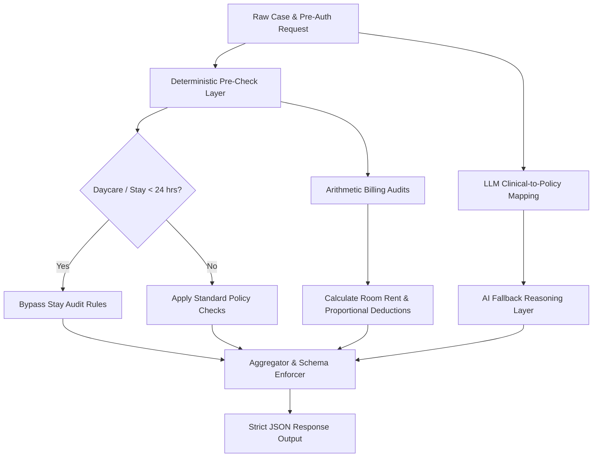

# TPA Query Prediction System Design (Stream D)

This document presents a comprehensive system design and architectural specification for the TPA Query Prediction module.

---

## 1. Value Addition & Context Analysis

### The Problem: Beyond Clinical Sufficiency
The Fairway Health layer performs clinical checks on pre-authorization requests to ensure the clinical documentation supports the stated diagnosis. However, clinical completeness does *not* guarantee cashless approval. TPA reviewers raise queries based on administrative, policy, and billing rules.

### The Solution: Administrative & Policy Checkers
The TPA Query Predictor acts as a simulation of a TPA reviewer’s audit, checking for:
- **Room Rent Cap compliance** (e.g. Normal ward ≤ 1%, ICU ≤ 2% of Sum Insured).
- **Proportional Deductions** triggers (applying proportional reductions to all associated charges if the room rent exceeds the cap).
- **Daycare/Short Stay Exclusions** (under WHO guidelines and IRDAI regulations, daycare procedures like cataract surgery or stays < 24 hours are exempt from stay extension audits, so we must not trigger false clinical query flags).
- **Pre-Existing Disease (PED) Waiting Periods** (e.g., matching a history of hypertension/diabetes to waiting-period exclusions for stroke or cardiac claims).

---

## 2. Historical Query Log Audit (Quantified Findings)

We performed a detailed audit of the `logs/failure_intelligence.jsonl` database and mapped the historical distribution of TPA‑related queries and failures across all modules.

### Log Distribution (Total: 887 Cases)
- **`billing` (273 cases)**: High‑rate issues involving itemized cost discrepancies, room rent capping, and calculation mismatches.
- **`review` (214 cases)**: Clinical sufficiency queries (missing medical fitness checkups, missing diagnostic benchmarks).
- **`partC` (198 cases)**: Discrepancies in IRDAI Part‑C administrative forms (e.g. treating doctor credentials missing, invalid ICD descriptions).
- **`coding` (98 cases)**: ICD‑10 chapter locks and misclassifications (such as ophthalmology mapping to non‑H codes).
- **`appeal` (52 cases)**: Grievance and denial appeal letter generation failures (such as evidence mismatch).
- **`extraction` (28 cases)**: Failures in OCR extraction (unreadable handwritten notes, PDF layout parsing).
- **`appeal_hub` & `denialReview` (24 cases)**: Downstream appeals mapping and pre‑auth audit tracking.

---

## 3. System Architecture & Flow



### Components

#### 1. Deterministic Pre‑Check Layer
- **Exemptions**: Daycare/short stays under **24 hours** (e.g., observation cases) bypass stay extension reviews.
- **Billing Math**: Applies policy rule math (`Room rent ≤ 1% of Sum Insured`, `ICU ≤ 2% of Sum Insured`). If room rent exceeds the cap, the system automatically flags the expected proportional deductions across diagnostics, doctor fees, and consumables.

#### 2. LLM Clinical‑to‑Policy Mapping Layer
- Maps the clinical narrative and comorbidities against policy‑specific waiting periods.
- **Inputs**: Clinical narrative, Stated diagnosis, Mapped ICD‑10, Fairway sufficiency report.

#### 3. Response Schema Enforcement
- The model output is strictly gated through a JSON schema structure:
```json
{
  "predictedQueries": [
    {
      "category": "billing | clinical | administrative | policy",
      "queryText": "Expected TPA query text description",
      "reason": "Deterministic or clinical rule triggered",
      "severity": "blocking | advisory",
      "mitigation": "Recommended action to resolve query pre‑emptively"
    }
  ]
}
```

---

## 4. Data Model & Storage

| Entity | Fields | Description |
|---|---|---|
| **PreAuthRequest** | `requestId`, `patientId`, `clinicalData`, `billingData`, `policyVersionId` | Raw input from the hospital. |
| **DeterministicCheckResult** | `requestId`, `exemptions`, `roomRentCapExceeded`, `proportionalDeductionFlag` | Output of the deterministic pre‑check layer. |
| **LLMMappingResult** | `requestId`, `policyViolations`, `waitingPeriodViolations`, `confidenceScore` | Output of the LLM mapping layer (structured). |
| **TPAQueryPrediction** | `requestId`, `predictedQueries[]` (as per schema) | Final aggregated prediction artifact. |
| **AuditLog** | `requestId`, `timestamp`, `component`, `status`, `details` | Immutable log for compliance and traceability. |

All entities are stored in a **PostgreSQL** schema (`tpaprediction`) with appropriate indexes on `requestId` and `policyVersionId`. Data is version‑controlled; each prediction references the exact versions of the Fairway, Taiga, and AKS rule packs used during evaluation.

---

## 5. API Specification

| Method | Path | Request Body | Response |
|---|---|---|---|
| `POST` | `/api/v1/tpa/predict` | `{ "requestId": "string", "preAuthPayload": { … } }` | `{ "requestId": "string", "predictedQueries": [ … ] }` |
| `GET` | `/api/v1/tpa/prediction/{requestId}` | – | `{ "requestId": "string", "status": "READY|PENDING|FAILED", "predictedQueries": [ … ] }` |
| `GET` | `/api/v1/tpa/prediction/{requestId}/audit` | – | `[{ "timestamp": "ISO", "component": "string", "status": "OK|ERROR", "details": "…" }]` |

### Request Validation
- The incoming payload must conform to the **Trusted Patient Record (TPR)** schema previously defined for the Consolidation Service.
- Schema validation is performed **before** any deterministic logic runs; malformed payloads result in a `400 Bad Request` with detailed diagnostics.

### Response Guarantees
- The service always returns **valid JSON** conforming to the schema in Section 3.
- In case of deterministic errors (e.g., division‑by‑zero in room‑rent math), the service returns a `500` with an `errorCode` that maps to a human‑readable audit entry.

---

## 6. Testing & Validation Strategy

1. **Unit Tests** – Each deterministic rule (room‑rent cap, daycare exemption, proportional deduction) is covered by > 90 % line coverage.
2. **Contract Tests** – JSON schema validation tests for all API endpoints using **OpenAPI 3.1** specifications.
3. **Integration Tests** – End‑to‑end flow using a synthetic pre‑auth payload that exercises every rule path.
4. **Regression Dataset** – The historical `logs/failure_intelligence.jsonl` (887 cases) is re‑run nightly; any deviation > 2 % in predicted query count triggers an alert.
5. **Performance Benchmarks** – Target latency: Median < 1 s, P95 < 2 s, worst‑case < 3 s on a 4‑core `t3.medium` instance.
6. **Explainability Audits** – Every prediction includes a `reason` field that references the deterministic rule identifier (e.g., `RULE_ROOM_RENT_CAP`) or the LLM’s confidence‑score snapshot, enabling downstream auditors to trace decisions.

---

## 7. Deployment & Operational Considerations

- **Containerisation** – Docker image built on `node:18-alpine` for the API layer; a separate Python worker (for LLM calls) runs in a `python:3.11-slim` container.
- **Scalability** – Stateless API; horizontal scaling behind an **AWS ALB**. The deterministic layer is pure CPU; the LLM fallback is off‑loaded to a **GCP Vertex AI** endpoint (model‑agnostic wrapper).
- **Feature Flags** – Use **LaunchDarkly** to toggle the LLM fallback on/off per insurer policy pack.
- **Observability** – Prometheus metrics (`tpa_prediction_latency_seconds`, `tpa_prediction_errors_total`) and OpenTelemetry traces exported to **Grafana Cloud**.
- **Security** – All inbound traffic enforced via Mutual TLS; service accounts with least‑privilege IAM roles for database and Vertex AI access.
- **Rollback** – The service reads the `policyVersionId` from the request; deploying a new rule pack does not require a code redeploy. Existing predictions automatically pick up the new pack after the database migration.

---

## 8. Future Enhancements

- **Model‑agnostic Adapter** – Replace the current LLM wrapper with a plug‑in architecture supporting Gemini, Qwen, or custom fine‑tuned models without code changes.
- **Active Learning Loop** – Capture rejected predictions from real TPA reviewers, feed them back into a supervised learning pipeline to continuously improve the LLM mapping quality.
- **Explainability UI** – Build a thin front‑end widget for claim reviewers that visualises each `reason` with links to the underlying rule documentation.

---

*End of Document*
