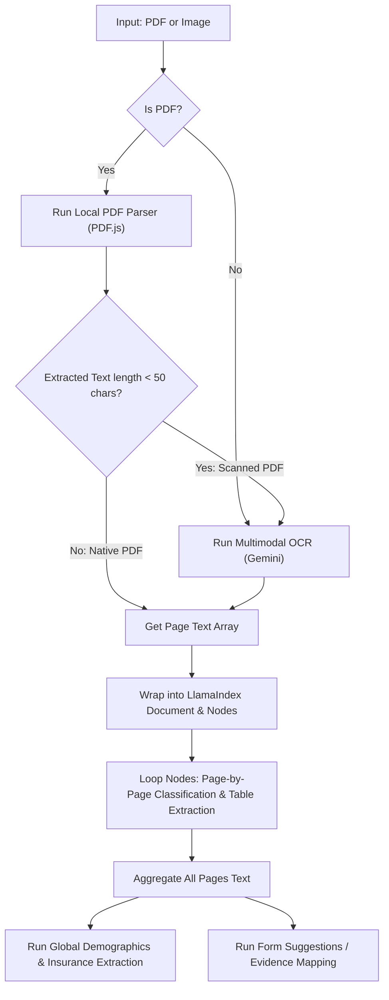

# Document Ingestion, OCR, and Classification Pipeline Guide

This guide outlines the architecture, data models, prompts, and pipeline stages utilized in the TPA Insurance system for document ingestion, text extraction, page-by-page classification, and structured clinical/insurance data extraction.

---

## 1. System Overview & Technology Stack

The pipeline is built as a hybrid local-and-cloud document processing workflow:

*   **Runtime Environment**: TypeScript / Node.js
*   **Native Document Reader**: `pdfjs-dist` (PDF.js) for parsing embedded vector/text data in PDFs.
*   **LLM & Multimodal OCR Engine**: Google Generative AI (`gemini-3-flash-preview` or any equivalent multimodal model).
*   **Logical Framework**: Custom node-based representation inspired by LlamaIndex, chunking documents page-by-page.



---

## 2. Ingestion & Native Extraction (OCR Bypass)

To optimize speed and minimize API costs, native text extraction is performed on PDF files first. If the file contains actual text, we bypass multimodal OCR.

### Native PDF Parser Execution
The document is read as an `ArrayBuffer` and processed page-by-page.

```typescript
import * as pdfjsLib from 'pdfjs-dist';

export async function extractTextFromPdf(arrayBuffer: ArrayBuffer): Promise<string> {
    const loadingTask = pdfjsLib.getDocument({ data: arrayBuffer });
    const pdf = await loadingTask.promise;
    let fullText = '';

    for (let i = 1; i <= pdf.numPages; i++) {
        const page = await pdf.getPage(i);
        const textContent = await page.getTextContent();
        const pageText = textContent.items
            .map((item: any) => item.str)
            .join(' ');
        
        fullText += `--- START OF PAGE ${i} ---\n${pageText}\n--- END OF PAGE ${i} ---\n\n`;
    }
    return fullText.trim();
}
```

### The OCR Fallback Trigger
If the natively extracted text contains fewer than **50 characters** (excluding headers and spaces), the PDF is classified as a scanned image PDF. The pipeline then falls back to **Gemini Multimodal OCR**.

---

## 3. Multimodal Fallback OCR

When processing images (PNG, JPEG, WebP) or scanned PDFs, the system converts the file or `ArrayBuffer` to base64 inline data and passes it to the Gemini Multimodal model.

### Prompt for Scanned PDFs
```text
Please extract all text from this PDF document. Present it page-by-page, wrapping each page's content strictly between '--- START OF PAGE X ---' and '--- END OF PAGE X ---', where X is the 1-based page number. Do not summarize or add commentary.
```

### Prompt for Images
```text
Extract all text from this image. Keep layout, headings, tables, and list items intact. Do not summarize or add commentary.
```

### Code Implementation (Scanned PDF OCR)
```typescript
async function extractPagesFromScannedPdf(arrayBuffer: ArrayBuffer): Promise<string[]> {
    const model = client.getGenerativeModel({ model: 'gemini-3-flash-preview' });
    const base64 = arrayBufferToBase64(arrayBuffer);
    
    const contents = [
        {
            inlineData: {
                mimeType: 'application/pdf',
                data: base64
            }
        },
        "Please extract all text from this PDF document. Present it page-by-page, wrapping each page's content strictly between '--- START OF PAGE X ---' and '--- END OF PAGE X ---'..."
    ];
    
    const result = await model.generateContent(contents);
    const text = result.response.text();
    
    // Parse using page match delimiters
    const pages: string[] = [];
    const pageMatches = [...text.matchAll(/--- START OF PAGE (\d+) ---([\s\S]*?)--- END OF PAGE \1 ---/gi)];
    for (const match of pageMatches) {
        pages.push(match[2].trim());
    }
    return pages.length > 0 ? pages : [text];
}
```

---

## 4. Node-Based Document Modeling (LlamaIndex-style)

To audit outputs and display exact page references to the user, page arrays are wrapped in structured objects.

```typescript
export interface LlamaNode {
    id: string;
    text: string;
    metadata: {
        pageNumber: number;
        fileName: string;
        mimeType: string;
        documentTypeClassification?: string;
    };
}

export interface LlamaDocument {
    id: string;
    nodes: LlamaNode[];
    metadata: {
        fileName: string;
        mimeType: string;
        uploadedAt: string;
    };
}
```
*   **One Node per Page**: This ensures that when the system suggests clinical evidence or tables, it can point back to the exact node/page ID that contained the text.

---

## 5. Page-by-Page Classification & Table Extraction

Each `LlamaNode` (page) is evaluated individually by the LLM to identify page boundaries, specific page classifications, and isolate tables.

### Prompt:
```text
You are processing a page Node from a medical record.
Original PDF Page Reference: Page [PageNumber] of [FileName].

TEXT FOR NODE:
"""
[NodeText]
"""

Instructions:
1. Classify this page's document type exactly (e.g. "Lab report – Urine examination", "Lab report – Dengue rapid test", "Lab report – CBC", "OPD prescription / consultation note", "Insurance card", "Hospital registration form", or "Unknown").
2. Reconstruct any tables present in this page containing lab tests or vitals, detailing testName, result, units, and normalRange.

Return strictly a valid JSON object matching this structure:
{
  "classification": "Specific document type classification",
  "tables": [
    {
      "tableName": "Table Name",
      "rows": [
        { "testName": "Name of test", "result": "result value", "units": "units", "normalRange": "normal range reference" }
      ]
    }
  ]
}
```

---

## 6. Global Extraction & Verification

After extracting individual page classifications and tables, the entire document text is concatenated and processed to build the overall patient case file.

### Expected JSON Output Structure:
```json
{
  "document_type": "hospital_registration" | "insurance_card" | "policy_document" | "id_card" | "unknown",
  "patient": {
    "name": "Full name or null",
    "age": 28,
    "dob": "YYYY-MM-DD or null",
    "gender": "Male" | "Female" | "Other" | null,
    "address": "Full address or null",
    "phone": "Phone number or null"
  },
  "insurance": {
    "policy_number": "Policy number or null",
    "insurance_company": "Company name or null",
    "tpa_name": "TPA name or null",
    "sum_insured": 500000,
    "valid_till": "YYYY-MM-DD or null",
    "member_id": "Member/Employee ID or null"
  },
  "clinical": {
    "diagnosis_impression": "Suspected or confirmed diagnosis",
    "doctor_name": "Name of treating doctor",
    "consultation_date": "YYYY-MM-DD",
    "lab_name": "Lab name",
    "hospital_name": "Hospital name",
    "vitals": {
      "bp": "120/80",
      "pulse": "80",
      "temp": "98.6",
      "spo2": "99",
      "rr": "16"
    },
    "drugs_prescribed": ["List of drug names"]
  },
  "confidence": 95,
  "notes": "Any extraction issues or notes"
}
```

### The "Silence" / Legal Compliance Policy
When extracting fields for insurance claims (such as Injury/RTA declaration, Alcohol involvement, or secondary insurance policies):
1. **Never default values**: The model is strictly instructed **never** to guess or infer values when the text is silent.
2. **Missing data = exclusion**: If the document does not explicitly state the answers, those keys/fields must be excluded from the returned suggestions list (remaining `null` or empty).
3. **Audited Evidence Suggestions**: Every clinical suggestion must also map a `sourceSnippet` (containing the exact verbatim quote) and `sourceDocName` (identifying the source file) to support auditability.

---

## 7. Key Best Practices for Re-Implementation
*   **JSON-Only Outputs**: Set Gemini's generation config to output JSON (e.g., `responseMimeType: "application/json"`) or clean the markdown backticks (````json ... ````) before executing `JSON.parse`.
*   **Retry Mechanisms**: Run a validation check on the parsed JSON block. If the parse fails, execute up to 2–3 retries or fallback to a secondary API key.
*   **Audit Trail**: Ensure every table row and extracted field is linked back to a specific `pageNumber` or `LlamaNode` so users can verify the information in the UI.
